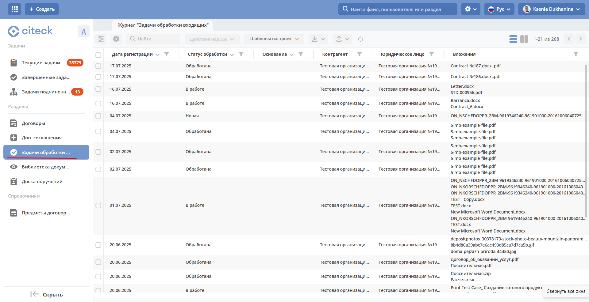
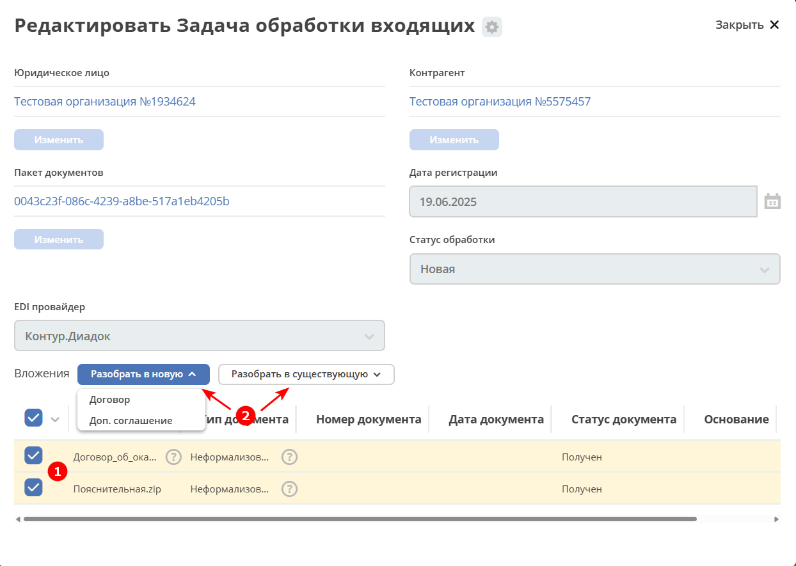
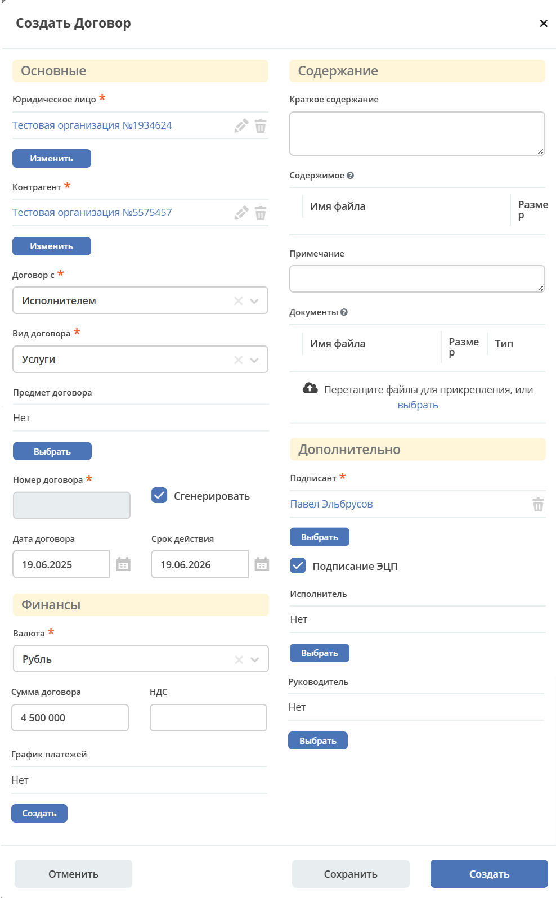
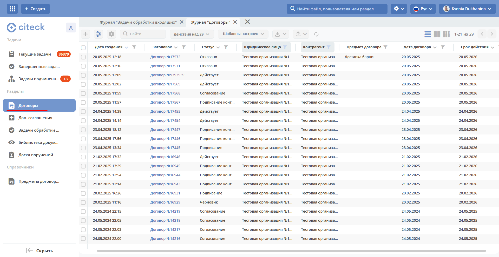
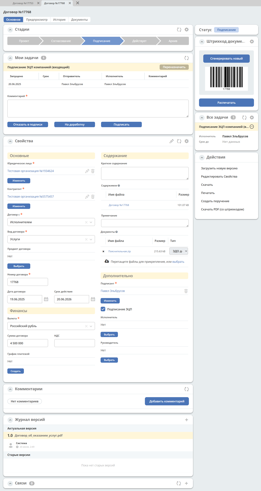
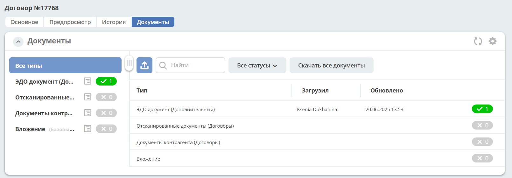
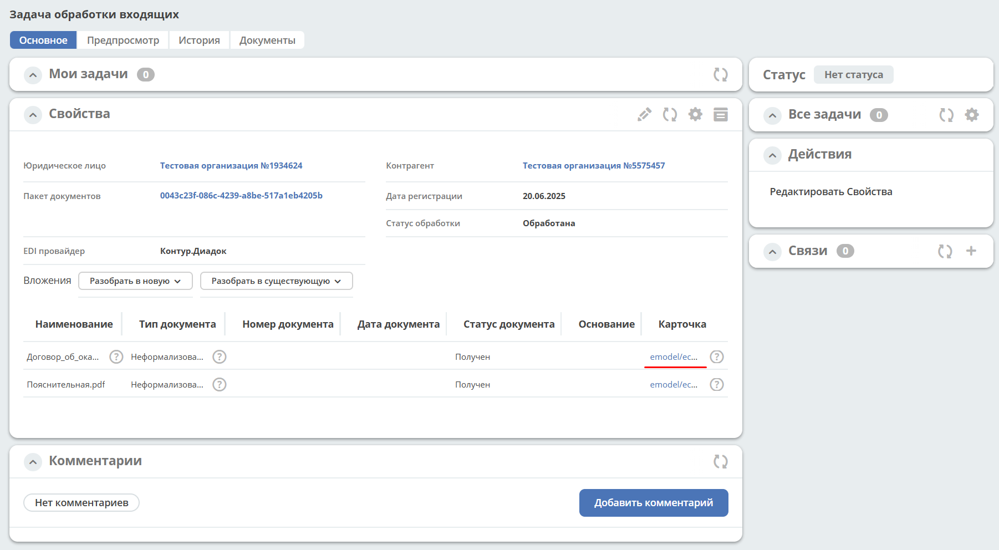

Работа с документами ЭДО
===========================

.. _EDI_in_out:

.. note::

    Доступно только в Enterprise версии.

    Журнал **«Задачи обработки входящих»** доступен в рабочих пространствах **Договоры** и **Делопроизводство**.

Возможность подписывать договоры и доп.соглашения квалифицированной электронной подписью (КЭП) и обмениваться ими с контрагентами через ЮЗДО провайдеров.

.. attention::

       Необходима установка плагина `КриптоПро ЭЦП Browser plug-in <https://www.cryptopro.ru/products/cades/plugin>`_
       
       Браузеры, которым не требуется дополнительная настройка расширения браузера после установки плагина:

        - `Chromium-Gost <https://www.cryptopro.ru/products/chromium-gost>`_
        - `Яндекс.Браузер <https://browser.yandex.ru/>`_

Договоры
---------

.. note::

    У **юридического лица** (справочник Юридические лица) и у выбираемого **контрагента** (справочник Контрагенты) в карточках в конфигурации должны быть указаны **Настройки интеграции с edi провайдером**:

       .. image:: _static/edo/settings_ka.png
              :width: 600
              :align: center

Входящие
~~~~~~~~~~~~

Перейдите в журнал **«Задачи обработки входящих»**. Для входящих очередей доступны 3 статуса:

-	**Новая** – вложения не обработаны;
-	**В работе** – хотя бы одно вложение обработано;
-	**Обработана** – все вложения обработаны.

Откройте входящий пакет:

Вложения пакета можно обработать как **все**, так и **поштучно**, как в **новую очередь**, так и в **существующую** – выберите **вложение (1)** и **тип обработки (2)**:

При выборе нескольких вложений выберите **основной** документ:

**Основной документ** будет добавлен в карточке в раздел **«Содержание» (1)**, **остальные** выбранные **документы **очереди будут добавлены в раздел **«Документы» (2)** после создания карточки.

.. note::

    При выборе **«Разобрать в существующую»** вложения будут добавлены как дополнительные документы к уже созданной карточке.

Далее откроется карточка договора, в которой уже заполнены **Юридическое лицо**, **Контрагент**. Дозаполните обязательные и необходимые поля, нажмите **«Создать»**:

.. note::

    Документы в разделе **«Содержание»** и **«Документы»** будут прикреплены после создания карточки.

Карточка договора будет доступна в журнале **«Договоры»**:

и отправлена по бизнес-процессу - процесс идентичен бумажному. См. :ref:`подробнее<contract_process>`.

Дополнительные документы будут отражены в виджете **«Документы»**:

На статусе **«Подписание»** в задаче **«Подписание ЭЦП компанией (входящий)»** укажите комментарий и подпишите ЭЦП:

Если сертификат у пользователя один, то подписание происходит автоматически по нажатию **«Подписать»**.

Если сертификатов несколько, то выберите необходимый сертификат из списка:

.. image:: _static/edo/10.png
       :width: 400
       :align: center

Статус договора изменится на **«Действует»**, и документы будут переданы по ЭДО.

Статус очереди изменится на **«Обработана»**. В карточке пакета будет доступна ссылка на карточку договора:

Исходящие
------------

При создании договора выставите чекбокс **«Подписание ЭЦП»**, заполните необходимые и обязательные поля, вложите основной документ в **«Содержимое»** или сгенерируйте его, дополнительные – в **«Документы»**, нажмите **«Создать»**:

.. image:: _static/edo/12.png
       :width: 500
       :align: center

Карточка будет отправлена по бизнес-процессу - процесс идентичен бумажному. См. :ref:`подробнее<contract_process>`.

На статусе **«Подписание»** в задаче **«Подписание ЭЦП компанией (исходящий)»** укажите комментарий и подпишите ЭЦП:

Документ будет подписан и передан по ЭДО. Статус договора изменится на **«Подписание контрагентом»**. 

Подписание контрагентом производится в ЭДО, после подписания статус договора автоматически изменится на **«Действует»**.
