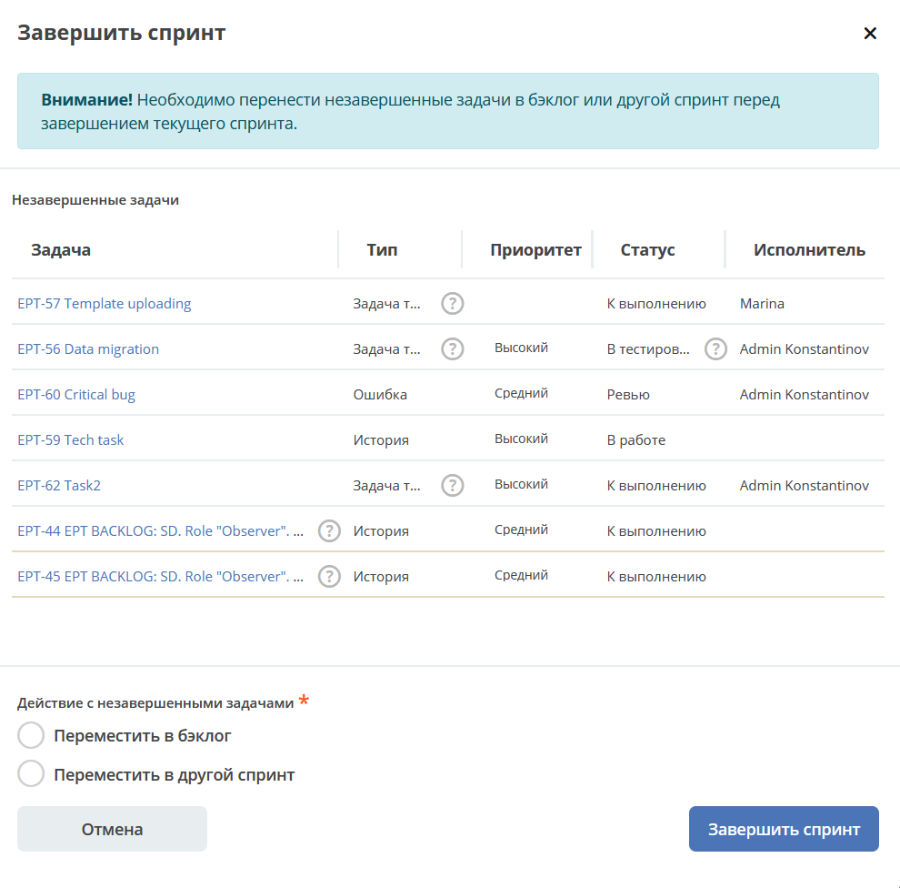

Project tracker
================

.. _ecos_ept:

.. contents::
    :depth: 3

**Project tracker** обеспечивает управление задачами разработки в соответствии с принятыми в компании процессами. Пользователи могут создать задачи и проводить их по череде статусов, меняя исполнителей. Статусы соответствуют принятым в компании процессам. 

Создание проекта
-------------------

Перейдите в журнал **«Трекер задач» - «Проекты»**:

 .. image:: _static/ept/project_01.png
       :width: 700
       :align: center 

Создайте проект – укажите **Название**, **Ключ** автоматически сформируется из первых букв названия проекта, сохраните.

 .. image:: _static/ept/project_02.png
       :width: 500
       :align: center 

Для проекта будет автоматически создано рабочее пространство.

Рабочее пространство проекта
------------------------------

Перейдите в созданное пространство:

 .. image:: _static/ept/ws_01.png
       :width: 700
       :align: center 

По умолчанию открывается канбан доска активного спринта:

 .. image:: _static/ept/ws_02.png
       :width: 700
       :align: center 

Предоставление доступа к рабочему пространству
-----------------------------------------------

Перейдите в режим редактирования:

 .. image:: _static/ept/ws_03.png
       :width: 700
       :align: center 

Карточка рабочего пространства:

 .. image:: _static/ept/ws_04.png
       :width: 500
       :align: center 

Определите **участников**. У участника могут быть права – пользователя или менеджера (с возможностью управления рабочим пространством).
Пользователь, создающий пространство, получает роль **«Менеджер»**.

.. list-table::
      :widths: 20 20
      :align: center

      * - |

            .. image:: _static/ept/ws_05.png
                  :width: 500
                  :align: center

        - |

            .. image:: _static/ept/ws_06.png
                  :width: 500
                  :align: center

Разделы
--------------

Активный спринт
~~~~~~~~~~~~~~~~~~

На доске Scrum отображаются задачи, над которыми в данный момент работает команда. Задачи можно создавать и обновлять, а также перемещать их по рабочему процессу с помощью функции «перетаскивания».

 .. image:: _static/ept/active_sprint_01.png
       :width: 700
       :align: center 

.. note:: 

    Активным может быть только 1 спринт.

Задачи проекта
~~~~~~~~~~~~~~~~

Содержит список задач проекта. Представлены задачи во всех статусах.

 .. image:: _static/ept/tasks_01.png
       :width: 700
       :align: center 

Создание задачи
""""""""""""""""""

.. _ept_new_task:

Нажмите **+**, выберите тип задачи

 .. image:: _static/ept/backlog_04_0.png
       :width: 600
       :align: center 

 и заполните поля формы, вложите файлы при необходимости:

 .. image:: _static/ept/backlog_04.png
       :width: 600
       :align: center 

Статус задачи при создании по умолчанию – **бэклог**.

Карточка задачи
""""""""""""""""""

Карточка задачи состоит из виджетов:

 .. image:: _static/ept/tasks_02.png
       :width: 600
       :align: center 

.. note:: 

    Чтобы ссылка на commit или MR (запросы на слияние) добавилась к задаче, укажите **идентификатор задачи** Project tracker, в комментарии к commit (**Commit message**) или названии (**Title**) merge request в GitLab.
    О настройке синхронизации с Gitlab см. :ref:`ниже<ept_gitlab_sync>`  

Перевод в статус 
""""""""""""""""""

Перевод задачи в статус осуществляется по действию **«Изменить статус»**:

 .. image:: _static/ept/tasks_03.png
       :width: 500
       :align: center 

Регистрация времени работы над задачей
"""""""""""""""""""""""""""""""""""""""

Запись времени работы над задачей осуществляется по действию **«Записать время»**:

 .. image:: _static/ept/tasks_04.png
       :width: 400
       :align: center 

Добавление задачи в спринт
"""""""""""""""""""""""""""

.. _ept_task_to_sprint:

1. Выбрать действие в журнале для быстрого добавления задачи в спринт:

 .. image:: _static/ept/backlog_03.png
       :width: 700
       :align: center 

Выбрать спринт:

 .. image:: _static/ept/sprint_03.png
       :width: 500
       :align: center 

.. list-table::
      :widths: 20 20
      :align: center

      * - |

            .. image:: _static/ept/sprint_04.png
                  :width: 500
                  :align: center

        - |

            .. image:: _static/ept/sprint_05.png
                  :width: 500
                  :align: center

2. Через групповое действие:

 .. image:: _static/ept/backlog_05.png
       :width: 700
       :align: center 

3. Указать спринт напрямую в карточке задачи:

 .. image:: _static/ept/backlog_06.png
       :width: 500
       :align: center 

Эпики
~~~~~~~

**Эпик** — крупная цель или задача, включающая множество меньших задач.

 .. image:: _static/ept/epic_01.png
       :width: 700
       :align: center 

В разделе по кнопке **+** доступно создание не только эпика, но и задач другого типа.

Карточка эпика
"""""""""""""""

 .. image:: _static/ept/epic_02.png
       :width: 600
       :align: center 

Бэклог
~~~~~~~~

**Бэклог продукта** - упорядоченный и регулярно обновляемый перечень всех задач, запланированных для разработки и совершенствования продукта. Представлены задачи только в статусе **«Бэклог»**.

 .. image:: _static/ept/backlog_01.png
       :width: 700
       :align: center 

В разделе по кнопке **+** доступно создание задач разного типа. См. подробнее :ref:`Создание задачи<ept_new_task>`

Карточка задачи бэклога
""""""""""""""""""""""""""""

Карточка задачи состоит из виджетов:

 .. image:: _static/ept/backlog_02.png
       :width: 600
       :align: center 

Добавление задачи бэклога в спринт
"""""""""""""""""""""""""""""""""""""

См. :ref:`Добавление задачи в спринт<ept_task_to_sprint>`

Спринты
~~~~~~~~

**Спринт** — фиксированный временной интервал в проектной деятельности, в пределах которого выполняются определённые задачи, выбранные из бэклога.

 .. image:: _static/ept/sprint_01.png
       :width: 700
       :align: center 

Создание спринта
"""""""""""""""""""

Нажмите **+** и заполните поля формы:

 .. image:: _static/ept/sprint_02.png
       :width: 500
       :align: center 

Карточка спринта
"""""""""""""""""""

Карточка спринта содержит статистику и прогресс его выполнения, список задача:

 .. image:: _static/ept/sprint_08.png
       :width: 600
       :align: center 

Запуск спринта
"""""""""""""""""""

Перейдите в карточку спринта и выберте действие **«Запустить спринт»**

Подтвердите:

 .. image:: _static/ept/sprint_07.png
       :width: 600
       :align: center 
       
Спринт переходит в активный, все задачи спринта в статусе «Бэклог» будут автоматически переведены в статус «К выполнению»

Завершение спринта
"""""""""""""""""""

Перейдите в карточку спринта и выберте действие **«Завершить спринт»**

.. note:: 

      Если в спринте остались незавершенные задачи, то перед завершением текущего спринта их необходимо перенести в бэклог или другой спринт. 

Релизы
~~~~~~~~

**Релиз** — список готовых версий продукта.

 .. image:: _static/ept/release_01.png
       :width: 700
       :align: center 
 
Карточка релиза:

 .. image:: _static/ept/release_02.png
       :width: 600
       :align: center 

Подробно о функционале см. :ref:`Релизы<ecos-releases>`

Компоненты
~~~~~~~~~~~~~~~~

**Компоненты** выполняют функцию категорий. Они позволяют разделить работу над большим проектом на отдельные части. 

Добавленные в данном разделе компоненты, становятся доступны к выбору при создании задачи.

 .. image:: _static/ept/components_01.png
       :width: 700
       :align: center 
 
Теги
~~~~

**Теги** позволяют классифицировать запросы в свободной форме, менее формально, чем компоненты. 

Добавленные в данном разделе теги, становятся доступны к выбору при создании задачи.

 .. image:: _static/ept/tags_01.png
       :width: 700
       :align: center 
 
Учет времени
~~~~~~~~~~~~~~~~

Функционал, позволяющий отслеживать время, затраченное сотрудником на выполнение конкретной задачи или работу с документом, непосредственно из карточки задачи или документа.

 .. image:: _static/ept/worklog_01.png
       :width: 700
       :align: center 

Подробно о функционале см. :ref:`Учет времени<ecos-worklog>` 

Библиотека документов
~~~~~~~~~~~~~~~~~~~~~~~~

Иерархический интерфейс для сомвестной работы с папками и документами.

 .. image:: _static/ept/doclib_01.png
       :width: 700
       :align: center 
 
В библиотеке доступны:

    - загрузка файлов и папок как по кнопке, так и перетаскиванием.
    - создание документов (текстовых, табличных, презентаций).

Подробно о функционале см. :ref:`Библиотека документов<document_library>`  

Настройки синхронизации Commits и Мerge requests
--------------------------------------------------

.. _ept_gitlab_sync:

Для запуска синхронизаций commits и merge request необходимо:

1.	Создать в GitLab **Access token**. В профиле GitLab перейти в **User settings -> Access tokens**

 .. image:: _static/ept/git_01.png
       :width: 800
       :align: center 
 
При создании токена обязательно необходимо указать **Select scopes -  read_api**

 .. image:: _static/ept/git_02.png
       :width: 600
       :align: center 
 
Далее скопировать созданный токен:

 .. image:: _static/ept/git_03.png
       :width: 600
       :align: center 

2.	Перейти в **Раздел Администратора → Модель → Секреты** и указать его в Секрете **gitlab-access-token**

 .. image:: _static/ept/git_04.png
       :width: 500
       :align: center 
 
3.	Перейти в **Раздел Администратора → Модель → Конечные точки** настроить конечную точку **gitlab-domain-url**:

-	указать **URL GitLab** – например, https://gitlab.yourcompany.ru
-	выбрать в Данных для аутентификации **Токен доступа Gitlab**

 .. image:: _static/ept/git_05.png
       :width: 500
       :align: center 
 
4.	Перейти в **Раздел Администратора → Интеграция → Camel DSL**, запустить **gitlab-merge-requests-sync** и **gitlab-commits-sync**:

 .. image:: _static/ept/git_06.png
       :width: 600
       :align: center 
 
Подробнее о :ref:`действиях<camel_dsl_actions>`, доступных с Camel DSL.

