Модуль «Доверенности»
=======================

.. _ecos-poa:

Модуль позволяет организовать работу как с обычными бумажными, так и с машиночитаемыми доверенностями. Модуль обеспечивает:

    -	создание, согласование и учет доверенностей;
    -	контроль сроков действия доверенностей;
    -	гибкую маршрутизацию.

**Машиночитаемая доверенность (МЧД)** - электронный аналог бумажной доверенности, который оформляется в виде файла XML, подписывается электронной подписью сотрудника, выбранного в качестве подписанта. 

В файле содержится информация о периоде действия доверенности, доверителе (в модуле предусмотрен выбор: Юридическое лицо, Индивидуальный предприниматель), представителе — уполномоченном сотруднике, и полномочиях, которые он получает. 
Доверенность генерируется по утвержденному формату: ЕДИНАЯ ФОРМА ДОВЕРЕННОСТИ/ МЧД версии 003 для осуществления хозяйственных сделок между организациями.

.. contents::
		:depth: 3

Схема бизнес-процесса
----------------------

Роли
----

.. list-table::
      :widths: 20 40
      :align: center
      :class: tight-table 
      
      * - **Инициатор**
        - Сотрудник компании, создающий доверенность в системе. Выполняет задачу по Доработке.
      * - **Согласующий**
        - Согласующие доверенностей, Дополнительные согласующие - группы пользователей. Выполняет согласование доверенности.
      * - **Регистратор**
        - Группа пользователей, выполняющая задачи Утверждение, Получение (для доверенности на третье лицо) и Отзыв Доверенности.
      * - **Представитель**
        - Третье лицо или сотрудник компании, на которого оформляется доверенность. Выполняет задачу Получение Доверенности. 
      * - **Подписант**
        - Сотрудник компании, выполняющий задачу Подписание ЭЦП доверенности (только для МЧД).

Группы оргструктуры, в которые должны быть добавлены пользователи
~~~~~~~~~~~~~~~~~~~~~~~~~~~~~~~~~~~~~~~~~~~~~~~~~~~~~~~~~~~~~~~~~~~~~~~~

     * Согласующие доверенностей (Attorney_approver_gr);
     * Дополнительные согласующие (Attorney_addApp_gr);
     * Регистраторы доверенностей (Attorney_registrar_gr).

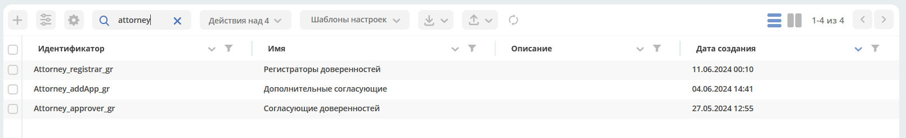

Статусы
--------

.. list-table::
      :widths: 20 40
      :align: center
      :class: tight-table 
      
      * - **Черновик**
        - Доверенность создана Инициатором, но не отправлен по процессу.
      * - **Направлена Представителю**
        - Доверенность передана представителю.
      * - **На доработке**
        - По итогам согласования доверенность отправлена на доработку Инициатору.
      * - **Аннулирована**
        - Инициатор аннулировал доверенность.
      * - **На утверждении**
        - Доверенность передана регистратору.
      * - **Действует**
        - Доверенность выдана и находится в статусе «Действует», но дата начала её действия еще не наступила.
      * - **На согласовании**
        - Согласование доверенности в соответствии с маршрутом в зависимости от выбранного вида доверенности и указанного лимита.
      * - **На подписании ЭЦП**
        - | Доверенность находится на подписании ЭЦП у выбранного в карточке Подписанта.
          | Только для машиночитаемых доверенностей.
      * - **Отзыв доверенности**
        - Доверенность отозвана регистратором.
      * - **Не действует**
        - Регистратор подтвердил отзыв доверенности или срок действия доверенности истек.

Виды доверенностей
--------------------

    -	Генеральная;
    -	Стандартная;
    -	Нестандартная.

Для **Генеральной** и **Стандартной** доверенностей предусмотрена генерация человекочитаемого вида доверенности, который доступен через действия **«Скачать PDF»**. Для данных видов доверенностей процесс обработки до момента оформления включает в себя статусы: «Черновик» (опционально), «На согласовании», «На доработке» (при необходимости), «На подписании ЭЦП» (только для Машиночитаемой), «На утверждении», «Направлена Представителю», «Действует».

Для **Нестандартной** доверенности в бумажном формате пользователю необходимо загрузить файл с готовой доверенностью в атрибут **«Содержимое»**. Подразумевается, что нестандартная доверенность полностью оформляется вне системы, поэтому в процесс ее обработки включен только этап согласования. Таки образом после успешного согласования нестандартная доверенность переходит в статус «Действует», минуя все промежуточные. 

Маршруты
----------

.. _poa_routs:

В модуле реализован динамический выбор маршрута с использованием  :ref:`DMN<ecos-dmn>` и зависит от выбранного вида доверенности и указанного лимита:

.. list-table::
      :widths: 5 10 5 10 20
      :header-rows: 1
      :class: tight-table 
      
      * - №
        - Вид доверенности
        - Лимит доверенности
        - Решение
        - Согласующие
      * - 1
        - **Стандартная**
        - 0
        - | Assign approver 
          | (последовательное согласование)
        - | Дополнительные согласующие
          | (GROUP_Attorney_addApp_gr)
      * - 2
        - **Генеральная**
        - 0
        - | Approve
          | (параллельное согласование)
        - | Согласующие доверенностей
          | (GROUP_Attorney_approver_gr)
      * - 3
        - **Стандартная**
        - <=100 000
        - | Approve
          | (параллельное согласование)
        - | Дополнительные согласующие
          | (GROUP_Attorney_addApp_gr),
          | Согласующие доверенностей
          | (GROUP_Attorney_approver_gr)
      * - 4
        - **Стандартная**
        - > 100 000
        - | Assign approver 
          | (последовательное согласование)
        - | Дополнительные согласующие
          | (GROUP_Attorney_addApp_gr)
      * - 5
        - **Генеральная**
        - <=200 000
        - | Assign approver 
          | (последовательное согласование)
        - | Дополнительные согласующие
          | (GROUP_Attorney_addApp_gr),
          | Согласующие доверенностей
          | (GROUP_Attorney_approver_gr)
      * - 6
        - **Генеральная**
        - > 200 000
        - | Approve
          | (параллельное согласование)
        - | Дополнительные согласующие
          | (GROUP_Attorney_addApp_gr)
      * - 7
        - **Нестандартная**
        - нет
        - | Assign approver 
          | (последовательное согласование)
        - | Дополнительные согласующие
          | (GROUP_Attorney_addApp_gr)

Журнал
-------

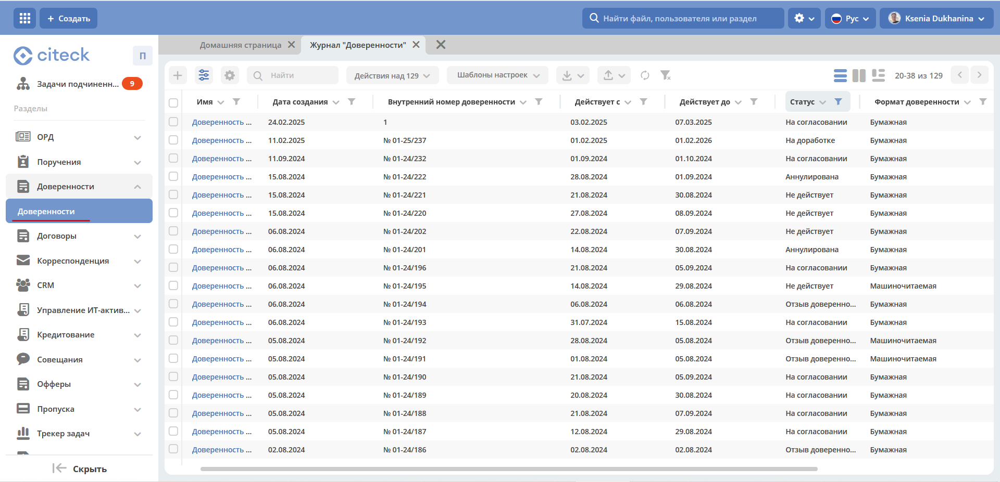

Стандартный дашборд журнала содержит колонки:
    -	Имя;
    -	Дата создания;
    -	Внутренний номер доверенности;
    -	Действует с;
    -	Действует до;
    -	Статус;
    -	Формат доверенности;
    -	Инициатор;
    -	Представитель.

Дополнительно для включения доступны колонки: Дата выдачи, Номер доверенности в ФНС, Вид доверенности, Юридическое лицо, Индивидуальный предприниматель, Подписант, Передаваемые полномочия, Лимит доверенности.

Создание карточки доверенности
--------------------------------

Создание доверенности в Системе возможно, как с помощью кнопки быстрого создания:

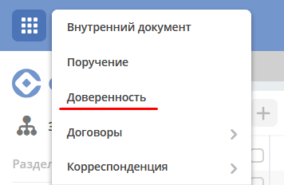

так и из журнала **«Доверенности»**:

На экране становится доступна форма создания **Доверенности**:

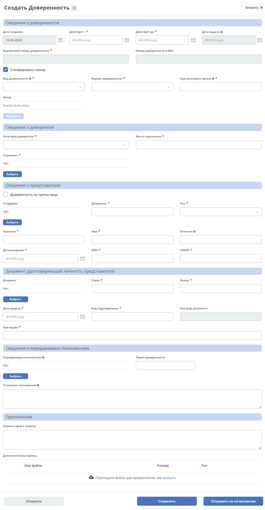

Карточка состоит из разделов:

-	**Сведения о доверенности:**

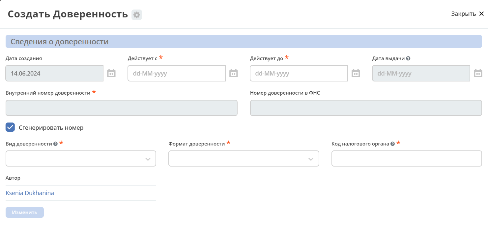

.. list-table::
      :widths: 20 40
      :class: tight-table
      :align: center
      
      * - **Дата создания**
        - | Дата в формате dd.mm.yyyy. 
          | Обязательный. 
          | Заполняется автоматически при создании РКК, нередактируемый.
      * - **Действует с**
        - | Дата в формате dd.mm.yyyy. 
          | Обязательный.
      * - **Действует до**
        - | Дата в формате dd.mm.yyyy. 
          | Обязательный. 
          | При выполнении отзыва доверенности поле заполняется текущей системной датой.
      * - **Дата выдачи**
        - | Дата в формате dd.mm.yyyy. 
          | Заполняется автоматически при переходе доверенности в статус «Действует». 
          | Нередактируемый. 
      * - **Внутренний номер доверенности**
        - | Текст.
          | Обязательный.  
          | Зависит от состояния чек-бокса «Сгенерировать номер»:
          | - false. Поле доступно для редактирования вручную.
          | - true. Поле заблокировано. 
          | После создания карточки номер доверенности генерируется автоматически согласно правилу:
          | **№ 01-ХХ/Y**, где
          | -	**ХХ** - последние две цифры текущего года;
          | -	**Y** - порядковый номер доверенности в системе.
          | При удалении доверенности порядковый номер НЕ присваивается другой доверенности
      * - **Номер доверенности в ФНС**
        - | Текст.
          | Обязательный.  
          | Заполняется по интеграции (для МЧД).
          | Нередактируемый. 
      * - **Сгенерировать номер**
        - | Чек-бокс. 
          | Значение по умолчанию true.  
          | Отображается только на форме создания.
      * - **Вид доверенности**
        - | Выбор из списка:
          | 1.	Генеральная; 
          | 2.	Стандартная;
          | 3.	Нестандартная.
          | Обязательный. 
      * - **Формат доверенности**
        - | Выбор из списка:
          | 1.	Бумажная; 
          | 2.	Машиночитаемая.
          | Обязательный. 
          | При **Вид доверенности = Нестандартная** в поле **«Формат доверенности»** автоматически выставляется значение **«Бумажная»** и блокируется (выбор значения «Машиночитаемая» становится недоступен). 
      * - **Код налогового органа**
        - | Число. Обязательный. 
          | Зависит от выбранного значения в поле «Формат доверенности»:
          | -	Бумажная. Поле пустое и недоступно для редактирования. 
          | -	Машиночитаемая. Поле доступно для редактирования вручную. 
          | Проверка введенного значения: Код должен содержать 4 цифры.
      * - **Автор**
        - | Заполняется автоматически пользователем, создавшим карточку. 
          | Обязательный, нередактируемый.

-	**Сведения о доверителе:**

Скрыто с формы, если **«Вид доверенности»** выбран **«Нестандартная»**.

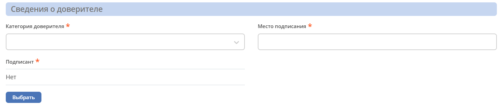

.. list-table::
      :widths: 20 40
      :class: tight-table
      :align: center
      
      * - **Категория доверителя**
        - | Выбор из списка:
          | 1.	Индивидуальный предприниматель;
          | 2.	Юридическое лицо.
          | Обязательный.
      * - **Место подписания**
        - | Текст.
          | Обязательный.
      * - **Подписант**
        - | Выбор из Оргструктуры.  
          | Обязательный, если **Формат доверенности** = **«Машиночитаемая»**, иначе - необязательный.

-	**Данные организации:**

Отображается, если **«Категория доверителя»** выбрана **«Юридическое лицо»**. Изначально раздел скрыт.

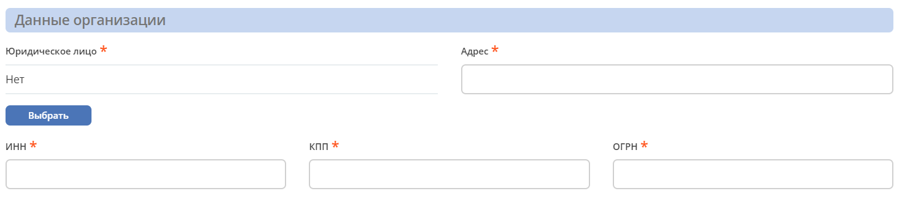

.. list-table::
      :widths: 20 40
      :class: tight-table
      :align: center
      
      * - **Юридическое лицо**
        - | Выбор из справочника «Юридические лица». 
          | Обязательный.
      * - **Адрес**
        - | Текст. 
          | Обязательный.
          | Заполняется автоматически значением поля «Юридический адрес» из карточки выбранного Юридического лица.
      * - **Регион**
        - | Выбор из справочника «Субъекты Российской Федерации».
          | Обязательный.
      * - **ИНН**
        - | Текст. 
          | Обязательный.
          | Заполняется автоматически значением поля «ИНН» из карточки выбранного Юридического лица.
      * - **КПП**
        - | Текст. 
          | Обязательный.
          | Заполняется автоматически значением поля «КПП» из карточки выбранного Юридического лица. 
      * - **ОГРН**
        - | Текст. 
          | Обязательный.
          | Заполняется автоматически значением поля «ОГРН» из карточки выбранного Юридического лица. 

-	**Единоличный исполнительный орган:**

Отображается, если **«Категория доверителя»** выбрана **«Юридическое лицо»**. Изначально раздел скрыт.

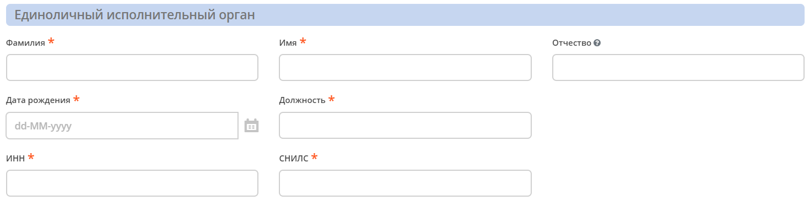

.. list-table::
      :widths: 20 40
      :class: tight-table
      :align: center 
      
      * - **Фамилия**
        - | Текст
          | Обязательный.
          | Заполняется автоматически значением поля «Фамилия» из профиля Генерального директора в карточке Юридического лица. 
      * - **Имя**
        - | Текст
          | Обязательный.
      * - **Отчество**
        - | Текст
          | Необязательный.
          | Заполняется автоматически значением поля «Отчество» из профиля Генерального директора в карточке Юридического лица.
      * - **Дата рождения**
        - | Дата в формате dd.MM.yyyy. 
          | Обязательный.
          | Заполняется автоматически значением поля «Дата рождения» из профиля Генерального директора в карточке Юридического лица.
      * - **Должность**
        - | Текст
          | Обязательный.
          | Заполняется автоматически значением поля «Должность» из профиля Генерального директора в карточке Юридического лица. Обязательный.
      * - **ИНН**
        - | Текст
          | Обязательный.
          | Пока заполняется вручную, в будущем планируется добавить поле в профиль пользователя и забирать значение оттуда. 
      * - **СНИЛС**
        - | Текст
          | Обязательный.
          | Пока заполняется вручную, в будущем планируется добавить поле в профиль пользователя и забирать значение оттуда.

-	**Данные об индивидуальном предпринимателе:**

Отображается, если **«Категория доверителя»** выбрана **«Индивидуальный предприниматель»**. Изначально раздел скрыт.

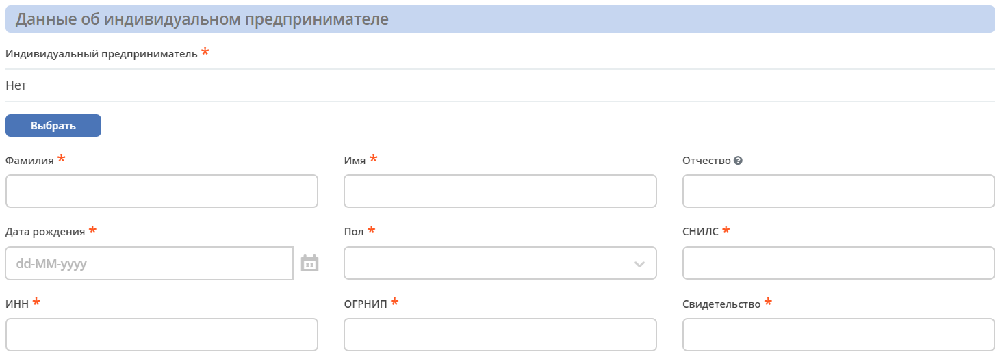

.. list-table::
      :widths: 20 40
      :class: tight-table
      :align: center
      
      * - **Индивидуальный предприниматель**
        - | Выбор из справочника «Юридические лица». 
          | Обязательный.
      * - **Фамилия**
        - | Текст
          | Обязательный. Редактируемое.
          | Заполняется автоматически значением поля «Фамилия» из профиля Индивидуального предпринимателя в карточке Юридического лица. 
      * - **Имя**
        - | Текст
          | Обязательный. Редактируемое.
          | Заполняется автоматически значением поля «Имя» из профиля Индивидуального предпринимателя в карточке Юридического лица. 
      * - **Отчество**
        - | Текст
          | Необязательное. Редактируемое.
          | Заполняется автоматически значением поля «Отчество» из профиля Индивидуального предпринимателя в карточке Юридического лица. 
      * - **Дата рождения**
        - | Дата в формате dd.mm.yyyy. 
          | Обязательный. Редактируемое.
          | Заполняется автоматически значением поля «Дата рождения» из профиля Индивидуального предпринимателя в карточке Юридического лица. 
      * - **Пол**
        - | Выбор из списка:
          | 1.	Женский;
          | 2.	Мужской.
          | Обязательный. 
      * - **СНИЛС**
        - | Число
          | Обязательный.
          | Заполняется автоматически значением одноименного поля из карточки выбранного Юридического лица. 
      * - **ИНН**
        - | Число
          | Обязательный.
          | Заполняется автоматически значением одноименного поля из карточки выбранного Юридического лица.
      * - **ОГРНИП**
        - | Число
          | Обязательный.
          | Заполняется автоматически значением одноименного поля из карточки выбранного Юридического лица. 
      * - **Свидетельство**
        - | Число
          | Обязательный. Редактируемое.
          | Заполняется автоматически значением одноименного поля из карточки выбранного Юридического лица. 

-	**Документ, удостоверяющий личность индивидуального предпринимателя:**

Отображается, если **«Категория доверителя»** выбрана **«Индивидуальный предприниматель»**. Изначально раздел скрыт.

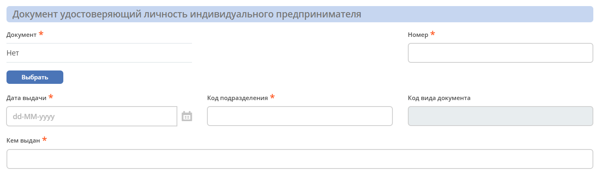

.. list-table::
      :widths: 20 40
      :class: tight-table
      :align: center
      
      * - **Документ**
        - | Выбор из справочника «Код вида документа». 
          | Обязательный.
          | Значение по умолчанию: «Паспорт гражданина Российской Федерации»
      * - **Серия**
        - | Число
          | Обязательный. Редактируемый.
      * - **Номер**
        - | Число
          | Обязательный. Редактируемый.
      * - **Дата выдачи**
        - | Дата в формате dd.mm.yyyy.
          | Обязательный. Редактируемый.
      * - **Код подразделения**
        - | Дата в формате dd.mm.yyyy.
          | Обязательный. Редактируемый.
      * - **Код вида документа**
        - | Текст
          | Обязательный. Нередактируемый.
          | Заполняется автоматически из справочника «Код вида документа» в соответствии с выбранным значением в поле «Документ».
      * - **Кем выдан**
        - | Текст
          | Обязательный. Редактируемый.

-	**Сведения о представителе:**

Скрыто с формы, если **«Вид доверенности»** выбран **«Нестандартная»**.

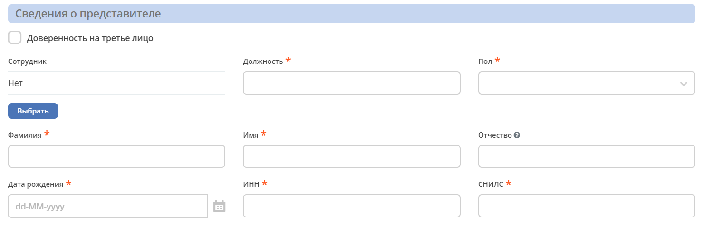

.. list-table::
      :widths: 20 40
      :class: tight-table
      :align: center
      
      * - **Сотрудник**
        - | Выбор из Оргструктуры. 
          | Необязательный. 
          | Скрывается с формы при доверенности на третье лицо=true.
      * - **Доверенность на третье лицо**
        - | Чек-бокс. 
          | По умолчанию значение false.
      * - **Должность**
        - | Текст. 
          | Обязательный. 
          | Зависит от поля «Сотрудник»:
          | -	заполнено, автоматическое заполнение из профиля выбранного пользователя;
          | -	не заполнено, ручное заполнение.      
      * - **Пол**
        - | Выбор из списка:
          | 1.	Женский;
          | 2.	Мужской.
          | Обязательный.
          | Зависит от поля «Сотрудник»:
          | -	заполнено, автоматическое заполнение из профиля выбранного пользователя;
          | -	не заполнено, ручное заполнение. 
      * - **Фамилия**
        - | Текст.
          | Обязательный.
          | Зависит от поля «Сотрудник»:
          | -	заполнено, автоматическое заполнение из профиля выбранного пользователя;
          | -	не заполнено, ручное заполнение. 
      * - **Имя**
        - | Текст.
          | Обязательный.
          | Зависит от поля «Сотрудник»:
          | -	заполнено, автоматическое заполнение из профиля выбранного пользователя;
          | -	не заполнено, ручное заполнение. 
      * - **Отчество**
        - | Текст.
          | Обязательный.
          | Зависит от поля «Сотрудник»:
          | -	заполнено, автоматическое заполнение из профиля выбранного пользователя;
          | -	не заполнено, ручное заполнение. 
      * - **Дата рождения**
        - | Дата в формате dd.mm.yyyy. 
          | Обязательный.
          | Зависит от поля «Сотрудник»:
          | -	заполнено, автоматическое заполнение из профиля выбранного пользователя;
          | -	не заполнено, ручное заполнение. 
      * - **ИНН**
        - | Текст.
          | Обязательный.
          | Зависит от поля «Сотрудник»:
          | -	заполнено, автоматическое заполнение из профиля выбранного пользователя;
          | -	не заполнено, ручное заполнение. 
      * - **СНИЛС**
        - | Текст.
          | Обязательный.
          | Зависит от поля «Сотрудник»:
          | -	заполнено, автоматическое заполнение из профиля выбранного пользователя;
          | -	не заполнено, ручное заполнение. 

-	**Документ, удостоверяющий личность представителя:**

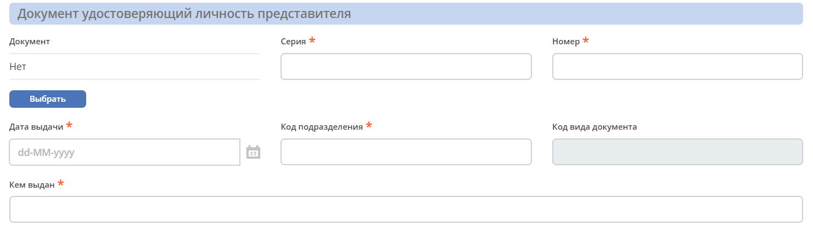

.. list-table::
      :widths: 20 40
      :class: tight-table
      :align: center 
      
      * - **Документ**
        - | Выбор из справочника «Код вида документа». 
          | Обязательный.
          | Значение по умолчанию: «Паспорт гражданина Российской Федерации»
      * - **Серия**
        - | Число
          | Обязательный. Редактируемый.
      * - **Номер**
        - | Число
          | Обязательный. Редактируемый.
      * - **Дата выдачи**
        - | Дата в формате dd.mm.yyyy.
          | Обязательный. Редактируемый.
      * - **Код подразделения**
        - | Дата в формате dd.mm.yyyy.
          | Обязательный. Редактируемый.
      * - **Код вида документа**
        - | Текст
          | Обязательный. Нередактируемый.
          | Заполняется автоматически из справочника «Код вида документа» в соответствии с выбранным значением в поле «Документ».
      * - **Кем выдан**
        - | Текст
          | Обязательный. Редактируемый.

-	**Сведения о передаваемых полномочиях:**

Скрыто с формы, если «Вид доверенности» выбран «Нестандартная».

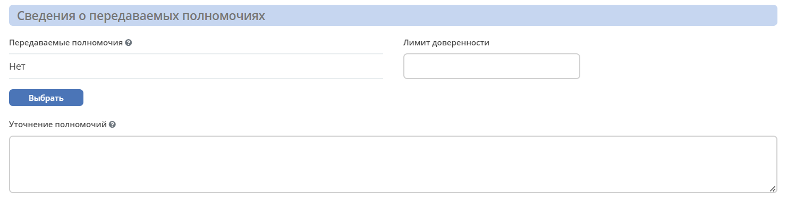

.. list-table::
      :widths: 20 40
      :class: tight-table
      :align: center
      
      * - **Передаваемые полномочия**
        - | Множественный выбор из справочника «Классификатор полномочий». 
          | Обязательный, если «Формат доверенности» = Машиночитаемая.
      * - **Лимит доверенности**
        - | Число
          | Необязательный.
          | Формат: два знака после запятой, с разделителем разрядов.
          | **Если поле не было заполнено пользователем, то по умолчанию записывается 0 (важно для корректной работы DMN).**
      * - **Уточнение полномочий**
        - | Многострочный текст. 
          | Необязательный.

Для бумажной доверенности поля **«Передаваемые полномочия»** и **«Уточнение полномочий»** обязательны для заполнения. Если одно заполнено, то обязательность со второго убирается.

-	**Приложения:**

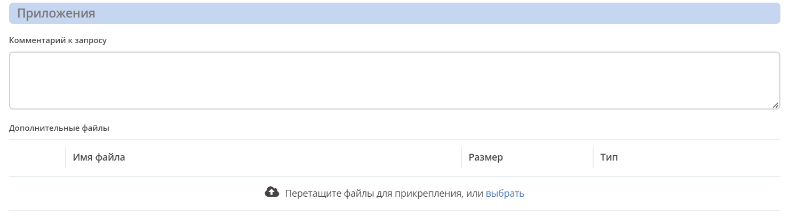

.. list-table::
      :widths: 20 40
      :class: tight-table
      :align: center
      
      * - **Комментарий к запросу**
        - | Многострочный текст. 
          | Необязательный.
      * - **Содержимое**
        - | Загрузчик файла. 
          | Отображается и обязательный, если «Вид доверенности» = Нестандартная и «Формат доверенности» = Бумажная.
      * - **Дополнительные файлы**
        - | Загрузчик файла. 
          | Множественное заполнение. Необязательный.
          | Файлы отображаются в виджете «Документы».
          | Предусмотрены следующие типы документов:
          | -	Доверенность на подписание (один файл);
          | -	Отзыв доверенности (один файл);
          | -	Скан-копия доверенности (один файл);
          | -	Скан-копия отзыва доверенности (один файл);
          | -	Прочее (множественное заполнение).

Для отправки доверенности в работу необходимо заполнить обязательные атрибуты на форме создания и нажать кнопку **«Отправить на согласование»**. Обязательные для заполнения атрибуты отмечены знаком **«*»**.

Для видов **«Генеральная»** и **«Стандартная»** доверенность будет сгенерирована по шаблону на основании введенных данных и добавлена как файл-вложение. Файл будет отображаться в виджете **«Документы»**. Человекочитаемый вид доверенности доступен посредством действия **«Скачать PDF»**

Если выбран вид доверенности **«Нестандартная»**, то укажите **Комментарий к запросу** и загрузите файл в атрибут **«Содержимое»**. Добавленный файл будет отображаться в виджете **«Предпросмотр»**.

Доверенности будет присвоен номер, который генерируется автоматически согласно правилу **№ 01-ХХ/Y**, где 

    -	**ХХ** - последние две цифры текущего года;
    -	**Y** - порядковый номер доверенности в системе.

При отсутствии возможности заполнить все обязательные атрибуты доверенность может быть сохранена в статусе **«Черновик»**. Для этого необходимо нажать **«Сохранить»**. Впоследствии черновик может быть отредактирован, сохранен повторно или после заполнения обязательных атрибутов отправлен на согласование. 

Все созданные в Системе доверенности (включая в статусе **«Черновик»**) отображаются в журнале **«Доверенности»**.

В случае нажатия кнопки **«Отмена»** форма создания закрывается без сохранения доверенности в Системе.

Карточка доверенности с виджетами
-------------------------------------------

После первого сохранения или отправки в работу карточка отображается в соответствии с действующими настройками страницы данного типа.

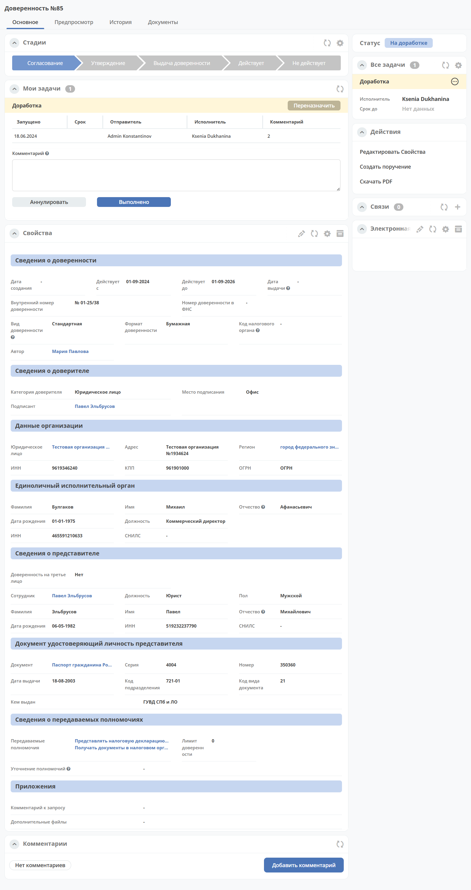

Стандартный дашборд карточки Довренности имеет вкладки:

 - **«Основное»**.
 - **«Предпросмотр»**. 
 - **«История»**. 
 - **«Документы»**. В виджете настроены следующие типы документов:

    1.	«Прочее» - предусмотрено множественное заполнение;
    2.	«Доверенность на подписание»;
    3.	«Скан-копия доверенности»;
    4.	«Скан-копия отзыва доверенности»;
    5.	«Отзыв доверенности».

Основные виджеты карточки и их назначение:
    - **«Стадии»** визуализирует прохождение стадий документа. Стадии представляют собой сгруппированные статусы.
    -	**«Мои задачи»** служит для отображения текущего действия задачи по данному документу у просматривающего его пользователя и варианты их завершения.
    -	**«Свойства»** предназначен для отображения атрибутов карточки и их значений. 
    -	**«Комментарии»** - общий комментарий. Предназначен для ввода и отображения истории ввода комментариев для задачи в целом. Является инструментом обратной связи в цикле обработки выявленных отклонений.
    -	**«Статус»** отображает текущий статус документа (определяется системой автоматически, не доступен для редактирования пользователем).
    -	**«Все задачи»** служит для отображения задач по данному документу и их исполнителей.
    -	**«Действия»** содержит перечень доступных действий с документом на данном статусе.
    -	**«Связи документа»** используется для установки связей данного документа с другими в системе и отображения установленных связей.
    - **«Электронная подпись»** содержит информацию об ЭЦП, которой был подписан документ, например:

        .. image:: _static/poa/poa_18.png
            :width: 200
            :align: center 

    -	**«История»** служит для отображения событий таких, как создание, обновление, смена статуса документа с фиксацией даты и времени их происшествия, участников и комментариев.
    -	**«Документы»** служит для загрузки сопутствующих документов.

Работа с доверенностью на различных статусах
------------------------------------------------------

Перейти к доверенности в любом статусе можно одним из трех способов:

  -	открыв задачу в Журнале **«Текущие задачи»**;
  -	открыв документ в Журнале **«Доверенности»**;
  -	перейдя по ссылке из полученного уведомления.

Подробно о :ref:`задачах<tasks>`.

Согласование
~~~~~~~~~~~~~~~

Группы согласующих (Согласующие доверенностей, Дополнительные согласующие) назначаются динамически - последовательно или параллельно в зависимости от выбранного вида доверенности и указанного лимита. См.  :ref:`Маршруты<poa_routs>`.

В статусе **«На согласование»** доступны следующие варианты завершения задачи:

.. list-table::
      :widths: 20 20
      :class: tight-table
      
      * - |

          .. image:: _static/poa/poa_20.png
              :width: 600
              :align: center 

        - | 

          .. image:: _static/poa/poa_21.png
              :width: 600
              :align: center 

-	**«На доработку»** - отправить Инициатору на доработку, если в доверенности есть спорные вопросы. Внесите комментарий. Доверенность переходит в статус **«Доработка»**. Инициатору доверенности будет отправлено уведомление.
-	**«Согласовать»** - для формата **«Машиночитаемая»** доверенность переходит в статус **«На подписании ЭЦП»**, для формата **«Бумажная»**- **«На утверждении»**. Исполнителю задачи будет отправлено уведомление.

Подписание ЭЦП
~~~~~~~~~~~~~~~

Только для формата доверенности **«Машиночитаемая»**.

Задача **«Подписание ЭЦП»** назначается на подписанта, выбранного в разделе **«Сведения о доверителе»**. В статусе **«На подписании ЭЦП»** доступны следующие варианты завершения задачи:

.. list-table::
      :widths: 20 20
      :class: tight-table
      
      * - |

          .. image:: _static/poa/poa_22.png
              :width: 600
              :align: center 

        - | 

          .. image:: _static/poa/poa_23.png
              :width: 300
              :align: center 

-	**«На доработку»** - отправить Инициатору на доработку, если в доверенности есть спорные вопросы. Внесите комментарий. Доверенность переходит в статус **«Доработка»**. Инициатору доверенности будет отправлено уведомление.
-	**«Подписать»** - доверенность переходит в статус **«На утверждении»**. Исполнителю задачи будет отправлено уведомление.

Информация об ЭЦП будет отражена в виджете **«Электронная подпись»**.

Доработка
~~~~~~~~~~~

Доработка доверенности  доступна Инициатору.

В статусе **«Доработка»** Инициатору доступны следующие варианты завершения задачи:

Инициатор изучает замечания, оставленные Согласующим в поле **Комментарий**, оценивает целесообразность доработки доверенности. Используя действия **«Редактировать свойства»**, вносит изменения и выносит решение:

-	**«Аннулировать»** - если доработка доверенности оказывается нецелесообразной. Внесите комментарий. Доверенность переходит в статус **«Аннулирована»**.
-	**«Выполнено»** - если Инициатор выполнил доработку доверенности. Доверенность возвращается в статус, с которого была отправлен в доработку. Исполнителю задачи будет отправлено уведомление.

Утверждение
~~~~~~~~~~~

Доверенность утверждают сотрудники группы **«Регистраторы доверенностей»**.
В статусе **«На утверждении»** доступны следующие варианты завершения задачи:

-	**«На доработку»** - отправить Инициатору на доработку, если в доверенности есть спорные вопросы. Внесите комментарий. Доверенность переходит в статус **«Доработка»**. Инициатору доверенности будет отправлено уведомление.
-	**«Выполнено»** - Доверенность переходит в статус **«Направлена Представителю»**. Исполнителю задачи будет отправлено уведомление.

В виджете **«Документы»** можно загрузить скан-копию доверенности. 

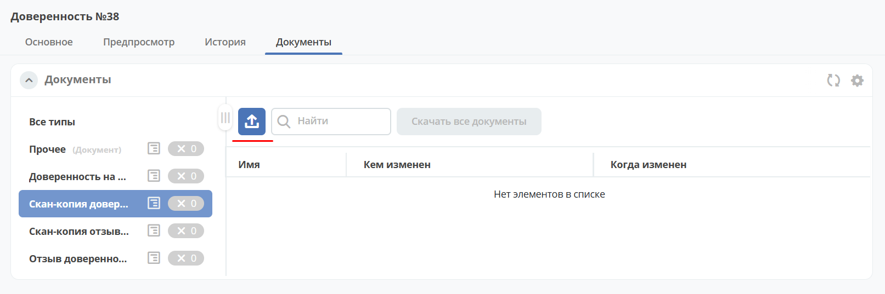

Получение
~~~~~~~~~~~

Задача **«Получение»** назначается на сотрудника, выбранного в разделе **«Сведения о представителе»**.

В статусе **«Направлена Представителю»** доступны следующие варианты завершения задачи:

-	**«Выполнено»** - Доверенность получена. Доверенность переходит в статус **«Действует»**.

Отзыв доверенности
--------------------

Действие доступно пользователям, входящим в группу **«Регистраторы доверенностей»** в статусе доверенности **«Действует»**.

.. list-table::
      :widths: 20 20
      :class: tight-table
      :align: center
      
      * - |

          .. image:: _static/poa/poa_28.png
              :width: 250
              :align: center 

        - | 

          .. image:: _static/poa/poa_29.png
              :width: 300
              :align: center 

При активации действия статус меняется на **«Отзыв доверенности»**, автоматически текущей системной датой заполняется атрибут **«Действует до»**:

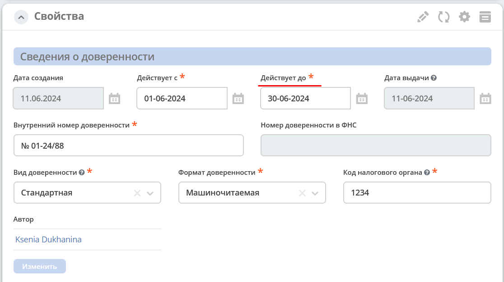

Сотрудники группы **«Регистраторы доверенностей»** указывают комментарий и выносят по задаче решение **«Выполнено»**:

Доверенность переходит в статус **«Не действует»**.

Автоматический присвоение статуса «Не действует»
-----------------------------------------------------

Когда дата, указанная в поле **«Действует до»** становится меньше текущей даты, статус доверенности автоматически изменяется на **«Не действует»**.

Уведомления
-------------

Стандартное уведомление о назначении задачи. Например:

Кроме стандартных уведомлений о назначении задачи, есть еще уведомления за 20 дней до окончания срока действия доверенности. 
В случае, если на момент оформления доверенности до окончания срока действия менее 20 дней (уж не знаю бывают ли такие доверенности в реальной жизни), то такое уведомление тоже отправляется.

Действия, доступные с доверенностью
-------------------------------------

Для бумажной доверенности:

- **Скачать в PDF** - загрузить сгенерированную доверенность в формате pdf 

Для машиночитаемой доверенности:

- **Скачать** - загрузить доверенность в формате doc
- **Скачать в PDF**	- загрузить сгенерированную доверенность в формате pdf
- **Выгрузить в XML**	- выгрузить файл МЧД в формате xml

Создать поручение
------------------

Cоздать поручение можно из карточки документа, выбрав действие **«Создать поручение»**. См. подробно :ref:`Создание поручения из карточки<ecos-assignments-action>`