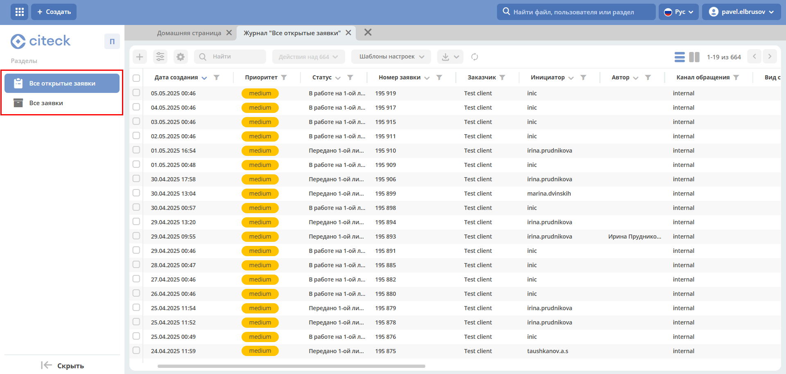
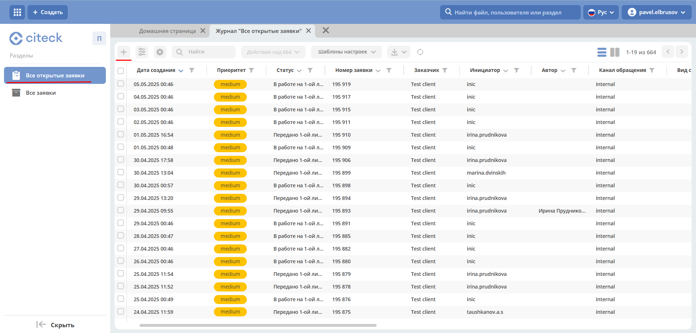
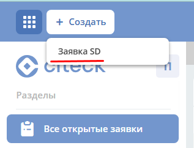
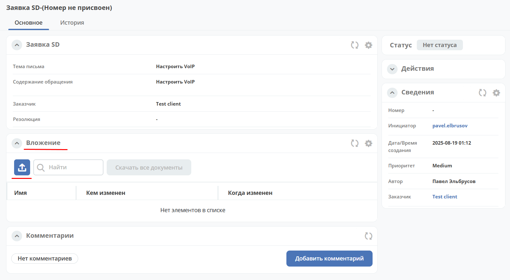
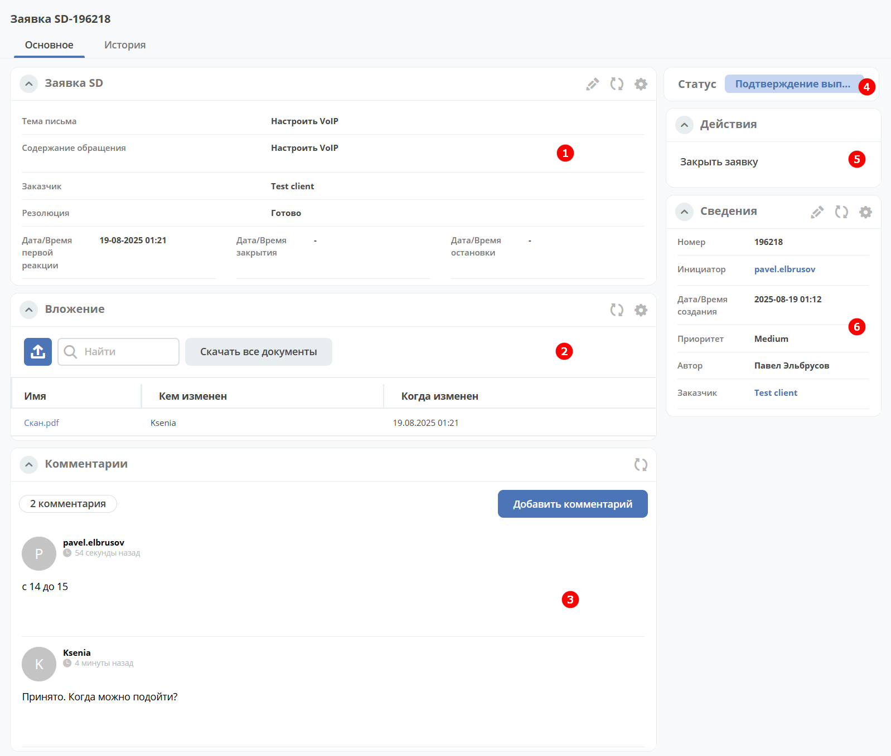
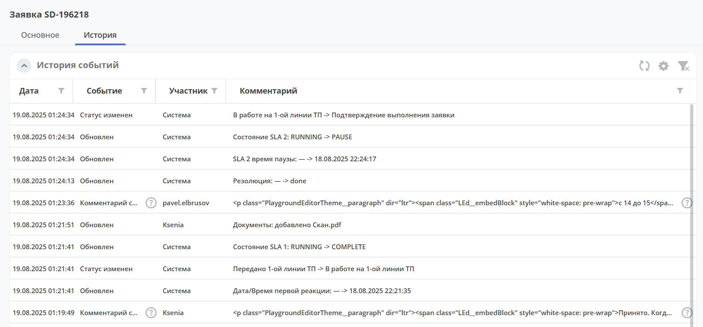
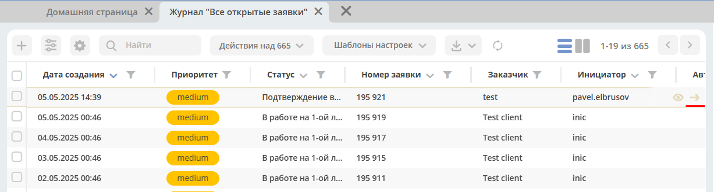

Портал технической поддержки
===============================

.. _portal_sd:

.. note:: 

       Доступно только в enterprise версии.

.. contents::
   :depth: 3

Для внешних пользователей может быть настроен портал технической поддержки, на котором доступно:

       * создание заявок,
       * отслеживание статуса текущих заявок,
       * просмотр истории, комментариев и вложений закрытых заявок,
       * общение через комментарии и обмен файлами со специалистами технической поддержки.

Общая схема смены статусов
----------------------------

Переход заявки по статусам:

 .. image:: _static/portal_sd/status_actions.png
       :width: 800
       :align: center 

.. list-table::
      :widths: 20 40
      :align: center
      :class: tight-table 
      
      * - **Передано 1-й линии ТП**
        - | Инициатор создает карточку заявки SD в Системе или Инициатор отправляет письмо по шаблону с описанием проблемы.
          | Система создает карточку заявки SD по письму Инициатора по преднастроенному шаблону.      
          | Система запускает процесс обработки заявки, назначает заявку группе пользователей 1-й линии поддержки, или заявку возвращают Исполнители 2-й, 3-й линии ТП, Инициатор.
      * - **В работе на 1-й линии ТП**
        - | Исполнитель 1-й линии ТП берет на себя заявку.
      * - **Передано 2-й линии ТП**
        - | Исполнитель 1-й линии ТП отправляет на 2-ю линию поддержки, или заявку возвращает Инициатор.
      * - **В работе на 2-й линии ТП**
        - | Исполнитель 2-й линии ТП берет на себя заявку.
      * - **Передано 3-й линии ТП**
        - | Исполнитель 1-й линии ТП или Исполнитель 2-й линии ТП отправляет на 3-ю линию поддержки, или заявку возвращает Инициатор.
      * - **В работе на 3-й линии ТП**
        - | Исполнитель 3-й линии ТП берет на себя заявку.
      * - **Подтверждение выполнения заявки**
        - | Исполнитель любой линии ТП выполняет заявку сам и отправляет на подтверждение выполнения Инициатору.
      * - **На уточнении**
        - | Исполнитель любой линии ТП отправляет заявку на уточнение Инициатору.
      * - **На удержании**
        - | Исполнитель любой линии ТП удерживает заявку.
          | Работа приостановлена, поскольку ожидается выполнение какого-то действия.
          | Например, на 1-й линии приостановлена работа, потому что по данной проблеме создана задача на 3-ю линию. Поскольку проблема не решена, на 1-й линии работы не ведутся, заявка переводится в статус на удержании.
      * - **Закрыта**
        - | Исполнитель любой линии ТП закрывает заявку по факту ее выполнения и подтверждения Инициатором.

Журнал
--------

На портале представлены 2 журнала:

       * **Все открытые заявки** – созданные заявки, которые находятся в работе и не закрыты.
       * **Все заявки** – открытые заявки и заявки в статусе «Закрыта».

.. note::

       В журналах доступны заявки как самого пользователя, так и других пользователей организации.

Создание заявки
----------------

Заявку можно создать из журнала **«Все открытые заявки»** или **«Все заявки»**, нажав: 

или с помощью кнопки быстрого создания:

Карточка заявки при создании
-----------------------------

Обязательно заполните **Приоритет**, **Тема письма**, **Содержание обращения**, **Заказчик**.

Для ввода текста используйте визуальный редактор, предоставляющий широкий ряд возможностей по настройке и изменению внешнего вида текста, форматирования, добавления изображений, ссылок.

Нажмите **Создать**.

Далее в заявку можно добавить файлы в разделе **«Вложение»**:

.. note::

       Номер и статус будут присвоены не сразу.

Виджеты карточки
----------------

1.	**Виджет «Заявка SD»** отображает информацию, поданную Инициатором, и поля, заполняемые системой и Исполнителем в жизненном цикле заявки.
2.	**Виджет «Вложения»** предназначен для добавления файлов, их скачивания.
3.	**Виджет «Комментарии»** отображает комментарии к заявке. Подробно о :ref:`виджете<widget_comments>`.
4.	**Виджет «Статус»** отображает текущий статус заявки (определяется системой автоматически, не доступен для редактирования пользователем).
5.	**Виджет «Действия»** содержит перечень доступных действий с заявкой на данном статусе.
6.	**Виджет «Сведения»**. Подробная информация о заявке: номер, инициатор, дата/время создания, приоритет, автор, заказчик.

Вкладка «История»
------------------

.. _portal_sd_history:

В **виджете «История событий»** отображается хронология событий по заявке с фиксацией даты и времени, когда они произошли, участников и комментариев.

Отображается следующая информация:

  - событие создания заявки;
  - смена статуса;
  - добавление/изменение комментария;
  - изменения по полям;
  - добавление вложений.

Действия
---------

Возможные действия по процессу показаны в виджете **«Действия»**.

На статусе **«Подтверждение выполнения заявки»** доступно следующее действие:

Статус заявки станет **«Закрыта»**.

Так же действия доступны в журнале в строке заявки:

