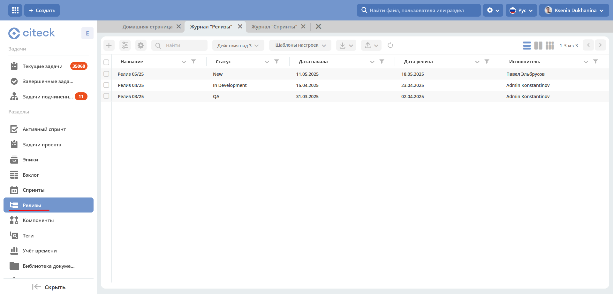

Модуль «Релизы»
=================

.. _ecos-releases:

Модуль позволяет компании фиксировать и учитывать все этапы, связанные с релизами программного обеспечения или продуктов компании, ее подразделений. 

Модуль обеспечивает прозрачность и систематизацию процесса релиза, позволяя компании более эффективно управлять и контролировать этапы разработки и внедрения новых продуктов.

.. contents::
	:depth: 2

**Реализованные требования:**

    1.	Модуль предоставляет возможность создания и управления проектами релизов, где пользователи смогут добавлять и следить за этапами каждого релиза.
    2.	Каждый проект релиза содержит необходимые атрибуты, такие как название релиза, описание, дата начала и завершения, ответственные лица и другие сопутствующие детали, описанные ниже.
    3.	Пользователи имеют возможность отмечать завершенные этапы, чтобы отслеживать прогресс и текущий статус релиза.
    4.	Новый модуль интегрирован в пользовательский интерфейс Citeck ECOS, обеспечивая простоту в использовании и легкость навигации.

Схема бизнес-процесса
----------------------

 .. image:: _static/releases/bp.png
       :width: 600
       :align: center 

Роли
----

  * Исполнитель
  * Ответственные лица
  * Директор

Группы оргструктуры, в которые должны быть добавлены пользователи
~~~~~~~~~~~~~~~~~~~~~~~~~~~~~~~~~~~~~~~~~~~~~~~~~~~~~~~~~~~~~~~~~~~~~~~~

  * Ответственные за релиз

Статусы
--------

.. list-table::
      :widths: 20 40
      :align: center
      :class: tight-table 
      
      * - **New**
        - Проект релиза
      * - **In development**
        - Релиз в разработке
      * - **QA**
        - Тестирование релиза
      * - **UAT**
        - Тестирование релиза UAT
      * - **Ready for prod**
        - Релиз проверен и готов к установке в prod-среду
      * - **Prod**
        - Релиз установлен в prod-среду

В каком рабочем пространстве доступен
---------------------------------------

Модуль доступен в :ref:`рабочем пространстве<workspaces>` каждого проекта в :ref:`Project tracker<ecos_ept>`.

Журнал и канбан доска
----------------------

.. note:: 

    Журнал доступен только для участников группы **release-responsible-persons** (Ответственные за релиз).

Так же доступна канбан-доска. В колонках доски отображаются статусы релизы, на самой доске - релизы распределены по статусам. По клику на наименование релиза можно перейти в карточку заявки.

 .. image:: _static/releases/releases_2.png
       :width: 700
       :align: center 

Карточка релиза
-----------------

 .. image:: _static/releases/releases_3.png
       :width: 600
       :align: center 

Обязательные поля для заполнения:

    -	Название релиза;
    -	Исполнитель;
    -	Дата начала;
    -	Планируемая дата релиза. Планируемая дата релиза должна быть позже даты начала.

Дашборд релиза с виджетами
----------------------------

 .. image:: _static/releases/releases_4.png
       :width: 600
       :align: center 

Дашборд содержит виджет **«Стадии»**, который визуализирует прохождение статусов релиза.

Смена статуса
---------------

Переход между статусами осуществляется через канбан доску перемещением карточки по столбцам. Столбцы соответствуют статусам релиза:

 .. image:: _static/releases/releases_5.png
       :width: 700
       :align: center 
 
Если условия перехода из статуса в статус не соблюдены, то будет выдана ошибка, например:

 .. image:: _static/releases/releases_6.png
       :width: 300
       :align: center 
 
Или используя варианты действия **«Завершить задачу: "Задача перехода на следующий этап»** в карточке. Действие необходимо подтверждать.

.. list-table::
      :widths: 20 20
      :align: center

      * - |

            .. image:: _static/releases/action_1.png
                  :width: 300
                  :align: center

        - |

            .. image:: _static/releases/action_2.png
                  :width: 350
                  :align: center

.. list-table::
      :widths: 20 40
      :header-rows: 1
      :align: center 
      :class: tight-table 
      
      * - Статус
        - Доступные действия
      * - **New**
        - Отправить в разработку
      * - **In development**
        - Отправить на тестирование
      * - **QA**
        - | Вернуть в разработку
          | Отправить на UAT
      * - **UAT**
        - | Вернуть в разработку
          | Готов к релизу
      * - **Ready for prod**
        - Завершить релиз
      * - **Prod**
        - Установить релиз в prod-среду

 
Создание поручения по релизу
-----------------------------

По релизу можно воспользоваться функционалом создания поручений, выбрав действие **«Создать поручение»**. См. подробно :ref:`Создание поручения из карточки<ecos-assignments-action>`