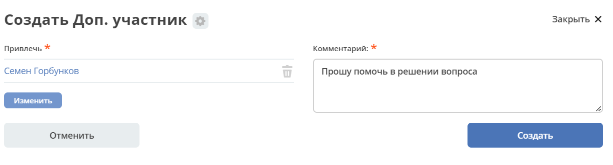
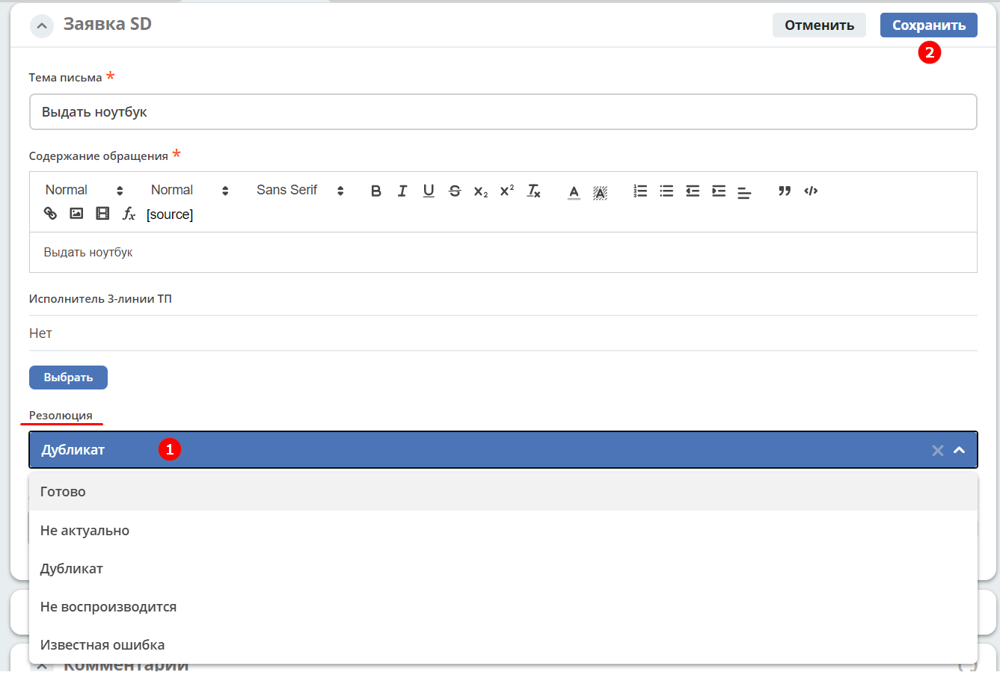

Модуль «Service Desk»
======================

.. _ecos-service-desk:

Модуль **Service Desk** предназначен для автоматизации работы техподдержки с клиентскими обращениями (заявками).

.. contents::
		:depth: 3

Схема и особенности реализации бизнес-процесса
----------------------------------------------

БП реализован во внутреннем редакторе бизнес-процессов BPMN. Подробно о :ref:`редакторе бизнес-процессов BPMN.<ecos-bpmn_platform>`

Основная схема процесса разбита на подпроцессы, триггером (событием) для начала подпроцесса является смена статуса заявки.

Схема основного процесса: 

 .. image:: _static/service_desk/desk_8.png
       :width: 800
       :align: center 

Разбитие на подпроцесс при срабатывании события **«Статус Передано 1-ой линии ТП»**:

 .. image:: _static/service_desk/desk_9.png
       :width: 800
       :align: center 

Подробно о :ref:`событиях BPMN<bpmn_events>`

Смена статуса, ввод комментария, изменения атрибута сопровождается отправкой уведомлений заинтересованным участникам процесса.

Роли
-----

.. list-table::
      :widths: 20 40
      :class: tight-table 
      
      * - **Инициатор**
        - | Определяется автоматически:

           •	заказчик, по чьему письму была создана заявка, тот, кто имеет возможность отслеживать, отвечать на комментарии и т.д.;
           •	сотрудник, создавший заявку вручную, может редактировать, отслеживать, оставлять комментарии.

      * - **Исполнитель 1-ой линии**
        - | Сотрудники, принадлежащие группе «1-я линия поддержки». 
          | Пользователи, которым назначаются задачи на исполнение по заявке SD, могут оставлять комментарии в заявке, добавлять документы, полные права на редактирование Заявки и справочников.
      * - **Исполнитель 2-ой линии**
        - | Сотрудники, принадлежащие группе «2-я линия поддержки». 
          | Пользователи, которым назначаются задачи на исполнение по заявке SD, могут оставлять комментарии в заявке, добавлять документы.
      * - **Исполнитель 3-ей линии**
        - | Сотрудники, принадлежащие группе «3-я линия поддержки_Х» или конкретный исполнитель в задаче, выбранный из числа пользователей группы «3-я линия поддержки_Х». Состав группы «3-я линия поддержки_Х» зависит от заказчика/проекта. 
          | Вместо «Х» будет указан Проект или Заказчик или другой признак.
          | Могут оставлять комментарии в заявке, добавлять в нее документы.
      * - **Руководитель ТП**
        - | Сотрудник – руководитель техподдержки.
          | Полные права на редактирование и заявки и справочников.
      * - **Дополнительный участник**
        - | Сотрудник, выбранный из Оргструктуры при выполнении действия «Добавить участника».
          | Может просматривать заявку, к которой его привлекли и вносить в ней комментарий в виджет комментариев
      * - **Технолог**
        - | Сотрудник или Группа, обладающий правами администратора процесса, как и Руководитель ТП – полные права на редактирование Заявки и справочников. 
          | Может участвовать в процессе (выполнять задачи и перемещать заявку по ЖЦ), но не получает уведомления.

Группы оргструктуры, в которые должны быть добавлены пользователи
~~~~~~~~~~~~~~~~~~~~~~~~~~~~~~~~~~~~~~~~~~~~~~~~~~~~~~~~~~~~~~~~~~~~~~~~

  * 1-ая линия ТП
  * 2-ая линия ТП
  * 3-я линия ТП
  * Технологи
  * Руководитель ТП

Статусы
----------

Переход заявки по статусам:

 .. image:: _static/service_desk/status_actions.png
       :width: 800
       :align: center 

.. list-table::
      :widths: 20 40
      :class: tight-table 
      
      * - **Передано 1-й линии ТП**
        - | Инициатор создает карточку заявки SD в Системе или Инициатор отправляет письмо по шаблону с описанием проблемы.
          | Система создает карточку заявки SD по письму Инициатора по преднастроенному шаблону.      
          | Система запускает процесс обработки заявки, назначает заявку группе пользователей 1-й линии поддержки, или заявку возвращают Исполнители 2-й, 3-й линии ТП, Инициатор.
      * - **В работе на 1-й линии ТП**
        - | Исполнитель 1-й линии ТП берет на себя заявку.
      * - **Передано 2-й линии ТП**
        - | Исполнитель 1-й линии ТП отправляет на 2-ю линию поддержки, или заявку возвращает Инициатор.
      * - **В работе на 2-й линии ТП**
        - | Исполнитель 2-й линии ТП берет на себя заявку.
      * - **Передано 3-й линии ТП**
        - | Исполнитель 1-й линии ТП или Исполнитель 2-й линии ТП отправляет на 3-ю линию поддержки, или заявку возвращает Инициатор.
      * - **В работе на 3-й линии ТП**
        - | Исполнитель 3-й линии ТП берет на себя заявку.
      * - **Подтверждение выполнения заявки**
        - | Исполнитель любой линии ТП выполняет заявку сам и отправляет на подтверждение выполнения Инициатору.
      * - **На уточнении**
        - | Исполнитель любой линии ТП отправляет заявку на уточнение Инициатору.
      * - **На удержании**
        - | Исполнитель любой линии ТП удерживает заявку.
          | Работа приостановлена, поскольку ожидается выполнение какого-то действия.
          | Например, на 1-й линии приостановлена работа, потому что по данной проблеме создана задача на 3-ю линию. Поскольку проблема не решена, на 1-й линии работы не ведутся, заявка переводится в статус на удержании.
      * - **Закрыта**
        - | Исполнитель любой линии ТП закрывает заявку по факту ее выполнения и подтверждения Инициатором.

Журналы
--------

Информация о заявках представлена в подпунктах меню:

    -	Все открытые заявки;
    -	В работе на 1-й линии ТП;
    -	В работе на 2-й линии ТП;
    -	В работе на 3-й линии ТП;  
    -	Все заявки

 .. image:: _static/service_desk/desk_1.png
       :width: 800
       :align: center 

По клику на пункт меню открывается журнал, содержащий заявки:

 .. image:: _static/service_desk/desk_6.png
       :width: 800
       :align: center 

Например, https://host/v2/journals?journalId=open-requests-service-desk-journal 

Приоритет заявок автоматически отмечается цветом:

.. list-table::
      :widths: 20 40
      :align: center 
      :class: tight-table 
      
      * - 

            .. image:: _static/service_desk/desk_2.png
                :width: 50
                :align: center           

        - Низкий
      * - 

            .. image:: _static/service_desk/desk_3.png
                :width: 50
                :align: center           

        - Средний
      * - 

            .. image:: _static/service_desk/desk_4.png
                :width: 50
                :align: center           

        - Высокий
      * - 

            .. image:: _static/service_desk/desk_5.png
                :width: 50
                :align: center           

        - Срочный

Связанные журналы:

 - **Заказчики** - https://host/v2/journals?journalId=sd-clients-journal 
 - **Рабочее расписание** https://host/v2/admin?journalId=type$working-schedule&type=JOURNAL  
 - **SLA** https://host/v2/journals?journalId=sd-sla-journal 
 - **Маппинг заказчиков** https://host/v2/journals?journalId=clients-mapping-journal 

Канбан
-------

Для журнала **«Все заявки»** доступна канбан доска.

**Канбан** – наглядное представление задач в виде виртуальной доски проекта. Режим доступен по нажатию на:

 .. image:: _static/service_desk/desk_7.png
       :width: 800
       :align: center 

В колонках доски отображаются статусы заявок, на самой доске - заявки распределены по статусам. По клику на наименование заявки можно перейти в карточку заявки.

Переход между статусами может осуществляться через канбан доску перемещением карточки по столбцам. Если условия смены статусы не соблюдены, то выдается предупреждение:

 .. image:: _static/service_desk/error_1.png
       :width: 300
       :align: center 

Создание заявки
----------------

Заявка может быть создана Системой из :ref:`письма от заказчика<parsing_email>` или вручную Инициатором – пользователем системы в ECOS.

Создание заявки в ECOS возможно как с помощью кнопки быстрого создания: 

 .. image:: _static/service_desk/desk_25.png
       :width: 300
       :align: center 

или из журнала **раздела «Service desk»**:

 .. image:: _static/service_desk/desk_26.png
       :width: 800
       :align: center 

На экране появляется форма создания Заявки.

 .. image:: _static/service_desk/desk_29.png
       :width: 600
       :align: center 

в которой необходимо заполнить обязательные поля: **Приоритет, Тема письма, Содержание обращения, Заказчик**.

Для ввода текста используйте визуальный редактор, предоставляющий широкий ряд возможностей по настройке и изменению внешнего вида текста, форматирования, добавления изображений, ссылок.

Нажать **Создать**.

Далее на вкладке **Вложения** в заявку можно добавить файлы:

 .. image:: _static/service_desk/desk_29_1.png
       :width: 600
       :align: center 

Карточка заявки с виджетами
--------------------------------

 .. image:: _static/service_desk/desk_10.png
       :width: 700
       :align: center 

Карточка состоит из следующих виджетов:

  1.	**Виджет «Заявка SD»** отображает информацию, поданную Инициатором, поля, заполняемые Исполнителем и системой в жизненном цикле заявки. Данные, заполняемые системой автоматически: 

    .. image:: _static/service_desk/date_time.png
          :width: 600
          :align: center 

  2.	**Виджет «Связи документа»** для установки связей данного заявки с другими и отображения установленных связей.
  3.	**Виджет «Комментарии»** отображает :ref:`комментарии<sd_comment>` к заявке. Подробно о :ref:`виджете<widget_comments>`.
  4.	**Виджет «Статус»** отображает текущий статус заявки (определяется системой автоматически, не доступен для редактирования пользователем).
  5.	**Виджет «Действия»** содержит перечень доступных :ref:`действий<sd_actions>` с заявкой на данном статусе.
  6.	**Виджет «Все задачи»** отображает задачи по заявке и их исполнителей.
  7.	**Виджет SLA** отображает основные параметры :ref:`SLA<sla-service-desk>`.
  8.	**Виджет «Сведения».** Подробная информация о заявке: номер, инициатор, дата/время создания, приоритет, автор, заказчик.
  9.	**Виджет «Большей полей».** Дополнительные поля заявки.

Вкладка «История»
~~~~~~~~~~~~~~~~~~

Виджет «История событий» служит для отображения событий таких, как создание, обновление, смена статуса кейса с фиксацией даты и времени их происшествия, участников и комментариев.

 .. image:: _static/service_desk/desk_14.png
       :width: 600
       :align: center 

Вкладка «Вложения»
~~~~~~~~~~~~~~~~~~~~

Вкладка предназначена для добавления файлов к заявке:

 .. image:: _static/service_desk/desk_31.png
       :width: 600
       :align: center 

Связи
~~~~~~~

В качестве связи можно добавить веб-ссылку:

|

Действия
~~~~~~~~~

.. _sd_actions:

Возможные действия по процессу сгруппированы в виджете **«Действия»** в пункте **«Завершить задачу «Наименование теущей задачи пользователя»**:

    .. list-table::
      :widths: 20 20
      :align: center 
      :class: tight-table 
      
      * - 

          .. image:: _static/service_desk/desk_13.png
                :width: 300
                :align: center 

        -       

          .. image:: _static/service_desk/desk_13_1.png
                :width: 280
                :align: center 

При выполнии действия, завершении задачи необходимо подтвержение. Для некоторых действий необходимо можно заполнить комментарий.

    .. list-table::
      :widths: 20 20
      :align: center 
      :class: tight-table 
      
      * - 

          .. image:: _static/service_desk/action_comment_1.png
                :width: 400
                :align: center 

        -       

          .. image:: _static/service_desk/action_comment.png
                :width: 500
                :align: center 

См. подробно в разделе :ref:`Работа с заявкой<operate-service-desk>`

Комментарии
~~~~~~~~~~~~

.. _sd_comment:

При выставленной отметке **Внутренний комментарий** - комментарий не будет виден заказчику.

      .. image:: _static/service_desk/desk_30.png
          :width: 600
          :align: center 

По процессу рассылаются уведомления о комментариях в следующих случаях:

  1.	**Инициатор** добавил комментарий -  рассылка 1,2,3 линии.
  2.	**1,2,3 линия поддержки** добавила комментарий -  рассылка Инициатору.

SLA
-----

.. _sla-service-desk:

**SLA (Service Level Agreement** — соглашение об уровне обслуживания) — внешний документ (существующий между заказчиком и исполнителем), описывающий параметры предоставляемой услуги. 

Для поставщика услуг соглашение об уровне обслуживания — это изложенное простым и доступным языком соглашение между ним и заказчиком (внутренним или внешним). В таком соглашении определяются предоставляемые услуги, ожидаемая скорость реагирования и способ измерения эффективности.

Соглашение SLA определяет согласованные условия предоставления услуг, включая время безотказной работы и оперативность поддержки.

В модуле SD отслеживаются два основных параметра: 

  -	время до первой реакции, 
  -	время до окончательного решения. 

Настройка SLA доступна в журнале https://host/v2/journals?journalId=sd-sla-journal

 .. image:: _static/service_desk/sla_settings.png
       :width: 700
       :align: center 

Карточка SLA:

 .. image:: _static/service_desk/sla_card.png
       :width: 600
       :align: center 

Сроки можно настроить для конкретного заказчика.

Учет рабочего расписания
~~~~~~~~~~~~~~~~~~~~~~~~~~

.. _schedule-service-desk:

Порядок расчета SLA можно настроить с учетом рабочего времени технической поддержки индивидуально для каждого заказчика. 
Например, если ночные/вечерние часы, выходные дни не должны включаться в расчет, или задать конкретное время начала и окончания работы.

Для этого необходимо создать :ref:`рабочее расписание<working-schedule>` - https://host/v2/admin?journalId=type$working-schedule&type=JOURNAL

 .. image:: _static/service_desk/SD_calendar_journal.png
       :width: 700
       :align: center 

|

 .. image:: _static/service_desk/SD_calendar.png
       :width: 600
       :align: center 

И добавить его в карточку маппинга заказчика - https://host/v2/journals?journalId=clients-mapping-journal

 .. image:: _static/service_desk/client_mapping.png
       :width: 700
       :align: center 

выбрав созданное расписание в поле **Рабочее расписании**:

 .. image:: _static/service_desk/client_mapping_1.png
       :width: 600
       :align: center 

Виджет «SLA»
~~~~~~~~~~~~~

 .. image:: _static/service_desk/desk_16.png
       :width: 600
       :align: center 

Обозначения:

.. list-table::
      :widths: 20 40
      :class: tight-table 
      
      * - 

            .. image:: _static/service_desk/desk_17.png
                :width: 30
                :align: center           

        - Процесс запущен.
      * - 

            .. image:: _static/service_desk/desk_18.png
                :width: 30
                :align: center           

        - Остается менее 30 мин до того, как процесс будет просрочен.
      * - 

            .. image:: _static/service_desk/desk_19.png
                :width: 30
                :align: center           

        - Процесс просрочен, указано на сколько.
      * - 

            .. image:: _static/service_desk/desk_20.png
                :width: 30
                :align: center           

        - Процесс по SLA завершен и НЕ просрочен.
      * - 

            .. image:: _static/service_desk/desk_21.png
                :width: 30
                :align: center           

        - | При переходе в статусы «На уточнении», «На удержании» или «На подтверждении выполнения».
          | Остается менее 30 мин до того, как процесс будет просрочен.
      * - 

            .. image:: _static/service_desk/desk_22.png
                :width: 30
                :align: center           

        - | При переходе в статусы «На уточнении», «На удержании» или «На подтверждении выполнения». 
          | Процесс просрочен.
      * - 

            .. image:: _static/service_desk/desk_23.png
                :width: 30
                :align: center           

        - Процесс по SLA завершен и просрочен.

Работа с заявкой
-----------------

.. _operate-service-desk:

Перейти к Заявке Исполнитель может любым из способов:

  -	из полученного **уведомления**;
  -	из журнала **«Активные задачи»**;
  -	открыв задачу в журналах **раздела «Service desk»**.

Подробно о :ref:`задачах<tasks>`.

Для взятия заявки в работу, передачи на следующие линии поддержки и т.д. используйте :ref:`действия<sd_actions>`.

Так же действия доступны в журнале в строке заявки:

 .. image:: _static/service_desk/actions_line.png
       :width: 700
       :align: center 

Действие «Взять в работу»
~~~~~~~~~~~~~~~~~~~~~~~~~~~~~

Данным действием Исполнитель линии ТП берет заявку в работу. Действие доступно нас статусах **«Передано 1-й линии ТП»**, **«Передано 2-ой линии ТП»** и **«Передано 3-ей линии ТП»** соответственно. 

Действие необходимо подтвердить, нажав **«Да»**.

Заявка переходит на статус **«В работе на 1-ой линии ТП»**, **«В работе на 2-ой линии ТП»** и **«В работе на 3-ей линии ТП»** соответственно. 

Действие «Добавить участника»
~~~~~~~~~~~~~~~~~~~~~~~~~~~~~~~

Если к решению заявки необхоимо привлечь дополнительных исполнителей. Действие доступно Исполнителям любой линии ТП на любом из статусов **«В работе на 1-ой линии ТП»**, **«В работе на 2-ой линии ТП»** и **«В работе на 3-ей линии ТП»**.

При выборе действия в поле **«Привлечь»** можно выбрать конкретного пользователя из Оргструктуры (не группу), и в поле **«Комментарий»** указать суть обращения к указанному сотруднику. 

Действие «На уточнение»
~~~~~~~~~~~~~~~~~~~~~~~~~~

Если по заявке необходимо уточнение от Инициатора. Действие доступно Исполнителям любой линии ТП на любом из статусов **«В работе на 1-ой линии ТП»**, **«В работе на 2-ой линии ТП»** и **«В работе на 3-ей линии ТП»**.

При выборе действия **«На уточнение»** необходимо ввести комментарий и подтвердить:

Статус заявки станет **«На уточнении»**.

Далее Инициатор указывет в заявке уточняющий комментарий, система распознает, что данный комментарий от учетной записи, принадлежащей Инициатору и отправляет заявку на статус **«Передано 1 линии поддержки»**.

Действие «На удержание»
~~~~~~~~~~~~~~~~~~~~~~~~~

Если необходимо приостановить работу по заявке, например, ожидается решение вопроса вне ТП, либопо просьбе Инициатора. 

При выборе действия **«На удержание»** пользователями 1, 2 и 3-ей линиям ТП необходимо ввести комментарий и подтвердить.

Статус заявки станет **«На удержании»**. Расчет SLA по заяввке производиться не будет.

Чтобы вернуть заявку используйте действие **«Вернуть в работу** - статус изменится на **«Передано 1-й линии ТП»**.

Действие «Передать N-й линии ТП»
~~~~~~~~~~~~~~~~~~~~~~~~~~~~~~~~~

Для передачи заявки на выбранную линию ТП.

Действие доступно Исполнителям любой линии ТП на любом из статусов **«В работе на N-ой линии ТП»**.

Опционально можно ввести комментарий. Статус заявки станет **«Передано N-й линии ТП»**.

Действие «Выполнено»
~~~~~~~~~~~~~~~~~~~~~~

Подтверждение интциатором выполнения заявки.

Действие доступно Исполнителям любой линии ТП на любом из статусов **«В работе на 1-ой линии ТП»**, **«В работе на 2-ой линии ТП»** и **«В работе на 3-ей линии ТП»**.

Сначала в карточке необходимо выбрать резолюцию **(1)** из списка, сохранить данные **(2)**:

и далее выбрать действие **«Выполнено»**.

Опционально можно ввести комментарий. Статус заявки станет **«Подтверждение выполнения заявки»**.

У Инициатора заявки будут доступны 2 действия - **«Вернуть в работу»** и **«Подтверждено»**:

  .. image:: _static/service_desk/action_done.png
        :width: 300
        :align: center 

  При выборе **«Вернуть в работу»** Инициатору необходимо ввести комментарий и подтвердить - статус заявки станет **«Передано N-й линии ТП»**, где N - линия ТП, которая выполняла заявку.

  При выборе **«Подтверждено»** - резолюция автоматически заполнится значением **«Готово»**, статус заявки станет **«Закрыта»**.

Действие «Закрыть»
~~~~~~~~~~~~~~~~~~~~

Для закрытия заявки по факту ее выполнения и подтверждения Инициатором.

Действие **«Закрыть»** доступно Исполнителям любой линии ТП  на любом из статусов **«В работе на 1-ой линии ТП»**, **«В работе на 2-ой линии ТП»**  и **«В работе на 3-ей линии ТП»** соответственно.
  
Сначала в карточке необходимо выбрать резолюцию **(1)** из списка, сохранить данные **(2)**:

и далее выбрать действие **«Закрыть»**.

Статус заявки станет **«Закрыта»**.

Действие «Вернуть в работу»
~~~~~~~~~~~~~~~~~~~~~~~~~~~~~~~~

Действие **«Вернуть в работу»** доступно сотрудникам 1-ой линии ТП на статусах заявки **«Закрыто»** и **«На удержании»**. При запуске данного действия заявка переходит на статус **«Передано 1-ой линии поддержки»**. 

Создать поручение
~~~~~~~~~~~~~~~~~~~

Cоздать поручение можно из карточки документа, выбрав действие **«Создать поручение»**. См. подробно :ref:`Создание поручения из карточки<ecos-assignments-action>`

Отчеты по заявкам
-------------------

В Enterprise версии можно сформировать и выгрузить отчеты по заявкам в Excel из любого журнала модуля:

 .. image:: _static/service_desk/report_1.png
       :width: 600
       :align: center 

В отчете из журнала **Все заявки** отображается **Линия закрытия** заявки:

 .. image:: _static/service_desk/report_2.png
       :width: 600
       :align: center 

Создание заявки из письма
--------------------------

В модуле можно настроить создание заявок SD из писем электронной почты. Для этого необходимо создать карточки заказчиков и настроить конфигурацию почтового ящика для чтения писем.

Заказчики
~~~~~~~~~

Создание доступно в журнале **Заказчики** https://host/v2/journals?journalId=sd-clients-journal 

 .. image:: _static/service_desk/client_01.png
       :width: 700
       :align: center 

Укажите **код**, наименование **заказчики**, **проект**, **почтовый домен**, выберите **пользователей**, **группы** от имени которых будут приниматься заявки:

 .. image:: _static/service_desk/client_02.png
       :width: 500
       :align: center 

Для автоматического формирования заявки имеет значение **почтовый домен**, **пользователь** и его **email**.

.. note:: 

  Данные пользователя и его email указываются в карточке пользователя ECOS в разделе **Пользователи**.

Для вновь созданного заказчика также можно настроить: 

  - отдельный учет рабочего времени технической поддержки:

    **Рабочее расписание** https://host/v2/admin?journalId=type$working-schedule&type=JOURNAL   :ref:`учет рабочего времени<schedule-service-desk>` технической поддержки индивидуально для добавленного заказчика. Далее используется в SLA.

    .. image:: _static/service_desk/client_05.png
          :width: 700
          :align: center 

    Пример заполнения полей:

    .. image:: _static/service_desk/client_06.png
          :width: 500
          :align: center 

  - распределение заявок заказчика по сотрудникам линий поддержки:

    **Маппинг заказчиков** https://host/v2/journals?journalId=clients-mapping-journal 

    .. image:: _static/service_desk/client_03.png
          :width: 700
          :align: center 

    Пример заполнения полей:

    .. image:: _static/service_desk/client_04.png
          :width: 500
          :align: center 

  - порядок расчета :ref:`SLA<sla-service-desk>` на каждый приоритет:

    **SLA** https://host/v2/journals?journalId=sd-sla-journal 

    .. image:: _static/service_desk/client_07.png
          :width: 700
          :align: center 

    Пример заполнения полей:

    .. image:: _static/service_desk/client_08.png
          :width: 500
          :align: center 

Если **Рабочее расписание**, **Маппинг заказчиков**, **SLA** индивидуально не заполнены, то используются данные по умолчанию.

Настройка для парсинга письма
~~~~~~~~~~~~~~~~~~~~~~~~~~~~~~

.. _parsing_email:

Настройка почтового ящика производится в **Конфигурации ECOS** **mail-inbox-sd** (Конфигурация почтового ящика IMAP для чтения писем в SD `Camel route <https://camel.apache.org/components/3.20.x/mail-component.html>`_):

 .. image:: _static/service_desk/parsing_1.png
       :width: 700
       :align: center 

В **значении** необходимо ввести следующее:

 .. image:: _static/service_desk/parsing_2.png
       :width: 400
       :align: center 

.. code-block::

  imaps://imap.mail.ru?username=testuser1@mail.ru&password=somePassword&delete=false&unseen=true&delay=30

Где:

.. list-table::
      :widths: 5 10
      :align: center
      :class: tight-table 
      
      * - **username**
        - адрес электронной почты, которая будет обеспечивать обработку сообщений
      * - **password**
        - пароль для подключения
      * - **delete**
        - удалять ли сообщения в почте после обработки. Это делается путем установки флага DELETED в почтовом сообщении. Если false, вместо этого устанавливается флаг SEEN.
      * - **unseen**
        - ограничиваться ли только непрочтенными письмами.
      * - **delay**
        - частота проверки почтового ящика (указывается в милисекундах)

Автоматически из полученного письма будут заполняться следующие поля заявки:

  -	Тема письма;
  -	Содержание обращения;
  -	Автор;
  - Инициатор.

При перемещении заявки по бизнес-процессу автор заявки получает письма такого формата:

 .. image:: _static/service_desk/mail_1.png
       :width: 600
       :align: center 

Автор заявки нажимает на ссылку **"Ответить"**, пишет письмо. Информация из тела письма будет перенесена в комментарий заявки.

Правила обработки такого письма и переноса информации из него:

  1. Удаляются вложения.
  2. Защита от изменения стилей, добавления ссылок - удаляются теги, в комментарии остается только текст письма.
  3. Блокировка выполнения скриптов.

