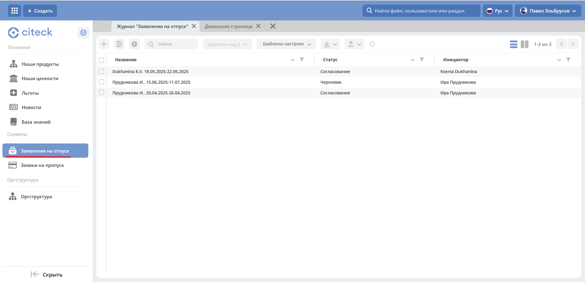
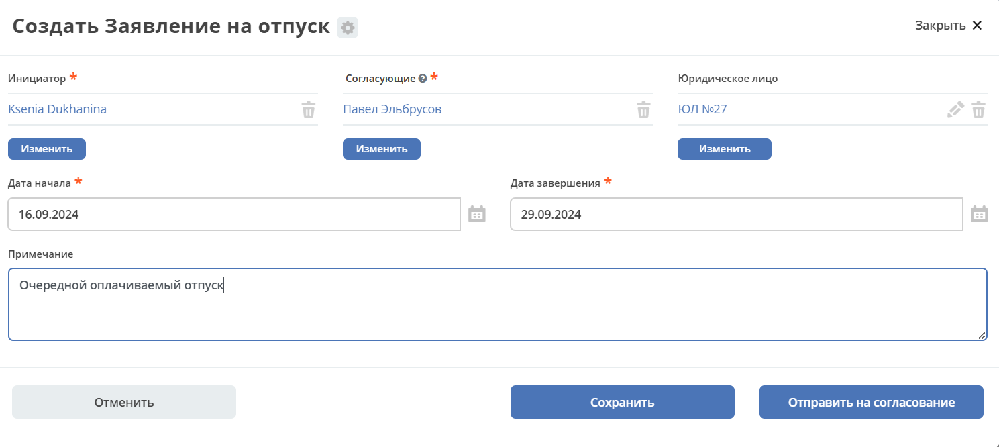
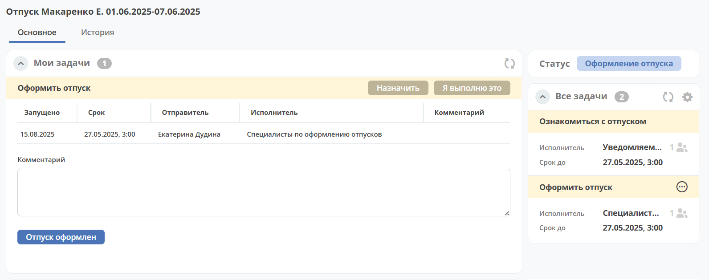
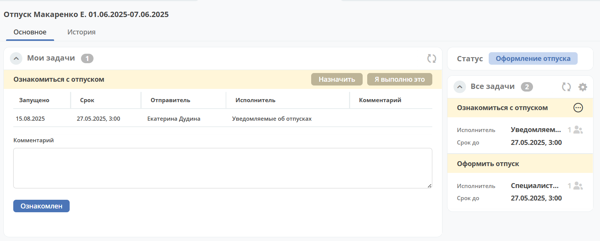

Модуль «Заявления на отпуск»
===============================

.. _ecos-vacation:

Модуль позволяет организовать работу с заявлениями на отпуск, поступающими от сотрудников. Модуль обеспечивает создание, согласование и учет заявлений на отпуск.

.. contents::
	:depth: 3

Схема бизнес-процесса
----------------------

.. image:: _static/vacation/bp_scheme.png
       :width: 800
       :align: center 

Роли
----

.. list-table::
      :widths: 20 40
      :class: tight-table 
      
      * - **Инициатор**
        - Сотрудник компании, создающий заявление в системе.
      * - **Ответственный**
        - Сотрудник компании, согласующий заявление на отпуск.
      * - **Бухгалтерия**
        - Группа сотрудников, получающая задачу для расчета отпускных и подготовки финансовых документов.
      * - **Отдел HR**
        - Группа сотрудников, получающая задачу для учета и подготовки кадровых документов.

Группы оргструктуры, в которые должны быть добавлены пользователи
~~~~~~~~~~~~~~~~~~~~~~~~~~~~~~~~~~~~~~~~~~~~~~~~~~~~~~~~~~~~~~~~~~~~~~~~

      * Бухгалтерия (vac_acc);
      * Отдел HR (vac_hr).

Статусы
--------

.. list-table::
      :widths: 20 40
      :class: tight-table 
      
      * - **Черновик**
        - Заявление создано Инициатором, но не отправлено по процессу.
      * - **Доработка**
        - По итогам согласования заявление отправлено на доработку Инициатору.
      * - **Согласование**
        - Согласование заявления Ответственным лицом.
      * - **Оформление отпуска**
        - Группа бухгалтеров и отдела HR оформляют отпуск в установленном порядке.
      * - **Закрыт**
        - Отпуск оформлен.
      * - **Отменен**
        - Заявление отменено Инициатором. 

Журнал
--------------

Например, https://host/v2/journals?journalId=ecos-vacation-journal

Журнал содержит поля:

    -	Дата создания;
    -	Статус;
    -	Имя;
    -	Инициатор.

Дополнительно для включения доступна колонка **«Юридическое лицо»**.

Создание карточки заявления
--------------------------------

Создание заявления на отпуск в Системе возможно, как с помощью кнопки быстрого создания:

 .. image:: _static/vacation/vacation_02.png
       :width: 200
       :align: center 

так и из журнала **«Кадровые документы - Заявления на отпуск»**:

.. image:: _static/vacation/vacation_03.png
       :width: 600
       :align: center 

На экране становится доступна форма создания **Заявления на отпуск**:

Поля карточки:

.. list-table::
      :widths: 20 40
      :class: tight-table
      :align: center
      
      * - **Инициатор**
        - | заполняется автоматически пользователем, создавшим карточку. 
          | Обязательный. Редактируемый.
      * - **Ответственное лицо**
        - | выбор пользователя из Оргструктуры. 
          | Если в профиле Инициатора заполнено поле «Линейный руководитель», то автоматически предзаполняется его данными.
          | Обязательный. Заполнено 
      * - **Юридическое лицо**
        - | выбор из справочника «Юридические лица». 
          | Может быть предзаполнено.
          | Необязательный. Редактируемый.
      * - **Дата начала**
        - дата в формате dd.mm.yyyy. Обязательный.
      * - **Дата завершения**
        - дата в формате dd.mm.yyyy. Обязательный.
      * - **Примечание**
        - многострочный текст. Необязательный.

Для отправки заявления в работу необходимо заполнить обязательные атрибуты на форме создания и нажать кнопку **«Отправить на согласование»**. 
Обязательные для заполнения атрибуты отмечены знаком **«*»**.

При отсутствии возможности заполнить все обязательные атрибуты заявление может быть сохранено в статусе **«Черновик»**. Для этого необходимо нажать **«Сохранить»**. Впоследствии черновик может быть отредактирован, сохранен повторно или после заполнения обязательных атрибутов отправлен на согласование. 

Все созданные в Системе заявления (включая в статусе «Черновик») отображаются в журнале **«Заявления на отпуск»**.

В случае нажатия кнопки **«Отменить»** форма создания закрывается без сохранения заявления в Системе.

Карточка заявления на отпуск с виджетами
-------------------------------------------

После первого сохранения или отправки в работу карточка отображается в соответствии с действующими настройками страницы данного типа.

.. image:: _static/vacation/vacation_05.png
       :width: 600
       :align: center 

Заголовок карточки строится следующим образом: **«Отпуск <Фамилия И.О.> <Дата начала>-<Дата завершения>»**

Стандартный дашборд карточки Заявления на отпуск имеет вкладки:

- **«Основное»**. Виджеты на ней расположены в две колонки:

  * Колонка 1 (широкая): 

    -	«Мои задачи»;
    -	«Свойства»;
    -	«Комментарии».

  * Колонка 2 (узкая): 

    -	«Статус»;
    -	«Все задачи»;
    -	«Действия»;
    -	«Связи документа».

- **«История»**. Одна колонка с виджетом **«История событий»**, расположенным во всю ширину.

Основные виджеты карточки и их назначение:

    -	**«Мои задачи»** служит для отображения текущего действия задачи по данному документу у просматривающего его пользователя и варианты их завершения.
    -	**«Свойства»** предназначен для отображения атрибутов карточки и их значений. 
    -	**«Комментарии»** - общий комментарий. Предназначен для ввода и отображения истории ввода комментариев для задачи в целом. Является инструментом обратной связи в цикле обработки выявленных отклонений.
    -	**«Статус»** отображает текущий статус документа (определяется системой автоматически, не доступен для редактирования пользователем).
    -	**«Все задачи»** служит для отображения задач по данному документу и их исполнителей.
    -	**«Действия»** содержит перечень доступных действий с документом на данном статусе.
    -	**«Связи документа»** используется для установки связей данного документа с другими в системе и отображения установленных связей.
    -	**«История»** служит для отображения событий таких, как создание, обновление, смена статуса документа с фиксацией даты и времени их происшествия, участников и комментариев.

Подробно о :ref:`виджетах<widgets>`.

Работа с заявлением на различных статусах
----------------------------------------------

Перейти к заявлению в любом статусе можно одним из трех способов:

  -	открыв задачу в Журнале **«Активные задачи»**;
  -	открыв документ в Журнале **«Кадровые документы - Заявления на отпуск»**;
  -	перейдя по ссылке из полученного уведомления.

Подробно о :ref:`задачах<tasks>`.

Согласование
~~~~~~~~~~~~~~~

Задача **«Согласование ответственным»** назначается выбранному в карточке заявления Ответственному лицу.

В статусе **«Согласование»** доступны следующие варианты завершения задачи:

.. image:: _static/vacation/vacation_07.png
    :width: 600
    :align: center 

- **«На доработку»** - отправить Инициатору на доработку, если в заявлении есть спорные вопросы. Внесите комментарий. Заявление переходит в статус **«Доработка»**. Инициатору заявления будет отправлено уведомление.
- **«Согласовать»** - Заявление переходит в статус **«Оформление отпуска»**. На исполнителей параллельно назначаются следующие задачи:

    * **Оформление отпуска** - на группу Бухгалтеров. Срок выполнения задачи - 5 дней до наступления отпуска.
    * **Уведомление отдела HR** - на группу HR. Срок выполнения задачи - 5 дней до наступления отпуска.

Доработка
~~~~~~~~~~~

Доработка заявления доступна Инициатору.

В статусе **«Доработка»** Инициатору доступны следующие варианты завершения задачи:

.. image:: _static/vacation/vacation_08.png
    :width: 600
    :align: center 

Инициатор изучает замечания, оставленные Согласующим в поле **Комментарий**, оценивает целесообразность доработки заявления. Используя действия **«Редактировать свойства»**, вносит изменения и выносит решение:

    -	**«Отменить»** - если доработка заявления оказывается нецелесообразной. Внесите комментарий. Заявление переходит в статус **«Отменен»**.
    -	**«Вернуть на согласование»** - если Инициатор внес изменения в заявление. Заявление переходит в статус **«Согласование»**. Исполнителю задачи будет отправлено уведомление.

Оформление отпуска
~~~~~~~~~~~~~~~~~~~~

.. note::

  В задачах **«Оформление отпуска»**  и **«Уведомление отдела HR»**  выставлен срок исполнения - за 5 дней до наступления отпуска.

Группа бухгалтеров
"""""""""""""""""""

Задача **«Оформление отпуска»** назначается на группу бухгалтеров для подготовки финансовых документов. В статусе **«Оформление отпуска»** доступен единственный вариант завершения задачи:

-	**«Отпуск оформлен»** - финансовые документы подготовлены. 

Отдел HR
"""""""""

Задача **«Уведомление отдела HR»** назначается на группу HR-специалистов для подготовки кадровых документов. В статусе **«Оформление отпуска»** доступен единственный вариант завершения задачи:

-	**«Уведомлен»** - кадровые документы подготовлены. 

Заявление переходит в статус **«Закрыт»**, когда обе задачи выполнены.

Уведомления
--------------

Стандартные уведомления о назначении задачи. Например:

.. list-table::
      :widths: 20 20
      :align: center

      * - |

            .. image:: _static/vacation/notification_01.png
                  :width: 350
                  :align: center

        - |

            .. image:: _static/vacation/notification_02.png
                  :width: 350
                  :align: center

Создать поручение
------------------

Cоздать поручение можно из карточки документа, выбрав действие **«Создать поручение»**. См. подробно :ref:`Создание поручения из карточки<ecos-assignments-action>`