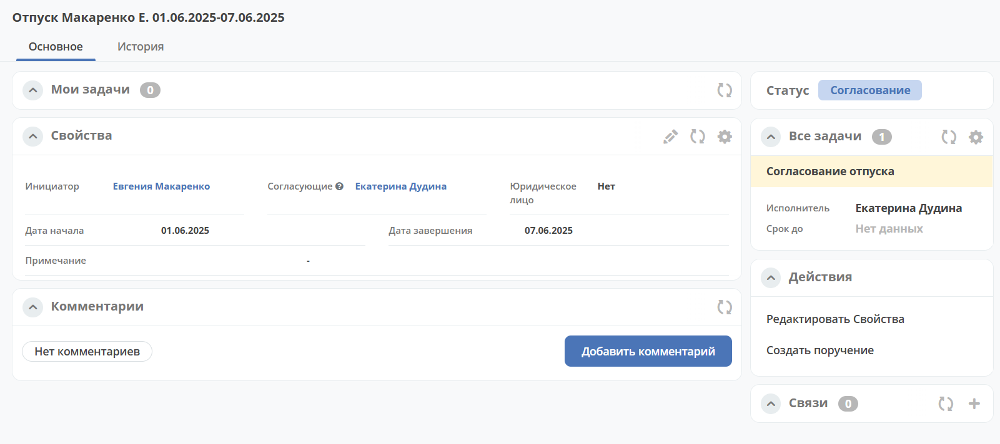
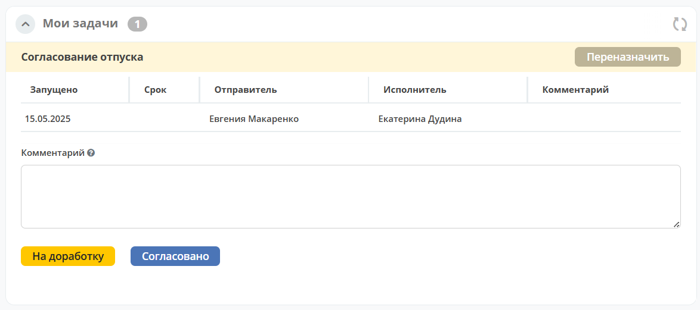
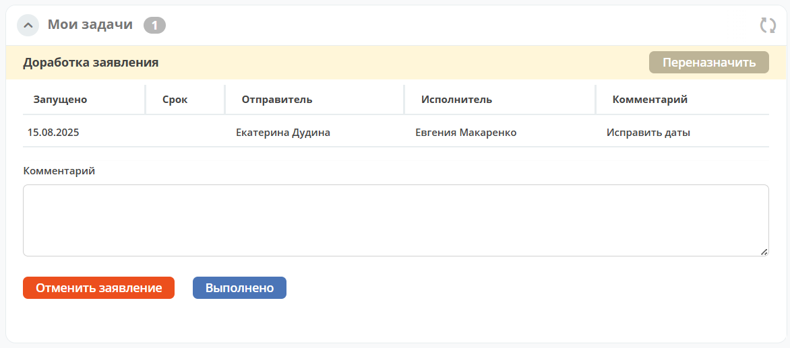

Модуль «Заявления на отпуск»
===============================

.. _ecos-vacation:

Модуль обеспечивает создание, согласование и учет заявлений на отпуск.

.. contents::
	:depth: 3

Схема бизнес-процесса
----------------------

.. image:: _static/vacation/bp_scheme.png
       :width: 800
       :align: center 

Роли
----

.. list-table::
      :widths: 20 40
      :align: center
      :class: tight-table 
      
      * - **Инициатор**
        - Сотрудник компании, создающий заявление в системе.
      * - **Ответственный**
        - Сотрудник компании, согласующий заявление на отпуск.
      * - **Специалисты по оформлению отпусков**
        - Группа сотрудников, получающая задачу для расчета отпускных и подготовки финансовых документов.
      * - **Уведомляемые об отпусках**
        - Группа сотрудников, получающая задачу для учета и подготовки кадровых документов.

Группы оргструктуры, в которые должны быть добавлены пользователи
~~~~~~~~~~~~~~~~~~~~~~~~~~~~~~~~~~~~~~~~~~~~~~~~~~~~~~~~~~~~~~~~~~~~~~~~

      * Специалисты по оформлению отпусков (vacation-registrators);
      * Уведомляемые об отпусках (vacation-familiarizers).

Статусы
--------

.. list-table::
      :widths: 20 40
      :align: center
      :class: tight-table 
      
      * - **Черновик**
        - Заявление создано Инициатором, но не отправлено по процессу.
      * - **Доработка**
        - По итогам согласования заявление отправлено на доработку Инициатору.
      * - **Согласование**
        - Согласование заявления Ответственным лицом.
      * - **Оформление отпуска**
        - Группа бухгалтеров и отдела HR оформляют отпуск в установленном порядке.
      * - **Закрыт**
        - Отпуск оформлен.
      * - **Отменен**
        - Заявление отменено Инициатором. 

В каком рабочем пространстве доступен
---------------------------------------

Модуль доступен в :ref:`рабочем пространстве<workspaces>` **Корпоративный портал**.

Журнал
--------------

.. image:: _static/vacation/vacation_01.png
       :width: 700
       :align: center 

Создание карточки заявления
--------------------------------

Создание заявления на отпуск в Системе возможно, как с помощью кнопки быстрого создания:

 .. image:: _static/vacation/vacation_02.png
       :width: 300
       :align: center 

так и из журнала **«Кадровые документы - Заявления на отпуск»**:

На экране становится доступна форма создания **Заявления на отпуск**:

.. image:: _static/vacation/vacation_04.png
       :width: 600
       :align: center 

Поле **Инициатор** автоматически заполнено пользователем, создавшим карточку. Выберите **Согласующего**, **Юридическое лицо** (поле может быть предзаполнено),  **дату начала** и **дату завершения**.

Для отправки заявления в работу необходимо заполнить обязательные атрибуты на форме создания и нажать кнопку **«Отправить на согласование»**. 

При отсутствии возможности заполнить все обязательные атрибуты заявление может быть сохранено в статусе **«Черновик»**. Для этого необходимо нажать **«Сохранить»**. Впоследствии черновик может быть отредактирован, сохранен повторно или после заполнения обязательных атрибутов отправлен на согласование. 

Все созданные в Системе заявления (включая в статусе «Черновик») отображаются в журнале **«Заявления на отпуск»**.

При нажатии кнопки **«Отменить»** форма создания закрывается без сохранения заявления в Системе.

Карточка заявления на отпуск с виджетами
-------------------------------------------

Заголовок карточки строится следующим образом: **«Отпуск <Фамилия И.О.> <Дата начала>-<Дата завершения>»**

Подробно о :ref:`виджетах<widgets>`.

Работа с заявлением на различных статусах
----------------------------------------------

Перейти к заявлению в любом статусе можно одним из трех способов:

  -	открыв задачу в Журнале **Текущие задачи»**;
  -	открыв документ в Журнале **«Кадровые документы - Заявления на отпуск»**;
  -	перейдя по ссылке из полученного уведомления.

Подробно о :ref:`задачах<tasks>`.

Согласование
~~~~~~~~~~~~~~~

Задача **«Согласование ответственным»** назначается выбранному в карточке заявления Ответственному лицу.

В статусе **«Согласование»** доступны следующие варианты завершения задачи:

- **«На доработку»** - отправить Инициатору на доработку, если в заявлении есть спорные вопросы. Внесите комментарий. Заявление переходит в статус **«Доработка»**. Инициатору заявления будет отправлено уведомление.
- **«Согласовано** - Заявление переходит в статус **«Оформление отпуска»**. На исполнителей параллельно назначаются следующие задачи:

    * **Оформление отпуска** - на группу Бухгалтеров. Срок выполнения задачи - **5** дней до наступления отпуска.
    * **Уведомление отдела HR** - на группу HR. Срок выполнения задачи - **5** дней до наступления отпуска.

Доработка
~~~~~~~~~~~

Доработка заявления доступна Инициатору.

В статусе **«Доработка»** Инициатору доступны следующие варианты завершения задачи:

Инициатор изучает замечания, оставленные Согласующим в поле **Комментарий**, оценивает целесообразность доработки заявления. Используя действия **«Редактировать свойства»**, вносит изменения и выносит решение:

    -	**«Отменить заявление»** - если доработка заявления оказывается нецелесообразной. Внесите комментарий. Заявление переходит в статус **«Отменен»**.
    -	**«Выполнено** - если Инициатор внес изменения в заявление. Заявление переходит в статус **«Согласование»**. Исполнителю задачи будет отправлено уведомление.

Оформление отпуска
~~~~~~~~~~~~~~~~~~~~

.. note::

  В задачах **«Оформление отпуска»**  и **«Уведомление отдела HR»**  выставлен срок исполнения - за 5 дней до наступления отпуска.

Уведомляемые об отпусках
""""""""""""""""""""""""""

Задача **«Оформление отпуска»** назначается на группу бухгалтеров для подготовки финансовых документов. В статусе **«Оформление отпуска»** доступен единственный вариант завершения задачи:

.. image:: _static/vacation/vacation_12.png
    :width: 600
    :align: center 

-	**«Отпуск оформлен»** - финансовые документы подготовлены. 

Специалисты по оформлению отпусков
""""""""""""""""""""""""""""""""""""""""""

Задача **«Уведомление отдела HR»** назначается на группу HR-специалистов для подготовки кадровых документов. В статусе **«Оформление отпуска»** доступен единственный вариант завершения задачи:

.. image:: _static/vacation/vacation_13.png
       :width: 600
       :align: center 

-	**«Ознакомлен»** - кадровые документы подготовлены. 

Заявление переходит в статус **«Закрыт»**, когда обе задачи выполнены.

Уведомления
--------------

Стандартные уведомления о назначении задачи. Например:

.. list-table::
      :widths: 20 20
      :align: center

      * - |

            .. image:: _static/vacation/notification_01.png
                  :width: 350
                  :align: center

        - |

            .. image:: _static/vacation/notification_02.png
                  :width: 350
                  :align: center

Создать поручение
------------------

Cоздать поручение можно из карточки документа, выбрав действие **«Создать поручение»**. См. подробно :ref:`Создание поручения из карточки<ecos-assignments-action>`