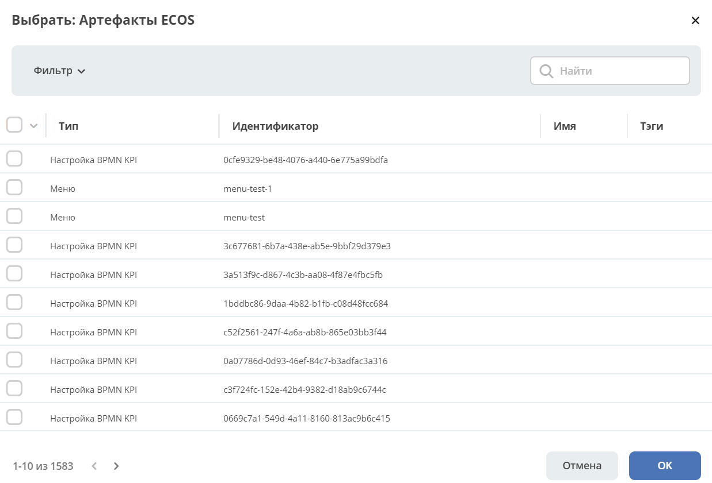

Быстрая разработка
===================

.. _fast_develop:

.. contents:: 
   :depth: 2

Созданные в Citeck :ref:`артефакты<ecos_artifacts>` (типы данных, журналы, формы, бизнес-процесс и другие сущности) можно упаковать в виде :ref:`приложения<applications>`, чтобы, например, поместить в систему контроля версий или перенести на другой стенд. Приложение представляет собой **zip-архив**.

IntelliJ IDEA plugin for Citeck
--------------------------------------

Если вы ведете разработку в среде IntelliJ IDEA, то у нас есть специальный :ref:`плагин<IntelliJ_IDEA_plugin>`, который упрощает работу с проектами и артефактами Citeck.

С чего начать
--------------

Создайте артефакты бизнес-процесса. Например, создание  процесса запроса на закупку оборудования описано в :ref:`статье<sample_request>`

Как создать новое Citeck приложение
-------------------------------------

Для создания приложения перейдите в рабочее пространство администратора в разделе **Управление системой** перейдите в пункт **Приложения ECOS**:

 .. image:: _static/fast_develop/App_1.png
       :width: 700
       :align: center

Нажмите **+ - Создать приложение**: 

 .. image:: _static/fast_develop/App_2.png
       :width: 500
       :align: center

|

 .. image:: _static/fast_develop/App_3.png
       :width: 600
       :align: center

Укажите **Id (1)**, **Имя (2)**, выберите все созданные **типы данных (3)** вашего процесса, измените **Версию (5)** при необходимости.

Для автоматической загрузки артефактов можно нажать **«Загрузить артефакты для выбранных типов» (4)**.

.. note:: 

 Не все типы артефактов загружаются автоматически. Дополните полученный список артефактов, нажав **«Добавить»**:

.. image:: _static/fast_develop/App_4.png
    :width: 600
    :align: center

|

**Сохраните**.

Далее архив можно скачать, чтобы перенести его на другой стенд, задеплоить его локально или закоммитить в систему контроля версий.

 .. image:: _static/fast_develop/App_5.png
       :width: 600
       :align: center

**Zip-архив** имеет следующую структуру - все артефакты располагаются в директориях, в соответствии с их типом:

 .. image:: _static/fast_develop/App_8.png
       :width: 300
       :align: center

Как перенести между стендами
-------------------------------

Скачайте приложение:

 .. image:: _static/fast_develop/App_5_1.png
       :width: 600
       :align: center
 
Загрузите приложение на необходимом стенде:

 .. image:: _static/fast_develop/App_6.png
       :width: 500
       :align: center

Как задеплоить локально/на стенд
---------------------------------

Создайте локально `maven проект  <https://maven.apache.org/index.html>`_  с названием приложения, в папку ``src/main/resources/app`` скопируйте содержимое zip-архива:

 .. image:: _static/fast_develop/ecos_app.png
       :width: 350
       :align: center

В корне приложения разместите файл **meta.yml**, указав:

.. code-block::

  id: name

* **id: String** - идентификатор приложения. По умолчанию равен artifactId проекта
* **name: MLText** - имя приложения

Например:

.. code-block::

  ecos-assignments

Настройте главный **pom файл** следующим образом:

.. code-block::

  <?xml version="1.0" encoding="UTF-8"?>
  <project xmlns="http://maven.apache.org/POM/4.0.0"
          xmlns:xsi="http://www.w3.org/2001/XMLSchema-instance"
          xsi:schemaLocation="http://maven.apache.org/POM/4.0.0 http://maven.apache.org/xsd/maven-4.0.0.xsd">

      <modelVersion>4.0.0</modelVersion>

      <groupId>ru.citeck.ecos.eapps.assignments</groupId>
      <artifactId>ecos-assignments</artifactId>
      <version>1.0.0-snapshot</version>

      <parent>
          <groupId>ru.citeck.ecos.eapps.project</groupId>
          <artifactId>ecos-apps-simple-parent</artifactId>
          <version>1.0.3</version>
      </parent>

      <repositories>
          <repository>
              <id>citeck-public</id>
              <url>https://nexus.citeck.ru/repository/maven-public</url>
          </repository>
      </repositories>

  </project>

Укажите в нем **groupId**, **artifactId**, **version**.

Создайте **Jenkinsfile** с содержимым:

.. code-block::

    ecosBuild()

Создайте **ecos-build-config.yml** с содержимым:

.. code-block::

    ---
    type: maven-ecos-apps

Соберите приложение командой: 

.. code-block::

 mvn clean package

При сборке приложения получается **zip-архив** в папке ``target/classes/apps``: 

.. image:: _static/fast_develop/App_9.png
       :width: 400       
       :align: center

Далее загрузите созданный архив на необходимый стенд, как описано в главе выше.

Как закоммитить в систему контроля версий
-------------------------------------------

В системе контроля версий создайте репозиторий с названием приложения.

В репозиторий перенесите: 

  - папку ``src`` со всем содержимым;
  - созданный **pom.xml**;
  - **Jenkinsfile**;
  - **ecos-build-config.yml**.

 .. image:: _static/fast_develop/git_01.png
      :width: 700
      :align: center

Как создать микросервис
------------------------

Если сконфигурированные в конструкторе артефакты не покрывают необходимую функциональность, можно создать отдельный микросервис — это полноценное Java-приложение на Spring Boot, в котором можно писать собственный код, использовать сторонние библиотеки и реализовывать любую бизнес-логику, выходящую за рамки стандартных возможностей платформы.

Для создания микросервиса воспользуйтесь :ref:`инструкцией<mcs_setup>`

.. note::

    Для микросервиса созданные артефакты необходимо скопировать в папку  ``src/main/resources/eapps/artifacts``

     .. image:: _static/fast_develop/ecos_mks.png
       :width: 400
       :align: center

См. статью о :ref:`приложении<demo_microservice>`, демонстрирующем возможности Citeck.

