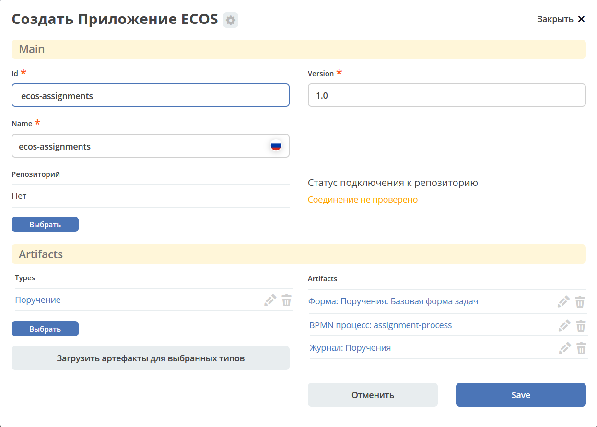

Быстрая разработка
===================

Созданные в ECOS :ref:`артефакты<ecos_artifacts>` (типы данных, журналы, формы, бизнес-процесс и другие сущности) можно упаковать в виде :ref:`приложения<applications>`, чтобы, например, поместить в систему контроля версий или перенести на другой стенд.

Приложение представляет собой zip-архив.

С чего начать
--------------

Создайте артефакты бизнес-процесса. Например, создание  процесса запроса на закупку оборудования описано в  :ref:`статье<sample_request>`

Как создать новое ECOS приложение
----------------------------------

Для создания приложения перейдите в раздел администратора и выберите **«Приложения ECOS»**:

 .. image:: _static/fast_develop/App_1.png
       :width: 600
       :align: center

Нажмите **+ - Создать приложение**: 

 .. image:: _static/fast_develop/App_2.png
       :width: 300
       :align: center

|

 .. image:: _static/fast_develop/App_3.png
       :width: 600
       :align: center

Укажите **Id (1)**, **Имя (2)**, выберите все созданные **типы данных (3)** вашего процесса, **измените Версию (5)** при необходимости.

Для автоматической загрузки артефактов можно нажать **«Загрузить артефакты для выбранных типов» (4)**.

.. note:: 

 Не все типы артефактов загружаются автоматически. Дополните полученный список артефактов, нажав **«Добавить»**:

|

.. image:: _static/fast_develop/App_7.png
    :width: 600
    :align: center

**Сохраните**.

Далее архив можно скачать, чтобы перенести его на другой стенд, задеплоить его локально или закоммитить в систему контроля версий.

 .. image:: _static/fast_develop/App_5.png
       :width: 600
       :align: center

**Zip-архив** имеет следующую структуру - все артефакты располагаются в директориях, которые соответствуют типу:

 .. image:: _static/fast_develop/App_8.png
       :width: 400
       :align: center

Как перенести между стендами
-------------------------------

Скачайте приложение:

 .. image:: _static/fast_develop/App_5.png
       :width: 600
       :align: center
 
Загрузите приложение на необходимом стенде:

 .. image:: _static/fast_develop/App_6.png
       :width: 300
       :align: center

Как задеплоить локально/на стенд
---------------------------------

Создайте локально `maven проект  <https://maven.apache.org/index.html>`_  с названием приложения, в папку ``src/main/resources/app`` скопируйте содержимое zip-архива:

 .. image:: _static/fast_develop/ecos_app.png
       :width: 400
       :align: center

В **meta.yml** можно указать:

.. code-block::

  id: ecos-assignments

* **id: String** - идентификатор приложения. По умолчанию равен artifactId проекта
* **name: MLText** - имя приложения

Настройте главный **pom файл**:

.. code-block::

  <?xml version="1.0" encoding="UTF-8"?>
  <project xmlns="http://maven.apache.org/POM/4.0.0"
          xmlns:xsi="http://www.w3.org/2001/XMLSchema-instance"
          xsi:schemaLocation="http://maven.apache.org/POM/4.0.0 http://maven.apache.org/xsd/maven-4.0.0.xsd">

      <modelVersion>4.0.0</modelVersion>

      <groupId>ru.citeck.ecos.eapps.assignments</groupId>
      <artifactId>ecos-assignments</artifactId>
      <version>1.0.0-snapshot</version>

      <parent>
          <groupId>ru.citeck.ecos.eapps.project</groupId>
          <artifactId>ecos-apps-simple-parent</artifactId>
          <version>1.0.3</version>
      </parent>

      <repositories>
          <repository>
              <id>citeck-public</id>
              <url>https://nexus.citeck.ru/repository/maven-public</url>
          </repository>
      </repositories>

  </project>

Укажите в нем **groupId, artifactId, version**.

Далее приложение собрать приложение командой: 

.. code-block::

 mvn clean package

При сборке приложения получается **zip-архив** в папке ``target/classes/apps``: 

Далее загрузите созданный архив на необходимый стенд, как описано в главе выше.

Как закоммитить в систему контроля версий
-------------------------------------------

В созданный репозиторий в системе контроля версий перенесите папку ``src`` со всем содержимым и созданный **pom файл**.

Как создать микросервис
------------------------

Если сконфигурированные в конструкторе артефакты не покрывают необходимую функциональность, то можно создать отдельный микросервис, который будет содержать и сконфигуированные артефакты, и необходимую дополнительную логику.

Для создания микросервиса воспользуйтесь :ref:`инструкцией<service_setup>`

.. note::

    Для микросервиса созданные артефакты необходимо скопировать в папку  ``src/main/resources/eapps/artifacts``.

     .. image:: _static/fast_develop/ecos_mks.png
       :width: 400
       :align: center

