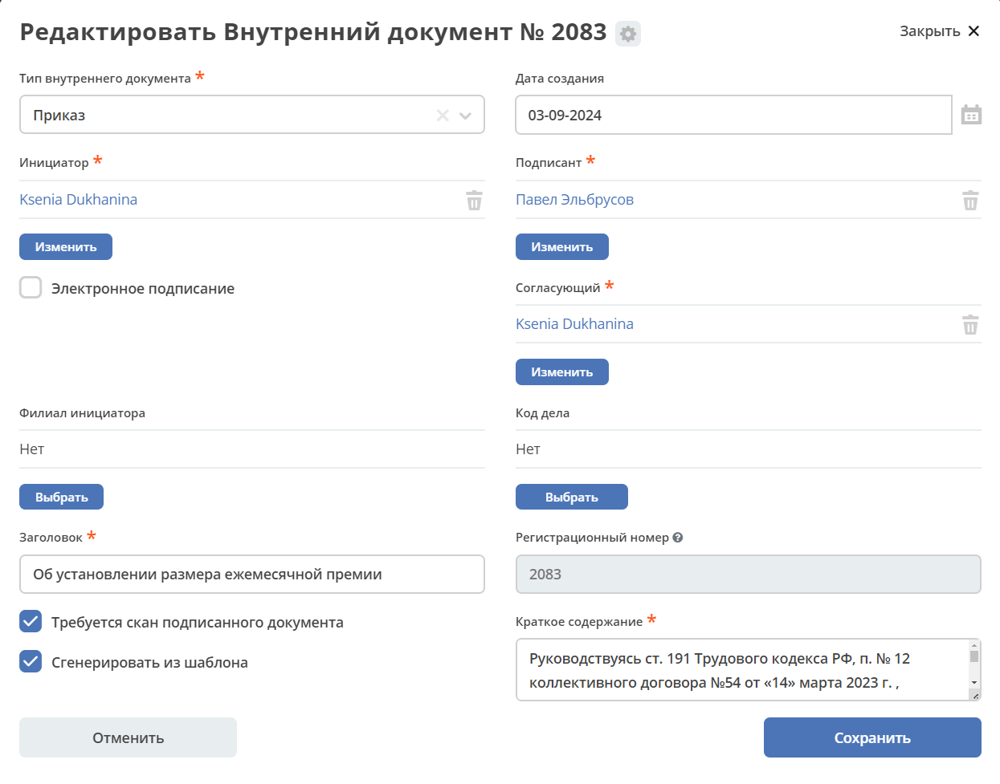
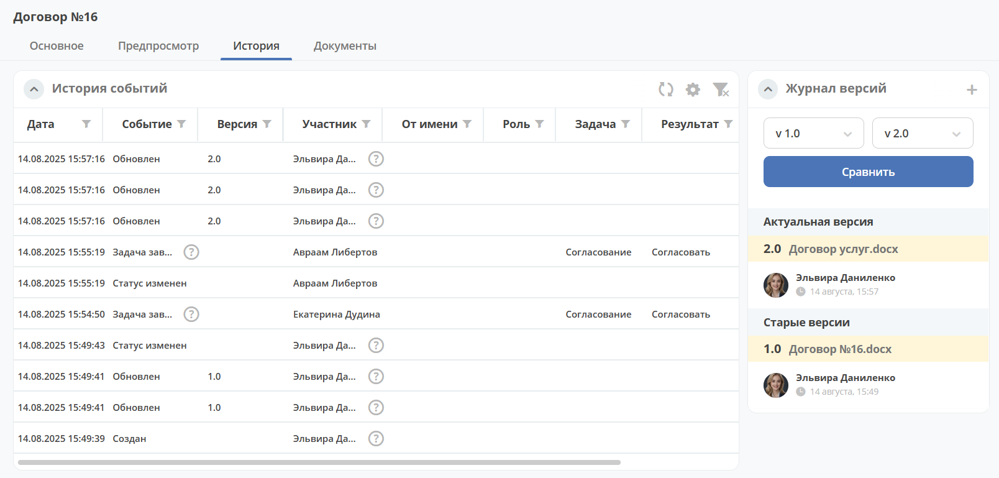
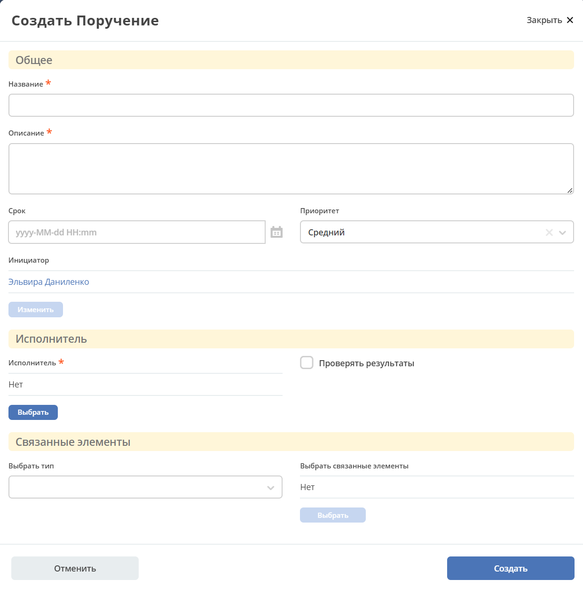

Действия в карточках
=====================

.. _actions:

.. contents:: 
   :depth: 2

Редактировать свойства
-----------------------

Открывается карточка документа с возможностью внести изменения и сохранить:

Редактировать документ
------------------------

.. _action_edit:

Для вложенных и сформированных по шаблону документов формата MS Office и OpenDocument доступно редактирование в OnlyOffice.

См. :ref:`подробно<edit_only_office>`

Печатать
--------

.. _action_print:

Поддерживаемые форматы файлов:

    - Microsoft Word - **.doc, DOCX**;
    - Microsoft Excel - **.xls, XLSX**;
    - Документы в формате OpenDocument - **.ODT**;
    - Таблицы в формате OpenDocument - **.ODS**;
    - Adobe Portable Document Format - **.PDF**;
    - Текстовые - **.txt**

Загрузить новую версию
------------------------

.. _action_version:

Добавление новой версии документа:

Выберите **файл**, тип **изменений**, укажите **комментарий** при необходимости:

Изменения версий фиксируются :ref:`виджете «Журнал версий»<widget_versions_journal>`

Создать поручение
-------------------

.. _action_assignment:

Cоздание поручения из карточки документа - открывается форма поручения:

При создании поручения из карточки документа автоматически проставляется двухсторонняя связь.

См. подробно :ref:`Создание поручения из карточки<ecos-assignments-action>`