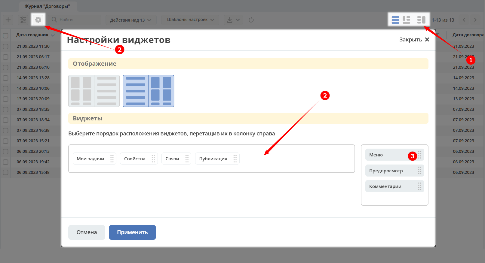
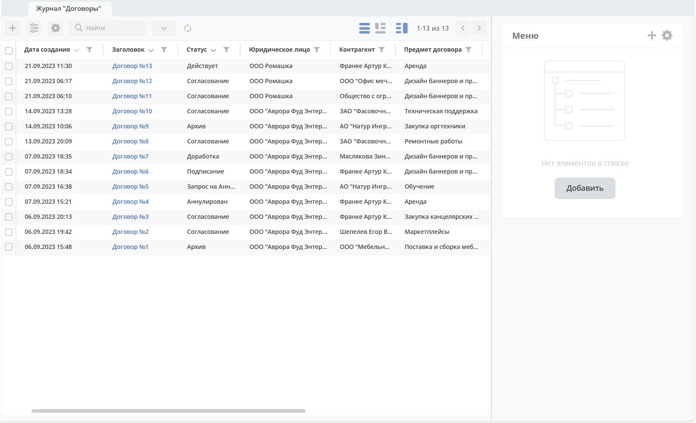
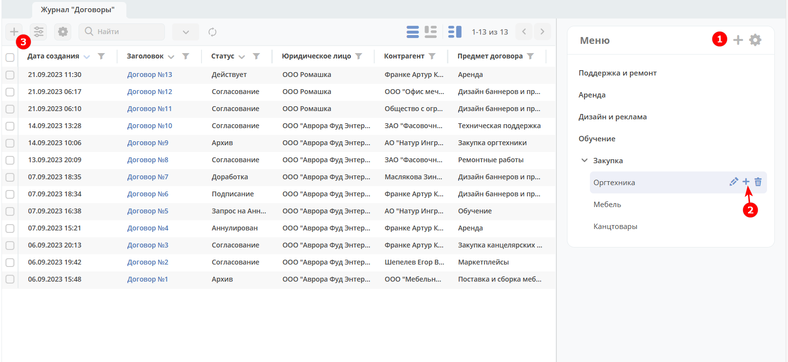
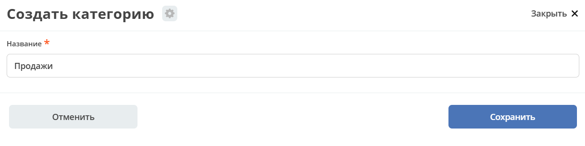
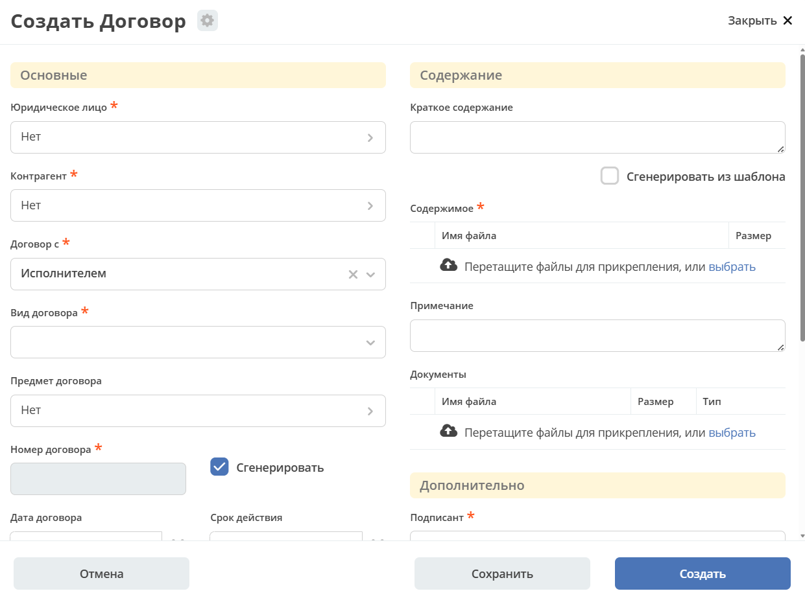
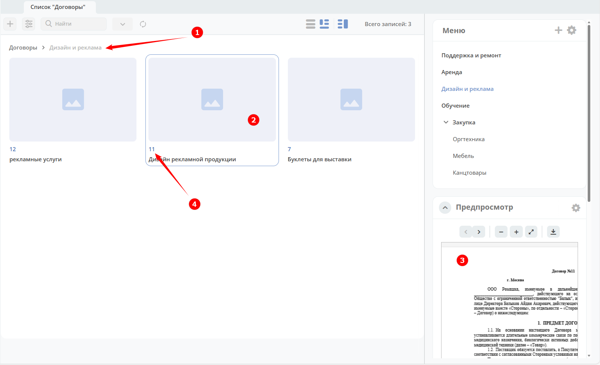
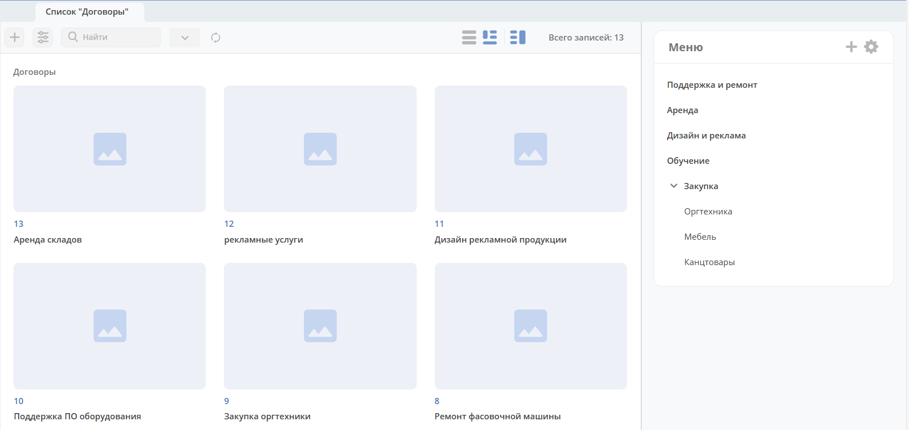
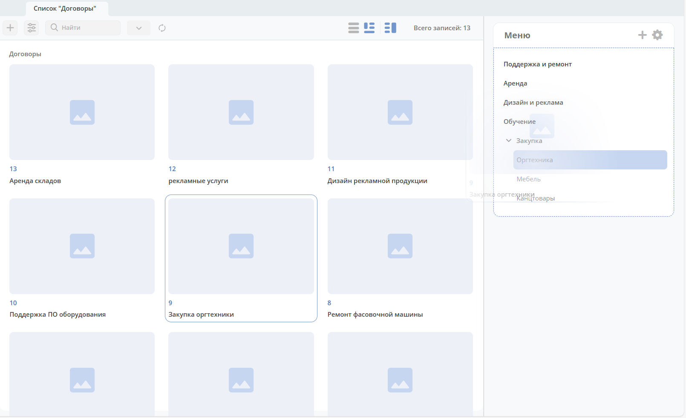
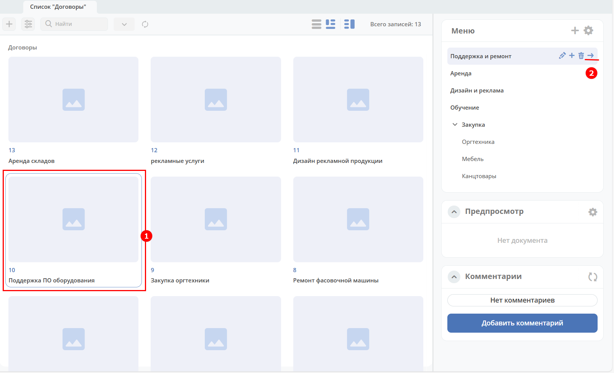

Дерево категорий
=================

.. _category_tree:

Администратор в режим предпросмотра **(1)** может помимо стандартных виджетов **(2)** добавить виджет **Меню** **(3)**:

**Виджет Меню** представляет собой дерево категорий. Для создания первой категории необходимо нажать **Добавить**:

И далее для добавления категории 1-го уровня нажмите большой **+** **(1)**. Для добавления подкатегории нажмите маленький **+** **(2)**:

Введите название:

Для создания карточки в категории нажмите **+** **(3)**:

Созданная карточка будет доступна как в категории, так и в главном разделе.

Для удобства навигации в представлении есть хлебные крошки **(1)**:

По клику на плитку **(2)** откроется ее предпросмотр **(3)**. При клике на заголовок плитки **(4)** карточка откроется в отдельной вкладке.

Главный раздел (в данном случае Договоры) будет иметь все записи, а иерархия выступает, как фильтр:

Для перемещения элемента в другой раздел выберите элемент и перетащите ее в необходимый раздел:

Или выберите элемент **(1)** и выберите раздел **(2)**:

О настройке представления для типа данных см. :ref:`подробно<datatypes_views>`