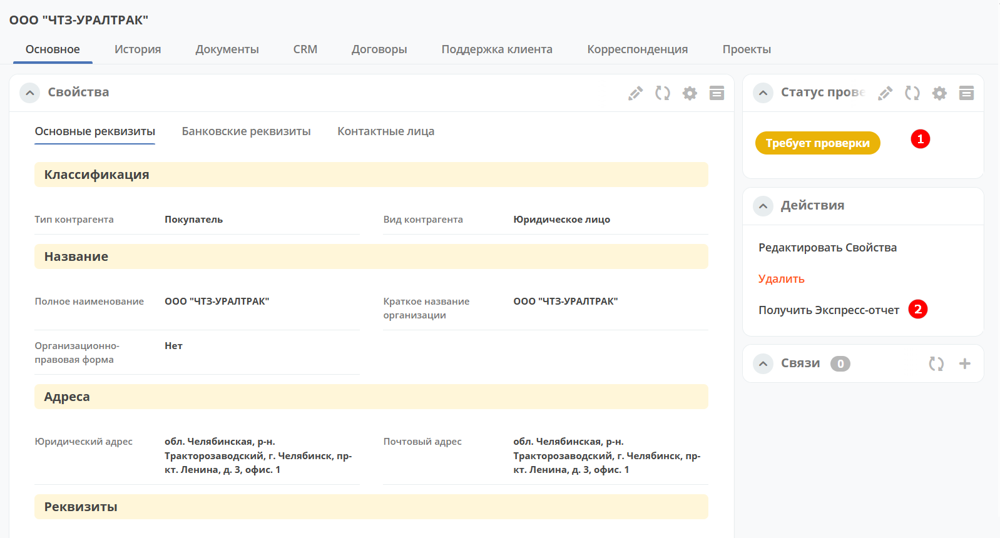
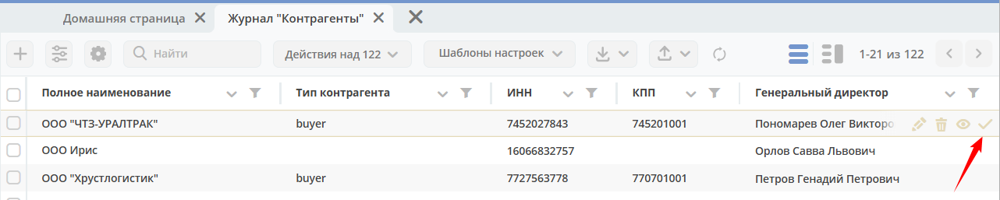
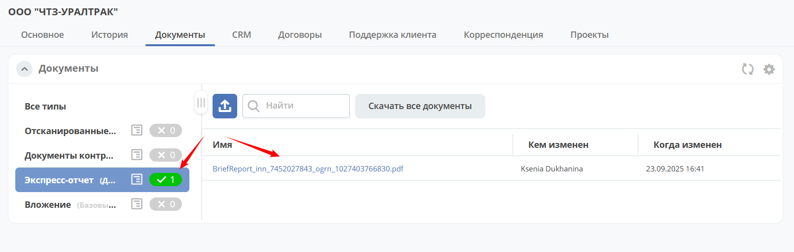

Клиент 360
============

.. _client_360:

В Citeck реализуется стратегия **Клиент 360** – в карточке контрагента отображаются консолидированные данные из модулей платформы, такие как история взаимодействия по сделкам и договорам, технической поддержке. Это позволяет пользователям быстро получать полную картину взаимодействия с клиентом.

В карточке доступны следующие вкладки: 

    *	**Основное** – представлены реквизиты и информация о контактных лицах:

        .. image:: _static/client_360/Tab_01.png
            :width: 600
            :align: center 
    
    *	**История** – информация о событиях в карточке таких как создание, обновление:

        .. image:: _static/client_360/Tab_02.png
            :width: 600
            :align: center 

    *	**Документы** –документы по контрагенту. Можно добавить новые, скачать загруженные ранее:

        .. image:: _static/client_360/Tab_03.png
            :width: 600
            :align: center 

    *	**CRM** - информация из CRM о сделках, заказах и платежах. Для каждого элемента доступны действия:

        .. image:: _static/client_360/Tab_04.png
            :width: 600
            :align: center 

    *	**Договоры** - информация о договорах, доп. соглашениях с контрагентом. Для каждого элемента доступны действия:

        .. image:: _static/client_360/Tab_05.png
            :width: 600
            :align: center 

    *	**Поддержка клиента** – обращения контрагента в техническую поддержку:

        .. image:: _static/client_360/Tab_06.png
            :width: 600
            :align: center 

    *	**Корреспонденция** - информация о входящей, исходящей корреспонденции контрагента:

        .. image:: _static/client_360/Tab_07.png
            :width: 600
            :align: center 

    *	**Проекты** - информация о релизах для данного клиента:

        .. image:: _static/client_360/Tab_08.png
            :width: 600
            :align: center 

Автозаполнение
----------------

.. note::

    Доступно только в Enterprise версии.

При создании карточки контрагента доступно автоматическое заполнение большинства реквизитов, используя сервис `DaData <https://dadata.ru/>`_. Заполните **ИНН**, нажмите **Автозаполнение**:

.. list-table::
      :widths: 20 20
      :align: center

      * - | 

            .. image:: _static/client_360/autofill_01.png
                  :width: 600
                  :align: center

        - |

            .. image:: _static/client_360/autofill_02.png
                  :width: 600
                  :align: center

Экспресс-отчет
---------------

.. note::

    Доступно только в Enterprise версии.

В карточке контрагента можно получить `Экспресс-отчет от Контур-Фокус <https://kontur-f.ru/features/ehkspress-otchet-ehlektronnyjj-bezopasnik/>`_. Экспресс-отчет — документ с краткой информацией о рисках сотрудничества и способах их снижения.

- **1**- виджет для отображения статуса экспресс отчета 
- **2**- действие для получения экспресс-отчета

Так же действие доступно и в журнале:

|

.. note::

    После создания карточки Контрагента действие выполняется автоматически

После успешного выполнения действия устанавливается статус, и в виджет **Документы** прикладывается pdf-файл с Экспресс-отчетом:

Для работы с Контур Фокус необходимо задать токен в секрете **kontur-focus-api-token**.