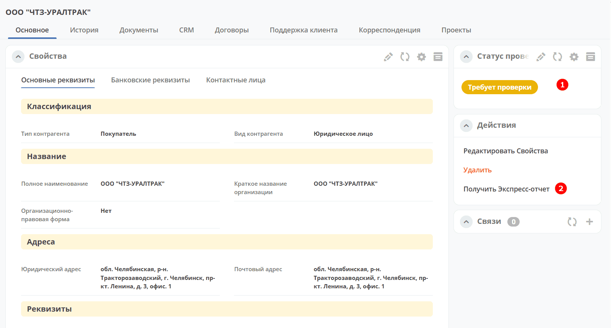
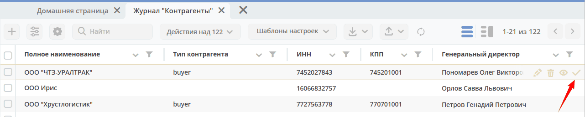
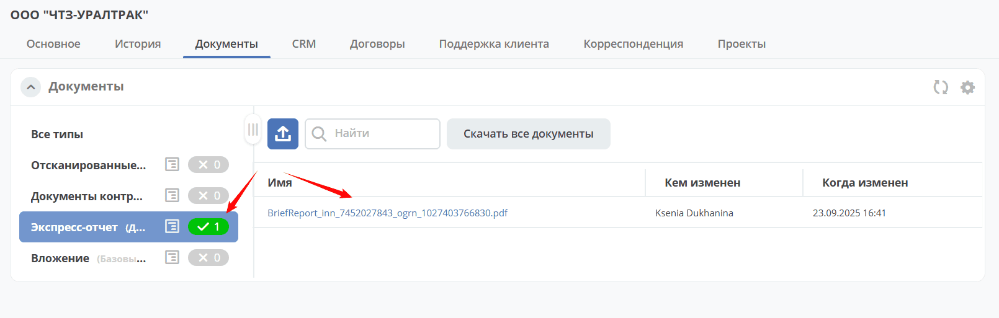
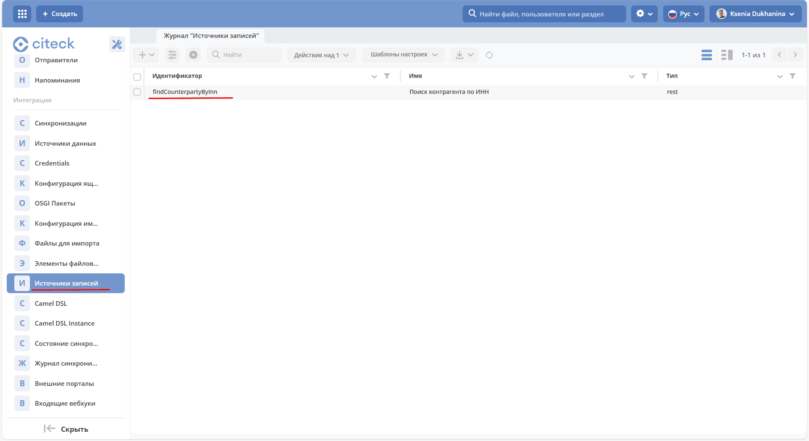
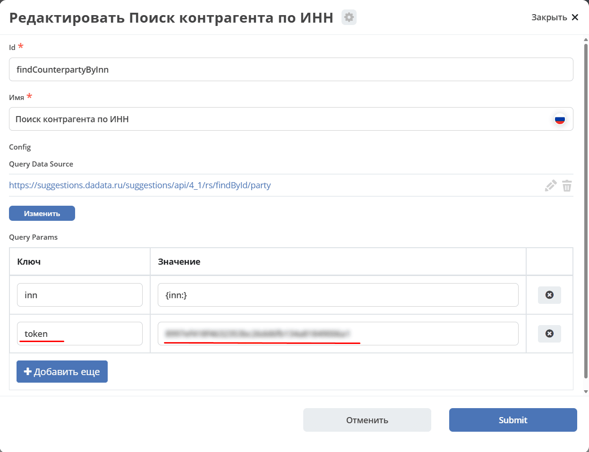
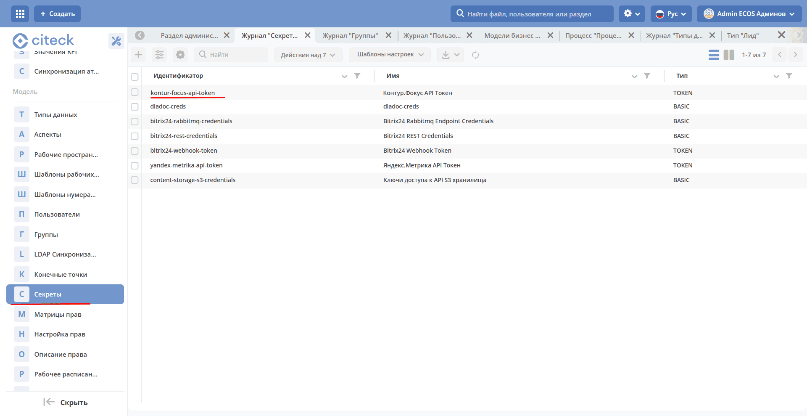
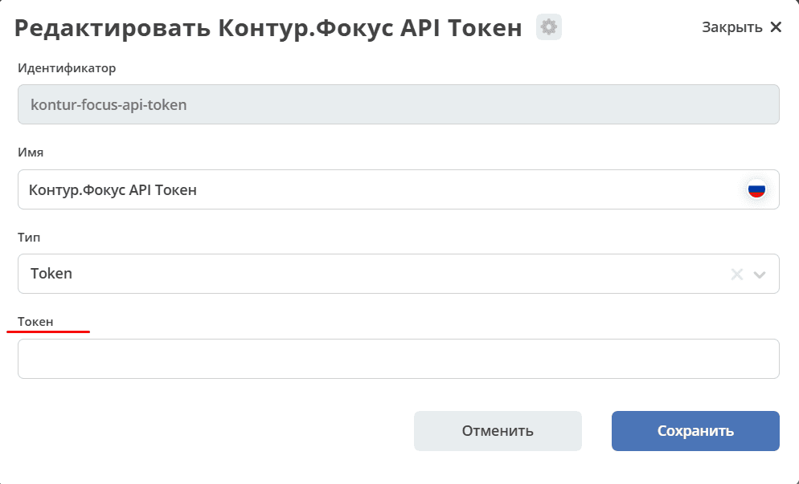

.. _client_360:

Клиент 360
============

Стратегия **Клиент 360** — подход к работе с контрагентами, при котором вся информация о клиенте собрана в едином месте. В карточке контрагента отображаются консолидированные данные из всех модулей платформы: CRM, договоры, документы, обращения в поддержку, корреспонденция и проекты.

Такая консолидация позволяет:

- получать полную картину взаимодействия с клиентом без переключения между разделами;
- оперативно анализировать историю сделок, платежей и обращений;
- принимать обоснованные решения на основе актуальных данных.

.. contents::
   :depth: 3

В карточке доступны следующие вкладки:

.. tab-set::

   .. tab-item:: Основное

      Реквизиты и информация о контактных лицах:

      .. image:: _static/client_360/Tab_01.png
          :width: 600
          :align: center

   .. tab-item:: История

      Информация о событиях в карточке — таких как создание, обновление:

      .. image:: _static/client_360/Tab_02.png
          :width: 600
          :align: center

   .. tab-item:: Документы

      Документы по контрагенту. Можно добавить новые, скачать загруженные ранее:

      .. image:: _static/client_360/Tab_03.png
          :width: 600
          :align: center

   .. tab-item:: CRM

      Информация из CRM о сделках, заказах и платежах. Для каждого элемента доступны действия:

      .. image:: _static/client_360/Tab_04.png
          :width: 600
          :align: center

   .. tab-item:: Договоры

      Информация о договорах, доп. соглашениях с контрагентом. Для каждого элемента доступны действия:

      .. image:: _static/client_360/Tab_05.png
          :width: 600
          :align: center

   .. tab-item:: Поддержка клиента

      Обращения контрагента в техническую поддержку:

      .. image:: _static/client_360/Tab_06.png
          :width: 600
          :align: center

   .. tab-item:: Корреспонденция

      Информация о входящей, исходящей корреспонденции контрагента:

      .. image:: _static/client_360/Tab_07.png
          :width: 600
          :align: center

   .. tab-item:: Проекты

      Информация о релизах для данного клиента:

      .. image:: _static/client_360/Tab_08.png
          :width: 600
          :align: center

Автозаполнение
----------------

.. note::

    Доступно только в Enterprise версии.

При создании карточки контрагента доступно автоматическое заполнение большинства реквизитов, используя сервис `DaData <https://dadata.ru/>`_. Заполните **ИНН**, нажмите **Автозаполнение**:

.. grid:: 2
   :gutter: 2

   .. grid-item::

      .. image:: _static/client_360/autofill_01.png
         :width: 500
         :align: left

   .. grid-item::

      .. image:: _static/client_360/autofill_02.png
         :width: 500
         :align: left

Экспресс-отчет
---------------

.. note::

    Доступно только в Enterprise версии.

В карточке контрагента можно получить `Экспресс-отчет от Контур-Фокус <https://kontur-f.ru/features/ehkspress-otchet-ehlektronnyjj-bezopasnik/>`_. Экспресс-отчет — документ с краткой информацией о рисках сотрудничества и способах их снижения.

- **1**- виджет для отображения статуса экспресс отчета 
- **2**- действие для получения экспресс-отчета

Также действие доступно и в журнале:

|

.. note::

    После создания карточки Контрагента действие выполняется автоматически

После успешного выполнения действия устанавливается статус, и в виджет **Документы** прикладывается pdf-файл с Экспресс-отчетом:

Настройки
----------

DaData
~~~~~~~

.. dropdown:: Получение токена
   :color: secondary

   1. Перейдите на https://dadata.ru и нажмите кнопку **«Войти»** в правом верхнем углу экрана.

   2. В открывшемся окне выберите **«Зарегистрироваться»**. Введите имя пользователя, вашу электронную почту и пароль, затем нажмите кнопку регистрации.

   3. Подтвердите email. На указанный почтовый ящик придёт письмо со ссылкой для подтверждения — нажмите на неё. Без этого шага ключи не будут сгенерированы.

   4. Получите ключи в личном кабинете. После подтверждения email API-ключ автоматически сгенерируется. Перейдите в личный кабинет по адресу https://dadata.ru/profile/ — в нижней части страницы будут указаны API-ключ и секретный ключ вашего аккаунта.

   5. Скопируйте нужные ключи. В DaData используются два ключа:

      - **API-ключ** — основной пароль от сервиса, который указывается в запросах к DaData по API. Используется для подсказок (Suggestions) и большинства операций.
      - **Секретный ключ** — дополнительный ключ, который нужен для API стандартизации (Cleaner).

      Скопируйте оба ключа и вставьте их в настройки вашего приложения или используйте в коде.

Настройка Citeck
""""""""""""""""""""

Для работы с DaData необходимо перейти в раздел **«Источники записей» (Рабочее пространство "Раздел администратора" - Интеграция)** и задать токен DaData в записи **findCounterpartyByInn**:

|

Контур Фокус
~~~~~~~~~~~~~

Получение токена
""""""""""""""""""

.. tab-set::

   .. tab-item:: Через личный кабинет Контур.Фокус

      - На https://focus.kontur.ru/ перейдите в раздел **«Настройки»** или **«API»**
      - Найдите пункт **«Ключ доступа»** / **«API-ключ»**
      - Скопируйте или сгенерируйте токен

   .. tab-item:: Через учётную запись Контур (SSO)

      - На https://kontur.ru/ войдите в свой аккаунт
      - В разделе интеграций или для разработчиков найдите доступ к API Фокуса
      - Токен выдаётся в рамках подписки на соответствующий тариф

Настройка Citeck
""""""""""""""""""

Для работы с Контур Фокус необходимо перейти в раздел **«Секреты» (Рабочее пространство "Раздел администратора" - Модель)** и задать токен Контур Фокус в секрете **kontur-focus-api-token**:

|

