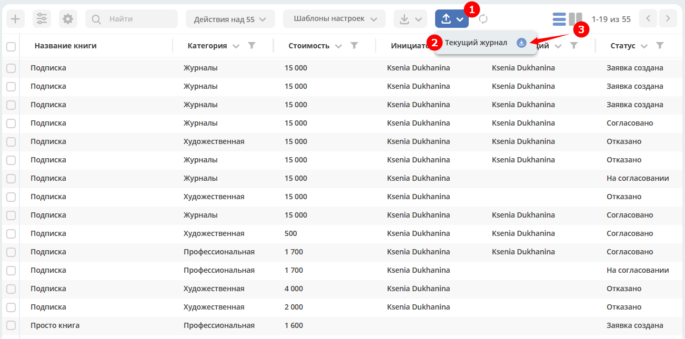
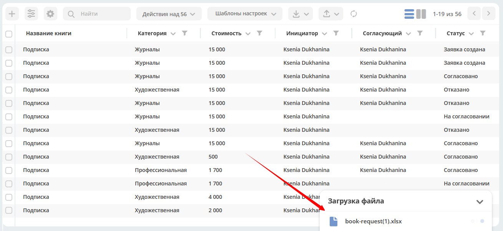
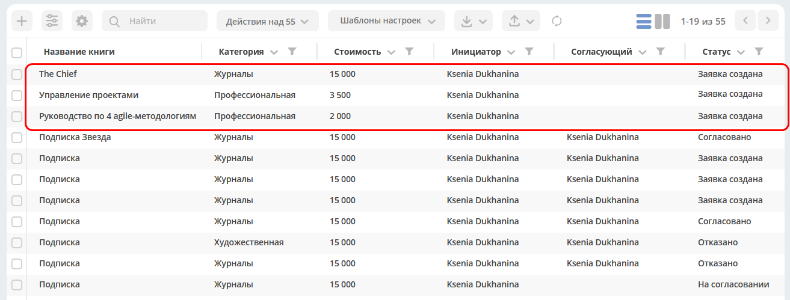

Импорт данных
===============

.. _default_data_import:

Добавлена возможность импорта в систему файлов (Excel) по шаблону. В результате обработки данных в системе создаются карточки выбранного типа.

Конфигураций импорта для одного журнала может быть несколько.

Ниже рассмотрим конфигурацию по умолчанию. 

В журнале нажмите кнопку **Импорт (1)**, на ней доступны варианты выбора **(2)**:

Нажмите **(3)** для скачивания шаблона Excel. Шаблон содержит все поля, заданные в журнале.

 
Заполните поля файла, сохраните:

 
Загрузите заполненный файл в систему:

.. image:: _static/import/ex_06.png
       :width: 600
       :align: center
 
В нижней части журнала будет показан прогресс обработки данных:

 
Если при загрузке данных произойдет ошибка, то будет выдано предупреждение.

После окончания обработки файла система выдаст сообщение о завершении процесса и статус (Успех/Ошибка):

.. list-table::
      :widths: 20 20
      :align: center

      * - |

            .. image:: _static/import/ex_10.png
                  :width: 300
                  :align: center

        - |

            .. image:: _static/import/ex_09.png
                  :width: 300
                  :align: center 	 

Загруженные данные в журнале - созданные карточки, которые можно открыть, внести изменения при необходимости и запустить бизнес-процесс:

Для создания своей конфигурации см. :ref:`Глобальный импорт данных<data_import>`
