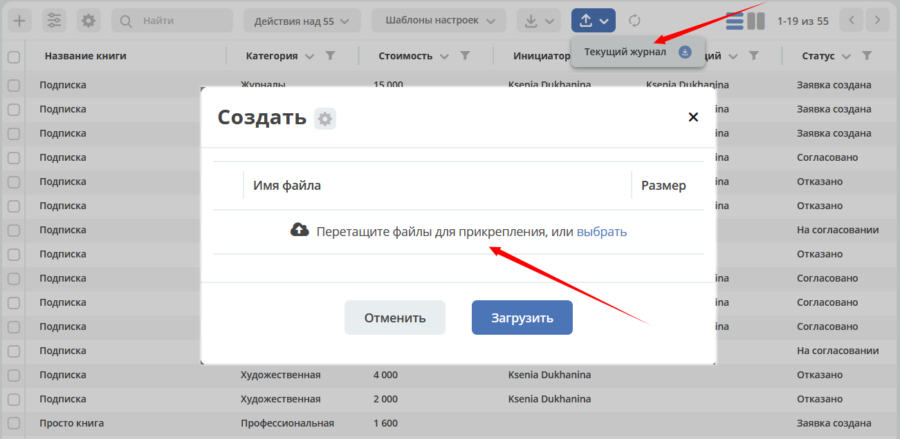

Импорт данных
===============

.. _default_data_import:

Добавлена возможность импорта в систему файлов (Excel) по шаблону. В результате обработки данных в системе создаются карточки выбранного типа.

.. contents::
   :depth: 2

Импорт данных в журнал
-----------------------

Конфигураций импорта для одного журнала может быть несколько.

Ниже рассмотрим конфигурацию по умолчанию. 

В журнале нажмите кнопку **Импорт (1)**, на ней доступны варианты выбора **(2)**:

.. image:: _static/import/ex_03_1.png
       :width: 600
       :align: center

Нажмите **(3)** для скачивания шаблона Excel. Шаблон содержит все поля, заданные в журнале.

.. image:: _static/import/ex_04.png
       :width: 600
       :align: center
 
Заполните поля файла, сохраните:

.. image:: _static/import/ex_05.png
       :width: 600
       :align: center
 
Загрузите заполненный файл в систему:

 
В нижней части журнала будет показан прогресс обработки данных:

.. image:: _static/import/ex_07_1.png
       :width: 600
       :align: center
 
Если при загрузке данных произойдет ошибка, то будет выдано предупреждение.

После окончания обработки файла система выдаст сообщение о завершении процесса и статус **(Успех/Ошибка)**:

.. list-table::
      :widths: 20 20
      :align: center

      * - |

            .. image:: _static/import/ex_10.png
                  :width: 300
                  :align: center

        - |

            .. image:: _static/import/ex_09.png
                  :width: 300
                  :align: center 	 

Загруженные данные в журнале - созданные карточки, которые можно открыть, внести изменения при необходимости и запустить бизнес-процесс:

.. image:: _static/import/ex_08.png
       :width: 600
       :align: center

Для создания своей конфигурации см. :ref:`Глобальный импорт данных<data_import>`

Импорт пользователей и групп
-------------------------------

Так же в систему по предварительно заполненному шаблону можно загрузить пользователей и группы.

.. note::
  
  Порядок действий описан для пользователей, состоящих в группе **Администраторы ECOS** (ECOS_ADMINISTRATORS).

Пользователи
~~~~~~~~~~~~~~~~~

Перейдите в **рабочее пространство администратора (1)** в журнал **Модель - Пользователи** нажмите кнопку **Импорт (2)**, на ней доступны варианты выбора **(3)**:

.. image:: _static/import/users_01.png
       :width: 700
       :align: center

Нажмите **(4)** для скачивания шаблона Excel. Шаблон содержит все поля, как на карточке создания нового пользователя.

.. image:: _static/import/users_02.png
       :width: 700
       :align: center

Заполните поля файла, сохраните:

.. image:: _static/import/users_03.png
       :width: 700
       :align: center

**Обязательные поля**,  как и на форме создания:

 - Системное имя
 - Email
 - Имя

Загрузите заполненный файл в систему:

.. image:: _static/import/users_04.png
       :width: 700
       :align: center

В нижней части журнала будет показан прогресс обработки данных:

.. image:: _static/import/users_05.png
       :width: 600
       :align: center
 
Если при загрузке данных произойдет ошибка, то будет выдано предупреждение.

Пользователи будут загружены в систему:

.. image:: _static/import/users_06.png
       :width: 600
       :align: center

Группы
~~~~~~~~~~~~~~~~~

Перейдите в **рабочее пространство администратора** в журнал **Модель - Группы**:

.. image:: _static/import/groups_01.png
       :width: 700
       :align: center

Шаблон файла:

.. image:: _static/import/groups_02.png
       :width: 500
       :align: center

Далее действия аналогичны, как и с пользователями.

**Обязательные поля**,  как и на форме создания:

 - Идентификатор группы
 - Имя группы