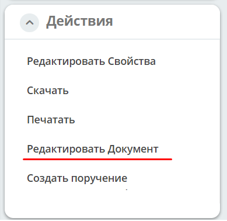
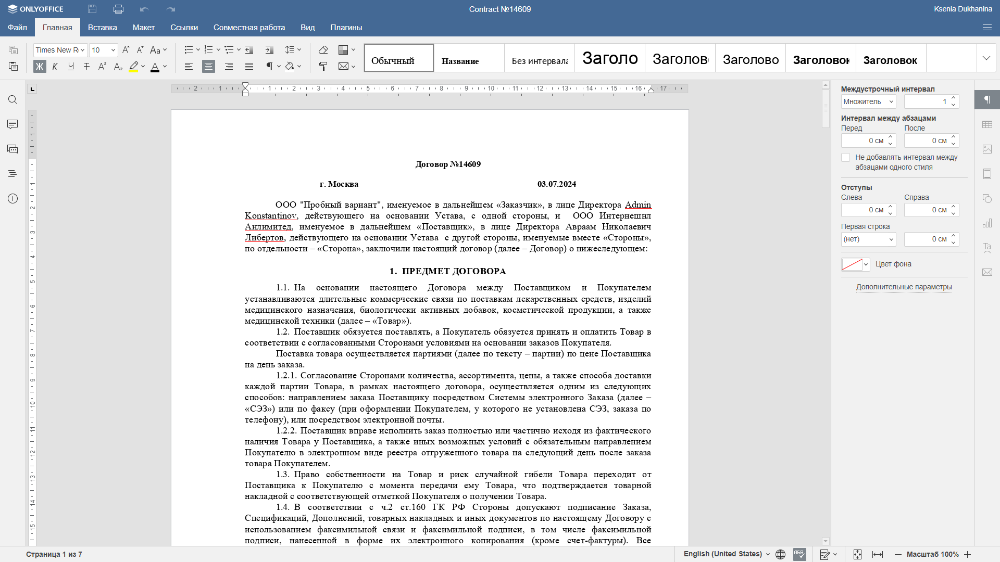
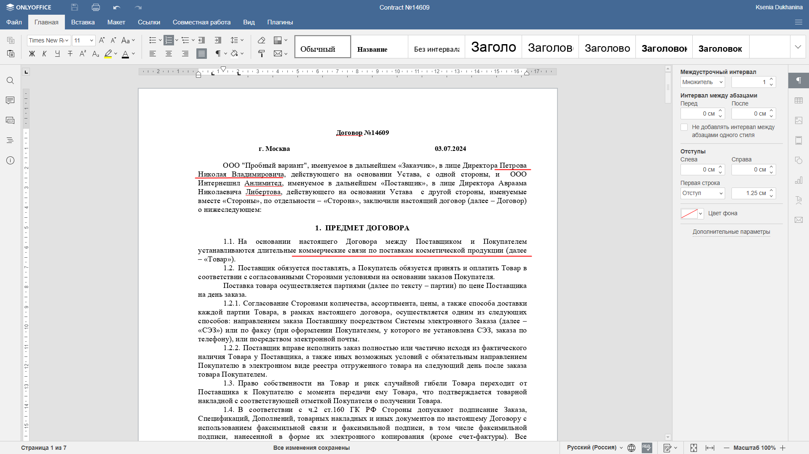
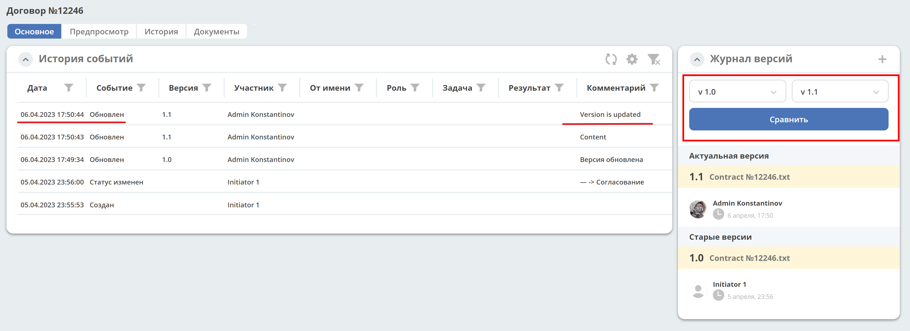
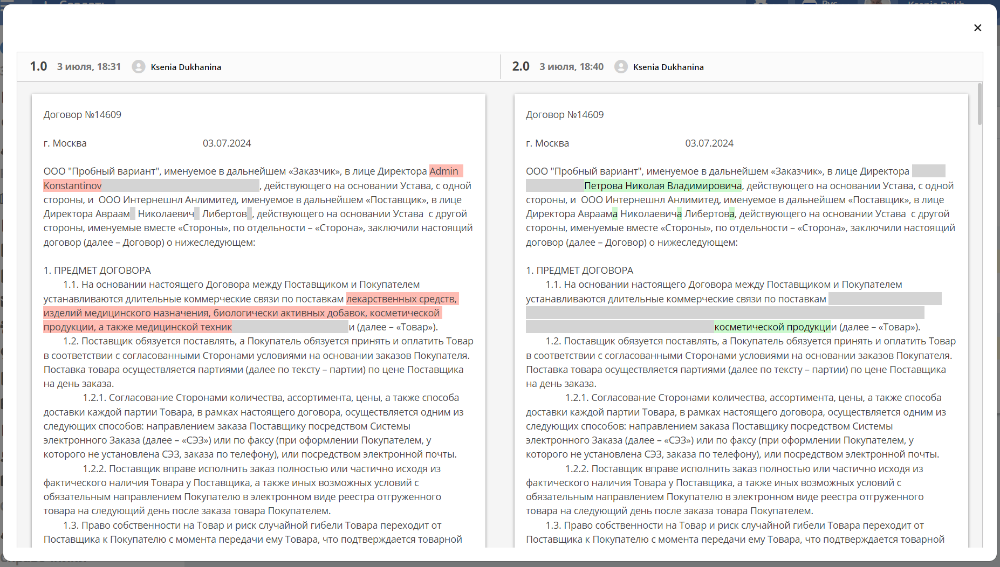

Редактирование документа в Onlyoffice
=====================================

.. _edit_only_office:

Для редактирования файлов документов в Onlyoffice используйте действие **«Редактировать документ»**:

Редактор **Onlyoffice** совместим с форматами MS Office и OpenDocument.

В отдельной вкладке браузера в Onlyoffice откроется документ:

Внесите в документ изменения:

Система сохраняет внесенные изменения автоматически в новую версию документа. Изменения версий фиксируются в :ref:`виджете «Журнал версий»<widget_versions_journal>`

Версии документов можно сравнить. Выберите версии и нажмите **Сравнить**. Различия будут подсвечены:

