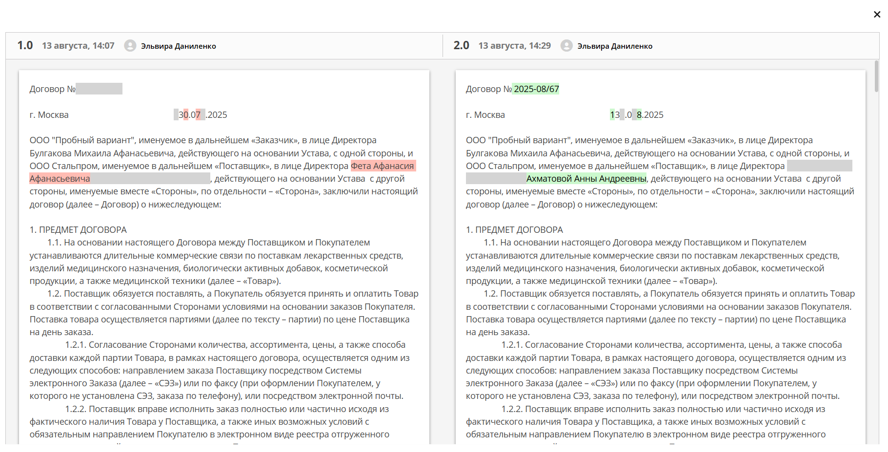

Сравнение версий
=================

Изменения версий документа фиксируются в :ref:`виджете «Журнал версий»<widget_versions_journal>`.

Виджет содержит актуальную и предшествующие версии документа. Служит для **загрузки новой версии** документа **(1)**, а также для сравнения файлов.

 .. image:: _static/versions/version_1.png
       :width: 250
       :align: center 

Для сравнения версий документов выберите версии и нажмите **Сравнить** **(2)**. Различия будут подсвечены:

