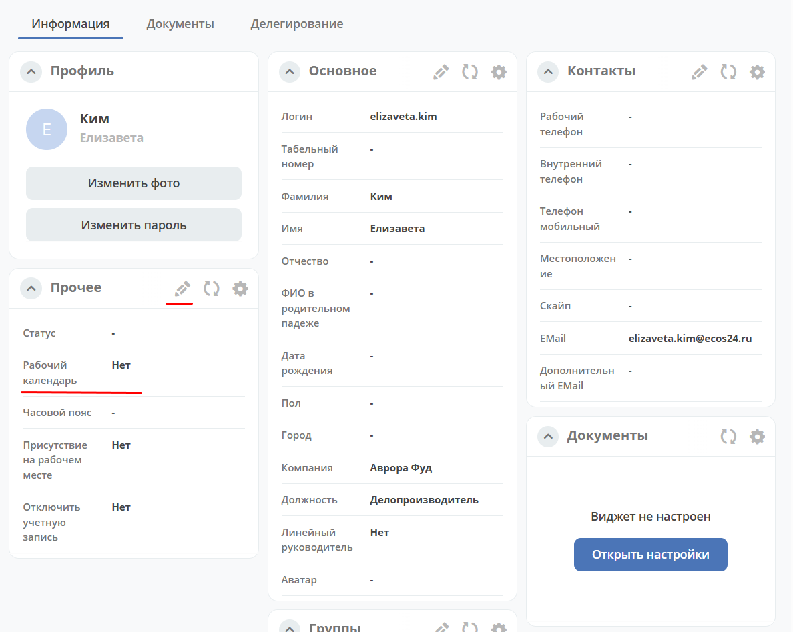

Рабочее расписание и производственный календарь
================================================

.. _business-schedule:

Функциональность для учета нерабочих, праздничных дней календаря, которые позволяют более гибко настраивать рабочий график сотрудников в различных модулях системы.

.. contents::
   :depth: 3

Производственный календарь
----------------------------

Функциональность для формирования списка дат, которые изменяют обычный распорядок рабочих дней:

Настройка расположена в журнале **"Производственный календарь" (Раздел администратора - Модель)** ``v2/admin?journalId=working-calendar&type=JOURNAL``

 .. image:: _static/work_calendar/calendar_3.png
       :width: 700
       :align: center 

|

 .. image:: _static/work_calendar/calendar_4.png
       :width: 500
       :align: center 

Выбрать **календарь**, который расширяем своей конфигурацией, указать **даты действия** календаря, выставить **Включен** ли календарь и указать **список дней** календаря.

Пример конфигурации календаря с условием:

.. code-block::

  [
      {
        "date": "2023-01-01",
        "type": "HOLIDAY",
        "until": "2023-01-08",
        "description": "Новогодние"
      },
      {
        "date": "2023-02-23",
        "type": "HOLIDAY",
        "description": "День защитника отечества"
      },
      {
        "date": "2023-02-24",
        "type": "HOLIDAY",
        "description": "С воскресенья 1 января"
      },
      {
        "date": "2023-03-08",
        "type": "HOLIDAY",
        "description": "Восьмое марта"
      },
      {
        "date": "2023-05-01",
        "type": "HOLIDAY"
      },
      {
        "date": "2023-05-08",
        "type": "HOLIDAY",
        "description": "С воскресенья 8 января"
      },
      {
        "date": "2023-05-09",
        "type": "HOLIDAY",
        "description": "День Победы"
      },
      {
        "date": "2023-06-12",
        "type": "HOLIDAY",
        "description": "День России"
      },
      {
        "date": "2023-11-04",
        "type": "HOLIDAY",
        "description": "День народного единства"
      }
  ]

где:

.. list-table:: 
      :widths: 10 10

      * - **date**
        - Конкретная дата или дата начала диапазона, если задано значение до
      * - **until**
        - Дата окончания диапазона (включительно)
      * - **type**
        - | Тип даты или всех дат в диапазоне
          | Допустимые типы: 
             
             * WORKING - рабочий день. Имеет смысл указывать, когда выходной день становится рабочим
             * HOLIDAY - праздник
             * SHORTDAY - сокращенный на 1ч рабочий день 
             * WEEKEND - выходной
             * NON_WORKING - не рабочий день

      * - **description**
        - Описание дня или диапазона

Рабочее расписание
-------------------

Определяет обычный распорядок рабочих дней. 

Настройка расположена в журнале **"Рабочее расписание" (Раздел администратора - Модель)**  ``v2/admin?journalId=type$working-schedule&type=JOURNAL``

 .. image:: _static/work_calendar/calendar_1.png
       :width: 700
       :align: center 

|

 .. image:: _static/work_calendar/calendar_2.png
       :width: 500
       :align: center 

Указать **Имя**, **Тип расписания** (на данный момент поддерживается только weekly), **Начало и заверешение рабочего дня**, **Часовой пояс** (при необходимости), **Рабочие дни**, **Производственный календарь**.

Пример заполнения конфигурации
~~~~~~~~~~~~~~~~~~~~~~~~~~~~~~~~

Пример конфигурации рабочего расписания с всеми рабочими днями и календарем по умолчанию:

.. code-block::

  {
      "workingDays": [
        "MONDAY",
        "TUESDAY",
        "WEDNESDAY",
        "THURSDAY",
        "FRIDAY",
      ],
      "workingDayEnd": "17:00",
      "workingCalendar": "emodel/working-calendar@RU",
      "workingDayStart": "09:00"
    
Пример конфигурации рабочего расписания с часовым поясом:

.. code-block:: 

  {
      "workingDays": [
        "MONDAY",
        "TUESDAY",
        "WEDNESDAY",
        "THURSDAY",
        "FRIDAY"
      ],
      "workingDayEnd": "17:00",
      "workingCalendar": "emodel/working-calendar@RU",
      "workingDayStart": "09:00",
      "workingDayTimeZone": "+03:00"
    

Где:

.. list-table:: 
      :widths: 10 10

      * - **workingDays**
        - Список рабочих дней
      * - **workingDayEnd**
        - Завершение рабочего дня
      * - **workingCalendar**
        - Ссылка на производственный календарь
      * - **workingDayStart**
        - Начало рабочего дня
      * - **workingDayTimeZone**
        - Часовой пояс рабочего дня

Например, используется для расчета SLA в :ref:`модуле «Service Desk»<ecos-service-desk>`

См. больше о :ref:`настройках<working-schedule>`

Добавление расписания пользователю
~~~~~~~~~~~~~~~~~~~~~~~~~~~~~~~~~~~~

Рабочий календарь можно добавить пользователю :ref:`в профиле<user_profile>`:

