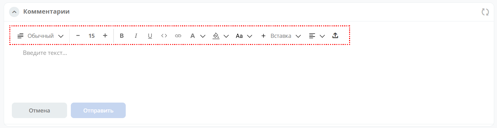
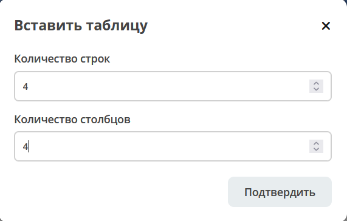

WYSIWYG-редактор
===================

.. _wysiwyg_editor:

**WYSIWYG-редактор** (произносится как «ви-зи-виг») — инструмент для создания и редактирования контента (текста, изображений, таблиц) в режиме реального времени, где результат отображается так, как он будет выглядеть после публикации. 

Визуальный редактор в Citeck основан на современном гибком и высокопроизводительном фреймворке `Lexical <https://lexical.dev>`_.

Над областью редактирования расположена панель инструментов WYSIWYG-редактора, при помощи которого можно оформлять текст, вставлять таблицы, изображения, математические формулы 

Рассмотрим ее функционал подробнее:

.. list-table:: 
      :widths: 5 5
      :align: center
      :class: tight-table 

      * - | 

            .. image:: _static/wysiwyg/title.png
                 :width: 200
                 :align: center   

        - | Выбрать уровень заголовков, вида списка и т.д.

      * - | 

            .. image:: _static/wysiwyg/font_size_format.png
                 :width: 200
                 :align: center  

        - | Изменить размера шрифта, применить стиль текста - жирный, курсив, подчеркнутый, добавить блок кода, ссылку

      * - | 

            .. image:: _static/wysiwyg/color.png
                 :width: 200
                 :align: center   

        - | Изменить цвет текста, цвет фона

      * - | 

            .. image:: _static/wysiwyg/format.png
                 :width: 200
                 :align: center   

        - | Изменить выравнивание и отступ

      * - | 

            .. image:: _static/wysiwyg/insert.png
                 :width: 200
                 :align: center   

        - | Вставить объект.
          | Изображение можно вставить как из файла, так и из ссылки.

            .. image:: _static/wysiwyg/pic_01.png
                 :width: 200
                 :align: center   

            .. image:: _static/wysiwyg/pic_02.png
                 :width: 200
                 :align: center   

            .. image:: _static/wysiwyg/pic_03.png
                 :width: 200
                 :align: center   

      * - | 

            .. image:: _static/wysiwyg/upload.png
                 :width: 50
                 :align: center  

          |

            .. image:: _static/wysiwyg/upload_file.png
                 :width: 400
                 :align: center   

        - | Загрузить файл

          | Файл будет отображаться в виде ссылки:

            .. image:: _static/wysiwyg/upload_file_1.png
                 :width: 500
                 :align: center   

          | По клику доступен его просмотр:

            .. image:: _static/wysiwyg/upload_file_2.png
                 :width: 600
                 :align: center   

      * - | Упомянуть пользователя

        - | 

            .. image:: _static/wysiwyg/mention_01.png
                 :width: 200
                 :align: center   

Пример работы с редактором:

Быстрое редактирование выделенного текста
--------------------------------------------

- **1** - перемещение строки или выделенной области
- **2** - форматирование выделенного текста

Добавление и редактирование таблицы
------------------------------------

Выберите в меню **Вставка - Таблица**, выберите количество строк и столбцов:

Для таблицы доступно изменение ширины и высоты ячеек, как в обычных редакторах, добавление столбцов и строк **(1)**, действия с таблицей доступны по нажатию на **(2)**:

.. list-table::
      :widths: 20 20
      :align: center

      * - |

            .. image:: _static/wysiwyg/table_02.png
                  :width: 600
                  :align: center

        - |

            .. image:: _static/wysiwyg/table_03.png
                  :width: 200
                  :align: center

