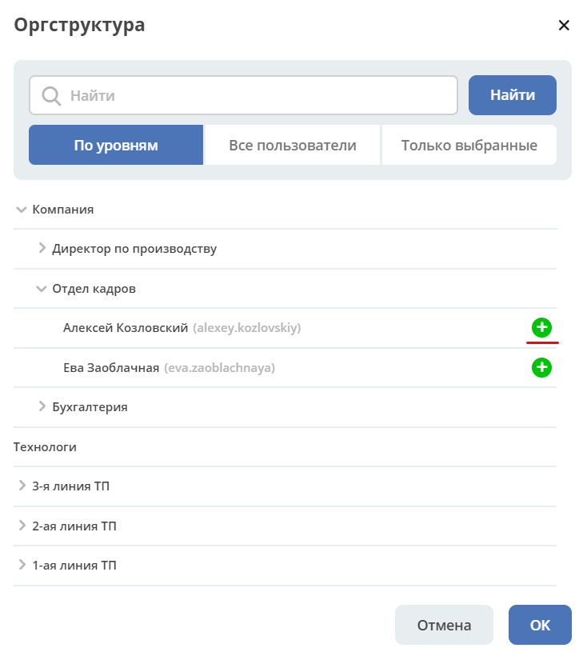

Организационная структура
===========================

Страница оргструктуры
----------------------

В системе предусмотрен функционал формирования организационной структуры компании. 

**Организационная структура** – система иерархически упорядоченных организационных единиц (должностей, отделов, подразделений). 

Для управления оргструктурой необходимо выбрать в главном меню пункт: 

.. image:: _static/org_structure/org_1.png
       :width: 600
       :align: center

|

Форма оргструктуры разделена на две части и содержит:

-	иерархическое дерево структуры с возможностью поиска **(1)**, 
-	дашборд с информацией о выбранной части структуры **(2)**. 

Каждый элемент структуры имеет кнопки управления, которые отображаются при наведении на элемент. 

Для пользователей:

.. image:: _static/org_structure/org_2.png
       :width: 300
       :align: center

|

.. list-table:: 
      :widths: 10 60
      :align: center

      * - 

          .. image:: _static/org_structure/org_3.png
                  :width: 30
                  :align: center

        - | **Удаление пользователя из данной группы**
          | Действие необходимо подтвердить:

          .. image:: _static/org_structure/org_4.png
                  :width: 500
                  :align: center
      * - 

          .. image:: _static/org_structure/org_5.png
                  :width: 30
                  :align: center

        - | **Просмотр профиля пользователя**

          .. image:: _static/org_structure/org_6.png
                  :width: 500
                  :align: center

          | Профиль представлен в виде :ref:`дашборда<dashboard>`
          | Виджеты на дашборде можно конфигурировать - менять их местами, скрывать ненужные. 
          | См. подробно :ref:`о конфигурации дашбордов<dashboard_config>`

Для групп:

.. image:: _static/org_structure/org_7.png
       :width: 300
       :align: center

|

.. list-table:: 
      :widths: 10 60
      :align: center

      * - 

          .. image:: _static/org_structure/org_8.png
                  :width: 30
                  :align: center

        - | **Редактировать группу**
          | Внести изменения и сохранить. 

          .. image:: _static/org_structure/org_9.png
                  :width: 500
                  :align: center

      * - 

          .. image:: _static/org_structure/org_10.png
                  :width: 30
                  :align: center

        - | **Добавить подгруппу**
          | Внести данные и сохранить. 

          .. image:: _static/org_structure/org_11.png
                  :width: 500
                  :align: center

      * - 

          .. image:: _static/org_structure/org_12.png
                  :width: 30
                  :align: center

        - | **Добавить человека в группу**
          | Внести данные и сохранить. 

          .. image:: _static/org_structure/org_13.png
                  :width: 500
                  :align: center

Компонент Оргструктура
------------------------

Компонент используется для выбора сотрудников и групп в формах документов, бизнес-процессов и т.д.

По умолчанию Оргструктура представлена в виде **иерархии по уровням**. Выбор сотрудника осуществляется нажатием на:

**Все пользователи** списком: 

Неактивные пользователи отмечены более светлым оттенком серого.

**Только выбранные** ранее:

Конфигурация компонента оргструктуры
-------------------------------------

Изменение маски вывода данных пользователя
~~~~~~~~~~~~~~~~~~~~~~~~~~~~~~~~~~~~~~~~~~~

Маску для отображения информации о пользователе можно изменить. Перейдите в журнал :ref:`«Конфигурация ECOS»<configuration_admin>`, откройте идентификатор **orgstruct-username-mask** в режиме редактирования:

.. image:: _static/org_structure/org_18.png
       :width: 700
       :align: center

Укажите маску, например, **${firstName} ${lastName} ${email}** и сохраните:

Измененный вывод данных пользователя в компоненте Оргструктура:

.. image:: _static/org_structure/org_20.png
       :width: 400
       :align: center

Добавлена возможность в конфигурации маски отображения пользователей в компоненте оргструктура использовать код HTML. 

Пример с использованием кода HTML. Маска:

**${firstName} ${lastName} <a href="https://ecos-community-demo/v2/orgstructure?recordRef=emodel/person@${fullName}" ><b>(${fullName})</b></a>**

По клику на ссылку в отдельной вкладке открывается страница профиля пользователя.

Где найти атрибуты для маски
~~~~~~~~~~~~~~~~~~~~~~~~~~~~~~

Перейти в **Типы данных**, в настройках выставить :ref:`отображение системных типов<data_types_admin>`.

Открыть тип **Person**, перейти в атрибуты:

.. image:: _static/org_structure/person_type.png
       :width: 600
       :align: center

Скрывать пользователей/ группы при поиске в оргструктуре
~~~~~~~~~~~~~~~~~~~~~~~~~~~~~~~~~~~~~~~~~~~~~~~~~~~~~~~~~

Перейдите в журнал :ref:`«Конфигурация ECOS»<configuration_admin>`, откройте идентификатор **hide-in-orgstruct** в режиме редактирования:

.. image:: _static/org_structure/org_22.png
       :width: 700
       :align: center

Укажите логины пользователей, например, **ivanov_ii,petrov_vv** и сохраните:

.. image:: _static/org_structure/org_23.png
       :width: 400
       :align: center

Поиск пользователя в компоненте Оргструктура:

.. image:: _static/org_structure/org_24.png
       :width: 400
       :align: center
