Организационная структура
===========================

.. _org_structure:

.. contents::
   :depth: 4

Страница оргструктуры
----------------------

В системе предусмотрен функционал формирования организационной структуры компании. **Организационная структура** – система иерархически упорядоченных организационных единиц (должностей, отделов, подразделений). 

.. note::

 Оргструктура доступна в рабочем пространстве :ref:`Справочники<datalists>` и на :ref:`корпоративном портале<corp_portal>`.

Форма оргструктуры разделена на две части и содержит:

 - иерархическое дерево структуры с возможностью поиска **(1)**, 
 - дашборд с информацией о выбранной части структуры **(2)**. 

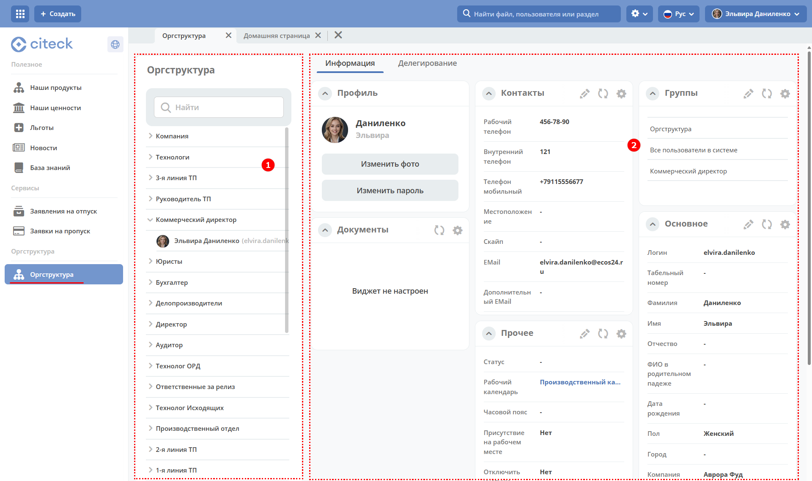

Создание группы
~~~~~~~~~~~~~~~~

.. _new_group:

Для создания группы в списке оргструктуры нажмите:

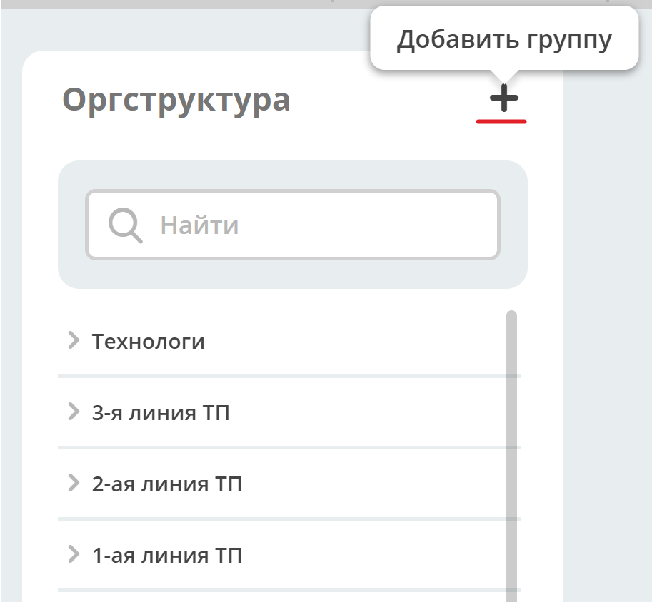

Группа **Оргструктура** добавлена по умолчанию. Внесите данные в обязательные поля и нажмите **Сохранить**.

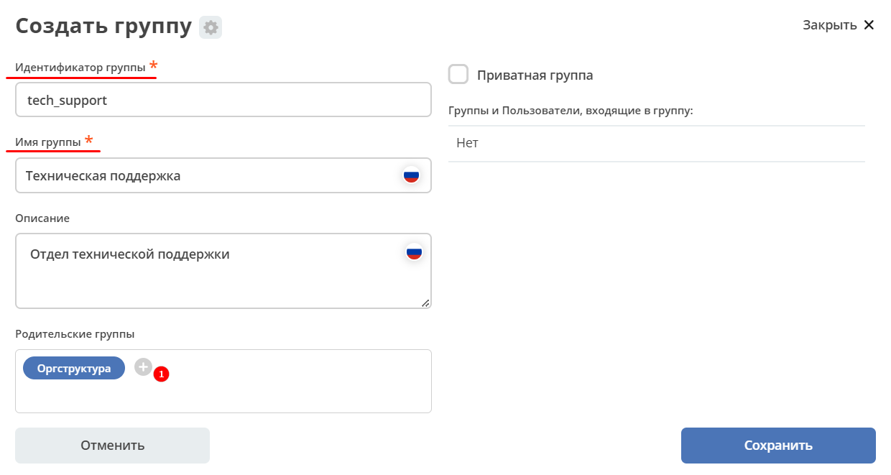

См. подробно о :ref:`приватных группах<UNIFIED_PRIVATE_GROUP>`

По кнопке **(1)** можно выбрать из оргструктуры родительскую группу (в которую создаваемая группы будет входить). 

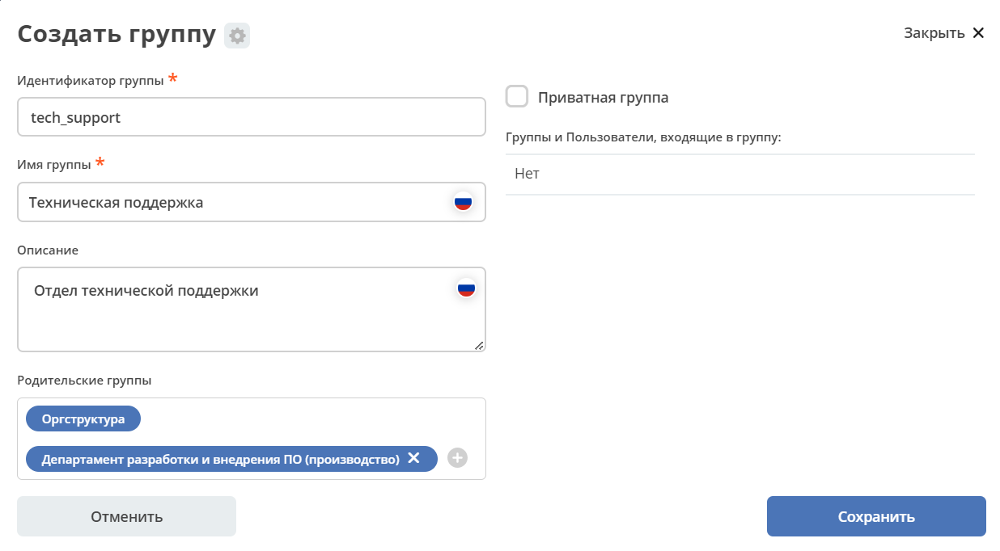

Создание подгруппы, добавление пользователя в группу
""""""""""""""""""""""""""""""""""""""""""""""""""""""

Для группы доступны кнопки управления, которые отображаются при наведении на элемент.

|

.. list-table:: 
      :widths: 10 60
      :align: center

      * - 

          .. image:: _static/org_structure/group_action_01.png
                  :width: 30
                  :align: center

        - | **Редактировать**
          | На форме отображены все группы и пользователи, входящие в группу, информация о родительских группах.
          | Можно отредактировать **Имя группы**, **Описание**, **удалить (1)**,  **добавить родительские группы** **(2)**.

          .. image:: _static/org_structure/edit.png
                  :width: 500
                  :align: center

          | По клику на группу/ пользователя **(3)** доступен просмотр информации:

           .. image:: _static/org_structure/edit_group.png
                  :width: 500
                  :align: center         
          
          |
          
           .. image:: _static/org_structure/edit_person.png
                  :width: 500
                  :align: center

      * - 

          .. image:: _static/org_structure/group_action_02.png
                  :width: 30
                  :align: center

        - | **Добавить подгруппу**
          | Выберите **существующую** группу/группы из оргструктуры. Нажмите **Ок**.

          .. image:: _static/org_structure/add_subgroup.png
                  :width: 400
                  :align: center

          | Пример иерархии подгрупп и пользователей в них:

          .. image:: _static/org_structure/structure.png
                  :width: 300
                  :align: center

      * - 

          .. image:: _static/org_structure/group_action_03.png
                  :width: 30
                  :align: center

        - | **Добавить пользователя в группу**
          | Выберите **существующих** пользователей из оргструктуры. Нажмите **Ок**.

          .. image:: _static/org_structure/add_user.png
                  :width: 400
                  :align: center

      * - 

          .. image:: _static/org_structure/group_action_04.png
                  :width: 30
                  :align: center

        - | **Создать пользователя**
          | Группа будет уже предзаполнена.
          | Внесите данные и сохраните. Обязательные поля отмечены звездочкой.
          | Чтобы задачи пользователя были доступны для контроля руководителем, заполните поле **Линейный руководитель**.

          .. image:: _static/org_structure/add_new_user.png
                  :width: 500
                  :align: center

Просмотр и редактирование профиля пользователя, удаление пользователя из группы
"""""""""""""""""""""""""""""""""""""""""""""""""""""""""""""""""""""""""""""""""

Для пользователя доступны кнопки управления, которые отображаются при наведении на элемент.

.. _user_profile:

.. image:: _static/org_structure/user_actions.png
       :width: 300
       :align: center

|

.. list-table:: 
      :widths: 10 60
      :align: center

      * - 

          .. image:: _static/org_structure/person_action_01.png
                  :width: 30
                  :align: center

        - | **Исключить пользователя из группы**
          | Действие необходимо подтвердить:

          .. image:: _static/org_structure/exclude_user.png
                  :width: 500
                  :align: center
      * - 

          .. image:: _static/org_structure/person_action_02.png
                  :width: 30
                  :align: center

        - | **Открыть профиль пользователя**

          .. image:: _static/org_structure/user_profile.png
                  :width: 500
                  :align: center

          | Профиль представлен в виде :ref:`дашборда<dashboard>`. Дашборд состоит из :ref:`виджетов<widgets>`.
          | Виджеты на дашборде можно конфигурировать - менять их местами, скрывать ненужные. См. подробно :ref:`о конфигурации дашбордов<dashboard_config>`

          .. note::

              Пользователь может редактировать только свой профиль, администратор - профиль любого пользователя.

          | Для редактирования информации виджета нажмите:

          .. image:: _static/org_structure/edit_user_1.png
                  :width: 300
                  :align: center

          | Или редактировать непосредственно в строке:

          .. image:: _static/org_structure/edit_user_2.png
                  :width: 300
                  :align: center   

          .. image:: _static/org_structure/edit_user_3.png
                  :width: 300
                  :align: center

Компонент Оргструктура
------------------------

Компонент используется для выбора сотрудников и групп в формах документов, бизнес-процессов и т.д.

.. image:: _static/org_structure/org_s_1.png
       :width: 600
       :align: center

По умолчанию **Оргструктура** представлена в виде **иерархии по уровням**. Выбор сотрудника осуществляется нажатием на:

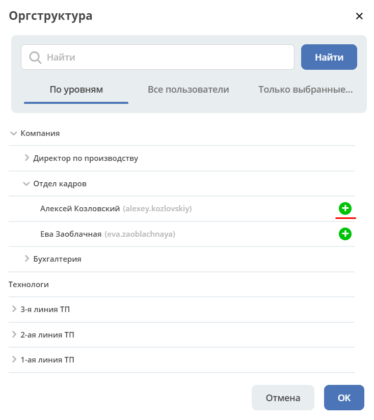

**Все пользователи** списком: 

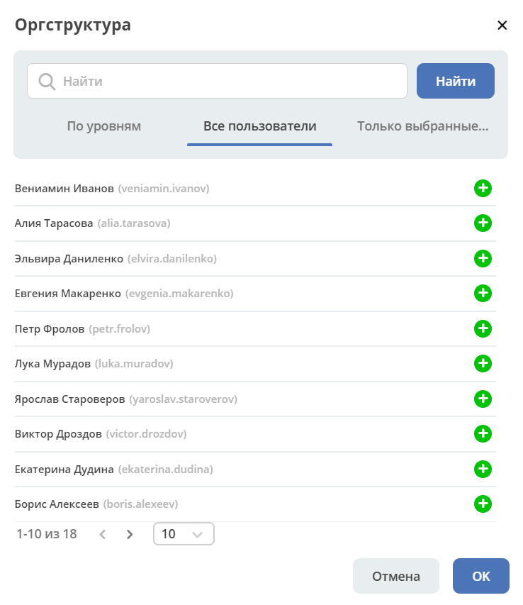

Неактивные пользователи отмечены более светлым оттенком серого.

**Только выбранные** ранее:

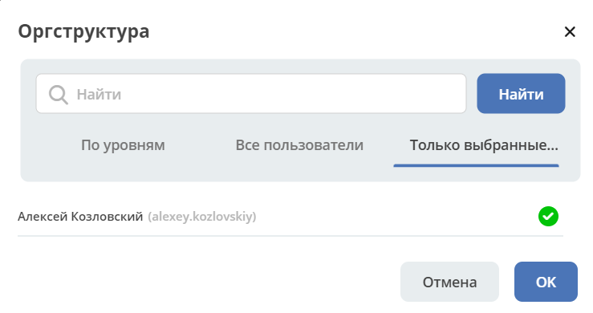

Конфигурация компонента оргструктуры
-------------------------------------

.. _orgstructure_config:

Перейдите в журнал :ref:`«Конфигурация ECOS»<configuration_admin>`. 

Журнал доступен по адресу: ``v2/admin?journalId=ecos-configs&type=JOURNAL``

В поисковой строке введите **org** - откроется список возможных настроек:

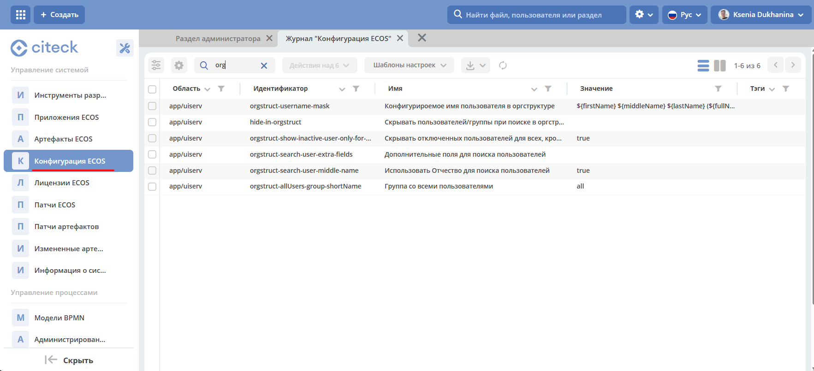

Изменение маски вывода данных пользователя
~~~~~~~~~~~~~~~~~~~~~~~~~~~~~~~~~~~~~~~~~~~

Маску для отображения информации о пользователе можно изменить. Откройте идентификатор **orgstruct-username-mask** в режиме редактирования:

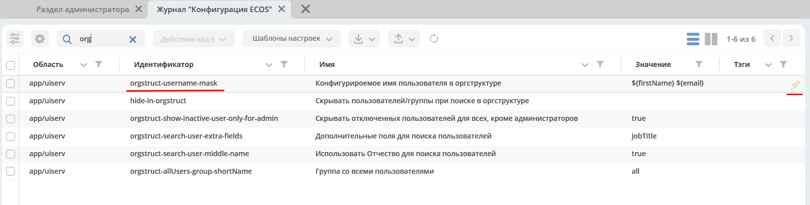

Укажите маску, например, **${firstName} ${lastName} ${email}** и сохраните:

.. image:: _static/org_structure/mask_2.png
       :width: 400
       :align: center

Измененный вывод данных пользователя в компоненте Оргструктура:

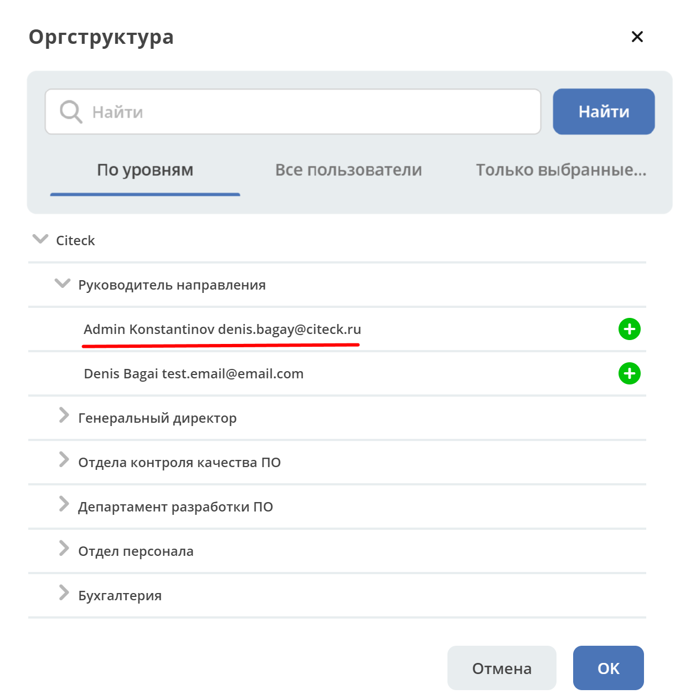

Добавлена возможность в конфигурации маски отображения пользователей в компоненте оргструктура использовать код HTML. 

Пример с использованием кода HTML. Маска:

``${firstName} ${lastName} <a href="https://localhost/v2/orgstructure?recordRef=emodel/person@${fullName}" ><b>(${fullName})</b></a>``

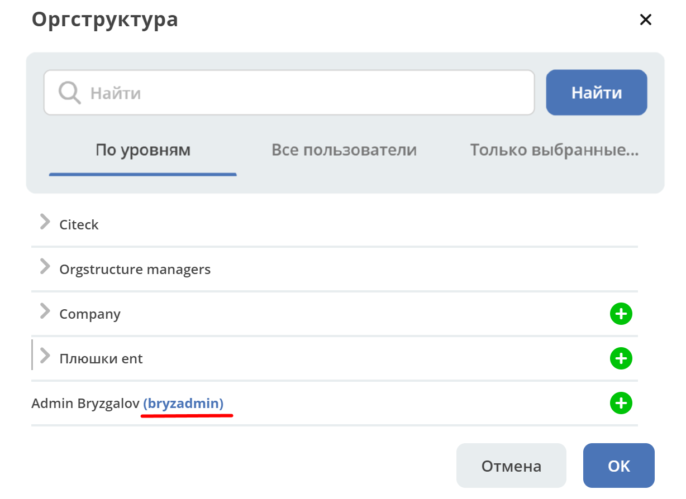

По клику на ссылку в отдельной вкладке открывается страница профиля пользователя.

Где найти атрибуты для маски
""""""""""""""""""""""""""""""

.. _org_structure_type_person:

Перейти в **Типы данных**, в настройках выставить :ref:`отображение системных типов<data_types_admin>`. Открыть тип **Person**, перейти в атрибуты:

.. image:: _static/org_structure/person_type.png
       :width: 600
       :align: center

Значение в поле **Id** является атрибутом.

Скрывать пользователей/ группы при поиске в оргструктуре
~~~~~~~~~~~~~~~~~~~~~~~~~~~~~~~~~~~~~~~~~~~~~~~~~~~~~~~~~

Определенных пользователей или группы можно скрыть в поисковой выдаче в оргструктуре.

Откройте идентификатор **hide-in-orgstruct** в режиме редактирования. Укажите логины пользователей, например, **ivanov_ii,petrov_vv** и сохраните:

Поиск пользователя в компоненте **Оргструктура**:

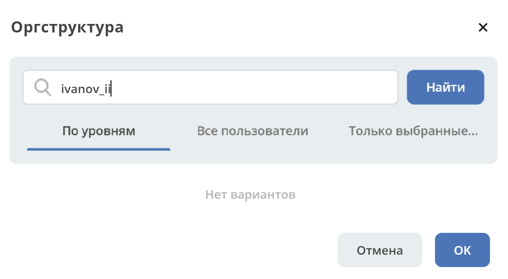

Скрывать отключенных пользователей для всех, кроме администраторов
~~~~~~~~~~~~~~~~~~~~~~~~~~~~~~~~~~~~~~~~~~~~~~~~~~~~~~~~~~~~~~~~~~~~

В оргструктуре отключенных пользователей можно скрыть для всех, кроме администраторов. 

Откройте идентификатор **orgstruct-show-inactive-user-only-for-admin** в режиме редактирования:

Выставите чек-бокс **«Включить»**.

Дополнительные поля для поиска пользователей
~~~~~~~~~~~~~~~~~~~~~~~~~~~~~~~~~~~~~~~~~~~~~~

По умолчанию поиск происходит, если в поисковой строке указать:

       * 1 слово - по полям **отображаемое имя в оргструктуре (1)**, **системное имя (2)**;

              .. image:: _static/org_structure/search_defalt.png
                     :width: 300
                     :align: center

       * 2 слова - по полям **Имя**, **Фамилия**;
       * 3 слова - по полям **Имя**, **Фамилия**, **Отчество**;
       * более 3 слов, аналогично как поиск по **1 слову**.

Для добавления дополнительных полей для поиска откройте идентификатор **orgstruct-search-user-extra-fields** в режиме редактирования:

Укажите наименование :ref:`атрибута<org_structure_type_person>`, по которому необходимо искать.

Поиск по добавленному в настройку полю:

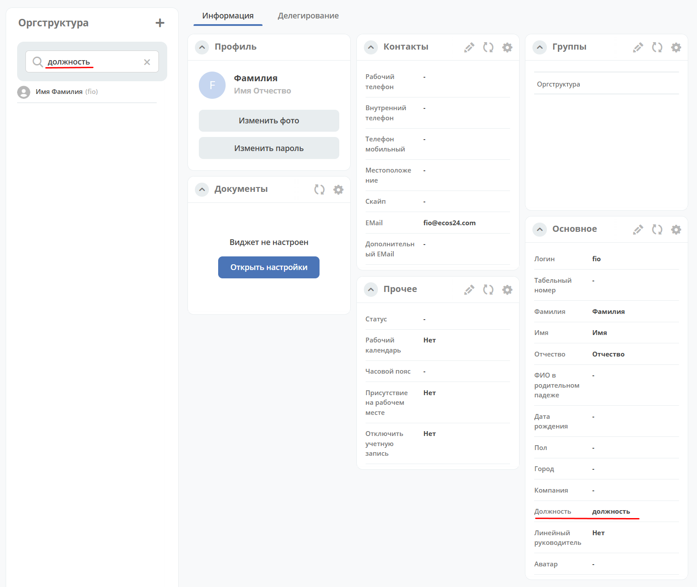

Использовать Отчество для поиска пользователей
~~~~~~~~~~~~~~~~~~~~~~~~~~~~~~~~~~~~~~~~~~~~~~

Для поиска пользователей в оргструктуре по отчеству откройте идентификатор **orgstruct-search-user-middle-name** в режиме редактирования:

Выставите чек-бокс **«Включить»**.

Поиск по отчеству - в самой оргструктуре:

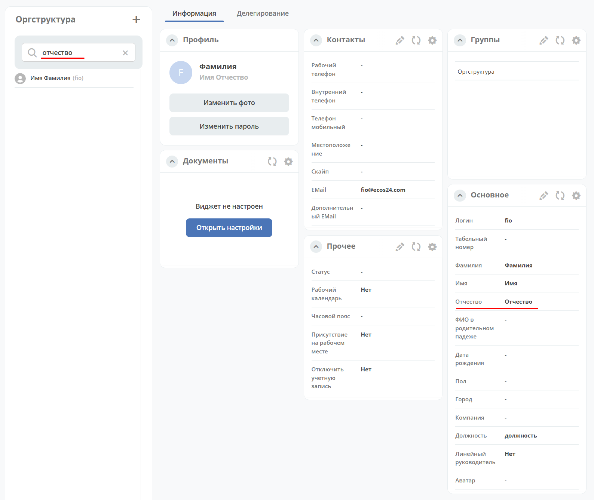

и в компоненте **Оргструктура**:

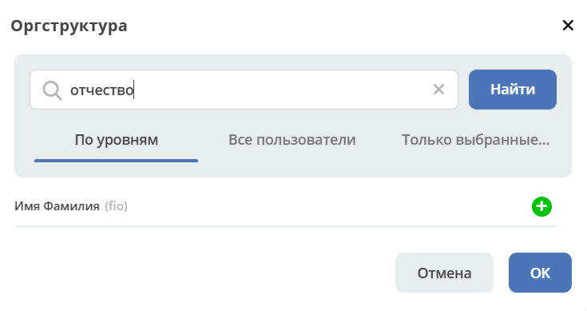
