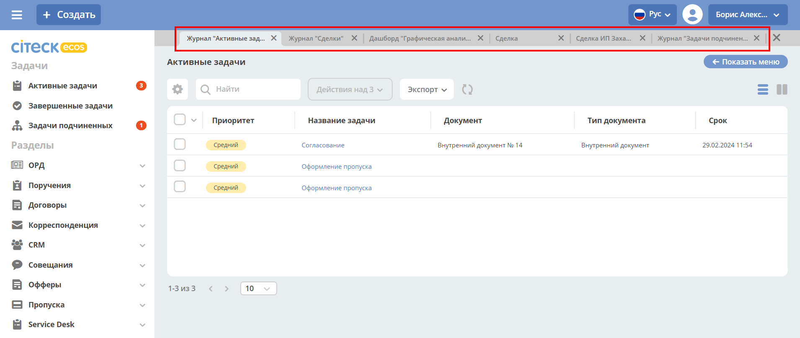

Производительность
===================

Вкладки внутри ECOS
---------------------

.. _ecos_tabs:

Чтобы скорость загрузки страницы не падала при увеличении количества вкладок:

1. Заголовки всех открытых вкладок сохраняются в LocalStorage браузера с текущей локализацией.

.. code-block::

 title: {ru: "Журнал "Договоры""}

2. При открытии страницы заголовок загружается только:  для активной вкладки, для вкладки без сохраненного имени в LocalStorage вкладки.

3. При смене локализации перезапрашиваются имена всех вкладок.

4. При первичном клике на вкладку, для которой имя было загружено из LocalStorage, запрашивается актуальное имя, при дальнейшем переключении на эту вкладку имя не запрашивается.