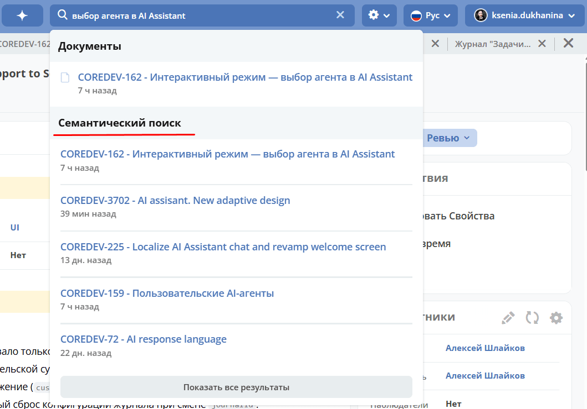

.. _rag-search:

Семантический поиск и индексация документов
============================================

.. note::

   Доступно только в enterprise версии.

Семантический поиск позволяет находить нужные документы по смыслу запроса, а не только по точному совпадению слов.

Сценарии использования
--------------------------------------------

- **Поиск в шапке** (живой поиск). При вводе текста в строку поиска в шапке платформы, помимо обычных результатов (документы, люди, пространства), появляется секция «Семантический поиск» с документами, релевантными по смыслу. Например, по запросу «условия оплаты для клиента» находятся договоры и коммерческие предложения, содержащие информацию об условиях оплаты, даже если в них нет точного совпадения с введённой фразой.

- **Поиск через журнал**. Семантический поиск также доступен на странице глобального поиска — результаты отображаются в отдельной группе SEMANTIC наряду с группами DOCUMENTS, PEOPLE и WORKSPACES.
- **Контроль доступа**. Пользователь видит в результатах поиска только те документы, к которым у него есть доступ. Если пользователь не является участником рабочего пространства, документы из него не отображаются.
- **Поиск по коду и документации** (для разработчиков). Через :ref:`AI‑ассистент <AI_assistant>` можно искать по содержимому GitLab‑репозиториев — исходному коду, README, конфигурациям. Это работает через MCP‑протокол и не требует от разработчика знания конкретных файлов или путей.

Индексация происходит автоматически: при создании или изменении документа он попадает в поисковый индекс в течение нескольких секунд, при удалении — автоматически удаляется из индекса.

Настройка семантического поиска описана в разделе :ref:`Конфигурация RAG <rag-config>`.

