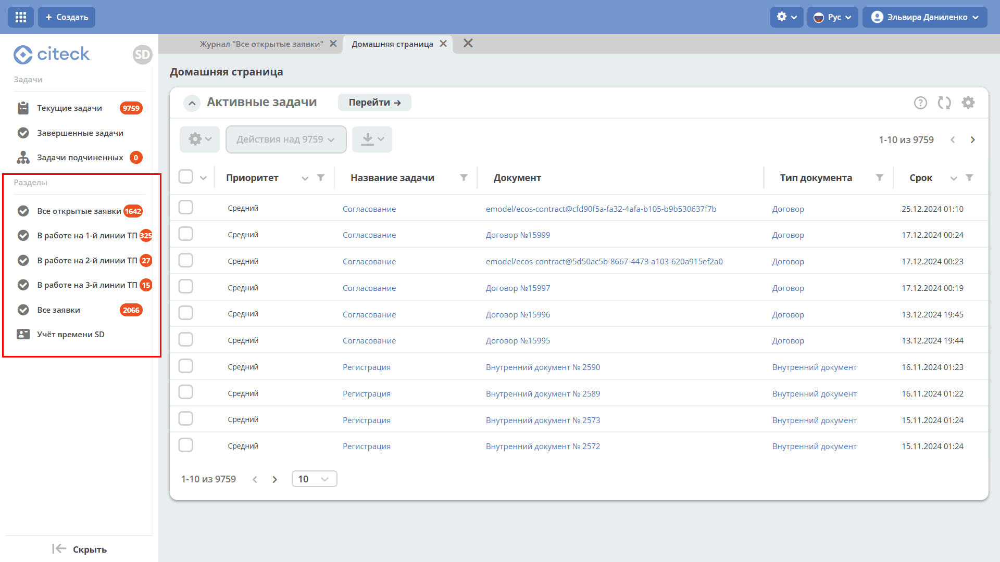
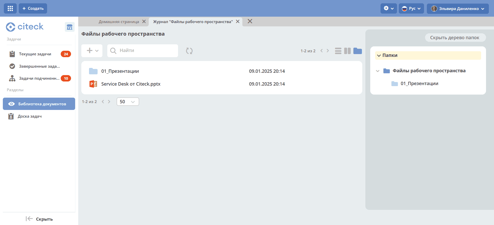

.. _workspaces:

Рабочие пространства
======================

.. contents::
   :depth: 2

.. grid:: 1
   :gutter: 2

   .. grid-item-card:: Выбор рабочего пространства
      :link: select_ws
      :link-type: ref

      Как переключиться на пространство, в котором вы уже состоите, или найти доступное через общее меню.

   .. grid-item-card:: Доступные рабочие пространства
      :link: types_ws
      :link-type: ref

      Персональное и совместное пространства: назначение и возможности каждого типа.

   .. grid-item-card:: Настройки рабочего пространства
      :link: workspace_settings
      :link-type: ref

      Настройка домашней страницы, меню и других параметров пространства.

   .. grid-item-card:: Создание и редактирование рабочего пространства
      :link: new_workspace
      :link-type: ref

      Как создать новое рабочее пространство или изменить существующее.

   .. grid-item-card:: Рабочее пространство администратора
      :link: ws_admin
      :link-type: ref

      Инструменты конфигурации и настройки платформы для системных администраторов.

   .. grid-item-card:: Создание артефактов в рабочем пространстве
      :link: ws_artifacts
      :link-type: ref

      No-code/low-code инструменты разработки внутри совместного рабочего пространства.

.. toctree::
    :maxdepth: 2
    :hidden:

    workspaces/select_ws
    workspaces/types_ws
    workspaces/settings_ws
    workspaces/new_ws
    workspaces/admin_ws
    workspaces/artifacts_ws

**Рабочее пространство (workspace)** — изолированная область в Citeck, объединяющая меню, данные и вкладки, относящиеся к определённой функциональности или команде. Благодаря разделению на пространства пользователи видят только то, что относится к их задачам, не отвлекаясь на данные других проектов или подразделений.

Например, пространство «Договоры и доверенности» собирает в одном интерфейсе договоры, доверенности и сопутствующие справочники, а пространство конкретного проекта — тикеты и запросы на изменение, полностью изолированные от других проектов.

Типы рабочих пространств
--------------------------

Поддерживается два типа рабочих пространств:

.. grid:: 1
   :gutter: 2

   .. grid-item-card:: Персональное
      :link: ws_personal
      :link-type: ref

      Индивидуальная область для управления задачами, документами и участия в бизнес-процессах.

   .. grid-item-card:: Совместное
      :link: ws_collaborative
      :link-type: ref

      Коллективная область для командной работы: объединяет участников, документы, задачи и бизнес-процессы в едином интерфейсе.

Видимость и роли
-------------------

По видимости пространство может быть **публичным** (любой пользователь платформы может к нему присоединиться) или **приватным** (доступно только выбранным участникам).

Каждый участник пространства получает одну из двух ролей:

.. list-table::
   :class: tight-table
   :header-rows: 1

   * - Роль
     - Описание
   * - Пользователь
     - Работает с данными пространства в рамках предоставленного доступа.
   * - Менеджер
     - Дополнительно управляет настройками пространства: меню, составом участников, артефактами. Роль автоматически присваивается пользователю, создавшему пространство.

Возможности пользователя
---------------------------

Выбор рабочего пространства
~~~~~~~~~~~~~~~~~~~~~~~~~~~~~

Пользователь может выбрать как рабочее пространство, в котором уже состоит, так и любое из списка доступных:

.. grid:: 2
   :gutter: 2

   .. grid-item::

      .. image:: _static/workspaces/01_button_select.png
         :width: 500
         :align: left

   .. grid-item::

      .. image:: _static/workspaces/01_button_select_1.png
         :width: 500
         :align: left

Меню и данные выбранного пространства
~~~~~~~~~~~~~~~~~~~~~~~~~~~~~~~~~~~~~~~

Пользователь видит только те пункты меню (левого и верхнего), вкладки и данные (объекты типов данных), которые относятся к выбранному рабочему пространству. Например, так выглядит интерфейс для пространства **Service Desk**:

Типы данных пространства
~~~~~~~~~~~~~~~~~~~~~~~~~~~

Пользователь видит объекты только тех типов данных, которые добавлены в данное пространство (а также «общие» типы данных глобального пространства).

Библиотека документов
~~~~~~~~~~~~~~~~~~~~~~~

В Библиотеке документов пользователь видит только файлы и папки, относящиеся к текущему пространству:

Возможности администратора
------------------------------

- управляет рабочими пространствами: создаёт, изменяет, удаляет, настраивает для них пункты меню и типы данных;
- задаёт принадлежность типов данных к **глобальному** пространству или к конкретному — это позволяет сделать объекты (например, общие справочники) доступными во всех рабочих пространствах одновременно;
- добавляет и исключает типы данных из рабочих пространств, разграничивая объекты между ними. Например, добавив тип «Договор» в пространства «Договоры компании А» и «Договоры компании Б», можно обеспечить полную изоляцию договоров этих компаний.

.. note::

   По умолчанию при развёртывании системы создаётся **Глобальное рабочее пространство** — оно открывается для пользователей по умолчанию. При необходимости администратор может назначить другое стартовое пространство через настройку конфигурации. См. :ref:`Рабочее пространство администратора<ws_admin>`.

Коробочные :ref:`функциональные модули<ecos_modules>` разбиты по рабочим пространствам для удобства навигации.
