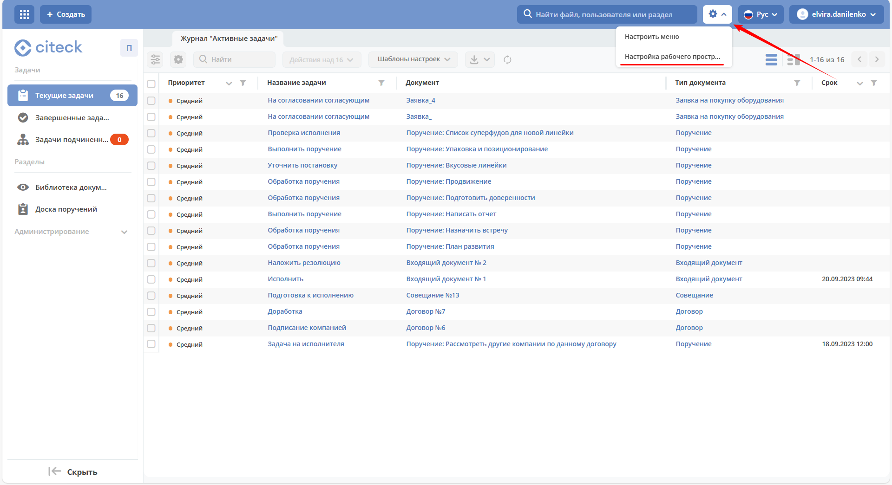
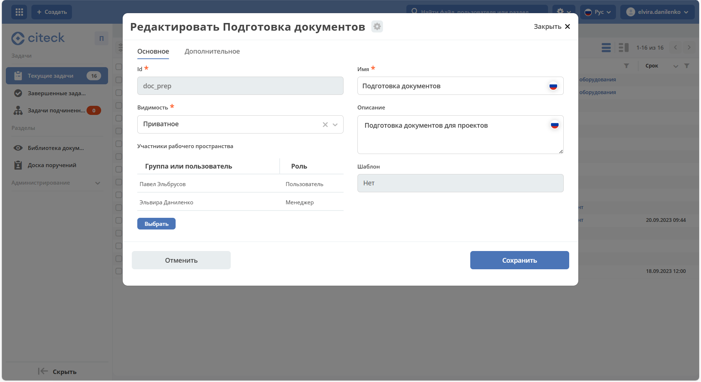

Создание и редактирование рабочего пространства
------------------------------------------------------------------------------------------

.. _new_workspace:

Создание
~~~~~~~~~~~~~~~~~~~~~~~~~

Нажмите **«Добавить пространство»**:

.. image:: _static/07_new_workspace.png
       :width: 700
       :align: center

Вкладка **«Основное»**:

.. list-table::
      :widths: 5 10 30 30
      :header-rows: 1
      :align: center
      :class: tight-table

      * - п/п
        - Наименование
        - Описание
        - Пример заполнения
      * - 1
        - **Id**
        - Уникальный идентификатор рабочего пространства. Задаётся при создании и не может быть изменён.
        - doc_prep
      * - 2
        - **Имя**
        - Локализованное название рабочего пространства.
        - Подготовка документов
      * - 3
        - **Видимость**
        - | **Публичное** — любые пользователи смогут присоединиться к пространству самостоятельно.
          | **Приватное** — пространство доступно только выбранным участникам.
        - Приватное
      * - 4
        - **Описание**
        - Локализованное описание рабочего пространства.
        - Подготовка документов для проектов
      * - 5
        - **Участники рабочего пространства**
        - | Выбор из оргструктуры участников и предоставление им прав: **Пользователь** или **Менеджер** (с возможностью управления пространством).
          | Пользователь, создающий пространство, автоматически получает роль **Менеджер** и фиксируется как создатель.
        -

            .. image:: _static/07_new_workspace_05.png
                  :width: 600
                  :align: center

      * - 6
        - **Шаблон**
        - Выбор :ref:`шаблона<template_workspace>` для предзаполнения меню, виджетов и настроек нового пространства.
        -

Вкладка **«Дополнительно»**:

 .. image:: _static/07_new_workspace_02.png
       :width: 600
       :align: center

.. list-table::
      :widths: 5 10 30 30
      :header-rows: 1
      :align: center
      :class: tight-table

      * - п/п
        - Наименование
        - Описание
        - Пример заполнения
      * - 1
        - **Адрес домашней страницы**
        - | Адрес, открывающийся при входе в рабочее пространство и при нажатии на логотип в меню.
          | Если адрес не задан, по умолчанию открывается **/v2/dashboard**.
        -
      * - 2
        - **Вложенные рабочие области**
        - | Позволяет включить одно или несколько дочерних рабочих пространств в текущее.
          | Во всех журналах пространства-родителя будут отображаться записи как из текущего, так и из всех вложенных пространств.
          | Ограничения: вложенные области не могут сами содержать вложенные; нельзя добавить пространство в себя же.
        -
      * - 3
        - **Иконка**
        - Выбор иконки рабочего пространства для отображения в переключателе пространств.
        -

Созданное пространство становится доступно участникам, указанным при создании.

.. image:: _static/07_new_workspace_03.png
       :width: 700
       :align: center

Участники могут добавлять и редактировать файлы в библиотеке документов, создавать поручения.

Редактирование
~~~~~~~~~~~~~~~~~~~~~~~~~~~~~~~~~~~~~~~

Редактирование рабочего пространства доступно пользователю с правами **«Менеджер»**.

Перейдите в **настройки** и выберите **«Настройка рабочего пространства»**:

В форме редактирования можно изменить роли участников, добавить новых участников, обновить описание и видимость пространства:

