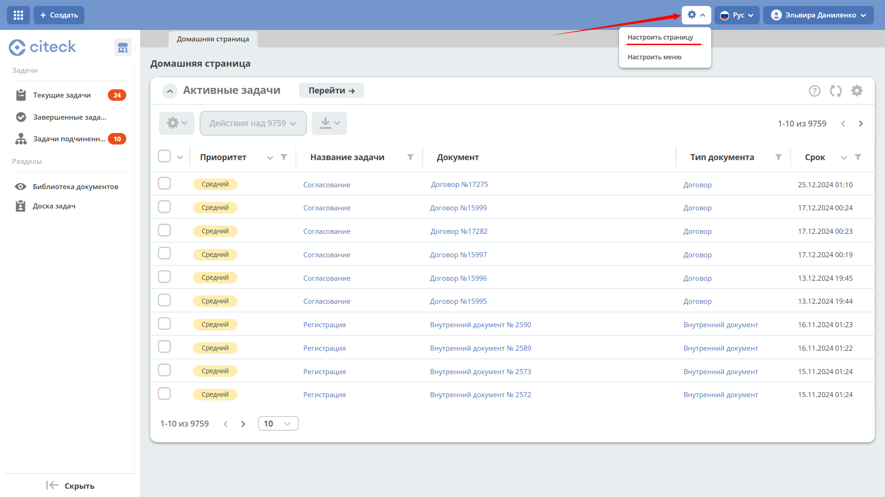
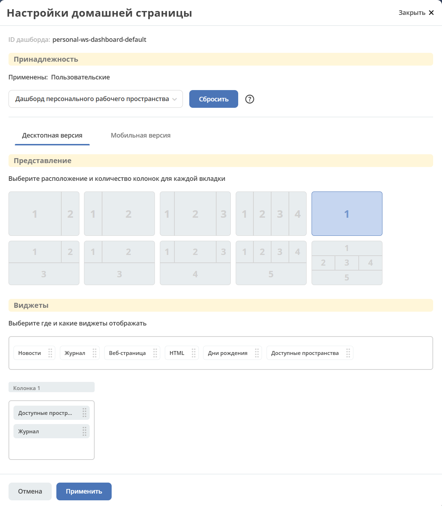
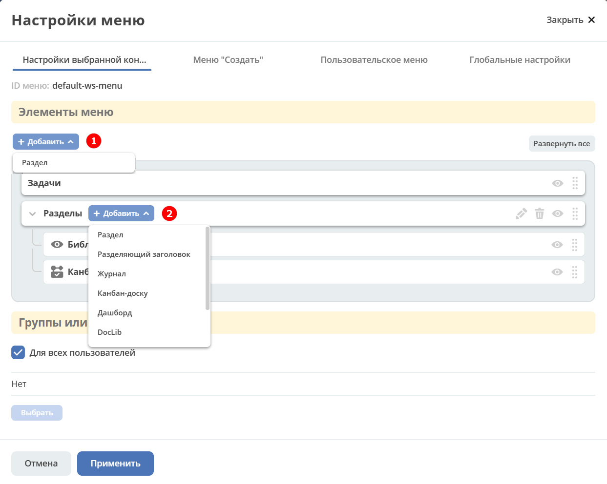
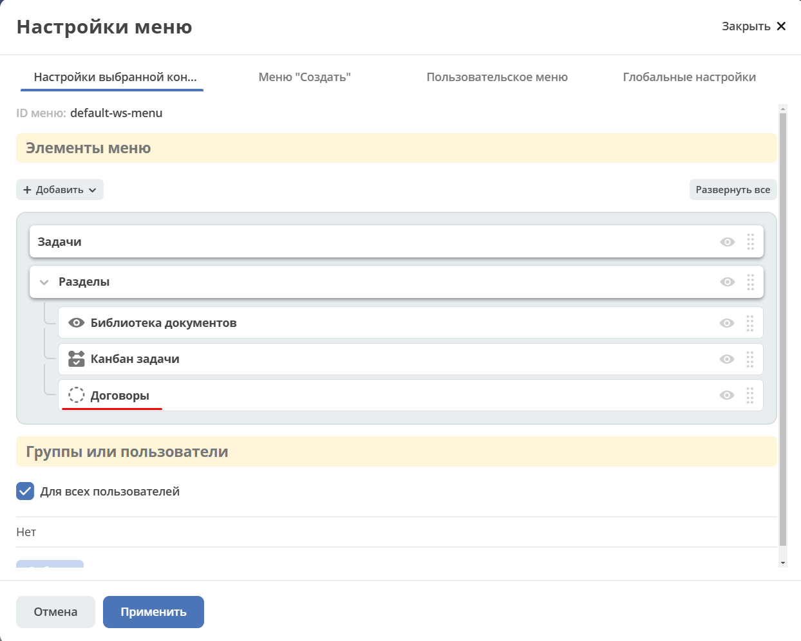

Настройки рабочего пространства
--------------------------------------------------------------

.. _workspace_settings:

Настройка домашней страницы
~~~~~~~~~~~~~~~~~~~~~~~~~~~~~~~~~~~~~~~~~~~~~~~~~~~~~~~~~~~~~~~~

При открытии рабочего пространства отображается дашборд, зависящий от типа пространства:

    -   рабочее пространство по умолчанию — **user-dashboard**;
    -   персональное рабочее пространство — **personal-ws-dashboard-default**;
    -   совместное рабочее пространство — **ws-dashboard-default**.

Для настройки дашборда выберите нужное рабочее пространство: персональное или то, в котором вы являетесь **Менеджером**. Перейдите в **настройки** и выберите **«Настроить страницу»**:

Откроется страница настроек домашней страницы, где можно изменить схему расположения и набор отображаемых виджетов.

В блоке **«Колонки»** выберите количество и расположение колонок — для этого кликните по нужной схеме.

В блоке **«Виджеты»** перетащите необходимые виджеты в колонки домашней страницы.

Для сохранения изменений нажмите **«Применить»** внизу страницы.

Настройка меню
~~~~~~~~~~~~~~~~~~~~~~~~~~~~~~~~~~~

.. _menu_ws_settings:

Выберите нужное рабочее пространство: персональное или то, в котором вы являетесь **Менеджером**. Перейдите в **настройки** и выберите **«Настроить меню»**:

.. image:: _static/09_edit_menu.png
       :width: 700
       :align: center

Доступно добавление раздела **(1)** и элементов внутри раздела **(2)**:

См. подробно о каждом :ref:`добавляемом элементе<menu_element_types>`.

Пример: добавим в меню журнал «Договоры»:

Обновлённое меню станет доступно для всех участников рабочего пространства.

.. image:: _static/11_ws-menu_02.png
       :width: 700
       :align: center
