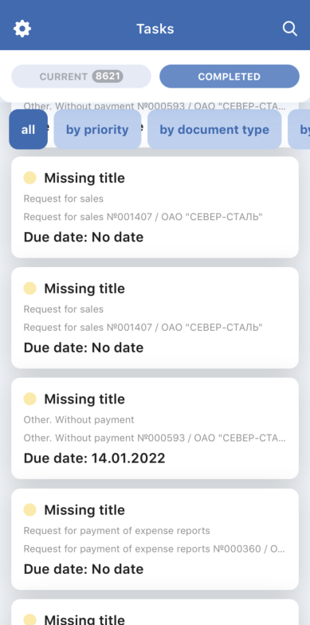
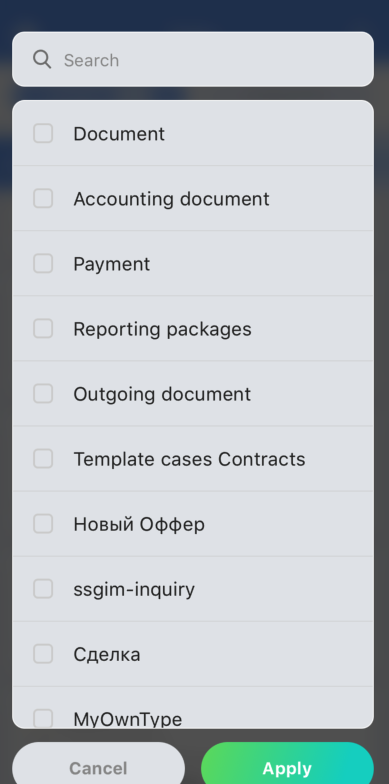
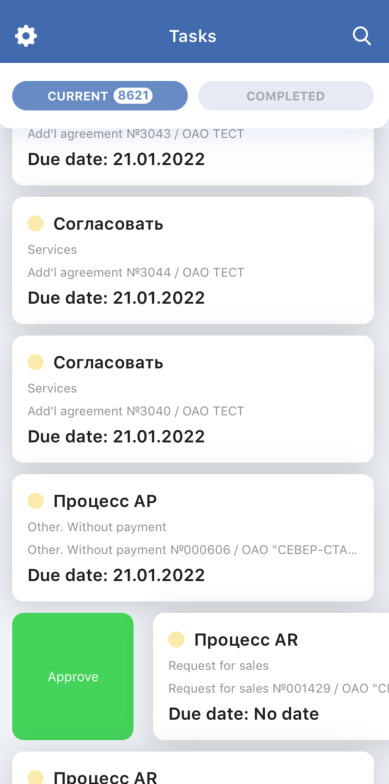
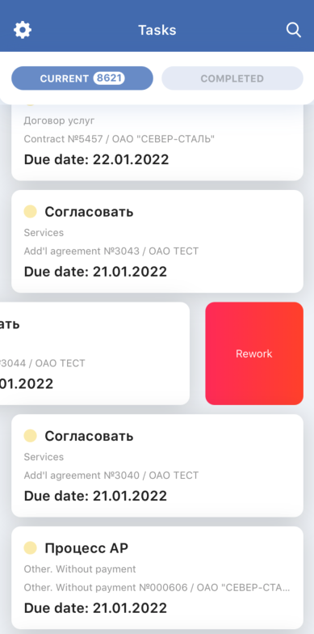
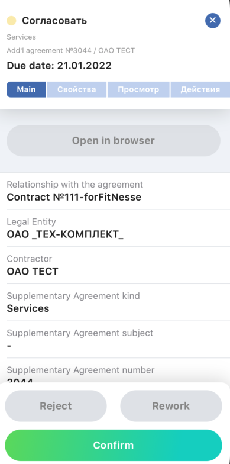
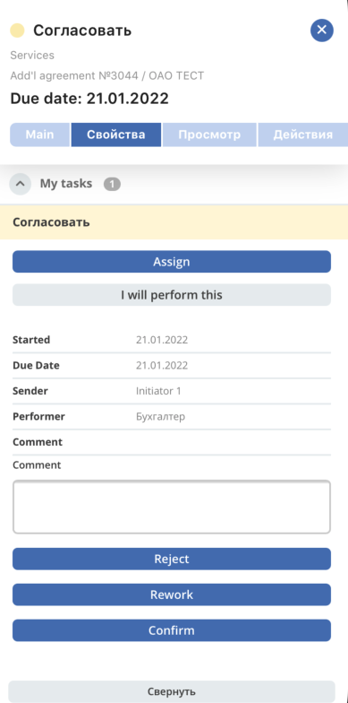
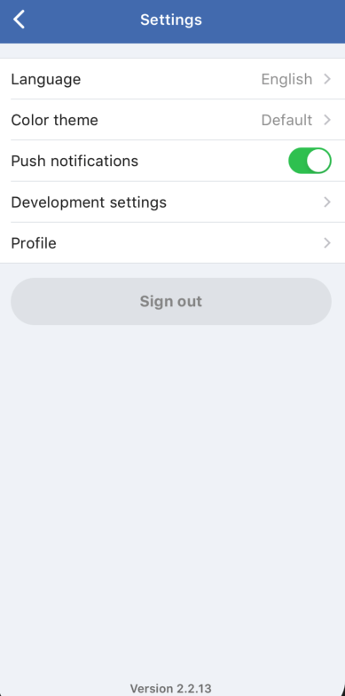
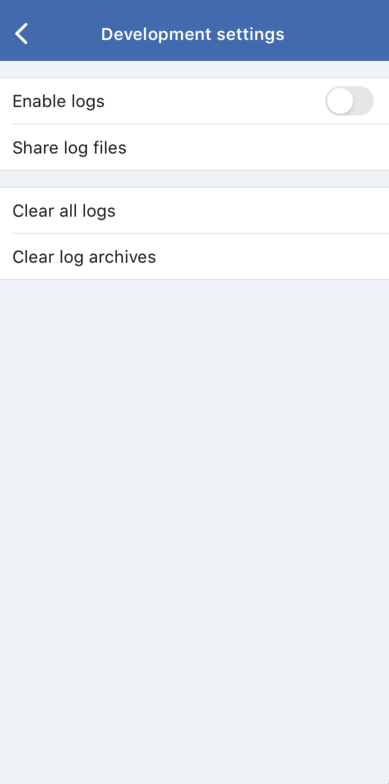
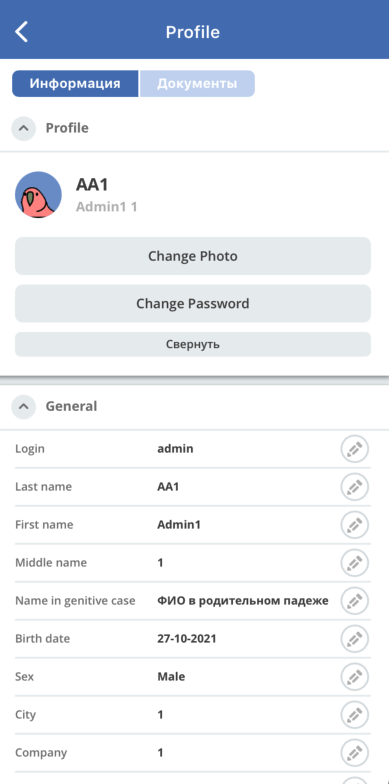

Экраны
=======

Список задач
------------

Текущие
~~~~~~~

.. image:: _static/curent_tasks.png
      :width: 200      
      :align: center
      :alt: Текущие задачи

Получение списка задач
:doc: `API_Получение списка задач.rst`

Завершенные
~~~~~~~~~~~

Получение списка задач
:doc: `API_Получение списка задач`

Фильтры
~~~~~~~

Фильтрация задач
:doc: `API_Фильтры`

Действия с задачами
~~~~~~~~~~~~~~~~~~~

Доступные действия определяются при разборе формы на шаге получения списка задач,
содержаться в свойстве с ключем ``footer_panel``

Задача
------

Основная вкладка
~~~~~~~~~~~~~~~~

Элементы главной вкладки формируются при парсинге формы на шаге получения списка задач
:doc: `API_Получение списка задач`

Вкладки WebView
~~~~~~~~~~~~~~~

Получение вкладок задачи
:doc: `API_Вкладки задачи`

Настройки
---------

Язык
~~~~
* локаль передается в заголовках запросов к апи src/services/api.service.ts
* при парсинге форм выбираются лэйблы соответствующие текущей локале
* при регистрации и обновлении токена пуш-уведомлений вместе с токеном передается используемая локаль
  :doc: `Push_уведомления`

Тема приложения
~~~~~~~~~~~~~~~

Текущая выбранная тема сохраняется в локальном хранилище

Пуш уведомления
~~~~~~~~~~~~~~~

Описание рабьоты пуш-уведомлений
:doc: `Push_уведомления`

Параметры разработчика
~~~~~~~~~~~~~~~~~~~~~~

Позволяет включить логирование и поделиться через стандартное меню

Профиль
~~~~~~~

Получение вкладок профиля
:doc: `API_Вкладки профиля`