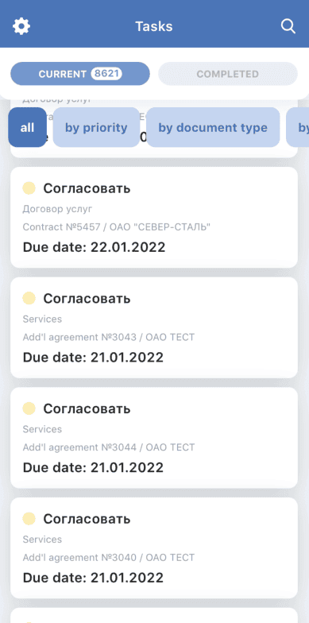
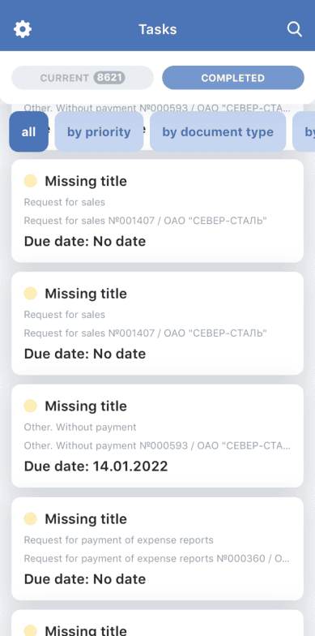
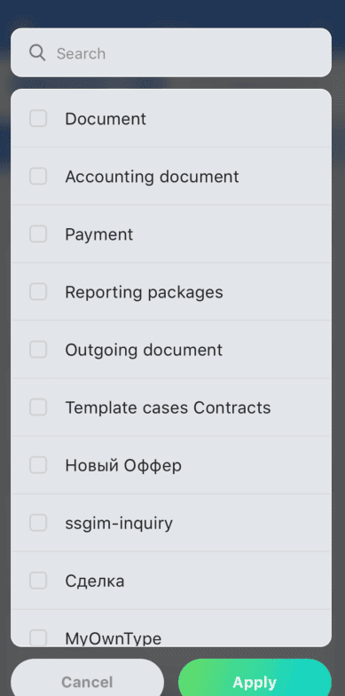
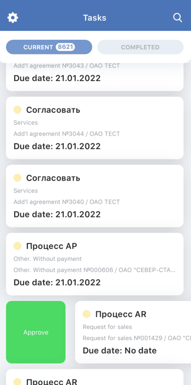
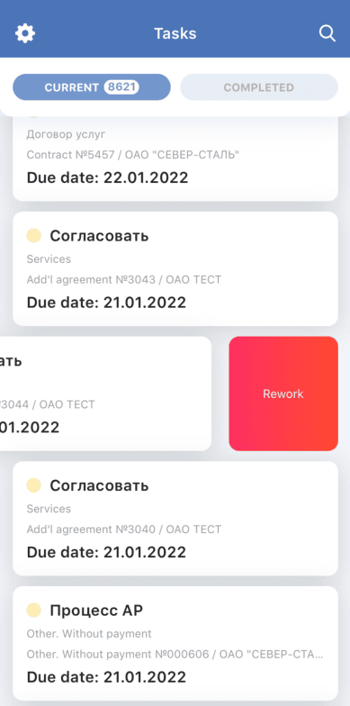
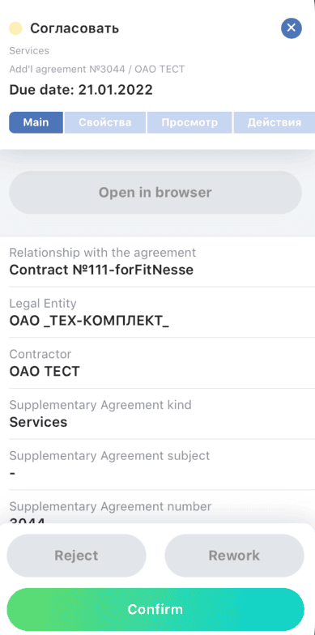
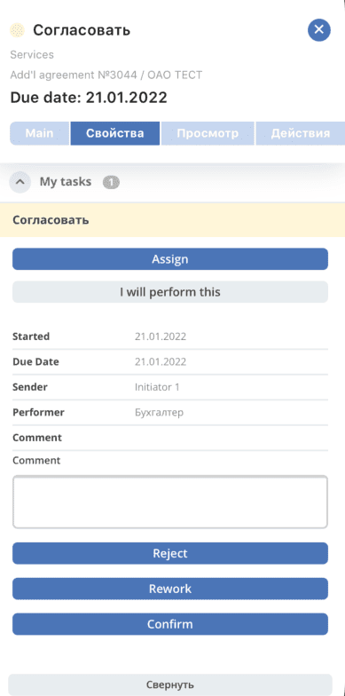
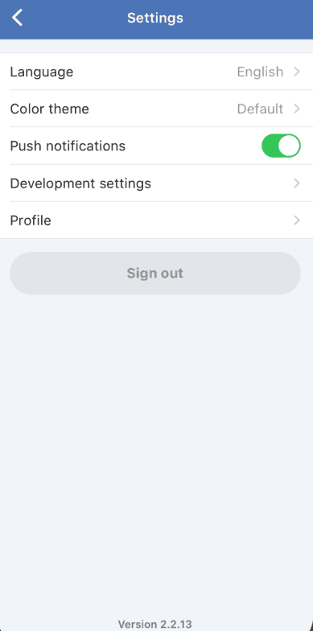
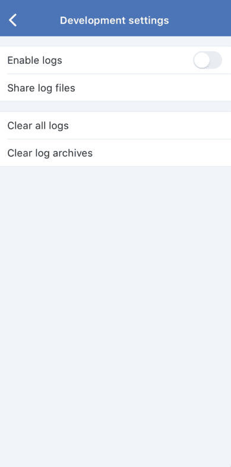
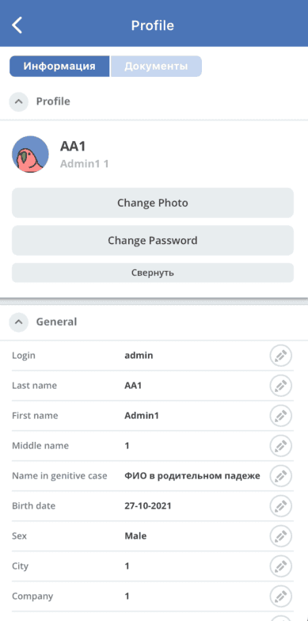

.. _mobile-screens:

Экраны
============

.. _mobile-screens-task-list:

Список задач
------------------------

.. _mobile-screens-current:

Текущие
~~~~~~~~~~~~~~

См. :ref:`mobile-api-task-list`

.. _mobile-screens-completed:

Завершенные
~~~~~~~~~~~~~~~~~~~~~~

См. :ref:`mobile-api-task-list`

.. _mobile-screens-filters:

Фильтры
~~~~~~~~~~~~~~

См. :ref:`mobile-api-filters`

.. _mobile-screens-task-actions:

Действия с задачами
~~~~~~~~~~~~~~~~~~~~~~~~~~~~~~~~~~~~~~

Доступные действия определяются при разборе формы на шаге получения списка задач и содержатся в свойстве с ключом ``footer_panel``.

.. _mobile-screens-task:

Задача
------------

.. _mobile-screens-task-main:

Основная вкладка
~~~~~~~~~~~~~~~~~~~~~~~~~~~~~~~~

Элементы главной вкладки формируются при парсинге формы на шаге получения списка задач. См. :ref:`mobile-api-task-list`

.. _mobile-screens-task-webview:

Вкладки WebView
~~~~~~~~~~~~~~~~~~~~~~~~~~~~~~

Получение вкладок задачи. См. :ref:`mobile-api-task-tabs`

.. _mobile-screens-settings:

Настройки
~~~~~~~~~~~~~~~~~~

.. _mobile-screens-lang:

Язык
~~~~~~~~

* локаль передаётся в заголовках запросов к API ``src/services/api.service.ts``
* при парсинге форм выбираются лейблы, соответствующие текущей локали
* при регистрации и обновлении токена пуш-уведомлений вместе с токеном передаётся используемая локаль

См. :ref:`mobile-push`

.. _mobile-screens-theme:

Тема приложения
~~~~~~~~~~~~~~~~~~~~~~~~~~~~~~

Текущая выбранная тема сохраняется в локальном хранилище.

.. _mobile-screens-push:

Пуш-уведомления
~~~~~~~~~~~~~~~~~~~~~~~~~~~~~~

Описание работы пуш-уведомлений см. :ref:`mobile-push`

.. _mobile-screens-dev:

Параметры разработчика
~~~~~~~~~~~~~~~~~~~~~~~~~~~~~~~~~~~~~~~~~~~~~~~~~~~~~~~~~~~~

Позволяет включить логирование и поделиться им через стандартное меню.

.. _mobile-screens-profile:

Профиль
~~~~~~~~~~~~~~

Получение вкладок профиля. См. :ref:`mobile-api-profile-tabs`
