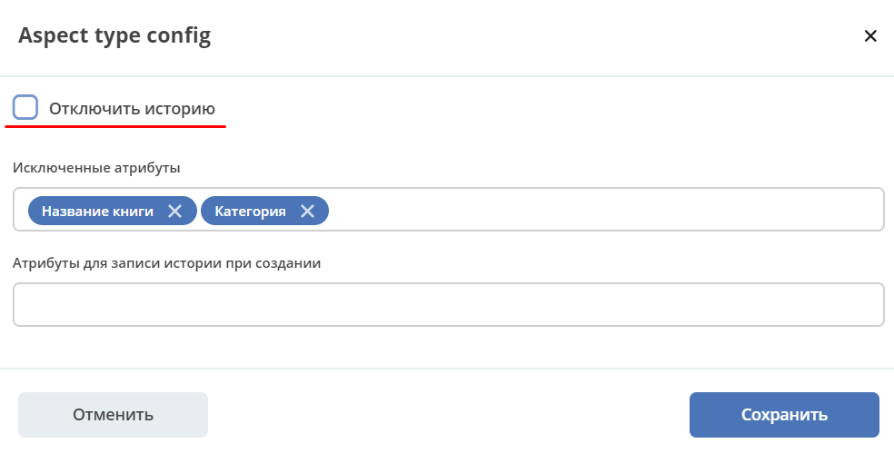

.. _aspects_user:

Аспекты
=========

.. contents::
		:depth: 3

Аспект  расширяет функционал типа данных без изменения самого типа.

Для просмотра существующих аспектов и их редактирования создан журнал **Аспекты (Раздел администратора - Модель - Аспекты**):

 .. image:: _static/aspects/aspects_1.png
       :width: 600
       :align: center

В журнале администратору с каждой записью доступен стандартный набор действий:

  - редактировать json-файл;
  - редактировать свойства;
  - скачать;
  - удалить.

См. больше информации :ref:`о разработке<aspects>`

Создание нового аспекта
-------------------------

Форма создания нового аспекта состоит из 2 вкладок.

**Вкладка "Основные":**

 .. image:: _static/aspects/aspects_2.png
       :width: 600
       :align: center

.. list-table:: 
      :widths: 10 30 30
      :header-rows: 1
      :align: center
      :class: tight-table 

      * - п/п
        - Наименование
        - Описание
      * - 1
        - **Идентификатор**
        - уникальный идентификатор аспекта
      * - 2
        - **Префикс**
        - | Предназанчен, чтобы различать атрибуты из разных аспектов.
          | Префикс добавляется ко всем атрибутам аспекта по шаблону ``{prefix}:{attribute.id}``. 
          | Таким образом атрибуты могут быть доступны в формах, конфигах действий, мутации записей.
          | Если префикс отдельно не задан, то по умолчанию равен идентификатору.
      * - 3
        - **Название**
        - локализованное наименование
      * - 4
        - **Форма конфигурации**
        - | Функционал позволяет расширять конфигурацию типа, не меняя форму типа.
          | Форма может быть выбрана из ранее созданных или создана.

**Вкладка "Атрибуты":**

 .. image:: _static/aspects/aspects_3.png
       :width: 600
       :align: center

Атрибуты аспекта и системные атрибуты аспекта, которые будут добавлены к сущностям с данным аспектом.

.. list-table:: 
      :widths: 10 30 30 30
      :header-rows: 1
      :align: center
      :class: tight-table 

      * - п/п
        - Наименование
        - Описание
        - Пример заполнения
      * - 1
        - **Id**
        - идентификатор поля, по которому оно будет доступно на форме, в журнале.
        - testAttribute (camelCase)
      * - 2
        - **Имя**
        - имя поля для отображения пользователю.
        - Тестовый атрибут
      * - 3
        - **Тип**
        - тип поля. :ref:`Поддерживаемые типы данных<ecos-model_types>`
        - выбирается из списка предлагаемых. По умолчанию выставляется text.
      * - 4
        - **Множественный**
        - множественный ввод разрешен
        - флаг
      * - 5
        - **Обязательный**
        - поле обязательно к заполнению
        - флаг
      * - 6
        - **Вычисляемые атрибуты**
        - функионал, позволяющий установить выражение-зависимость, позволяющий гибко создавать производные атрибуты :ref:`См. подробно<attribute_rights>`
        - настройка конфигурации в зависимости от типа и сложности вычисления атрибута

В поле ``_aspects`` как и при добавлении любого другого аспекта вносится информация об аспекте.

 .. image:: _static/aspects/aspects_4.png
       :width: 600
       :align: center

.. note::

  Каждый аспект может быть добавлен как явно (во вкладке Аспекты), так и автоматически (см. ниже **Учет времени**)

Примеры
--------

Связан с другим документом
~~~~~~~~~~~~~~~~~~~~~~~~~~~~

Аспект **"Связан с другим документом"** создан для работы виджета **"Связи документа"** (добавение и отображение связей с сущностью ):

 .. image:: _static/aspects/associated_1.png
       :width: 600
       :align: center

В поле ``assoc:associatedWith`` вносится информация о связанных сущностях.

 .. image:: _static/aspects/associated_2.png
       :width: 600
       :align: center

Имеет штрихкод
~~~~~~~~~~~~~~~

.. _barcode_aspect:

Аспект **"Имеет штрихкод"** создан для формирования штрихкода к документу:

 .. image:: _static/aspects/barcode_1.png
       :width: 600
       :align: center

В аспекте нет атрибутов, но есть форма настройки:

 .. image:: _static/aspects/barcode_2.png
       :width: 400
       :align: center

При выборе аспекта в типе данных можно настроить формат штрих-кода и атрибут, из которого брать данные для формирования штрих-кода (по умолчанию номер документа ``_docNum``).

Для реализацции сложной логики - необходимо создать :ref:`вычисляемый атрибут<count_attributes>`, и на основе него добавить аспект и далее брать настройку штрих-кода из атрибута.

Учет времени
~~~~~~~~~~~~~~

.. _time-trackable_aspect:

Аспект **"Учет времени"** создает записи о потраченном времени по задаче:

 .. image:: _static/aspects/time_trackable_1.png
       :width: 600
       :align: center

В аспекте есть атрибут ``timeTracking`` - запись о потраченном времени:

 .. image:: _static/aspects/time_trackable_2.png
       :width: 500
       :align: center

Отражается в виде дочерней ассоциации: ``time-trackable:timeTracking``:

 .. image:: _static/aspects/time_trackable_3.png
       :width: 500
       :align: center

При таком выборе атрибут аспекта является дочерней ассоциацией.

Следовательно, по сущности ``timeTracking`` можно перейти к родителю. В атрибуте ``timeTracking``, соответственно, содержатся ссылки на все дочерние сущности. 

Таким образом образуется двухсторонняя связь: 

  - от дочернего к родителю по системному атрибуту ``_parent``, 
  - от родителя к дочернему по настроенному атрибуту.

Если удаляется родитель, то удаляются дочерние сущности по всем ассоциациям. 

Если заданы права по умолчанию, то дочерние наследуют права от родителей. Соответственно, просматривать ``timeTracking`` могут все, у кого доступ к документу.

При создании ``timeTracking``- сущности доступны  2 атрибута, которые позволяют сделать связь с родителем:

.. code-block::

  _parent?str: "emodel/type@document"  //Заявка, с которой мы связываем родителя.
  _parentAtt?str: "time-trackable:timeTracking"  //Атрибут от родителя к дочерней сущности, куда его нужно добавить.

Конфигурация истории
~~~~~~~~~~~~~~~~~~~~~~~

.. _history-config_aspect:

Аспект **«Конфигурация истории»** создан для возможности конфигурации записи свойств в историю.

.. list-table::
      :widths: 20 20
      :align: center

      * - |

            .. image:: _static/aspects/history-config_08.png
                  :width: 600
                  :align: center

        - |

            .. image:: _static/aspects/history-config_07.png
                  :width: 600
                  :align: center

Для настройки необходимо добавить этот аспект в тип данных на вкладке **Аспекты**:

 .. image:: _static/aspects/history-config_01.png
       :width: 600
       :align: center

Исключенные атрибуты
"""""""""""""""""""""

По кнопке **Настроить** в строке **Исключенные атрибуты** доступен выбор атрибутов типа данных, информация об изменении которых не будет записываться в **историю**, и отражаться в виджете **«История событий»**, соответственно.

.. list-table::
      :widths: 20 20
      :align: center

      * - |

            .. image:: _static/aspects/history-config_02.png
                  :width: 400
                  :align: center

        - |

            .. image:: _static/aspects/history-config_03.png
                  :width: 400
                  :align: center

Например, если в карточке изменить информацию о наименовании, категории и стоимости, то в виджете **«История событий»** отразится информация только об измененной стоимости:

 .. image:: _static/aspects/history-config_04.png
       :width: 600
       :align: center

Если в типе данных настроены аспекты (например, **Версионные данные**, **Имеет документы**), то атрибуты из них так же можно выбрать: 

.. list-table::
      :widths: 20 20
      :align: center

      * - |

            .. image:: _static/aspects/history-config_09.png
                  :width: 400
                  :align: center

        - |

            .. image:: _static/aspects/history-config_10.png
                  :width: 400
                  :align: center

Атрибуты для записи истории при создании
""""""""""""""""""""""""""""""""""""""""""

По кнопке **Настроить** в строке **Атрибуты для записи истории при создании** доступен выбор атрибутов типа данных, информация о создании которых будет записываться в **историю**, и отражаться в виджете **«История событий»**, соответственно.

.. list-table::
      :widths: 20 20
      :align: center

      * - |

            .. image:: _static/aspects/history-config_12.png
                  :width: 400
                  :align: center

        - |

            .. image:: _static/aspects/history-config_13.png
                  :width: 400
                  :align: center

Например:

 .. image:: _static/aspects/history-config_14.png
       :width: 600
       :align: center

Так же можно вносить атрибуты непосредственно в json:

  - **excludedAtts** - исключенные атрибуты;
  - **onCreationHistoricalAtts** - атрибуты для записи истории при создании

.. list-table::
      :widths: 20 20
      :align: center

      * - |

            .. image:: _static/aspects/history-config_05.png
                  :width: 600
                  :align: center

        - |

            .. image:: _static/aspects/history-config_06.png
                  :width: 600
                  :align: center

Отключить историю
""""""""""""""""""

При выставленном чекбоксе **Отключить историю** при изменении никакие данные не будут записываться в **историю**, и отражаться в виджете **«История событий»**, соответственно.