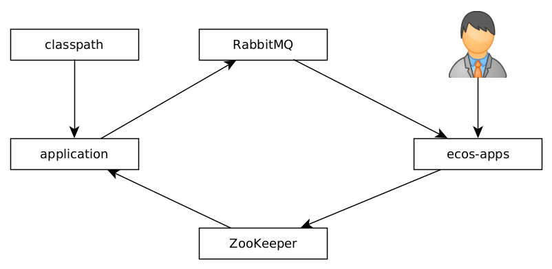

Конфигурация (rc4)
===================

Конфигурация в ECOS делится на два основных уровня:

1. Системный уровень
2. Уровень администратора

Системный уровень
~~~~~~~~~~~~~~~~~

Данный уровень конфигурации необходим для настройки низкоуровневых параметров, которые не предполагается изменять
в ходе работы приложеня (параметры подключение к БД, настройки для включения/отключения сервисов в приложении и др).

Конфигурация системного уровня настраивается средствами Spring Cloud - https://spring.io/projects/spring-cloud

Контейнер ecos-registry при старте загружает конфигурацию из указанных в настройках 
директорий и распространяет эту конфигурацию по всем приложениям.

Настройка ecos-registry через переменные среды::

  - SPRING_CLOUD_CONFIG_SERVER_COMPOSITE_0_TYPE=native
  - SPRING_CLOUD_CONFIG_SERVER_COMPOSITE_0_SEARCH_LOCATIONS=file:/central-config/

Путь во втором параметре указывает на место, откуда будет загружаться конфигурация

Уровень администратора
~~~~~~~~~~~~~~~~~~~~~~

Если настройка предполагается к изменению администратором системы через интерфейс, то это уровень администратора.

Для добавления новой конфигурации в проекте размещается файл config-name.yml по пути eapps/artifacts/app/config следующего содержания::

  id: some-config-id
  name:
    ru: Русское наименование конфигурации
    en: English name of configuration
  value: 'http://some-url.ru'

После этого конфигурация появится на странице администратора: ``/v2/admin?journalId=ecos-configs&type=JOURNAL``

Чтобы воспользоваться этой конфигурацией в коде мы можем установить аннотацию @EcosConfig("идентификатор_конфигурации")
на поле или метод, куда нужно поместить значение конфигурации. Любые изменения конфигурации в интерфейсе приведут к
автоматическому обновлению значения поля или вызову метода, который был помечен аннотацией @EcosConfig. Пример::

  @Component
  public class SomeService {
  
    // значение этого поля будет обновляться при изменениях значения конфиугурации в интерфейсе
    @EcosConfig("some-config-id")
    private URL someParamName;
  
    @EcosConfig("other-config-id")
    public void setOtherParamName(URL value) {
       // этот метод будет вызываться каждый раз когда будет меняться значение конфигурации "other-config-id"
    }
  } 

Схема работы:

При старте приложение проверяет наличие конфигурации в ZooKeeper. Если значение конфигурации есть, то используется оно. 
Если значения нету, то загружается значение из classpath (напрямую из файлов в директории eapps/artifacts/app/config).

Когда запускается микросервис ecos-apps, он забирает все файлы конфигураций со всех приложений 
и сохраняет их у себя в БД. При этом микросервис так же записывает значение в ZooKeeper.

Вся работа с просмотром и изменением значений конфигурации в интерфейсе происходит через микросервис ecos-apps. 
При смене значения конфигурации в интерфейсе микросервис обновляет значение в ZooKeeper и на стороне приложений срабатывает
триггер, который приводит к обновлению конфигурации во всех полях и методах с аннотацией @EcosConfig.  

