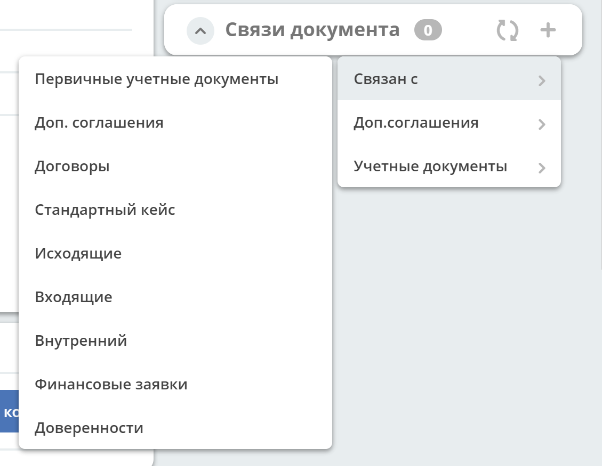

Связи
==========

**Связи (associations)** настраиваются для отображения, добавления и удаления связанных объектов в виджете "Связи"" на карточке объекта.

См. `подробно <https://citeck-ecos.readthedocs.io/ru/latest/settings_kb/interface/widgets.html#id15>`_ 

Связи настраивааются на вкладке :guilabel:`Associations`

.. image:: _static/Associations.png
       :width: 600       
       :align: center

Ссылка на другой тип кейса 
-------------------------------

[Уточнить]

Направление источника
--------------------------

[Уточнить]
