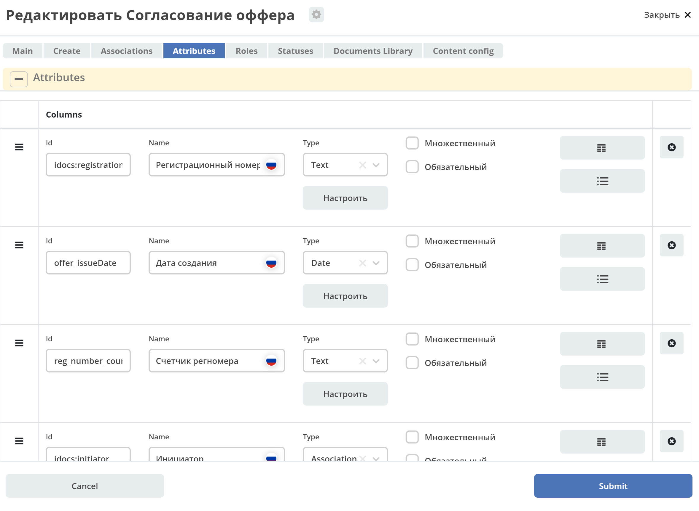
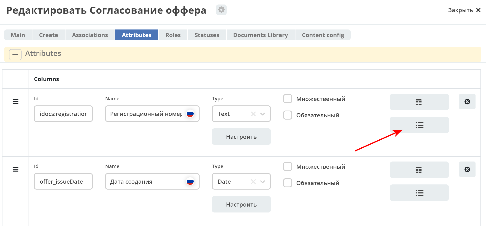
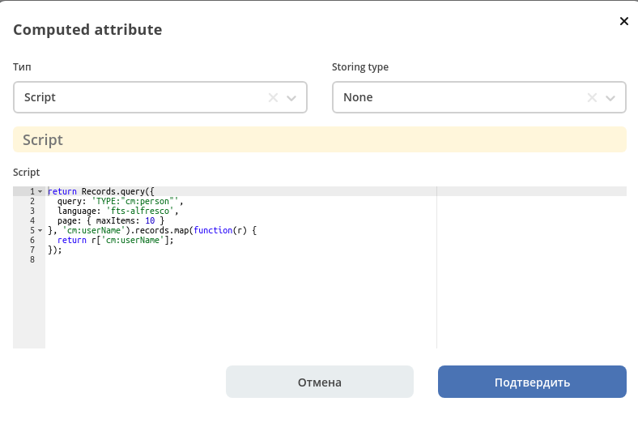
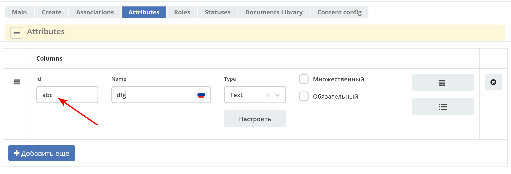
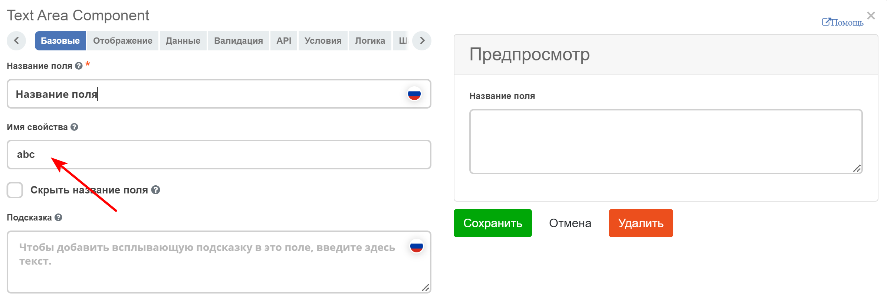
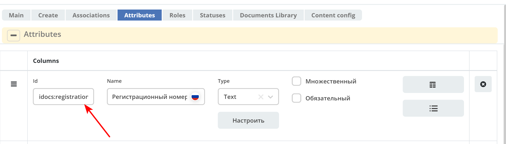
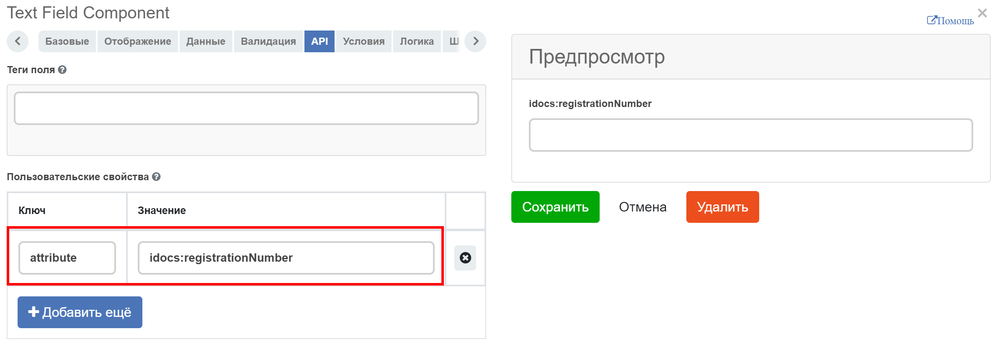

.. _ecos-model_label:

Атрибуты
=========

**Атрибут** - характеристика, определяющая свойства объекта.

При создании/редактировании типа данных атрибуты настраиваются на вкладке :guilabel:`Attributes`.

* **Id** - идентификатор поля, по которому оно будет доступно на форме, в журнале.
* **Name** - имя поля для отображения пользователю.
* **Тип** - тип поля. Поддерживаются следующие типы:
  
    * **Text** - текстовые данные;
    * **MLText** - [Дополнить]
    * **Person** - [Дополнить]
    * **Group** - [Дополнить]
    * **Authority** - [Дополнить]
    * **Association** - связь с другой сущностью;
    * **Number** - число;
    * **Boolean** - булево значение да/нет;
    * **Date** - дата;
    * **DateTime** - дата с временем;
    * **Content** - содержимое. Как правило поля с этим типом используются для сохранения больших объемов данных. Например - содержимое документа. Рекомендуется использовать только если стандартный cm:content не подходит;
    * **JSON** - [Дополнить]
    * **Binary** - [Дополнить]
    
    * **Computed** - настройка динамически вычисляемого атрибута. [Уточнить]

Вычислямеые атрибуты
-----------------------

|

**Тип** - тип вычисляемого атрибута. Поддерживаются:

    * **Script** - вычисление атрибута на основе ``javascript'а``;
    * **Attribute** - вычисление атрибута на основе другого атрибута (можно делать алиас на глубоко вложенный атрибут. Например: ``idocs:counterparty.idocs:fullOrganizationName?str)``;
    * **Value** - константное значение;
    * **Template** - шаблонная строка. Можно использовать вставки вида ${…}. Например: ``${someAttribute?str}``. Вместо данного плейсхолдера будет подставлено значение укзанного атрибута;
    * **Counter** - значение будет генерироваться по счетчику при создании документа и не меняться со временем.
 
**Storing type** - тип сохранения. Определяет, нужно или нет сохранять вычисленное значение и если да, то в какие моменты. Возможные значения:

    * **None** - сохранение не нужно. При каждом обращении вычисляем значение заново;
    * **On empty** - сохранять вычисленное значение только если сохраненное значение отсутствует (т.е. при запросе значения вернулся ``null``);
    * **On create** - сохранять вычисленное значение только после создания. Последующие мутации никак данный атрибут не затронут и он будет работать как обычный атрибут.
    * **On mutate** - сохранять вычисленное значение при каждой мутации. В случае использования **Records API** для изменения записи гарантируется актуальность значения.

Возможности атрибута с типом **script**
~~~~~~~~~~~~~~~~~~~~~~~~~~~~~~~~~~~~~~~

Объекты в глобальной области видимости:

  * **Records** - адаптер для RecordsService;
  * **value** - текущий документ;
  * **log** - логгер.

.. warning:: Прикладных сервисов в контексте скрипта нет.

Описание value::

 Свойства:
 id: String //глобальный идентификатор записи
 localId: String //локальный идентификатор записи

 Методы:

 load(attributes: Any?): Any? // загрузка атрибутов у текущей записи. Можно передавать массив, строку и объект <String, String>

Описание Records::

 Методы:

 get(recordRef: String): AttValueScriptCtx // возвращает объект аналогичный value, который описан выше
 query(query: Object, attributes: Any?) // возвращает объект вида:

 {
  "records": [
    {
      "id": "workspace://...",
      "attribute0": "value0",
      "attribute1": "value1"
    },
    {
      "id": "workspace://...",
      "attribute00": "value00",
      "attribute11": "value11"
    }
  ],
  "totalCount": 123
  "hasMore": true
 }

Использование атрибутов модели на форме
---------------------------------------

Для использование атрибутов на форме нужно, чтобы **Id** атрибута соответствовал значению **Имя свойства** на форме.

* Если в **Id** атрибута двоеточия нет, то параметра **Имя свойства** более чем достаточно.

|

* Если **Id** атрибута содержит двоеточие “:”, то следует на форме использовать :guilabel:`API` → **Пользовательские свойства**.

|

