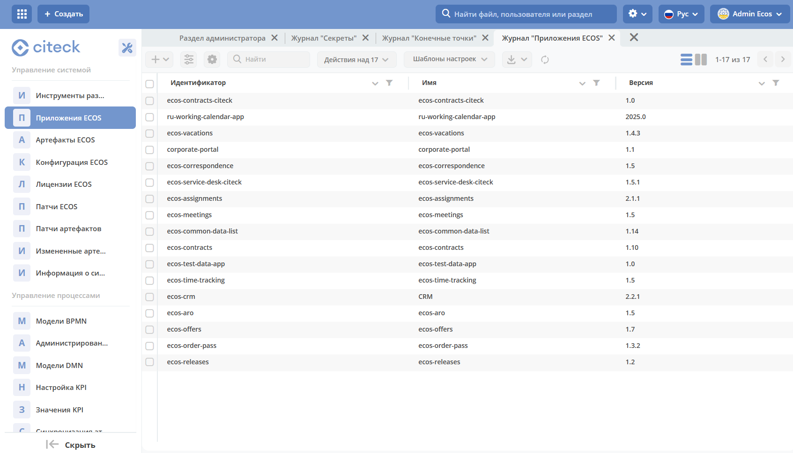
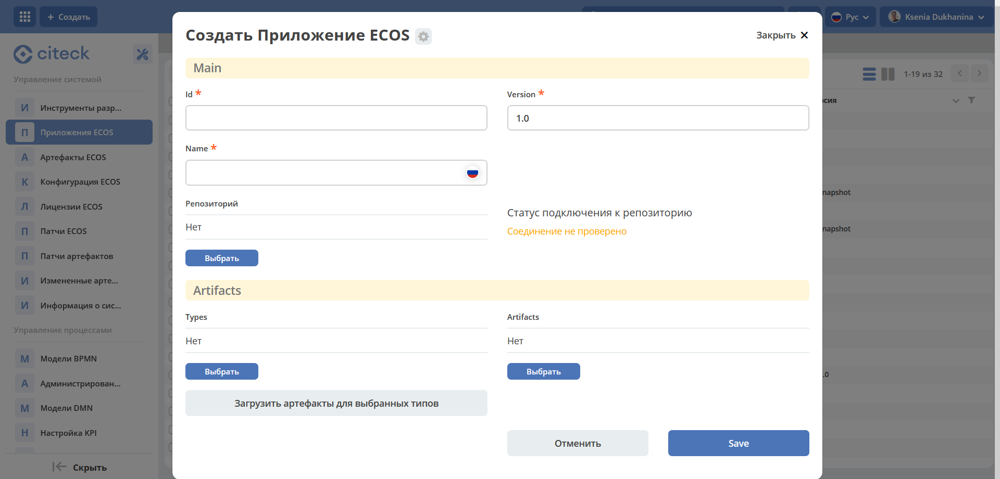
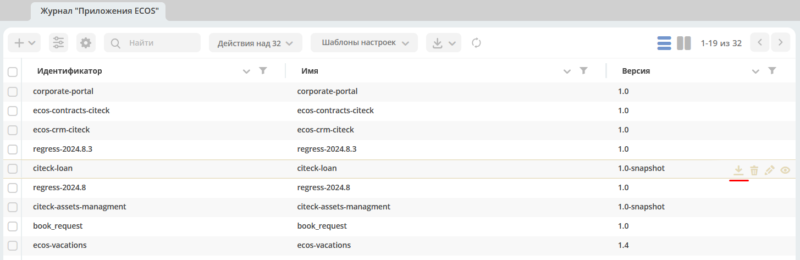
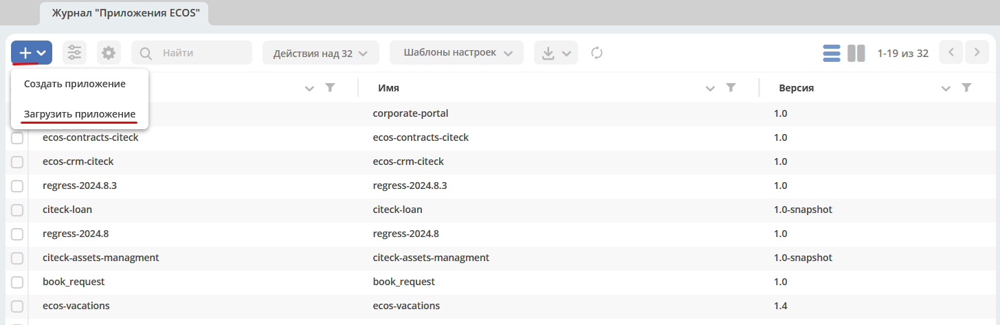
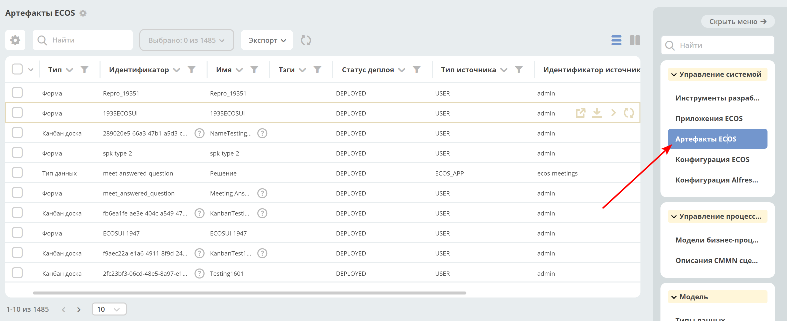
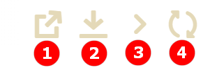
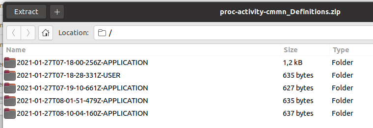

.. _applications:

ECOS Приложения
===============

Определения
--------------

**Артефакт** - единица расширения системы. Примеры артефактов: :guilabel:`Тип`, :guilabel:`Форма`, :guilabel:`Журнал`.

**Приложение ECOS** (ECOS App) - приложение, которое содержит в себе артефакты. 

Основная задача Приложений ECOS - переносимость артефактов между стендами и возможность версионирования. 

ECOS Application является артефактом, но его нельзя включить в другие приложения т.к. это системный тип.

Работа с приложениями 
-----------------------

Работа с приложениями осуществляется на странице администратора системы.

``http://host/v2/bpmn-designer?journalId=ecos-apps``

На этой странице можно:

1. Cоздавать и редактировать приложения.
2. Скачивать приложения.

Перенос данных с одного стенда на другой
------------------------------------------

Перенос данных со стенда на стенд осуществляется через **Приложения ECOS**. Для этого необходимо:

1. Создать приложение по кнопке **+**.

Ввести наименование, выбрать тип данных и автоматически иди вручную добавить соответствующие артефакты.

2. Скачать приложение.

3. Загрузить приложение на необходимом стенде.

Структура архива приложения
----------------------------

::

  meta.json // метаданные приложения
  artifacts: // папка с артефактами приложения
    type0:
      subType0:
        artifact0.json
        artifact1.json
        ...
      subType1:
        artifact0.json
        artifact1.json
        ...
    typ1:
      subType0:
        artifact0.json
        ...
      subType1:
        artifact0.json
        ...
    ...

Артефакты
----------

Для управления артефактами предусмотрен журнал **Артефакты ECOS**. В данный журнал попадают все артефакты, которые достигли микросервиса ``ecos-apps``. 

В данном журнале есть возможность выполнить следующие действия:

**1. Скачать историю артефакта**

* При нажатии на действие можно выбрать дату, с которой необходимо выгрузить историю артефакта.
* При сабмите формы скачивается *zip* архив со всеми версиями артефакта с указанной даты.
* Если последний артефакт был загружен ранее чем выбраная дата, то будет выгружен только он (т.е. всегда будет как минимум 1 артефакт).
* Формат имени папки с версией артефакта: **дата_созданияTвремя_созданияZ-[USER | APPLICATION | ECOS_APP]**. Дата создания указывается в часовом поясе UTC.

**2. Скачать артефакт**

Всегда скачивается *zip* архив с выбранным артефактом.

**3. Передеплоить артефакт вручную**

Отправить артефакт из ``ecos-apps`` в микросервис. Может быть полезно при разработке или после сбоя в базе целевого микросервиса т.е. ``ecos-apps`` не пропускает артефакт если он ранее был успешно задеплоен.

**4. Сбросить пользовательскую версию артефакта**

Сброс происходит до той версии, которая была установлена из приложения (``APPLICATION`` или ``ECOS_APP``). Сбрасывать можно только артефакты, которые в колонке :guilabel:`Тип источника` имеют **USER**.

Источники артефактов
~~~~~~~~~~~~~~~~~~~~

Есть 3 возможных источника артефактов:

1. **USER** - артефакт добавляет или модифицирует пользователь;
2. **APPLICATION** - артефакт загружается из приложений, которые подключены к интерфейсу команд;
3. **ECOS_APP** - артефакт загружается из приложения ECOS;

Обновление артефактов
~~~~~~~~~~~~~~~~~~~~~

Все 3 источника имеют свою политику по обновлению артефактов:

**USER** - Артефакт обновляется безусловно. Любое изменение артефакта приводит к его изменению в базе микросервиса ``ecos-apps``.

**APPLICATION** - Артефакт обновляется если он не принадлежит никакому приложению ECOS и была загружена версия артефакта, которая отличается от предыдущей загруженной из ``APPLICATION``. Пример: Если у нас есть следующие ревизии артефакта:

- **rev2** USER
- **rev1** USER
- **rev0** APPLICATION

То **rev0** - самая первая версия артефакта, а **rec2** - самая последняя версия артефакта. Мы видим, что первая версия артефакта поступила из приложения, а другие две от пользователя.

Если в такой ситуации в микросервис приходит версия **rev0** от APPLICATION, то ничего не поменяется не смотря на то что **rev2** != **rev0**.

Если из приложения придет **rev3**, то новая ревизия загрузится и станет актуальной:

- **rev3** APPLICATION
- **rev2** USER
- **rev1** USER
- **rev0** APPLICATION

**ECOS_APP** - обновляется аналогично APPLICATION, но при загрузке артефакту проставляется признак принадлежности приложению. Если артефакт принадлежит приложению, то он не обновляется из APPLICATION.

Создание ECOS Apps проекта
---------------------------

Для создания ECOS Apps проекта нужно создать новый maven проект и настроить главный **pom файл** следующим образом:

.. code-block::

  <?xml version="1.0" encoding="UTF-8"?>
  <project xmlns="http://maven.apache.org/POM/4.0.0"
          xmlns:xsi="http://www.w3.org/2001/XMLSchema-instance"
          xsi:schemaLocation="http://maven.apache.org/POM/4.0.0 http://maven.apache.org/xsd/maven-4.0.0.xsd">

      <modelVersion>4.0.0</modelVersion>

      <groupId>ru.citeck.ecos.eapps.meetings</groupId>
      <artifactId>ecos-meetings</artifactId>
      <version>1.0.0-SNAPSHOT</version>

      <parent>
          <groupId>ru.citeck.ecos.eapps.project</groupId>
          <artifactId>ecos-apps-simple-parent</artifactId>
          <version>1.0.2</version>
      </parent>

      <repositories>
          <repository>
              <id>citeck-public</id>
              <url>https://nexus.citeck.ru/repository/maven-public</url>
          </repository>
      </repositories>

  </project>

Приложения можно расположить двумя способами:

``src/main/resources/app`` - для варианта когда приложение у нас одно

``src/main/resources/apps/[app0,app1,…]`` - для варианта когда приложений несколько

В корне приложения нужно разместить файл **meta.yml**, в котором можно указать:

* **id: String** - идентификатор приложения. По умолчанию равен artifactId проекта
* **name: MLText** - имя приложения

Если файл **meta.yml** отсутствует, то он будет сгенерирован автоматически.

При сборке приложений получается набор zip-архивов, каждый из которых представляет из себя отдельное приложение.

Деплой
~~~~~~~

Есть два основных способа деплоя - ручной и автоматический.

Ручной деплой
""""""""""""""""""
При ручном деплое мы можем собрать приложения командой `mvn clean package` и загрузить нужный архив из папки ``target/classes/app``s через журнал приложений, который доступен по ссылке ``/v2/admin?journalId=ecos-apps&type=JOURNAL``

Автоматический деплой
""""""""""""""""""""""

Автоматический деплой осуществляется через механизм загрузки артефактов в микросервисе **ecos-apps**. Артефакты доставляются в виде docker образа.

Команда для сборки docker образа: 

.. code-block::

  mvn clean package jib:dockerBuild -Djib.docker.image.tag=1.0.0-snapshot 

где **1.0.0-snapshot** - это тэг для итогового образа.

После сборки образа мы подключаем его там, где развернут микросервис **ecos-apps**:

.. code-block::

  ecos-meetings-ecos-apps:
    container_name: ecos-meetings-ecos-apps
    image: nexus.citeck.ru/ecos-meetings:1.0.0-snapshot
    environment:
      - ECOS_APPS_TARGET_DIR=/run/ecos-apps
    volumes:
      - ./volumes/ecos-apps:/run/ecos-apps

Параметр **ECOS_APPS_TARGET_DIR** - это папка, в которую будут скопированы все приложения, которые лежат внутри образа. Копирование происходит с помощью shell скрипта. По завершении копирования приложений ECOS образ сразу же останавливается т.к. на этом его работа заканчивается.

Далее нам нужно подключить папку с артефактами (``./volumes/ecos-apps``) как volume в микросервис ecos-apps:

.. code-block::

  eapps-app-dev:
    container_name: eapps-app-dev
    image: nexus.citeck.ru/ecos-apps:2.6.0-snapshot
    ports:
      - 8089:8089
    environment:
      ...остальные_env_переменные...
      - ECOS_WEBAPP_EAPPS_ADDITIONAL_ARTIFACTS_LOCATIONS=/run/ecos-artifacts
    volumes:
      - ./volumes/ecos-apps:/run/ecos-artifacts/app/ecosapp

В env переменной мы передаем конфигурацию  **ECOS_WEBAPP_EAPPS_ADDITIONAL_ARTIFACTS_LOCATIONS**, которая указывает на дополнительные папки, из которых нужно загрузить артефакты (приложение ECOS тоже является артефактами с типом **app/ecosapp**).

Нашу папку с архивами мы должны подключить как volume в директорию ``$ECOS_WEBAPP_EAPPS_ADDITIONAL_ARTIFACTS_LOCATIONS/app/ecosapp``

При запуске микросервиса **ecos-apps** он начинает следить за директориями, которые указаны в **ECOS_WEBAPP_EAPPS_ADDITIONAL_ARTIFACTS_LOCATIONS**, и если приложения, которые там находятся изменяются, то микросервис автоматически их загружает к себе в БД и деплоит оттуда артефакты.
