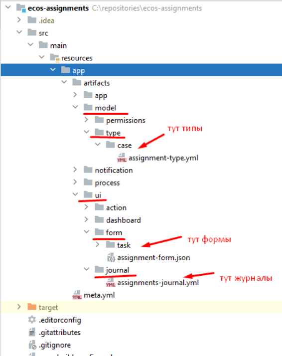
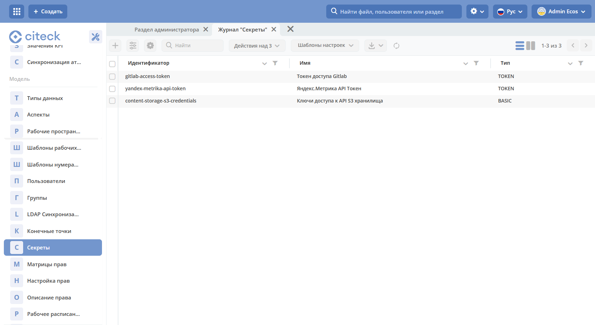
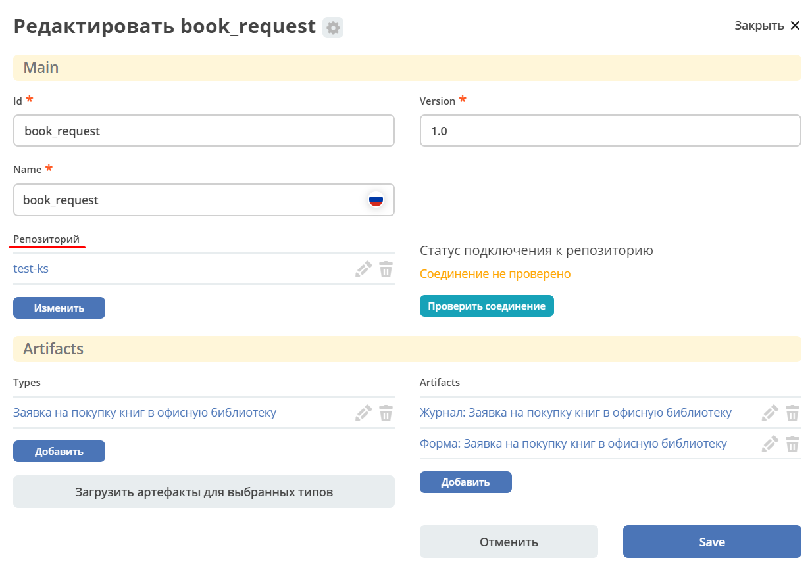

.. _applications:

Приложения Citeck 
====================

.. contents::
		:depth: 3

Определения
--------------

**Приложение Citeck** (ECOS App) - приложение, которое содержит в себе :ref:`артефакты<ecos_artifacts>` (единицы расширения системы). Примеры артефактов: :guilabel:`Тип`, :guilabel:`Форма`, :guilabel:`Журнал`.

Приложение Citeck представляет собой zip-архив с мета информацией (id, name, dependencies, version) и модулями (form, journal, menu, credentials, datasource, …).

Основная задача приложений Citeck - переносимость артефактов между стендами и возможность версионирования. 

**ECOS Application** сам является артефактом, но его нельзя включить в другие приложения т.к. это системный тип.

Работа с приложениями 
-----------------------

Работа с приложениями осуществляется в журнале **"Приложения ECOS" (Рабочее пространство "Раздел администратора" - Управление системой)** :

Журнал доступен по адресу: ``v2/admin?journalId=ecos-apps&type=JOURNAL``

На этой странице можно:

  1. Cоздавать и редактировать приложения.
  2. Скачивать приложения.

Перенос данных с одного стенда на другой
------------------------------------------

Перенос данных со стенда на стенд осуществляется через **Приложения ECOS**. Для этого необходимо:

1. Создать приложение по кнопке **+**.

.. image:: _static/apps/new_app.png
       :width: 700       
       :align: center
       :alt: Создать приложение

Ввести наименование, выбрать тип данных и автоматически иди вручную добавить соответствующие артефакты. 

2. Скачать приложение.

3. Загрузить приложение на необходимом стенде.

См. подробней :ref:`пример<app_example>`

Структура архива приложения
----------------------------

::

  meta.json // метаданные приложения
  artifacts: // папка с артефактами приложения
    type0:
      subType0:
        artifact0.json
        artifact1.json
        ...
      subType1:
        artifact0.json
        artifact1.json
        ...
    typ1:
      subType0:
        artifact0.json
        ...
      subType1:
        artifact0.json
        ...
    ...

Создание ECOS Apps проекта
-----------------------------

.. _app_project:

Для создания ECOS Apps проекта нужно создать новый **maven проект** и настроить главный **pom файл** следующим образом:

.. code-block::

  <?xml version="1.0" encoding="UTF-8"?>
  <project xmlns="http://maven.apache.org/POM/4.0.0"
          xmlns:xsi="http://www.w3.org/2001/XMLSchema-instance"
          xsi:schemaLocation="http://maven.apache.org/POM/4.0.0 http://maven.apache.org/xsd/maven-4.0.0.xsd">

      <modelVersion>4.0.0</modelVersion>

      <groupId>ru.citeck.ecos.eapps.assignments</groupId>
      <artifactId>ecos-assignments</artifactId>
      <version>1.0.0-snapshot</version>

      <parent>
          <groupId>ru.citeck.ecos.eapps.project</groupId>
          <artifactId>ecos-apps-simple-parent</artifactId>
          <version>1.0.3</version>
      </parent>

      <repositories>
          <repository>
              <id>citeck-public</id>
              <url>https://nexus.citeck.ru/repository/maven-public</url>
          </repository>
      </repositories>

  </project>

Приложения можно расположить двумя способами:

``src/main/resources/app`` - для варианта, когда приложение одно

``src/main/resources/apps/[app0,app1,…]`` - для варианта, когда приложений несколько

В корне приложения нужно разместить файл **meta.yml**, в котором можно указать:

.. code-block::

  id: ecos-assignments

* **id: String** - идентификатор приложения. По умолчанию равен artifactId проекта
* **name: MLText** - имя приложения

Если файл **meta.yml** отсутствует, то он будет сгенерирован автоматически.

При сборке приложений получается набор **zip-архивов**, каждый из которых представляет из себя отдельное приложение.

Деплой
~~~~~~~

Есть два основных способа деплоя - ручной и автоматический.

Ручной деплой
""""""""""""""

.. _manual_deploy:

При ручном деплое мы можем собрать приложения командой: 

.. code-block::

 mvn clean package

и загрузить нужный архив из папки ``target/classes/apps`` 

.. image:: _static/apps/zip_arch.png
       :width: 400       
       :align: center

через журнал приложений, который доступен по ссылке ``/v2/admin?journalId=ecos-apps&type=JOURNAL``

Автоматический деплой
""""""""""""""""""""""

.. _auto_deploy:

Автоматический деплой осуществляется через механизм загрузки артефактов в микросервисе **ecos-apps**. Артефакты доставляются в виде docker образа.

Команда для сборки docker образа: 

.. code-block::

  mvn clean package jib:dockerBuild -Djib.docker.image.tag=1.0.0-snapshot 

где **1.0.0-snapshot** - это тег для итогового образа.

После сборки образа мы подключаем его там, где развернут микросервис **ecos-apps**:

.. code-block::

  ecos-assignments-ecos-apps:
    container_name: ecos-assignments-ecos-apps
    image: nexus.citeck.ru/ecos-assignments:1.0.0-snapshot
    environment:
      - ECOS_APPS_TARGET_DIR=/run/ecos-apps
    volumes:
      - ./volumes/ecos-apps:/run/ecos-apps

Параметр **ECOS_APPS_TARGET_DIR** - папка, в которую будут скопированы все приложения, которые лежат внутри образа. Копирование происходит с помощью shell скрипта. По завершении копирования приложений Citeck образ сразу же останавливается т.к. на этом его работа заканчивается.

Далее нам нужно подключить папку с артефактами (``./volumes/ecos-apps``) как volume в микросервис ecos-apps:

.. code-block::

  eapps-app-dev:
    container_name: eapps-app-dev
    image: nexus.citeck.ru/ecos-apps:2.6.0-snapshot
    ports:
      - 8089:8089
    environment:
      ...остальные_env_переменные...
      - ECOS_WEBAPP_EAPPS_ADDITIONAL_ARTIFACTS_LOCATIONS=/run/ecos-artifacts
    volumes:
      - ./volumes/ecos-apps:/run/ecos-artifacts/app/ecosapp

В **env** переменной мы передаем конфигурацию  **ECOS_WEBAPP_EAPPS_ADDITIONAL_ARTIFACTS_LOCATIONS**, которая указывает на дополнительные папки, из которых нужно загрузить артефакты (приложение Citeck тоже является артефактами с типом **app/ecosapp**).

Нашу папку с архивами мы должны подключить как **volume** в директорию ``$ECOS_WEBAPP_EAPPS_ADDITIONAL_ARTIFACTS_LOCATIONS/app/ecosapp``

При запуске микросервиса **ecos-apps** он начинает следить за директориями, которые указаны в **ECOS_WEBAPP_EAPPS_ADDITIONAL_ARTIFACTS_LOCATIONS**, и если приложения, которые там находятся изменяются, то микросервис автоматически их загружает к себе в БД и деплоит оттуда артефакты.

Интеграция с Git
-----------------

.. _git_integration:

.. note::

    Доступно только в enterprise версии.

Интеграция с Git позволяет связать приложение Citeck с Git репозиторием и по нажатию на действие **«Зафиксировать изменения в Git»** загрузить изменившиеся артефакты в указанный репозиторий.

Настройка
~~~~~~~~~~~~~~~~~~

1. Открыть журнал **«Секреты»** ``/v2/admin?journalId=ecos-secrets&type=JOURNAL``: 

и создать пару **логин/пароль** (Тип - **Basic**) для доступа к Git репозиторию:

.. note::

  Для получения пароля в Gitlab для своей учетной записи можно сгенерировать `Personal Access Token <https://docs.gitlab.com/ee/user/profile/personal_access_tokens.html>`_  с указанием scopes **read_repository** и **write_repository** для нужных репозиториев. 
  
  При этом на форме создания секрета выбрать тип= Basic, ввести свой логин и вместо своего пароля ввести сгенерированный токен.

2. Открыть журнал **«Конечные точки»** ``/v2/admin?journalId=endpoints&type=JOURNAL``

и добавить **ссылку** на Git репозиторий:

.. note::

  Важно чтобы URL начинался на **https** (поддержка ssh на данный момент отсутствует). 

  URL можно получить, открыв страницу с репозиторием и нажав **Code**. В появившемся окне скопировать **HTTPS URL**.

  .. image:: _static/apps/git_05.png
       :width: 400       
       :align: center

3. Открыть журнал **«Приложения ECOS»** ``/v2/admin?journalId=ecos-apps&type=JOURNAL`` 

.. image:: _static/apps/git_06.png
       :width: 700       
       :align: center

и открыть настройки нужного приложения Citeck. В настройках заполнить поле **«репозиторий»** конечной точкой, которая была создана в **п.2.**

После этого на карточке настроенного приложения Citeck и на карточках его артефактов появится действие **«Зафиксировать изменения в Git»** :

.. list-table::
      :widths: 20 20
      :align: center

      * - |

            .. image:: _static/apps/git_08.png
                  :width: 500
                  :align: center

        - |

            .. image:: _static/apps/git_08_1.png
                  :width: 500
                  :align: center

Проверка соединения
~~~~~~~~~~~~~~~~~~~~

По кнопке **«Проверить соединение»** можно проверить актуальный статус подключения к репозиторию:

.. list-table::
      :widths: 20 20
      :align: center

      * - |

            .. image:: _static/apps/git_09.png
                  :width: 300
                  :align: center

        - |

            .. image:: _static/apps/git_10.png
                  :width: 300
                  :align: center

Действие «Зафиксировать изменения в Git»
~~~~~~~~~~~~~~~~~~~~~~~~~~~~~~~~~~~~~~~~~

Действие для фиксации изменений доступно на карточке приложения Citeck и на карточках его артефактов если у приложения Citeck  настроен **Репозиторий**.

При нажатии на действие появляется следующая форма:

На форме можно выбрать:

 -	либо существующую ветку:

    .. image:: _static/apps/git_12.png
          :width: 500       
          :align: center

 -	либо создать новую:

    .. image:: _static/apps/git_13.png
          :width: 500       
          :align: center

По умолчанию коммиты из Citeck можно делать в ветки, у которых имя начинается на **ecos/**. Это поведение можно изменить в журнале **ECOS конфигураций -> ecos-vcs-allowed-branches-to-commit**

При создании новой ветки в качестве базовой можно выбрать либо ветки, имя которых начинается на **ecos/**, либо стандартные ветки **develop, master, main**. Это поведение можно изменить в журнале **ECOS конфигураций -> ecos-vcs-allowed-base-branches**

Если установить галку **«Создать ветку»**, то пользователю будет предложено указать имя новой ветки и ветку, которую нужно взять за основу. Новая ветка всегда имеет префикс **ecos/**, чтобы исключить случайную порчу артефактов в важных ветках репозитория.

Фиксация в репозитории будет с авторством пользователя, который выполнил действие. При этом фиксация будет выполнена системной учетной записью, которая была настроена для приложения Citeck.

Права на выполнение действия есть только у администраторов ECOS. 

Фиксация изменений не удаляет артефакты из репозитория. Фиксируется только добавление новых артефактов и изменение старых. 

Структура проекта
~~~~~~~~~~~~~~~~~~~~

Если в репозитории не обнаружено базовых файлов структуры проекта из maven архитипа `ecos application <https://gitlab.citeck.ru/citeck-projects/ecos-projects-archetypes>`_ , то они будут добавлены - **настройка pom.xml, gitignore, gitattribute, editorconfig.**

Настройки конфигурации
~~~~~~~~~~~~~~~~~~~~~~~~

Для настройки конфиграции необходимо открыть журнал **«Конфигурация ECOS»** ``v2/admin?journalId=ecos-configs&type=JOURNAL``:

  .. image:: _static/apps/git_15.png
        :width: 700       
        :align: center

- **ecos-vcs-allowed-branches-to-commit**– разрешенные ветки для коммита
- **ecos-vcs-allowed-base-branches** - разрешенные базовые ветки
