Подписание документов электронной подписью
===========================================

.. _esign_settings:

Функционал подписания ЭЦП может быть добавлен к любому типу данных. Для этого были добавлены - специальная настройка виджета **"Свойства"** и действия.

Виджет "Свойства - Электронная подпись"
-----------------------------------------

Для виджета :ref:`Свойства<widget_properties>` добавлена настройка **Электронная подпись**. Для ее ее использования на карточке:

1. :ref:`Добавьте на дашборд<page_settings>` карточки виджет **"Свойства"**. 
 
2. В настройках виджета:

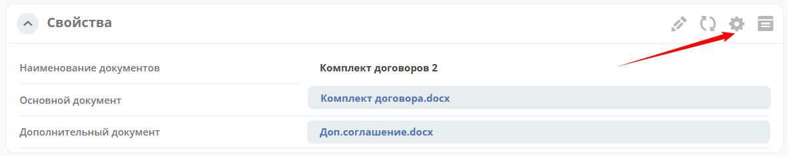

выберите **Электронная подпись**: 

.. list-table::
      :widths: 20 20
      :align: center

      * - |

            .. image:: _static/esign/01.png
                  :width: 400
                  :align: center

        - |

            .. image:: _static/esign/02.png
                  :width: 450
                  :align: center

3. У подписанных ЭЦП документов в карточке буду отображаться данные о сертификате ЭЦП и времени подписания:

.. image:: _static/esign/03.png
       :width: 300
       :align: center 

Действия
-----------

Доступные действия для подписания контента и скачивания подписи: 

1. Действие **Подписать документ** (Базовый контент) - sign-document-content-default
   
  - Доступно, если у документа есть свойство **content** и отсутствует прикрепленная подпись.
  - Формирует подпись на основе выбранного сертификата и контента в атрибуте **content** и прикрепляет к подписываемому документу.

2. Действие **Подписать документ** - sign-document-content
   
   - На текущий момент нет условия для ограничения видимости действия.
   - Действие отображает форму, на которой требуется выбрать атрибут с контентом, который необходимо подписать, затем выбор сертификата, подписывается только выбранный контент, если у типа только один атрибут типа **content**, то выбор атрибута с контентом происходит автоматически.

3. Действие **Скачать подпись** - download-sign-content
   
   - Скрыто по умолчанию, появляется у документа если его контент подписан через Citeck нашей электронной подписью Esign.sign)

Возможность при подписании опционально проверять загруженную в Citeck доверенность
------------------------------------------------------------------------------------

Добавлен конфиг **edi-sign-with-attorney**. Возможные значения (true/false)

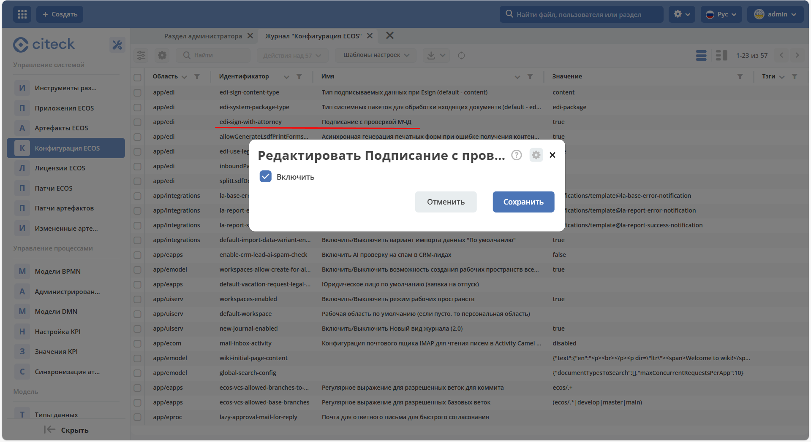

При включении добавляет на действие подписания проверку МЧД.

Проверка МЧД при нажатии на кнопку подписания:

1. МЧД отсутствует или невалидны даты - открывается обычная форма подписи, подписание не блокируется, в виджете нет отметки о МЧД.
2. МЧД найдена, даты валидны - открывается обычная форма подписи, документ подписывается, в виджете появляется отметка о МЧД, без дополнительной информации о доверенности:

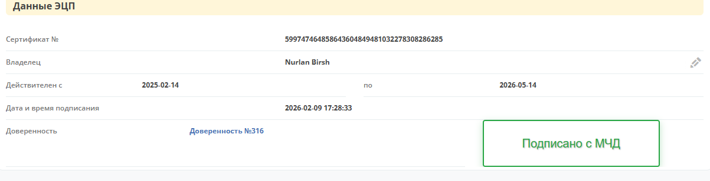

Пример использования действия "Подписать документ"
------------------------------------------------------

1. Создайте :ref:`тип данных<data_types_main>`, добавьте к нему действия - **Подписать документ** и **Скачать подпись**:

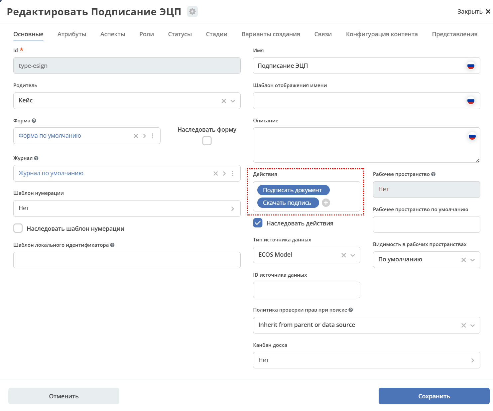

2. На вкладке **"Атрибуты"** укажите два атрибута с типом **content** и сохраните.

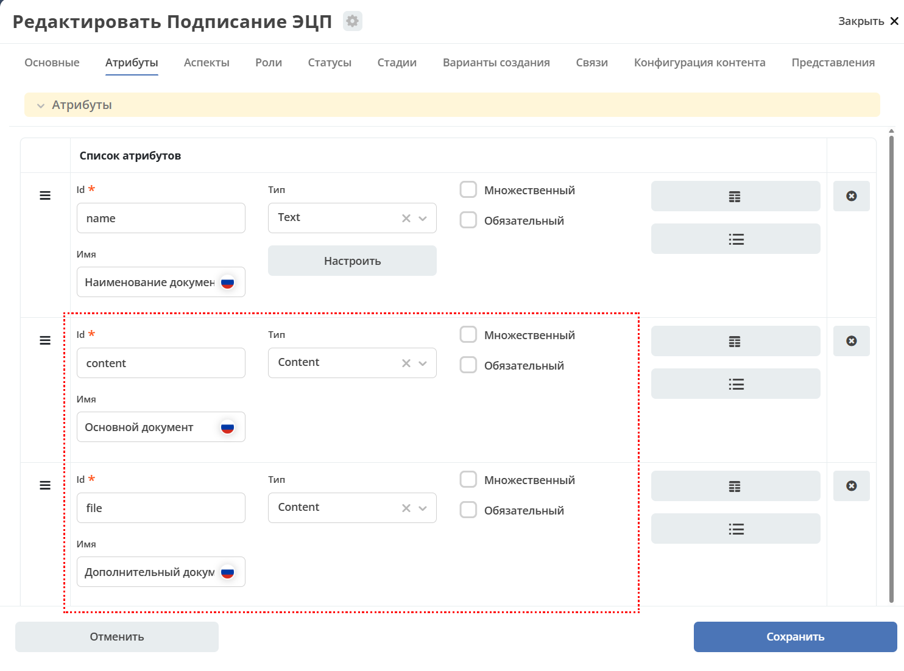

3. :ref:`Добавьте журнал<journal_to_menu>` в меню рабочего пространства. 

4. Создайте карточку:

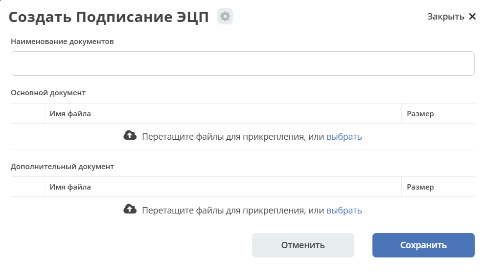

5. Далее настройте дашборд карточки:

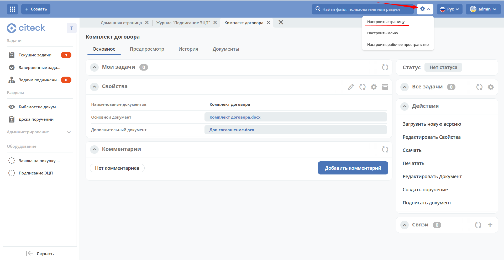

Добавьте виджет **"Свойства" (2)** и примените для созданного типа **(1)**:

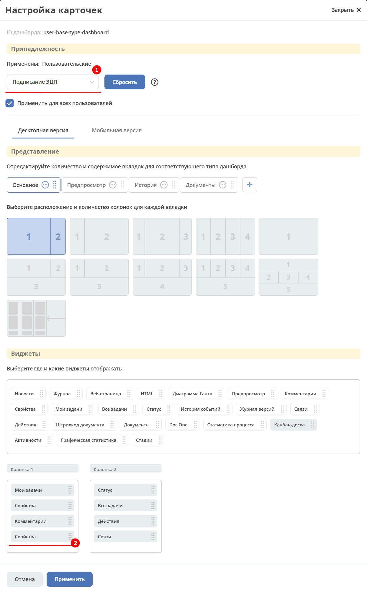

Перейдите в настройки виджета:

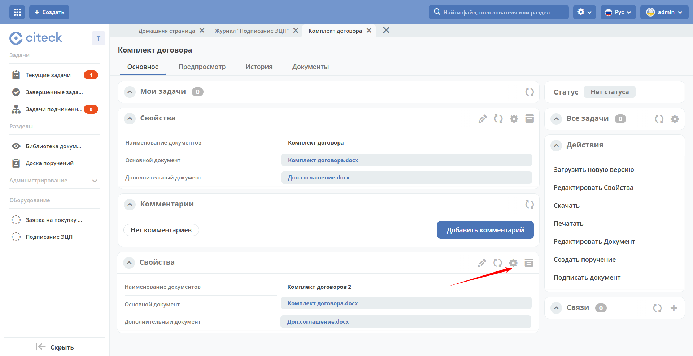

и выберите **Электронная подпись**:

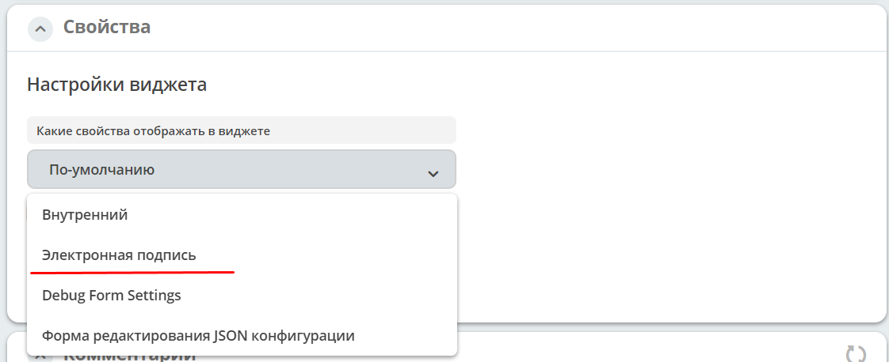

Добавленный в карточку виджет:

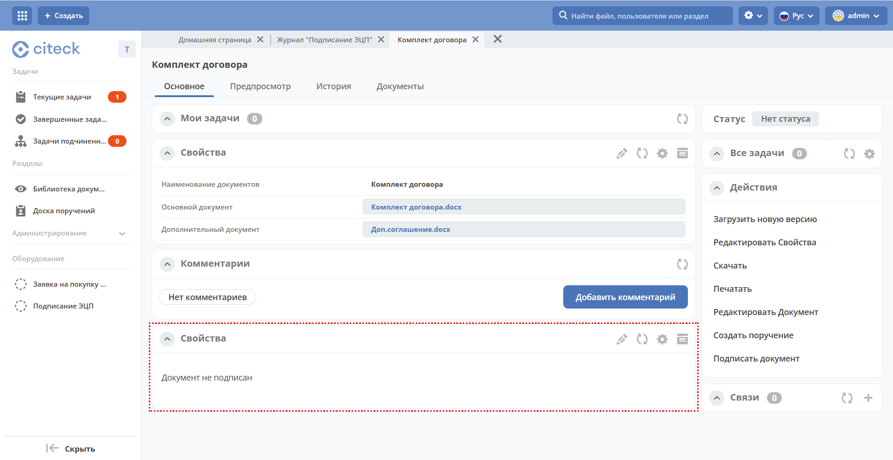

6. Создайте документ. Выберите действие **Подписать документ**, выберите файл:

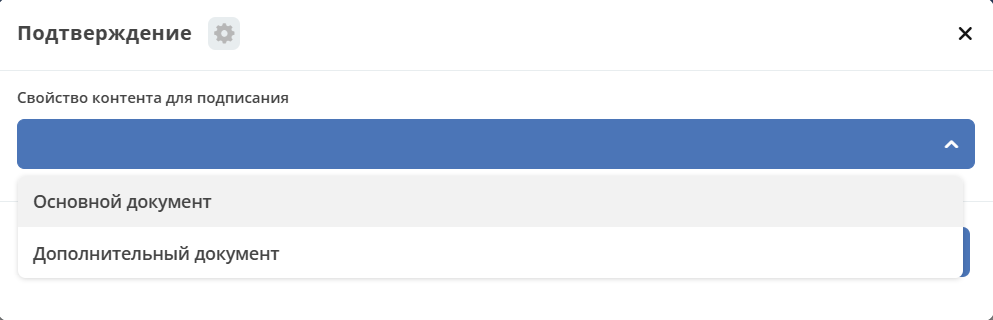

7. В карточке буду отображаться данные о сертификате ЭЦП и времени подписания:
   
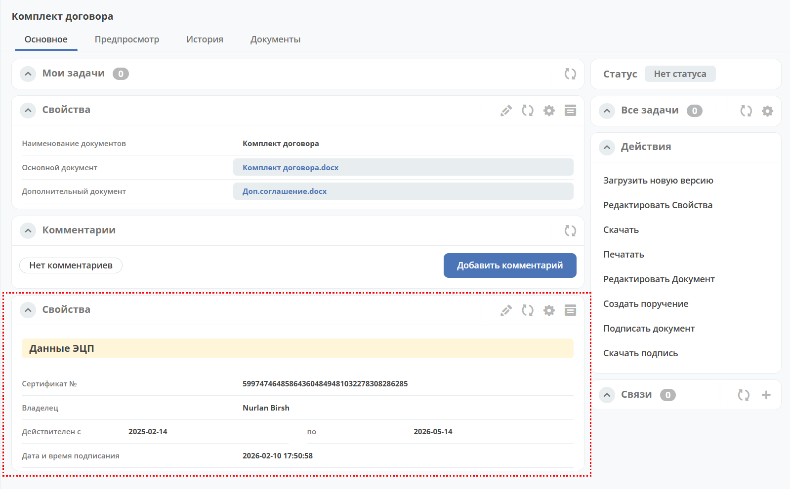

Файл подписи можно скачать, используя действие **Скачать подпись**.