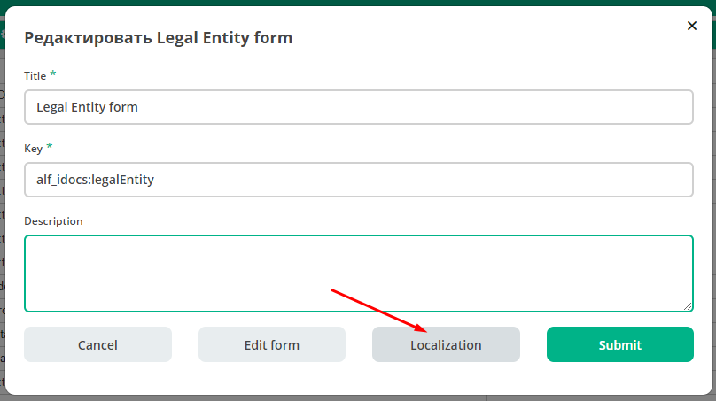
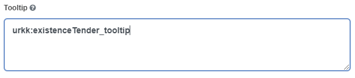

=========
**Формы**
=========

* Новые формы ECOS реализованы на базе движка `formiojs <https://github.com/formio/formio.js>`_.
* Функция редактора форм доступна только в ECOS **Enterprise**.
* Формы описываются в ``json`` формате.
* Формы используются для редактирования записей из **Records Service** (см. ECOS Records). На бэкэнде редактирование записи может восприниматься как создание новой (например если не указан **ID** редактируемой записи).

Существуют две системные формы, которые изменять **не желательно**:

       #. Форма для создания и редактирования других форм. Ключ: ``ECOS_FORM``;
       #. Форма по-умолчанию. Она используется как отправная точка если мы создаем новую форму. Ключ: ``DEFAULT``.

**Атрибут - это собиртельный термин, который относится и к свойству и ассоциации и к дочерней ассоциации и к системным свойствам;**

Связь с типом ECOS
------------------

В типе ECOS предусмотрено поле formRef, которое определяет связь типа с формой. В большинстве случаев этого поля достаточно, но если
для одного типа требуется несколько форм (например, для отображения на дашборде), то в конгфигурации формы предусмотрено поле typeRef.

Связь без типа ECOS
-------------------

В ситуации когда запись не может быть привязана к определенному типу ECOS можно воспользоваться привязкой по ключам. 
Запись должна отдавать атрибут ``_formKey`` и по полученным ключам идет поиск формы до первого совпадения.

Если записи принадлежат одному типу или тип отсутствует, но для некоторых записей должна использоваться определенная форма,
можно реализовать атрибут ``_formRef``. Если этот атрибут вернул ссылку на форму, то она имеет наибольший приоритет.

Связь с атрибутом записи
----------------------------------------------------------

Для простых полей мы можем выставить **Property Name** (1) в соответствии со свойством записи, но если нужно связать с атрибутом, в котором есть спец символы (например ":"), то следует добавить в **Custom Properties** свойство (2) с ключом **attribute** и значением - именем атрибута.

.. image:: _static/Forms_local_0.png
       :align: center
       :alt: Связь с атрибутом записи

Пользовательский модуль
-----------------------
В json описании формы можно добавить поле **customModule**, в котором записать путь до ``javascript`` модуля, который будет создан вместе с формой. В этом модуле можно разместить сложную логику, которую в последствии вызывать из скриптов формы. Для примера см. **ecos-eform-repo/src/main/resources/alfresco/module/ecos-eform-repo/ecos-forms\ecos-form.json**

Если в **customModule** будет метод ``init``, то он будет вызван с текущей формой в аргументах.

Конфигурация ecos-forms-enable
------------------------------
В ECOS конфигурации добавлен параметр **ecos-forms-enable**, который позволяет глобально отключать новые формы для создания нод. По-умолчанию данный параметр включен.

Проверка новых форм
~~~~~~~~~~~~~~~~~~~
Чтобы открыть конкретную форму для редактирования или создания следует в консоли браузера выполнить следующий скрипт::

 Citeck.forms.eform('wftask@activiti$875', {params:{formKey:'DEFAULT'}})

Первый аргумент - **RecordRef**, кототорый будет редактироваться.

Параметр **formKey** - ключ формы, которую следует открыть.

Создание формы с нуля
---------------------

Служебные данные формы
----------------------

Form Builder
------------

Компоненты формы
~~~~~~~~~~~~~~~~

API
~~~~~

Display (Отображение на форме)
~~~~~~~~~~~~~~~~~~~~~~~~~~~~~~~

Validation (Связь с моделью)
~~~~~~~~~~~~~~~~~~~~~~~~~~~~~~~~~~~~

Условия отображения
~~~~~~~~~~~~~~~~~~~~~~~

Logic
~~~~~~~~~~

Layout (Отображение в HTML?)
~~~~~~~~~~~~~~~~~~~~~~~~~~~~~

Локализация
------------
Все **Label** у полей на форме перед рендером проходят через этап локализации. Если ключа локализации не найдено, то рендерится строка, которая записана в поле **Label** у поля.

Локализация в новых формах может быть в 4 видах:

**1. Глобальная локализация**
   
Вся локализация, которая имеет префикс **ecos.forms**. попадает в новые формы. Например **ecos.forms.someTitle="123"** попадет в формы в виде: **{"someTitle":"123"}**.

На момент 16.05.19 в качестве глобальной локализации используется локализация из ``site-messages/*.properties`` файлов ``*-share`` модулей.

**2. Локализация атрибутов**

Если **Label** у поля совпадает с редактируемым атрибутом, то происходит запрос на сервер за заголовком для такого поля. Если заголовок найден, то поле будет локализовано.

.. image:: _static/Forms_local_1.png
       :align: center
       :alt: Локализация атрибутов

**3. Локализация формы**

В ``json`` конфигурации формы можно задать локализацию, которая будет действовать только в пределах данной формы. Пример:

Такой вариант подходит, если требуется добавить пользовательскую локализацию для сообщений об ошибке, подсказок и т. д. Чтобы установить локализацию, необходимо перейти на форму :guilabel:`Localization` и поместить свою локализацию туда. После чего её можно будет использовать на самой форме по ключу. Для именования ключей лучше всего использовать символы латиницы.

*Пример локализации панели*:
Чтобы установить локализацию для панелей (:guilabel:`Layouts` -> :guilabel:`Panels`), можно воспользоваться функциями :guilabel:`Localisation`, достаточно прописать их как показано ниже.

.. image:: _static/Forms_local_6.png
       :align: center
       :alt: Локализация для панелей

.. image:: _static/Forms_local_7.png
       :align: center
       :alt: Локализация для панелей

**4. Локализация подсказок**

Чтобы локализовать подсказки к атрибутам, необходимо следующее:

1. Написать саму локализацию в форме. Ключ для локализации можно выбрать на своё усмотрение (не нужно писать ключи с пробелами, они могут не спарситься). Пример локализованной подсказки:

2. Прописать ключ в поле для подсказки :guilabel:`Tooltip`.

В итоге получим локализацию подсказок:

.. image:: _static/Forms_local_10.png
       :align: center
       :alt: Локализация подсказок

Формы для задач
----------------

Activity
~~~~~~~~~~

Mobile App form
---------------

