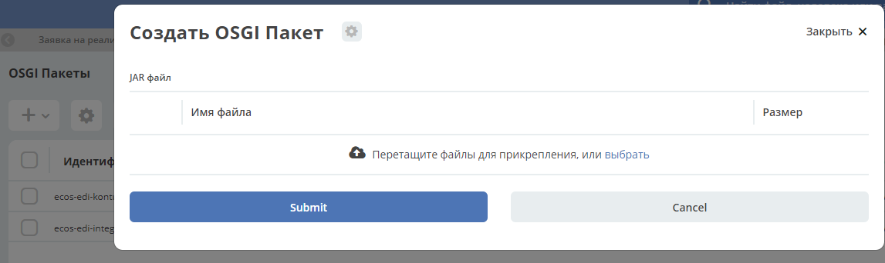

Переход на новые настройки интеграции с EDI провайдерами
=========================================================

1. Новые настройки для контрагентов. 

Ранее в enterprise версии поддерживался 1 провайдер - КОНТУР. Значение для **boxid** задавалось свойством ``idocs:diadocBoxId`` (или переопределенным в журнале **“Системные журналы“ → “Настройки ЭДО“ → Тип свойства DiadocBox : diaDocBoxIdType**). Теперь КА поддерживается несколько ящиков разных провайдеров

 .. image:: _static/new_integration_settings/settings_1.png
       :width: 600
       :align: center

Для переноса старых настроек КА написан dyn-ext скрипт: 

**{root}/alfresco/service/citeck/ecos/moveCounterpartyEdiSettingToNewFormat?counterpartyType={type}&diadocBoxIdProp={diadocBoxIdProp}**, где:

**{type}** - тип ноды КА,

**{diadocBoxIdProp}** - Свойство с идентификатором ящика диадока. 

Для коробки соответсвенно: ``type=idocs:contractor``, ``diadocBoxIdProp=idocs:diadocBoxId``

Так же, предусмотрена возможность переноса настроек аналогичных по структуре к текущей. В таком случае урл будет таким:

**{root}/alfresco/service/citeck/ecos/moveCounterpartyEdiSettingToNewFormat?counterpartyType={type}&ediProviderInfoType={ediProviderInfoType}&ediBoxIdProp={ediBoxIdProp}&ediProviderProp={ediProviderProp}**

2.  Переход на новые настройки для ЮР лиц.

Ранее события приходили для ящиков настроенных через системный справочник (**“Системные журналы“ → “Настройки ЭДО“ → diadoc|corus**). Сейчас настройки для ящиков хранятся в ноде ЮР.лица аналогично настройкам в ноде КА. 

Для переноса старых настроек КА написан dyn-ext скрипт: 

**{root}/alfresco/service/citeck/ecos/moveCounterpartyEdiSettingToNewFormat?legalEntityRef={ref}&clientBoxIdSettingKey={diadocClientBoxId}&ediProviderType={ediProviderType}**, где:

**{ref}** - нода ЮР лица,

**{diadocClientBoxId}** - настройка ящика(например, ``diadocClientBoxId1``).

**{ediProviderType}** - тип провайдера 

3. Переход на новых ответcвенных за обработку пакетов.

Ранее при получения входящего пакета создавалась задача в журнале **“Разбор входящих“** с назначением на пользователей указанных в справочнике **“Связь контрагента с группой“**. Тип настраивался через системный справочник (**“Системные журналы“ → “Настройки ЭДО“ → diadoc|corus**). Сейчас ответственные хранятся в ноде КА в ассоциации ``“idocs:responsibilities“``. 

Для переноса ответственных в ноду КА написан dyn-ext скрипт: 

**{root}/alfresco/service/citeck/ecos/moveResponsibleAuthoritiesToCounterpartyAssoc?clientBoxId={clientBoxId}**, где:

**{clientBoxId}** -  тип ящика. Допустимые значения: ``diadocClientBoxId1``, ``diadocClientBoxId2``, ``corusClientBoxId``.

Пошаговая инструкция по переходу на новую интеграцию
------------------------------------------------------

Для перехода на новую интеграцию необходимо выполнить следующие шаги:

1. Миграция в коде (разработчик):

 1.1. Использовать ``ru.citeck.ecos.integration.edi.service.EcosEdiService`` или ``ru.citeck.ecos.integration.edi.js.EcosEdiServiceJS`` реализацию вместо всех предыдущих вариантов интерфейсов для обращения к EDF-провайдерам. Эти сервисы отправляют запрос именно в микросервис, а не в старую интеграцию.

 1.2. Если используются кастомные настройки контрагентов/юр лиц - привести их в вид соответствующий новой структуре, описанной в статье: Переход на новые настройки интеграции с Edi провайдерами. 

2. Произвести миграцию на стенде, запустив скрипты (при миграции с 3й версии на 4ю) согласно следующей статье (Администратор/разработчик) Переход на новые настройки интеграции с Edi провайдерами. 

3. Перед запуском стенда - выключить старые джобы в **alfresco-global.properties**. Список свойств: (Администратор/разработчик)

.. code-block::

    integration.diadoc-getUpdates.enabled.1=false
    integration.diadoc-getUpdates.scheduler.1.autoStartup=false
    integration.diadoc-getUpdates.enabled.2=false
    integration.diadoc-getUpdates.scheduler.2.autoStartup=false
    integration.corus-getUpdates.enabled=false
    integration.corus-getUpdates.scheduler.autoStartup=false

4. Запустить стенд.

5. Согласно статье Настройка получения событий с ящиком Контур.Диадок. - добавить интересующие интеграции. Если была интеграция по одному ящику - сделать одну синхронизацию, если две - то две и тд.

ГАЛКУ **“Enabled/Включена”** ОСТАВИТЬ НЕ АКТИВНОЙ!!! Это необходимо, чтобы интеграция пошла именно с точки, с которой остановилась старая интеграция (для этого смотрите дальнейшие шаги).

“Camel endpoint” для синхронизации указывать следующий: ``direct-vm:ecosEventsReceiveVmRoute``

Остальное брать из справочника **“Конфигурация EDI”** (``URL: ${server_host}/v2/journals?journalId=ecosEdiConfig``).

6. На момент написания статьи, нельзя было на форме редактировать последнее обработанное событие в интеграции, поэтому:

    6.1. Заходим в БД микросервиса интеграций, делаем select для таблицы ecos_sync (**SELECT * FROM ecos_sync;**).

    6.2. Для только что созданных ecos_sync записей выполнить update, засетив свойство sync_state значением из справочника **“Конфигурация EDI”**. Например:

        6.2.1. У нас была, к примеру, одна единственная интеграция с диадоком на ent. Заходим в журнал **“Конфигурация EDI”** (``URL: ${server_host}/v2/journals?journalId=ecosEdiConfig``). Находим заполненное свойство ``lastProcessedEdiEventId`` (для первого ящика диадока). Запоминаем его значение.

         .. image:: _static/new_integration_settings/settings_2.png
            :width: 600
            :align: center
    
        6.2.2. Выполняем запрос UPDATE:

        .. code-block::

            UPDATE ecos_sync SET sync_state='{"lastEventId":"${значение_из_справочника_из_пункта_6.2.1}"}' WHERE id=${id_из_селекта};

        То есть, для значения выше запрос будет примерно следующим (обязательно удостовериться, что при копировании значения не скопировались лишние табы/пробелы):

        .. code-block::

            UPDATE ecos_sync SET sync_state='{"lastEventId":"4bc341e4-74b6-4908-899f-d196adbda205"}' WHERE id=1001;
        

        6.3. Сделать такое для каждого настроенного ящика.

(На текущий момент при настройке синхронизации появилось поле для указания последнего обработанного события, которое подхватывается при первом запуске интеграции, либо после сброса синхронизации).

7. После того как для всех ящиков восстановили **lastEventId** - можно включать флаг **“Enabled/Включена”** для синхронизаций.

8. Загрузить бандлы. Бандл - jar файл со специальным манифестом. В данном случае, “загрузить бандлы” означает скачать из nexus бандл соответствующей версии и загрузить его в журнал ``${server_host}/v2/journals?journalId=ecos-osgi-bundles``. Если в журнале уже существует бандл - нужно его удалить и загрузить заново.

Список бандлов, которые нужно загрузить для интеграции с Диадок:

* ru.citeck.ecos.ecos-edi-kontur-lib

* ru.citeck.ecos.ecos-edi-integration

При загрузке бандла, в случае успеха - вы увидите в логах мкс интеграции следующие сообщения:

.. code-block::

    Bundle ${bundle-name} is installed
    Bundle ${bundle-name} is started

Версии бандлов брать исходя из версии микросервиса интеграций из таблицы в следующей статье: Соответствие версий бандлов к версии микросервиса 

