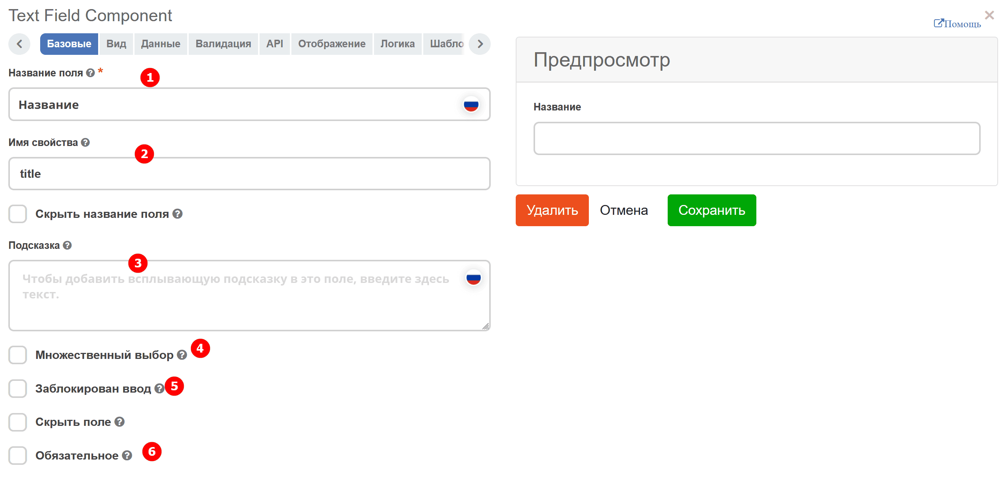
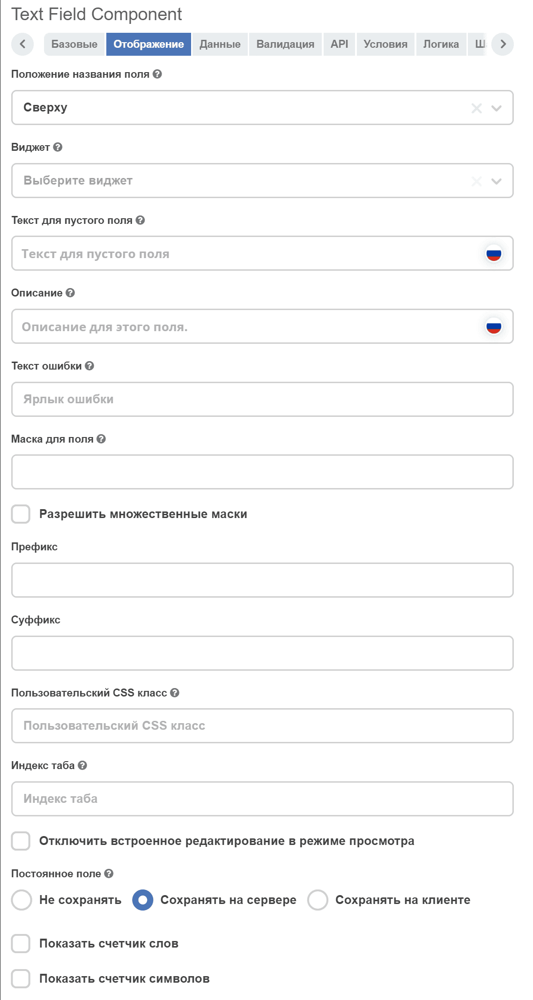
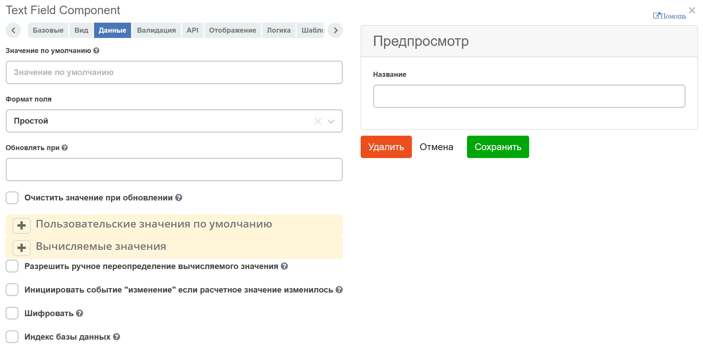
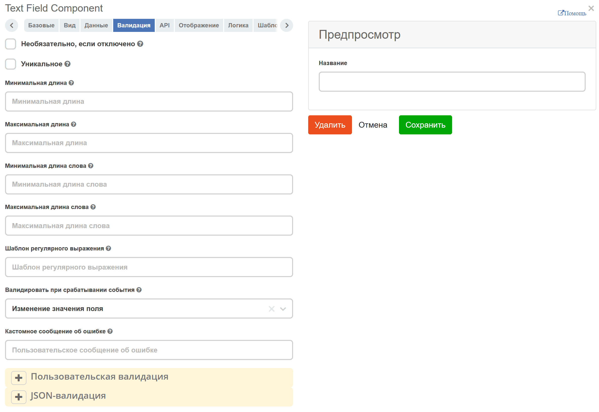
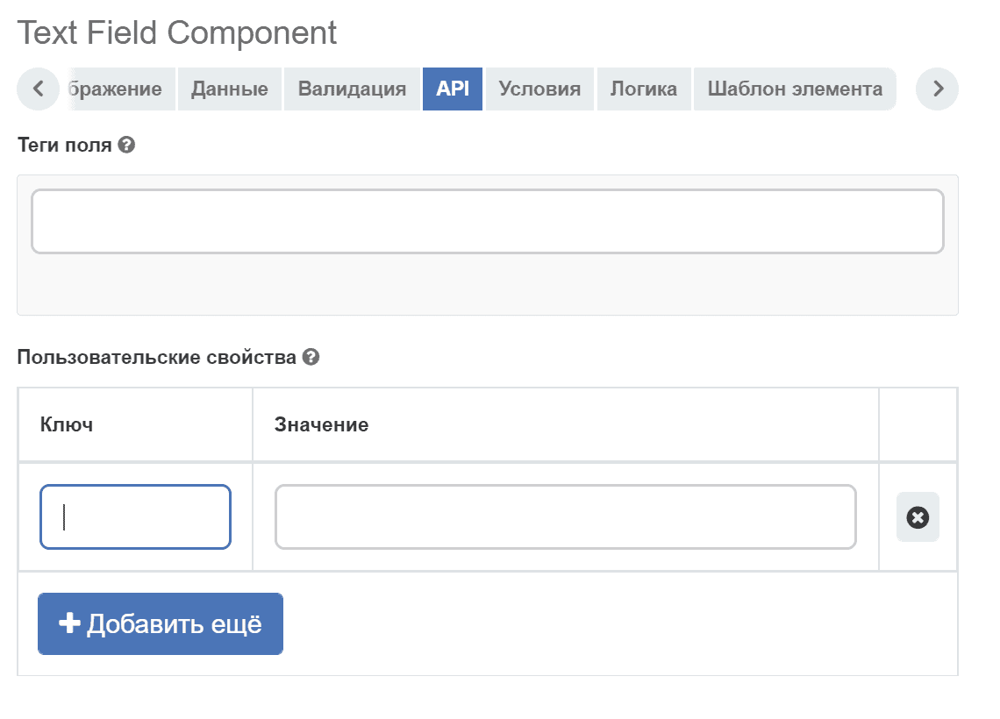
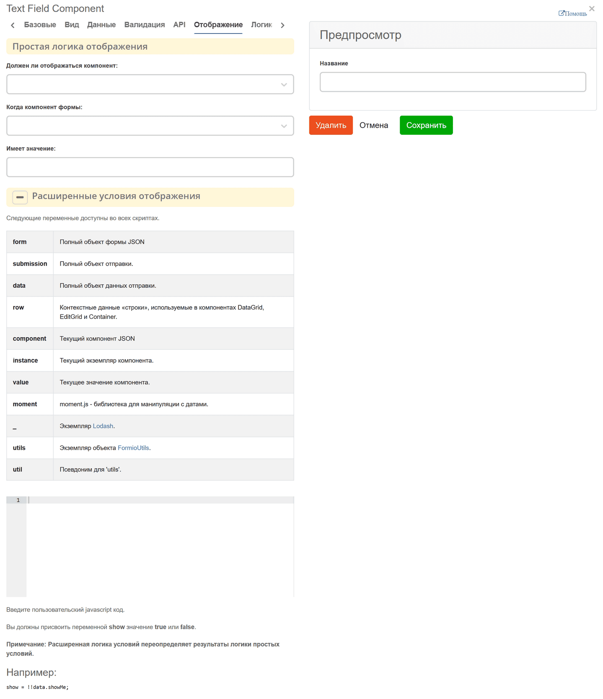
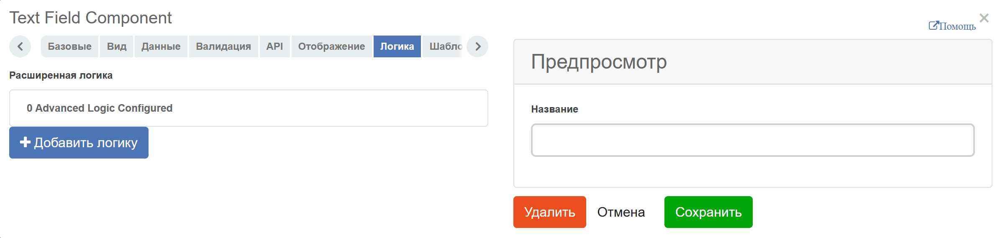
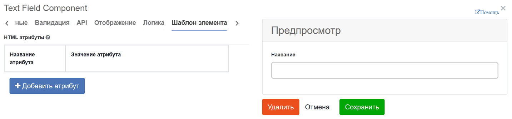

.. _form_builder:

Конструктор форм
=================

.. contents:: 
   :depth: 3

Общее описание
---------------

**Конструктор форм** — визуальный дизайнер для создания и настройки форм платформы Citeck. Он позволяет без написания кода определить состав и расположение полей, задать правила валидации, управлять видимостью и доступностью компонентов, а также добавить пользовательскую логику поведения формы.

С помощью конструктора можно:

* выбирать из готового набора компонентов (текстовые поля, списки, даты, вложения и др.) и размещать их на форме перетаскиванием;
* настраивать свойства каждого компонента — отображаемое название, привязку к атрибуту :ref:`типа данных<data_types_main>`, обязательность, режим «только чтение»;
* задавать условия отображения и логику изменения полей в зависимости от действий пользователя;
* проверять корректность заполнения с помощью встроенных правил валидации или пользовательских скриптов.

Добавление компонента формы
-----------------------------

Каждая новая форма начинается с автоматически добавленных кнопок и текстового поля, которые могут быть удалены или отредактированы по мере необходимости.

 .. image:: _static/form_builder/builder.png
       :width: 600
       :align: center

Чтобы добавить компонент в форму, перетащите компонент из левого столбца в нужное место в форме:

 .. image:: _static/form_builder/builder_1.png
       :width: 600
       :align: center

Редактирование компонента формы
--------------------------------

Чтобы изменить компонент формы, наведите указатель мыши на компонент и щелкните значок шестеренки - откроется форма настроек для компонента.

 .. image:: _static/form_builder/builder_2.png
       :width: 600
       :align: center

Настройка компонентов
---------------------

Ниже приведен список общих настроек, которые присутствуют в большинстве компонентов. Основные вкладки, используемые для настройки:

Базовые
~~~~~~~

Хранит в себе основные, используемые чаще всего, настройки.

.. list-table::
      :widths: 10 30 30
      :header-rows: 1
      :align: center
      :class: tight-table 

      * - п/п
        - Наименование
        - Описание
      * - 1
        - **Название поля** 
        - имя компонента, как оно будет отражаться на форме.
      * - 2
        - **Имя свойства** 
        - | имя свойства из :ref:`типа данных<data_types_main>`
          | При вводе имени свойства появляется выпадающий список атрибутов типа данных, для которого форма создается (при наличии частичного совпадения имен). Это позволяет понять, какие имена уже заняты, чтобы не привести к ошибке при создании или редактировании формы.

                 .. image:: _static/form_builder/tab_1_variants.png
                      :width: 500
                      :align: center

      * - 3
        - **Подсказка** 
        - подсказка, которая отображается при наведении курсора на знак вопроса возле поля, если необходимо. 
      * - 4
        - **Множественный выбор** 
        - отвечает за возможность множественного выбора (нужно для выбора из списка, журнала, или оргструктуры).
      * - 5
        - **Заблокирован ввод** 
        - отключает возможность ввода данных в компонент.
      * - 6
        - **Обязательное** 
        - обязательность заполнения поля.

Вид
~~~

Хранит в себе настройки для отображения. Для базовой настройки нужны:

.. list-table::
      :widths: 10 30 30
      :header-rows: 1
      :align: center
      :class: tight-table

      * - п/п
        - Наименование
        - Описание
      * - 1
        - **Текст для пустого поля**
        - подсказка, которая отображает до начала заполнения поля. Используется в основном для текстовых полей.
      * - 2
        - **Описание**
        - подсказка, которая отображается на форме всегда, в отличие от Placeholder, если необходимо.
      * - 3
        - **Очистить значение, если оно скрыто**
        - отвечает для очистку данных в компоненте, когда она скрыта.

Данные
~~~~~~

Отвечает за автоматическое заполнение поля данными. В списках, есть возможность заполнить список статическими, или полученными из асинхронного запроса данными.

Валидация
~~~~~~~~~

Отвечает за проверку правильности заполнения поля. Поддерживает как простые проверки (проверки длины введенной строки или принятия конкретного значения), так и сложные.

API
~~~

Хранит в себе ключ и атрибут для корректного сохранения данных.

.. list-table::
      :widths: 10 30
      :header-rows: 1
      :align: center
      :class: tight-table

      * - Поле
        - Значение
      * - **Ключ**
        - строка ``attribute``
      * - **Значение**
        - данные как в заголовке ``%prefix%_%localName%``, например ``initiator``

Отображение
~~~~~~~~~~~

Отвечает за настройку отображения компонента. Поддерживает как простую логику, например, сопоставление значения поля и отображения при совпадении, так и сложную.

Логика
~~~~~~

Пользовательская логика. Добавление динамического поведения в формы:

- Показ/скрытие полей.
- Изменение значений, обязательности, доступности полей.
- Выполнение кастомных действий через JavaScript.

Тип триггера определяет структуру и условия срабатывания. Конфигурация триггера зависит от выбранного типа:

.. list-table::
      :widths: 15 45 25
      :header-rows: 1
      :align: center
      :class: tight-table

      * - Тип
        - Описание
        - Документация
      * - **Простой**
        - Использует стандартный интерфейс и методы настройки, аналогичные вкладке «Отображение».
        - `Документация по простым условиям <https://help.form.io/userguide/form-building/logic-and-conditions#simple-conditions-8.0.x>`_
      * - **JavaScript**
        - Позволяет писать пользовательские условия на JavaScript. Интерфейс и настройки совпадают с «Расширенные условия отображения».
        - `Документация по расширенным условиям <https://help.form.io/userguide/form-building/logic-and-conditions#advanced-conditions>`_
      * - **JSON Logic**
        - Альтернатива JavaScript для написания логических условий с использованием JSON-структур.
        - `Документация по JSON Logic <https://help.form.io/userguide/form-building/logic-and-conditions#json-logic>`_
      * - **Событие**
        - Предназначен для создания пользовательских событий в форме.
        - —

Доступны следующие действия, которые могут быть выполнены при активации условия:

.. list-table::
      :widths: 15 55
      :header-rows: 1
      :align: center
      :class: tight-table

      * - Действие
        - Описание
      * - **Свойство**
        - Изменение настроек поля (видимость, обязательность, текст подписи и др.).
      * - **Значение**
        - Динамическое обновление данных с помощью JavaScript (доступны переменные ``row``, ``data``, ``component``, ``result``).
      * - **Валидация**
        - Настройка правил проверки данных формы в зависимости от условий.

Шаблон элемента
~~~~~~~~~~~~~~~

Отвечает за дополнительные атрибуты, которые могут быть добавлены в форму.

Настройки макета
^^^^^^^^^^^^^^^^

Можно изменить расположение компонентов на форме, используя HTML-атрибуты. Например, отступы сверху, снизу, слева и справа. Величины должны быть введены в допустимом формате CSS (например, 10px), чтобы отображаться корректно. Компоненты будут располагаться соответствующим образом в зависимости от того, какие поля отступов вы настроите.

