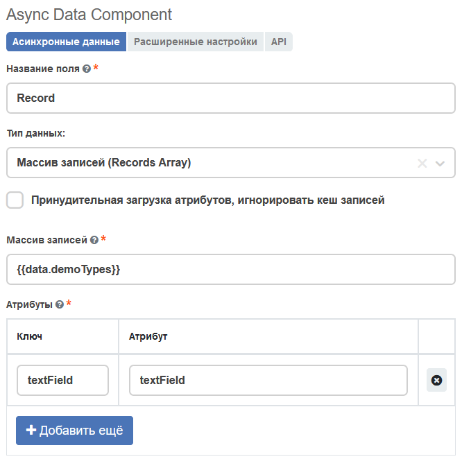
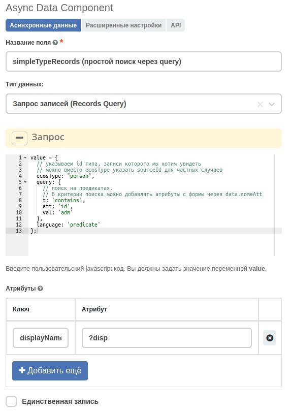
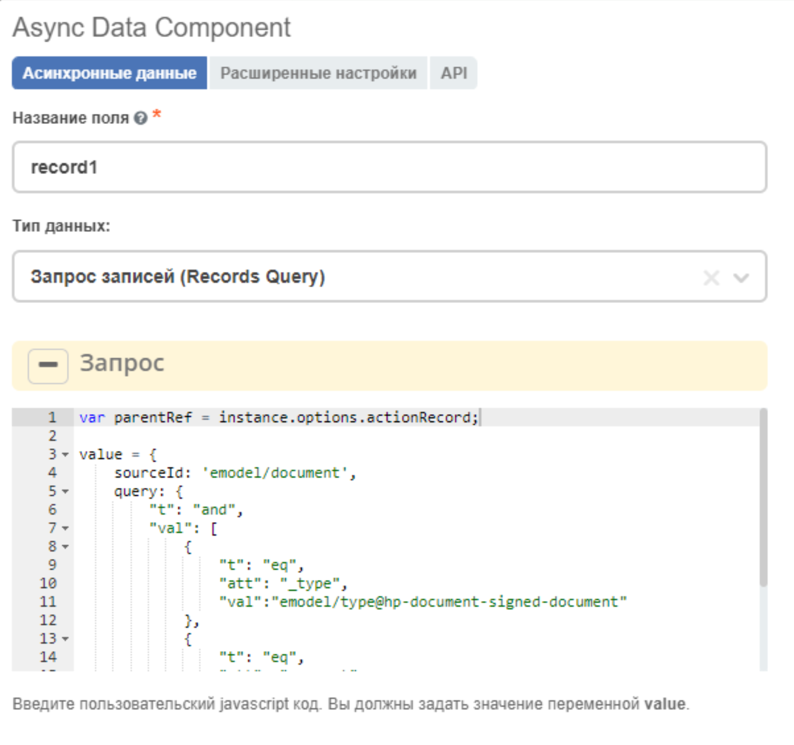

.. _async_data_component:

Async data
===========

.. contents::
   :depth: 4

**Запись (Record)** – сущность с набором атрибутов и идентификатором записи (RecordRef).

 .. image:: _static/async_data/async_data_1.png
       :width: 800
       :align: center

Типы данных
------------

Есть 6 типов данных, которые можно загружать с помощью данного компонента:

1. Запись/Record
~~~~~~~~~~~~~~~~~~~~

Если мы знаем идентификатор какой-то записи (он есть в поле формы или статичен), то мы можем выбрать этот режим.

Для подстановки значений формы в поле **record** можно делать вставки с четыремя фигурными скобками и полем, которое мы хотим подставить ``{{ data.typeField }}``

Для подстановки текущей редактируемой ноды можно использовать ``{{ recordId }}``

В аттрибутах ``ключ`` - это алиас (имя по которому будет храниться значение аттрибута), а ``value`` - это сам аттрибут. Список вариантов значения ``value`` можно посмотреть в :ref:`ECOS Records<Records_API>`

По умолчанию, при попытке из record'а получить ассоциацию, возвращается её **displayName**. Чтобы получить ссылку на неё, необходимо после указания названия атрибута, поставить постфикс **?assoc**. Пример:

 .. image:: _static/async_data/async_data_2.png
       :width: 400
       :align: center

2. Массив записей/Records Array
~~~~~~~~~~~~~~~~~~~~~~~~~~~~~~~~~~

Работает по аналогии с режимом **Record**, но применительно к массиву идентификаторов записей.

3. Запрос записей/Records Query
~~~~~~~~~~~~~~~~~~~~~~~~~~~~~~~~~~~

Если мы хотим отправить запрос поиска записей, то можем воспользоваться режимом **RecordsQuery**. Аналог **Citeck.Records.query({...})**, где указывается поисковый запрос (т.е. если нет ссылок на сущности)
В этом режиме есть вычисляемое javascript поле **Query**, в котором нужно на основе данных формы или других данных подготовить запрос для отправки на сервер. Если query не меняется, то новых запросов на сервер не происходит.

Аттрибуты аналогичны режиму **Record**, но они будут запрошены для каждой вернувшейся записи.

Если включен **Единственная запись** параметр, то в результате будет поиск только одной записи.

Если ссылки на сущности уже есть, то необходимо использовать другой режим. 

Пример использования query:

.. code-block:: javascript

  const contract = Records.get(recordId).getBaseRecord().id
  
  if (!contract) {
    return;
  }
  
  value = {
      sourceId: 'emodel/payments',
      query: {
          "t": "and",
          "val": [
              {
                  "t": "eq",
                  "att": "_parent",
                  "val": contract
              }
          ]
      },
      sortBy: [
          {
              "attribute": "paymentDate",
              "ascending": false
          },
          {
              "attribute": "residue",
              "ascending": true
          }
      ],
      language: 'predicate'
  };

4. Ajax
~~~~~~~~~~~~

Данный режим предназначен для запроса произвольных данных по URL.

В этом режиме есть два вычисляемых javascript поля **Query Data** и **Query Result Mapping**.

**Query Data** - поле, результат вычисления которого отправляется в запросе на сервер. Если метод запроса GET, то параметры из **Query Data** будут добавлены в URL. Если метод POST, то в данные попадут в тело запроса.

**Query Result Mapping** - необязательное поле. Если его не заполнить, то в Async Data контроле будет весь результат запроса. Если в данном поле есть дополнительная обработка результата, то итог данной обработки будет записан в значении поля.

5. Пользовательские данные/Custom
~~~~~~~~~~~~~~~~~~~~~~~~~~~~~~~~~~~~

Данный режим предназначен для вычисления любых асинхронных данных.

В этом режиме есть два вычисляемых javascript поля **Синхронные данные** и **Асинхронные данные**.

**Синхронные данные** - это подготовка данных, которые будут нужны для выполнения **Асинхронные данные**.

В **Асинхронные данные** можно в ``value`` записать **Promise**, результат выполнения которого будет проставлен в поле.

 .. image:: _static/async_data/async_data_15.png
       :width: 400
       :align: center

6. Records Script
~~~~~~~~~~~~~~~~~~

Тоже самое что и **Record** и **Record Array**, с тем отличием что имеется возможность вычислять идентификатор записи. Если идентификатор равен массиву, то отрабатывает как **Records Array** иначе как **Record**.

 .. image:: _static/async_data/async_data_3.png
       :width: 400
       :align: center

Отключение кеша при загрузке атрибутов с сервера
--------------------------------------------------

В режимах **Record, Records Array и Records Script** результат выполнения запроса к серверу кешируется. Для отключения такого кеширования добавлена опция:

 .. image:: _static/async_data/async_data_4.png
       :width: 400
       :align: center

Условия загрузки данных с сервера
----------------------------------

Во вкладке :guilabel:`Расширенные настройки` настраивается частота и условия обновления данных.

 .. image:: _static/async_data/async_data_5.png
       :width: 400
       :align: center

Обновление данных по событиям
~~~~~~~~~~~~~~~~~~~~~~~~~~~~~

Для реакции на определенные события существуют 2 параметра на вкладке :guilabel:`Расширенные настройки`: **Update on** и **Refresh on**.

 .. image:: _static/async_data/async_data_6.png
       :width: 400
       :align: center

На данный момент **Update on** и **Refresh on** выполняют по сути одну функцию и отличаются только событиями на которые они реагируют. Данные параметры можно комбинировать для покрытия большего количества ситуаций.

1. Update on
""""""""""""""""
Данный параметр поддерживает 4 события, в ответ на которые будет произведена загрузка информации:

 .. image:: _static/async_data/async_data_7.png
       :width: 400
       :align: center

* **Любых изменениях/Any change** – обновлять данные при любом изменении на форме.
  
  * **Update rate, ms** – период проверки обновления формы на изменения в миллисекундах(если в течении этого времени данные формы изменились, то запрос будет один). Таким образом, если этот параметр равен 100, и за последние 100 ms произошло, к примеру, 1000 событий на форме, то данные будут загружены всего 1 раз.

* **Событиях/Event** – обновлять данные по заданному событию (события можно триггерить кнопкой).
 
  * **Event** – название события, на которое следует реагировать.

* **Единоразово/Once** – загрузить данные единожды при загрузке формы.
* **Блокировке/Disabled** – выключает параметр Update on.

2. Refresh on
"""""""""""""""

Данный параметр имеет всего одно поле для указания элементов формы, которые следует отслеживать.

 .. image:: _static/async_data/async_data_8.png
       :width: 400
       :align: center

Поле поддерживает множественный выбор, так что можно можно выбрать несколько элементов, при обновлении которых будет происходить загрузка данных.

Для выбора элемента начните вводить **Название поля/Property Name** нужного элемента.

Обновление другого компонента при возникновении события
~~~~~~~~~~~~~~~~~~~~~~~~~~~~~~~~~~~~~~~~~~~~~~~~~~~~~~~~

Пример условия обновления другого компонента при возникновении события ``event_terLineManDefault`` в **Async Data Component**.

 .. image:: _static/async_data/async_data_10.png
       :width: 400
       :align: center

Выставите **Force update** при подписке на событие из **TableForm Component**. 

Условия обновления данных
~~~~~~~~~~~~~~~~~~~~~~~~~~~

После того как было обнаружено какое-либо событие из параметров **Update on** и **Refresh on**, можно также предварительно убедиться, что данные необходимо обновить.

1. Условие обновления
"""""""""""""""""""""""

Данный параметр отвечает за проверку необходимости обновления данных после того, как какое-либо необходимое событие было обнаружено.

 .. image:: _static/async_data/async_data_11.png
       :width: 400
       :align: center

**Условие обновления** представляет собой разворачивающееся окно javaScript кода. В данное окно вводится проверка необходимости обновления данных.

Можно ввести любое условие, главное присвоить переменной ``value`` результат проверки. Если **value === true** - необходимо загрузить данные с сервера, а если **value === false**, то данные не будут загружены. 

.. attention::

      Если значения триггерятся  в другом компоненте, чтобы избежать бесконечного цикла, не выставляйте чекбокс **"Обновлять всегда, игнорировать проверку равенства значений"**. 

       .. image:: _static/async_data/async_data_13.png
            :width: 400
            :align: center

Примеры использования
----------------------

Пример формы с async data
~~~~~~~~~~~~~~~~~~~~~~~~~~~~

На форме 2 видимых поля - выбор из журнала **типов** и **textarea**, которое автоматически наполняется списком записей выбранного типа.

:download:`json с данными формы <../files/async-data-test-form.json>` 

Загрузка данных через async data
~~~~~~~~~~~~~~~~~~~~~~~~~~~~~~~~~

Загрузка данных через async data в том числе и используя поиск:

.. list-table::
      :widths: 20 20
      :align: center

      * - |

            .. image:: _static/async_data/async_data_example_02.jpg
                  :width: 500
                  :align: center

        - |

            .. image:: _static/async_data/async_data_example_03.jpg
                  :width: 500
                  :align: center

:download:`json с данными формы <../files/async-data-test-form_v2.json>` 

Получение ссылки карточки на форме подтверждения
~~~~~~~~~~~~~~~~~~~~~~~~~~~~~~~~~~~~~~~~~~~~~~~~~~

На форме подтверждения (которая указана в ``formRef`` в свойстве ``confirm``) необходимо получить ссылку самой карточки (над которой производилось действие).

Можно получить внутри самой формы через системное поле:

.. code-block::

      instance.options.actionRecord

обратиться за ссылкой на саму карточку документа. 

И дальше, используя компонент **Async Data Component** на самой форме обратиться за всеми полями основной карточки.

Например, для поиска дочерних документов от данной карточки, используя следующий **Record Query**:

.. code-block::

      var parentRef = instance.options.actionRecord;

      value = {
      sourceId: 'emodel/document',
      query: {
            "t": "and",
            "val": [
                  {
                  "t": "eq", 
                  "att": "_type", 
                  "val":"emodel/type@hp-document-signed-document"
                  },
                  {
                  "t": "eq", 
                  "att": "_parent", 
                  "val": parentRef
                  }
                  ]
      },
      language: 'predicate'
      };

Дополнительные примеры
~~~~~~~~~~~~~~~~~~~~~~~~

**typeRecordsFetch** 

Async data, которая по пользовательским данным вычисляет что-то на форме. В частности, получает с формы значение поля **typeToSearch** 

Но в асинхронных данных напрямую обратиться к полям формы мы не можем.

Разделение на синхронные и асинхронные сделано, чтобы из синхронных данных определить, нужно ли выполнять логику из асинхронной, то есть 
пока данные в **typeToSearch** не изменятся, то сложная логика не будет перевычислена.

**Record(recordData)** 

Сам компонент async data:

На форме есть компонент **Demo types** - выбор из журнала, в настройках указан journal id.

.. list-table::
      :widths: 20 20
      :align: center

      * - |

            .. image:: _static/async_data/async_data_example_07.png
                  :width: 400
                  :align: center

        - |

            .. image:: _static/async_data/async_data_example_08.png
                  :width: 400
                  :align: center

В компоненте **Text Field** настроено вычисляемое назначение - берем вычисленное в async data **recorDdata** и преобразуем в json-строку:

Удобный прием для дебага.

.. list-table::
      :widths: 20 20
      :align: center

      * - |

            .. image:: _static/async_data/async_data_example_09.png
                  :width: 500
                  :align: center

        - |

            .. image:: _static/async_data/async_data_example_10.png
                  :width: 400
                  :align: center

:download:`json с данными формы <../files/async-data-test-form_v3.json>` 
