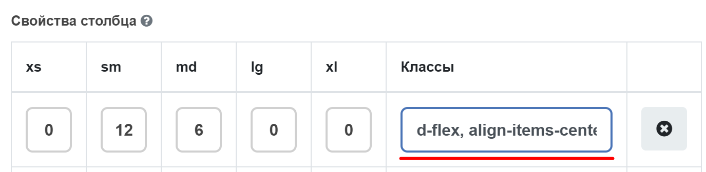

.. _columns:

Columns
=======

Контрол **Columns** был модифицирован.

Добавлена возможность указать ширину ячейки для разных размеров экрана согласно сетке bootstrap. `Подробная информация о сетке bootstrap <https://getbootstrap.com/docs/4.0/layout/grid/>`_

 .. image:: _static/columns/columns1.png
       :width: 400
       :align: center

Дополнительно для каждой ячейки можно добавить различные css-классы в поле столбца **Classes**. При добавлении нескольких css-классов их следует разделить запятой либо пробелом.

