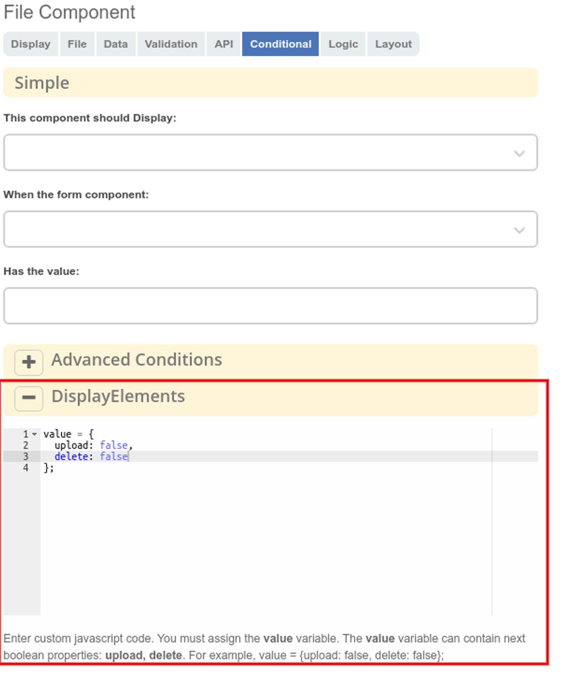

.. _file:

File
=====

.. contents::
   :depth: 4
   
Компонент для загрузки файлов. Позволяет загружать файлы в контент нод. Для дочерних ассоциаций поддерживается задание ``type/kind``.

Для настройки компонента необходимо перейти во вкладку :guilabel:`Файл`, в поле **Хранилище** выбрать **Url**, в поле **url** прописать endpoint для загрузки файлов - ``/share/proxy/alfresco/eform/file``.

 .. image:: _static/file/file_1.png
       :width: 500
       :align: center

Привязка компонента к конкретному атрибуту выполняется стандартно, аналогично другим компонентам.

Для привязки ``type/kind`` необходимо перейти на вкладку :guilabel:`Файл`, и заполнить **Типы файлов**. **Название поля** - заголовок для отображения, **Значение** - ключ ``type/kind``, который должен быть сформирован по следующему паттерну - ``node-uuid_type/node-uuid_kind``, при этом, возможно указание только ``type`` - ``node-uuid_type``. Обратите внимание, что нужно использовать именно **node_uuid**, а не nodeRef полностью. Например - ``category-document-type/kind-d-scan-documents``.

 .. image:: _static/file/file_2.png
       :width: 500
       :align: center

Настройка отображения названия файла
-------------------------------------

На вкладке :guilabel:`Файл` добавлена возможность настраивать отображение названий файлов в списке -  настройка **Отображаемое имя значения**. Поле принимает javascript-выражение, в котором необходимо присвоить переменной ``disp`` строку, либо Promise.

 .. image:: _static/file/file_4.png
       :width: 600
       :align: center

Помимо стандартных переменных formio, доступных при написании javascript-выражений (data, instance, _ и т.д.) добавлены дополнительные: 

* **originalFileName** - содержит название файла по-умолчанию

* **file** - объект, содержащий различную информацию о файле

* **record** - Promise, полученный путём вызова ``Records.get(file.data.recordRef)``. Если файл не связан ни с каким recordRef, значение record будет равно null.

Примеры использования  настройки **Value display name**:

.. code-block::

	// Пример 1. Статическое название
	disp = 'staticName.txt';

.. code-block::

    	// Пример 2. Название, вычисленное асинхронно
	disp = new Promise(resolve => {
	  // какие-то асинхронные действия
	  // ...
	  resolve('Асинхронное название файла')
	});

.. code-block::

    	// Пример 3. Использование record
	disp = record ? record.load('.disp').then(result => `${result}.pdf`) : originalFileName;

Настройка отображения отдельных элементов компонента
------------------------------------------------------

На вкладку :guilabel:`Отображение` добавлена дополнительная настройка **Элементы отображения**, которая позволяет задавать условия отображения отдельных элементов (например, кнопка удаления файла, upload-зона с кнопкой для добавления нового файла).

Поле принимает javascript-выражение, в котором необходимо присвоить переменной `value` объект с необязательными свойствами **upload, delete**. Если какое-то из свойств не указано, то компонент сам будет решать, отображать элемент или скрывать, в зависимости от ситуации.

.. code-block::

    value = {
        upload: false,
        delete: false
    } 

Бэкенд
-------

Для корректной работы контрола в режиме редактирования у значения “контент” должен быть реализован метод ``getAs`` с аргументом **“content-data”**, который вернет структуру следующего содержания: 

.. code-block::

    [
        {
            “url“: “ссылка_которая откроется при клике на файл.“
            “name“: “Имя файла“
            “size“: размер_файла_в_байтах
        }
    ]