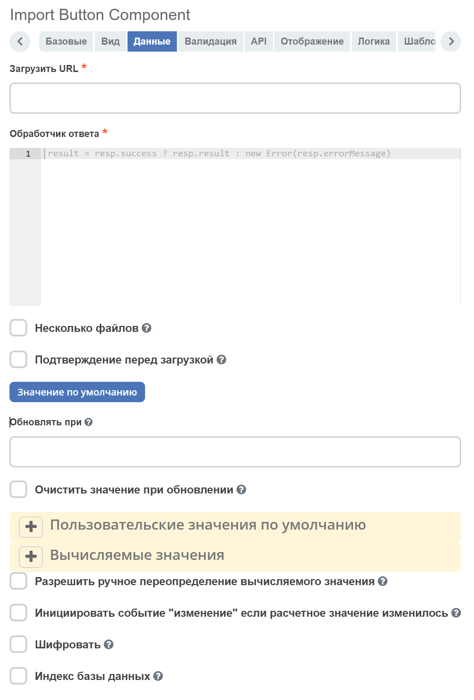
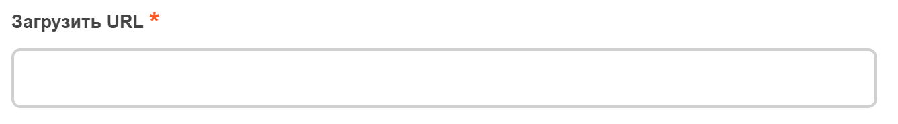
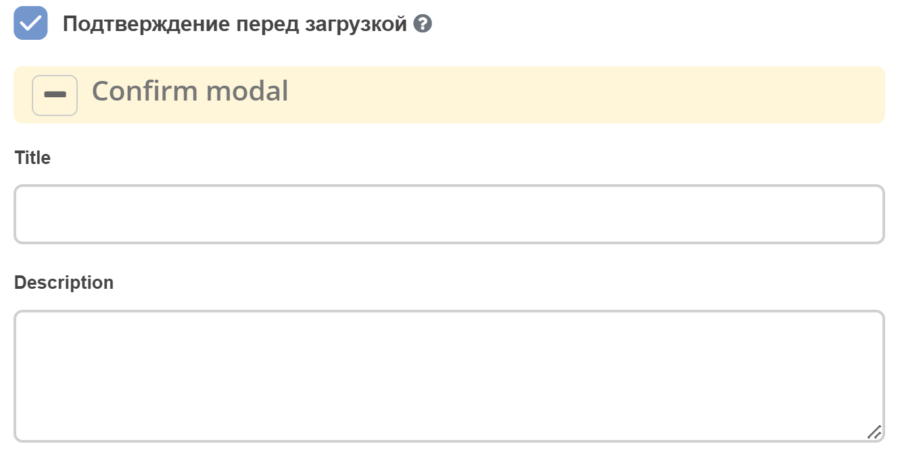

.. _import_button:

Import button
=============

.. contents::
   :depth: 4
   
О компоненте
----------------

Компонент **Import Button** позволяет добавить на форму настраиваемую кнопку для загрузки файлов.

Для отображаемой кнопки применяются стандартные настройки компонента **Button**.

Компонент располагается в разделе :guilabel:`Расширенные`

Настройка Display
------------------

Помимо основных настроек компонента **Button**, добавилась настройка отображения информации о загруженных файлах.

При активации данного чекбокса, после загрузки файла(ов), под кнопкой отобразится список названий файлов. При повторной загрузке файлов, список заменится на информацию о новых файлах.

Настройка Данные
-----------------
Помимо стандартных настроек Button, добавлены следующие:

* **Загрузить URL**  - url, куда будет отправляться POST-запрос с прикреплённым файлом (или несколькими файлами) для обработки. Обязательно к заполнению.
  
  .. image:: _static/import_button/import_button_4.png
       :width: 400
       :align: center

* **Обработчик ответа** - обработки результата ответа сервера после загрузки файла. Обязательно к заполнению. Принимает javascript-выражение, в котором необходимо присвоить переменной ``result`` строку (recordRef), массив строк (массив recordRef) или ошибку (result = new Error('текст ошибки')). В javascript-выражении помимо стандартных объектов formio (data, instance, _, moment, и т.д.) доступна переменная ``response`` (или ``resp``), которая содержит результат ответа сервера после загрузки файла. 

* **Несколько файлов** - возможность загрузки нескольких файлов одновременно

* **Подтверждение перед загрузкой** - настройка, позволяющая отобразить модальное окно подтверждения действия перед загрузкой новых файлов. Появляется после нажатия на кнопку, до отображения модального окна загрузки файла(ов). При активации чекбокса, появляются настройки полей модального окна - заголовка и описания. Эти поля не обязательны к заполнению, имеются базовые значения с учётом локализации.

Внешний вид модального окна:

.. image:: _static/import_button/import_button_7.png
       :width: 400
       :align: center

