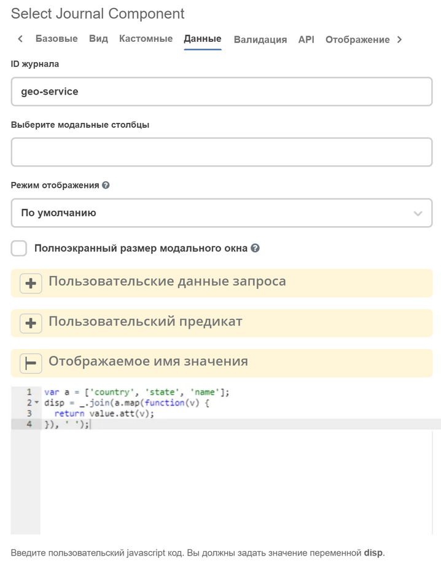
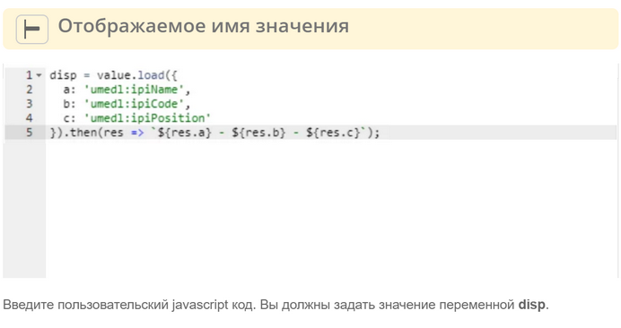

===================
**Select journal**
===================

.. contents::
   :depth: 4
   
Настройка компонента
----------------------

Чтобы указать, какой журнал отображать для выбора значения, в настройках компонента требуется заполнить поле **Journal ID**.

Также компонент умеет автоматически вычислять журнал на основе типа ассоциации, которая указана в атрибуте, при этом поле **Journal ID** заполнять не нужно.

Динамические критерии для поиска
---------------------------------

На вкладке :guilabel:`Data` в поле **Custom Predicate** есть возможность генерировать дополнительные параметры поиска:

 .. image:: _static/select_journal/select_journal_1.png
       :width: 500
       :align: center

Список предикатов описан в статье Язык предикатов (добавить ссылку) в разделе **JSON представление**.

Предустановленные фильтры
---------------------------------

На вкладке :guilabel:`Data` в поле **Preset filter predicates** можно настроить фильтры компонента, которые будут применены при инициализации. Поле **Preset filter predicates** принимает javascript-выражение, в котором необходимо присвоить переменной ``value`` массив из предикатов. 

Пример для компонента с установленным **Journal ID = 'currency'**:

 .. image:: _static/select_journal/select_journal_2.png
       :width: 400
       :align: center

В результате при открытии модального окна выбора по-умолчанию будет применён фильтр по полю "Заголовок" с типом предикатом "contains" и значением "рубль".

 .. image:: _static/select_journal/select_journal_3.png
       :width: 500
       :align: center

Список предикатов описан в статье Язык предикатов (добавить ссылку) в разделе **JSON представление**.

Миграция инварианта "Value Title" на новые формы
-------------------------------------------------

Если журнал используется для выбора ассоциаций, то лучше в данном случае зарегистрировать эвалюатор для отображаемого имени в **DisplayNameService** на сервере. В таком случае отображаемое имя сможет использоваться на формах, в журналах и много где еще.

Если же отображаемое имя специфично для конкретной формы или записи в журнале виртуальные (не имеют представления на сервере), то можно воспользоваться вычисляемым полем **Value Display Name**.

В скрипт записаный в данном поле в качестве аргументов подается

.. list-table:: 
      :widths: 10 10 
     
      * - '-'
        - lodash библиотека с утилитными функциями
      * - value
        - значение, отображаемое имя которого мы хотим вычислить (даже если поле множественное в скрипт за раз попадает только одно значение)

В некоторых случаях ``value.att()`` может возвращать пустое значение т.к. значение не было подгружено. Можно использовать следующий код для корректного отображения даже если значение не подгружено. 

