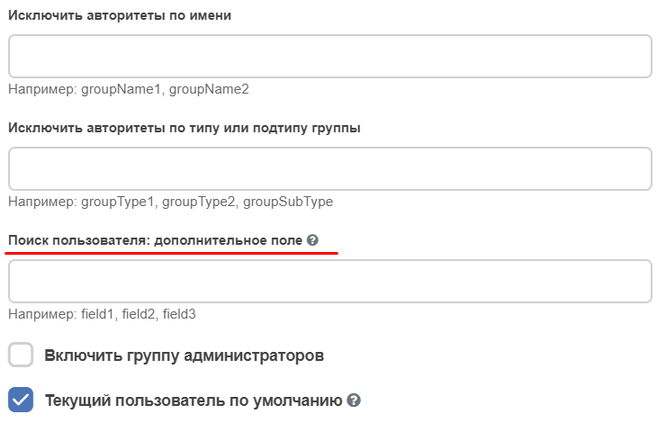
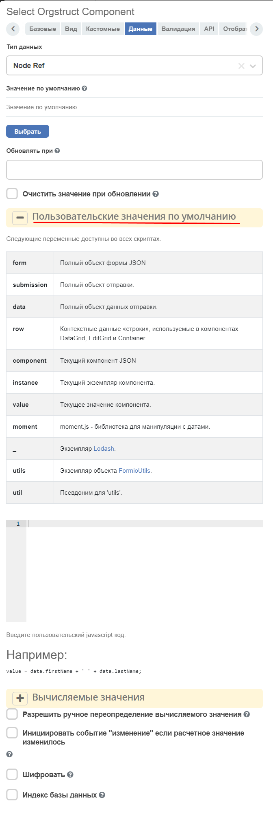

.. _Select_orgstruct_component:

Select orgstruct
================

.. contents::
   :depth: 4
   
Настройка доступных для выбора элементов
-----------------------------------------

.. image:: _static/select_orgstruct/select_orgstruct_1.png
       :width: 600
       :align: center

**Отображать всех пользователей системы** - в компоненте во вкладке **Все пользователи** будут отображать все пользователи, а не только пользователи рабочего пространства.

**Таб по умолчанию: Все пользователи, По уровням** - таб, показываемый по умолчанию:

**Разрешенный тип полномочий/Allowed authority type** - типы элементов, доступные до выбора. Доступные значения: **USER** - пользователи, **GROUP** - группы. Можно указать оба типа через запятую.

**Разрешенный тип группы/Allowed group type** - типы групп, доступных для выбора. Работает в случае, если **Allowed authority type** содержит **GROUP**. Можно указать несколько групп через запятую.

**Разрешенный подтип группы/Allowed group subtype** - типы подгрупп, доступных для выбора. Можно указать несколько подгрупп через запятую. Если поле заполнено, для выбора будут доступны только те элементы, которые проходят фильтр по этому полю, остальные группы выбрать нельзя.

Скрытие групп и подгрупп
------------------------

**Исключить авторитеты по имени/Exclude authorities by name** -  список групп, перечисленных через запятую, для фильтрации по имени . Группы, добавленные в это поле, и все их дочерние элементы не отображаются в оргструктуре

Для того чтобы дочерние группы скрытых групп не появлялись в результатах поиска была добавлена следующая нотация:
``GROUP_NAME/*`` - для того чтобы убрать дочерние элементы только первого уровня
``GROUP_NAME/**`` - для того чтобы убрать дочерние элементы на любом уровне вложенности

**Исключить авторитеты по типу или подтипу группы/Exclude authorities by group type or subtype** - список групп, перечисленных через запятую, для фильтрации по типу. Элементы, соответствующие этим типам, не отображаются в оргструктуре.

Настройка полей для поиска пользователя
-----------------------------------------

.. note::

    Пользовательские значения по умолчанию:
    ``value = user;``

По-умолчанию поиск пользователей осуществляется по трём полям: **userName, firstName и lastName**. 

Подробно о вариантах расширения списка полей для поиска пользователей см. :ref:`конфигурация компонента оргструктуры <orgstructure_config>` 

Возможность динамически задавать корневую группу 
--------------------------------------------------

Возможность динамически задавать корневую группу в Оргструктуре, через параметр, value или условие. Например:

.. code-block:: javascript

      if (someAtt === 'someValue') {
      value = '_orgstruct_home_';
      } else {
      value = 'someGroupId';
      }

.. note:: 

      Только если **разрешенный тип полномочий** имеет значение **GROUP**

Тип данных
-----------

Настройка **"Тип Данных"** определяет формат данных, отправляемых на сервер при сохранении формы. Доступны два режима:

.. list-table::
      :widths: 10 30 30
      :header-rows: 1
      :align: center
      :class: tight-table

      * - Режим
        - Описание
        - Когда использовать
      * - **Node Ref**
        - Сохраняет полную ссылку на сущность в формате :ref:`RecordRef<RecordRef>` (например, ``emodel/person@user``)
        - **Всегда** для ASSOC-like атрибутов (Association, Authority, Person, Group)
      * - **Authority**
        - Отправляет строковый идентификатор (например, ``user`` или ``GROUP_my_group``)
        - Только для системных артефактов, когда поле на бэкенде имеет тип «строка»

.. important::

  Для бизнес-сущностей всегда используйте режим **Node Ref**. Режим **Authority** предназначен для системных артефактов, где поле на бэкенде имеет строковый тип.

Прочее
--------

Текущий пользователь
~~~~~~~~~~~~~~~~~~~~~

На вкладке :guilabel:`Кастомные` **Текущий пользователь по умолчанию/Current user by default** - в случае, если флажок отмечен, по умолчанию будет установлено значение **id** текущего пользователя. Работает только для форм в режиме создания записи ('CREATE').

На вкладке :guilabel:`Данные` в разделе **Пользовательские значения по умолчанию**:

указать:

.. code-block::

    Citeck.constants.USERNAME

    или

    await window.Formio.currentUser()
