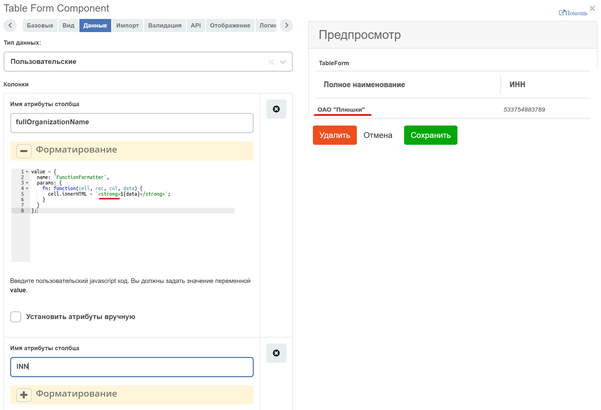
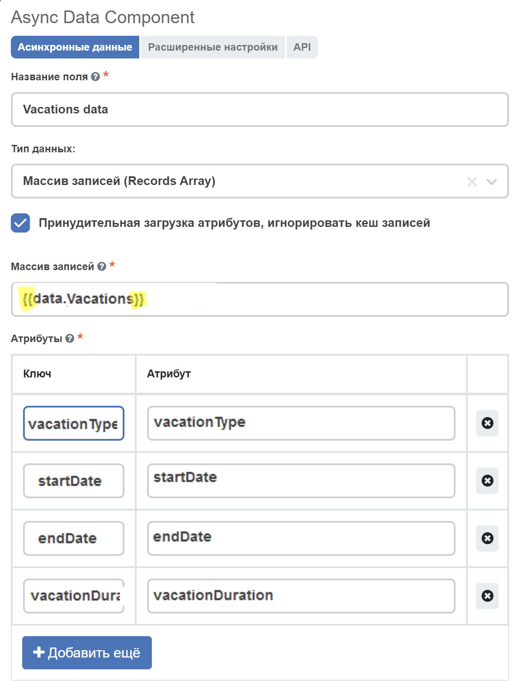
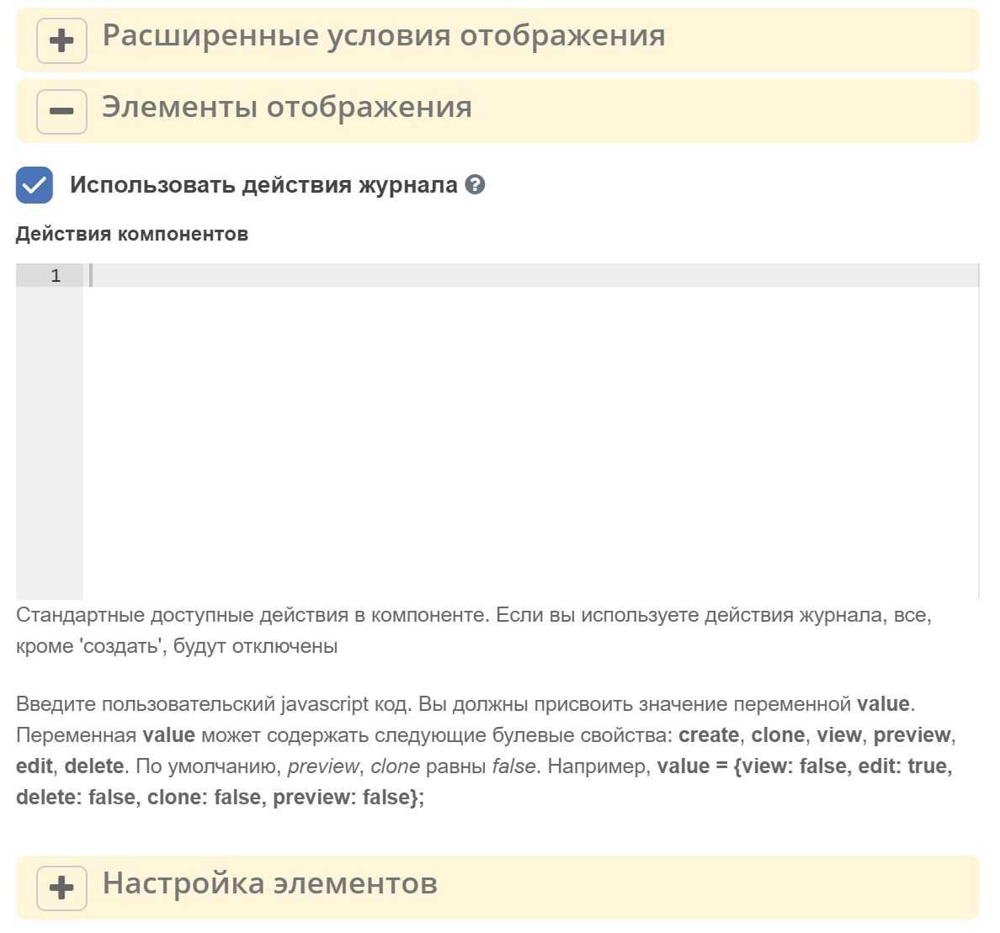
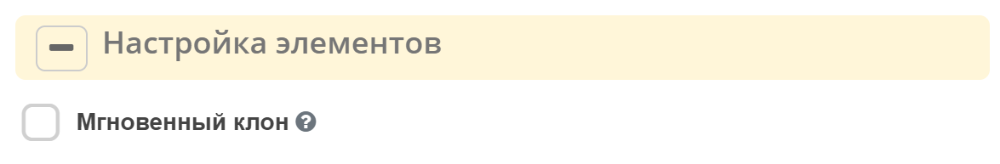
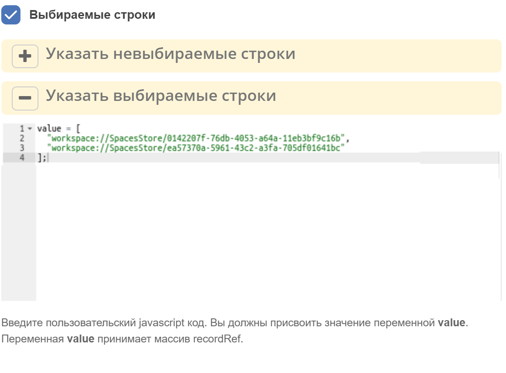
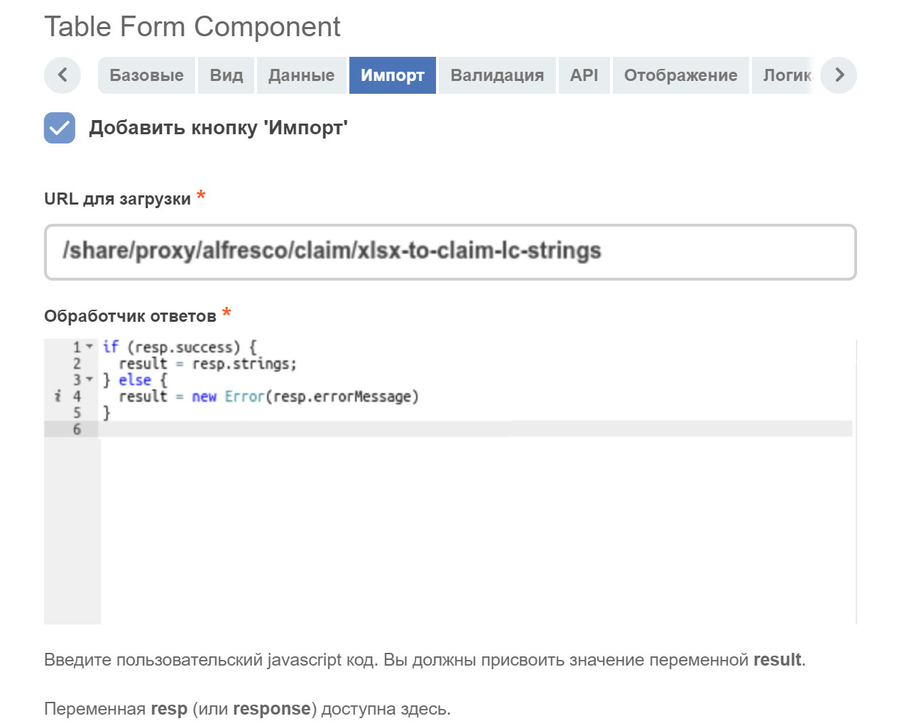

.. _table_form:

Table form
===========

.. contents::
   :depth: 4
   
Создание компонента
---------------------

Компонент **Table Form** позволяет отображать выбранные значения в виде таблицы.

Созданные записи являются временными и хранятся в памяти на клиенте. Отправляются на сервер вместе с родительской формой.

Для отображения кнопки :guilabel:`Создать` и возможности вызова формы создания используется ``formKey*``, который может быть вычислен в зависимости от настройки **Типа данных** на вкладке :guilabel:`Данные`:

* **Журнал** - варианты создания вычисляются с помощью настройки **ID журнала**, либо на основе типа ассоциации, которая указана в атрибуте (при этом **ID журнала** заполнять не нужно). Есть возможность выбрать колонки для отображения в таблице.
 
 .. image:: _static/table_form/Table_form_1.png
       :width: 400
       :align: center

 .. image:: _static/table_form/Table_form_2.png
       :width: 400
       :align: center

 .. image:: _static/table_form/Table_form_3.png
       :width: 400
       :align: center

* **Пользовательские** - варианты создания вычисляются на основе типа ассоциации, которая указана в атрибуте. При этом требуется добавить вручную колонки для отображения в таблице (соответствуют названиям полей в форме создания).

 .. image:: _static/table_form/Table_form_4.png
       :width: 400
       :align: center 

 .. image:: _static/table_form/Table_form_5.png
       :width: 400
       :align: center

 .. image:: _static/table_form/Table_form_6.png
       :width: 400
       :align: center

Варианты создания определяются из указанного аттрибута на вкладке :guilabel:`API`, либо из настройки **Пользовательские варианты создания** на вкладке :guilabel:`Данные`. Настройки колонок берутся из первого по списку полученного варианта создания. Если нет ни одного доступного варианта создания, кнопка :guilabel:`Создать` будет скрыта.

Для каждой колонки можно задать настройки вручную. Для этого нужно отметить галочкой пункт **Установить атрибуты вручную**:

 .. image:: _static/table_form/Table_form_7.png
       :width: 400
       :align: center

Таким образом можно установить заголовок колонки, тип данных и признак **Выбор нескольких**.

Предусмотрена возможность применения к колонке форматтера вручную. Опция **Установить атрибуты вручную** не влияет на настройку форматтера.  Поле настройки форматтера принимает значение вида:

.. code-block::

    value = {
        name: 'ExampleFormatter',
        params: {}
    };

Пример:

.. code-block::

    value = {
    name: 'FunctionFormatter',
    params: {
        fn: function(cell, rec, col, data) {
        cell.innerHTML = `<strong>${data}</strong>`;
        }
    }
    };

Чтение введенных данных
------------------------

Для этого можно использовать компонент **Async Data** (добавить ссылку) с типом данных **Массив записей (Records Array)**.

В поле **Массив записей (Records Array)** указывается имя таблицы, заключенное в двойные фигурные скобки, в аттрибутах - поля этой таблицы и ключи, по которым они будут доступны.

Как получить доступ к родительской форме?
------------------------------------------

Чтобы получить доступ к родительской форме из формы создания/редактирования записи, можно использовать объект ``instance.options.parentForm``.
Например, если требуется установить значение по-умолчанию полю дочерней формы, опираясь на значение из поля родительской формы, можно установить этому полю настройку **Пользовательские значения по умолчанию**:

.. code-block::

    if (instance.options.parentForm) {
  value = instance.options.parentForm.getValue()['data']['someParentFormFieldName']
    }

.. image:: _static/table_form/Table_form_10.png
       :width: 400
       :align: center

Отображение действий
----------------------

Вкладка :guilabel:`Отображение`, настройка **Элементы отображения** позволяет задавать условия отображения действий.

Есть два варианта установки действий: 

1. При использовании источника данных **Журнал** и установки флага **Использовать действия журнала**, в таблице будут задействованы действия заданные в конфигурации указанного журнала.

2. Если источник не журнал или не нужны журнальные действия, и заполнено поле **Действия компонентов**, отобразятся доступные стандартные действия, описанные ниже.

   * Если установлен  флаг **Использовать действия журнала**, то из поля **Действия компонентов** будет обработано только действие :guilabel:`Создать`.
     

.. list-table:: 
      :widths: 10 10 10 10
      :header-rows: 1

      * - Наименование действия 
        - Ключ 
        - По умолчанию
        - disabled / режим просмотра
      * - **Создать**
        - create 
        - true
        - недоступно или скрыто  
      * - **Редактировать**
        - edit 
        - true
        - недоступно 
      * - **Удалить**
        - delete
        - true
        - недоступно  
      * - **Просмотр**
        - view 
        - true
        -  
      * - **Предпросмотр документа**
        - preview 
        - false
        -  
      * - **Клонировать**
        - clone
        - false
        -  

Поле принимает javascript-выражение, в котором необходимо присвоить переменной **value** объект с необязательными свойствами **create, view, preview, edit и delete** (ключи в таблице выше). 

Если какое-то из свойств не указано, то компонент сам будет решать, отображать элемент или скрывать, в зависимости от ситуации (*).

Если компонент **Table Form** в состоянии *disabled* или *форма в режиме просмотра*, элементы “редактировать“, “удалить“ в любом случае будут недоступны. 

.. code-block::

	value = {
	  create: false,
	  view: false, 
	  edit: false, 
	  delete: true,
	  preview: true
	} 

Настройки элементов
----------------------

Вкладка :guilabel:`Отображение` настройка **Элементы отображения** задает некоторые свойства действиям.

* **Мгновенный клон** 

Если флаг установлен, запускается мгновенное добавление, в противном случае отображается форма создания и запись добавляется только после отправки.

Выбор строк в таблице и выполнение действий с выбранными строками
------------------------------------------------------------------
Для включения возможности выбора строки в таблице нужно отметить галочкой пункт **Выбираемые строки** на вкладке :guilabel:`Данные`.

.. image:: _static/table_form/Table_form_13.png
       :width: 600
       :align: center

Для получения списка выбранных строк в таблице у компонента предусмотрен метод ``getSelectedRows()``.

Например, чтобы выполнить какое-нибудь действие с выбранными строками в таблице при нажатии на кнопку, в компоненте **Button** выберем **Действия: Custom** и укажем **Button Custom Logic**:

.. code-block::

    const tableFormComponent = utils.getComponent(form.components, 'tableFormComponentKey');
    if (!tableFormComponent) {
        return;
    }

    const selectedRows = tableFormComponent.getSelectedRows();

    // some actions with selectedRows

Запрет выбора некоторых строк в таблице
----------------------------------------

На вкладке :guilabel:`Данные` в поле **Указать невыбираемые строки** можно запретить выбор определенных строк в таблице:

Установка выбранных строк по-умолчанию
----------------------------------------

На вкладке :guilabel:`Данные` в поле **Указать выбираемые строки** можно указать, какие строки должны быть выбраны по-умолчанию:

Флаг "Разрешить ручное переопределение вычисляемого значения"/ "Allow Manual Override of Calculated Value"
--------------------------------------------------------------------------------------------------------------

.. image:: _static/table_form/Table_form_18.png
       :width: 400
       :align: center

На вкладке :guilabel:`Данные` выставленный флаг разрешает принудительно перезаписать пользователю поле, где уже введено вычисляемое значение.

Статические заголовки
----------------------

Для включения статического заголовка необходимо в родительской форме проставить чекбокс **Скрыть имя записи в модальном заголовке/ Hide record name in modal title**. В данном случае произойдет скрытие имени ноды.

Так же, есть возможность задать свой локализованный статический заголовок. Для этого необходимо:

1. Создать в **Локализация/Localization** бандл с необходимой локализацией

2. Вставить ключ локализации в поле **Укажите пользовательское статическое название поля для объединения с основным/ Enter custom static label for concat with basic**. Если данный ключ не будет найден, то в заголовок добавится тот текст, что лежит в поле **Укажите пользовательское статическое название поля для объединения с основным/ Enter custom static label for concat with basic**

Импорт из файла
----------------

Появилась возможность импортировать в таблицу данные из файла (например, xslx). Для этого в настройки компонента  добавлен раздел :guilabel:`Импорт`:

Поле **URL для загрузки** предназначено для указания url, куда будет отправляться POST-запрос с прикреплённым файлом (или несколькими файлами) для обработки. Обязательно к заполнению.

Поле **Обработчик ответов** предназначено для обработки результата ответа сервера после загрузки файла. Обязательно к заполнению. 
Принимает javascript-выражение, в котором необходимо присвоить переменной **result строку (recordRef), массив строк (массив recordRef) или ошибку (result = new Error('текст ошибки'))**.
В javascript-выражении помимо стандартных объектов formio (data, instance, _, moment, и т.д.) доступна переменная response (или resp), которая содержит результат ответа сервера после загрузки файла. 

После заполнения настроек у компонента должна появиться кнопка **Импорт**:

