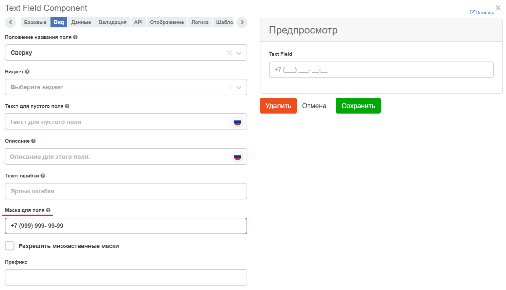

.. _text_field_component:

Text Field
===========

Однострочное текстовое поле.

Упреждающий ввод
~~~~~~~~~~~~~~~~~~

Во вкладке **Данные (Data)** появился чекбокс **Упреждающий ввод (Typeahead)**, активировав который, появляется возможность выбора способа формирования списка и текстовое поле для ввода соответствующего списка:

 .. image:: _static/text_field/text_field_1.png
       :width: 600
       :align: center

- **Custom** - вводим код в формате: 

.. code-block::

    values = ['one', ‘two’];

- **Values** - инпут, в котором вводятсязначения и добавляются по Enter (используется компонент Tags):

 .. image:: _static/text_field/text_field_2.png
       :width: 400
       :align: center

- **Raw JSON** - в текстовое поле вводим данные в формате JSON-строки:

.. code-block::

    "[\n  \"one\",\n  \"two\",\n  \"three\",\n  4,\n  5,\n  \"six\"\n]"

Для отображения ключей уже добавленных на форме компонентов, расширил базовый компонент форм, поле key. 
Теперь, при добавлении на форму нового компонента ( или при редактировании), в ``instance.root.options._webform`` хранится ссылка на форму, из которой можно достать список добавленных компонентов, например:

.. code-block::

    const rootFormComponents = _.get(instance, 'root.options._webform.components') || [];

    values = Object.keys(utils.flattenComponents(rootFormComponents));

Для поддержки асинхронных запросов в типе источника **Custom** нужно переменной **values** присвоить промис, который должен вернуть массив строк

.. code-block::

    values = window.Records.get('emodel/type@type').load('model.attributes[]{id}');

Теперь, при добавлении на форму нового компонента, при вводе имени свойства, появляется выпадающий список (при наличии частичного совпадения имен). Это позволит понять, какие имена уже заняты, чтобы не привести к ошибке при создании или редактировании формы.

 .. image:: _static/text_field/text_field_3.png
       :width: 600
       :align: center

Ввод маски
~~~~~~~~~~~~

На вкладке **Вид (View)** можно предопределить формат ввод. Маска полезна для принудительного использования форматов ввода, таких как номера телефонов, почтовые индексы  и т. д. 

В поле **Маска для поля (Input Mask)** введите маску с использованием:

  - *9: числовой*
  - *a: буквенный*
  - *: буквенно-цифровой*

Например:

