.. _form_components_overview:

General description
===================

.. contents::
   :depth: 4

The Citeck platform form editor includes a set of components grouped by purpose:

- **Basic** — for data input and selection,
- **Advanced** — specialized platform components,
- **Layout** — for structuring the form,
- **Data** — for working with data without displaying to the user.

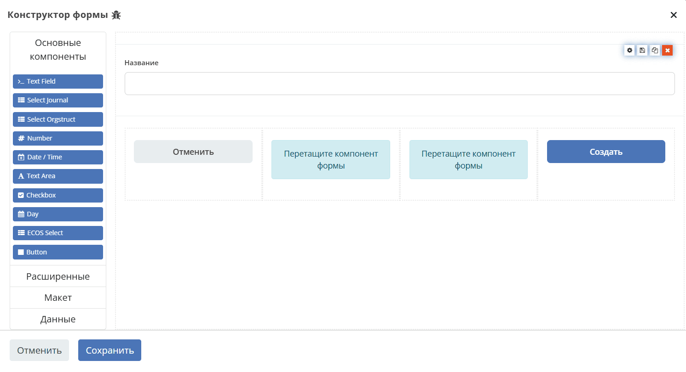

Some components are based on standard `Form.io <https://help.form.io/userguide/forms/form-components>`_ components and are supplemented with Citeck functionality. For such components, links to the original Form.io documentation and to the description of enhancements are provided.

Basic components
-----------------

Text Field
~~~~~~~~~~~

.. _Text_Field:

Single-line text field.

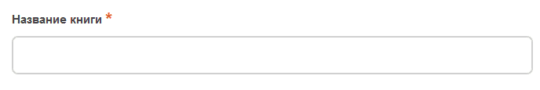

`See detailed description of Text Field on Form.io <https://help.form.io/userguide/forms/form-components#text-field>`_

:ref:`See component enhancements<text_field_component>`

:ref:`See Text Field example<sample_text_field_component>`

Select Journal
~~~~~~~~~~~~~~~

.. _Select_Journal_:

Component responsible for selection from a journal. Only works if a journal exists for the reference type.

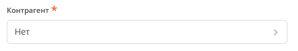

:ref:`See detailed description of Select Journal<Select_journal_component>`

:ref:`See Select Journal example<sample_select_journal_component>`

Select Orgstruct
~~~~~~~~~~~~~~~~~

.. _Select_Orgstruct_:

Component responsible for selection from organizational structure users/groups. What exactly will be selected (users with groups together, or something single) is regulated within the component.

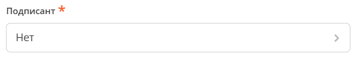

:ref:`See detailed description of Select Orgstruct<Select_orgstruct_component>`

:ref:`See Select Orgstruct example<sample_select_orgstruct_component>`

Number
~~~~~~~

.. _Number:

Numeric field. Can accept both integer values and floating point values. This is regulated within the component.

By default, number digits are separated by space. For example, 1 000 000.

`See detailed description of Number on Form.io <https://help.form.io/userguide/forms/form-components#number>`_

Date/Time
~~~~~~~~~~

.. _Date_Time:

Field responsible for displaying date and time.

Display is regulated within the component, RU/Eng localization is available

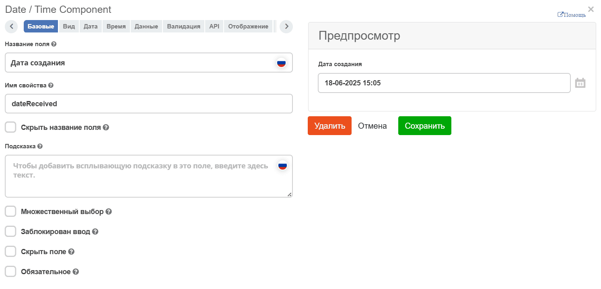

`See detailed description of Date/Time on Form.io <https://help.form.io/userguide/forms/form-components#date-time>`_

:ref:`See Date/Time example<sample_date_time_component>`

Text Area
~~~~~~~~~~

.. _Text_Area:

Analog of Text Field. Multi-line text field.

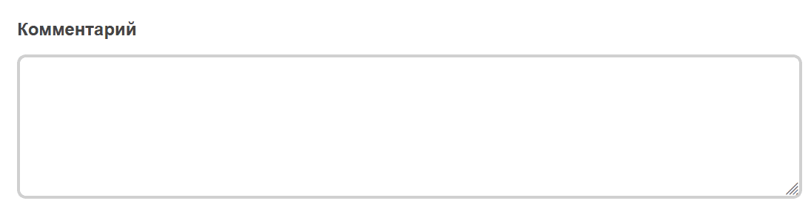

To display entered data in multiple lines, you need to add an editor on the **Display** tab:

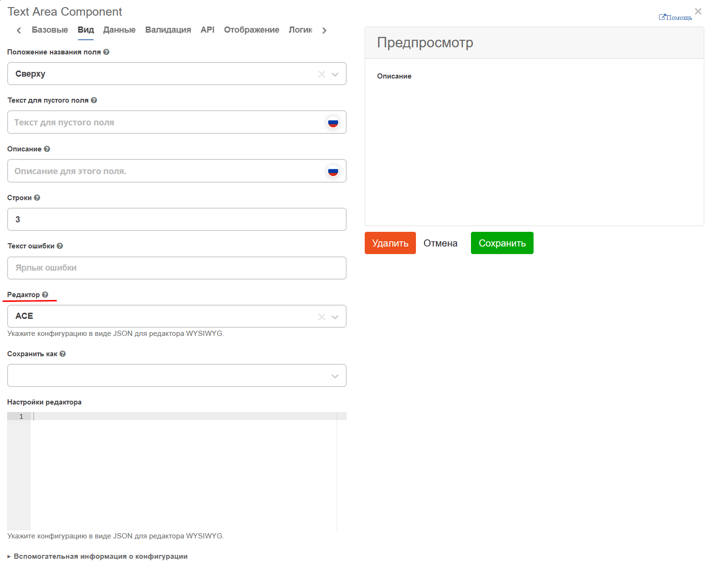

`See detailed description of Text Area on Form.io <https://help.form.io/userguide/forms/form-components#text-area>`_

Checkbox
~~~~~~~~~

.. _Checkbox:

Field for selecting multiple values from a list of parameters.

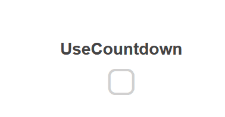

`See detailed description of Checkbox on Form.io <https://help.form.io/userguide/forms/form-components#check-box>`_

:ref:`See component enhancements<checkbox_component>`

Day
~~~~

.. _Day:

Field for entering values "Day", "Month" and "Year" using number or field type selection.

`See detailed description of Day on Form.io <https://help.form.io/userguide/forms/form-components#day>`_

ECOS Select
~~~~~~~~~~~~

.. _Ecos_Select_:

Field responsible for selection from a list. Based on the standard formio Select component, has been modified.

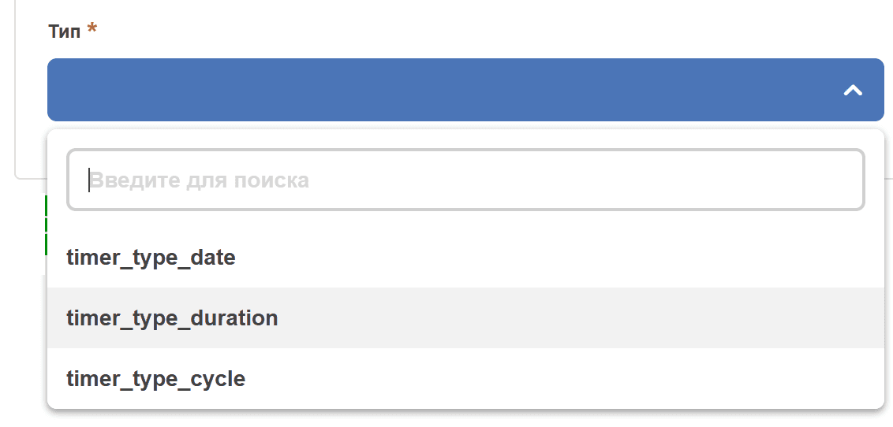

:ref:`See detailed description of Ecos Select<ecos_select_component>`

:ref:`See Ecos Select example<sample_ecos_select_component>`

Button
~~~~~~~

.. _Button:

Adding buttons to perform various actions in the form.

`See detailed description of Button on Form.io <https://help.form.io/userguide/forms/form-components#button>`_

:ref:`See Button example<sample_button_component>`

Advanced
---------

ML Text
~~~~~~~~

.. _ML_Text:

Single-line text field. Language selection is provided by a Russia/USA flag switch. After selecting the language, text is entered in the field.

Both entered values are saved. If the field contains the ML postfix and is an object (contains EN/RU key), the element is rendered.

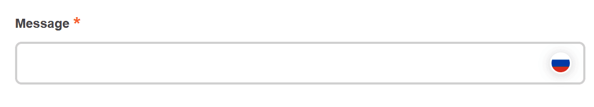

ML text support is implemented for the "Field name", "Hint" fields of all form editor components, as well as for the "Content" field of the Html Component, "Property name" field of the Panel Component.

Table Form
~~~~~~~~~~~

Component allows displaying selected values in table format.

:ref:`See detailed description of Table Form<table_form_component>`

Task Outcome
~~~~~~~~~~~~~

Component is used to add task verdict buttons to the form. The component automatically forms verdict buttons based on Task Outcomes settings.

:ref:`See Task Outcome example<approve_form_bpmn>`

Import Button
~~~~~~~~~~~~~~

Component allows adding a customizable button to the form for file upload.

:ref:`See detailed description of Import Button<import_button_component>`

Email
~~~~~~

Component is a string field that performs special input validation, ensuring that entered data is in a valid email format.

A valid email address consists of an email prefix and email domain in acceptable formats.

`See detailed description of Email on Form.io <https://help.form.io/userguide/forms/form-components#email>`_

URL
~~~~

Component has a customizable validation parameter that, if configured correctly, can ensure that the entered value is a valid URL.

`See detailed description of URL on Form.io <https://help.form.io/userguide/forms/form-components#url>`_

Phone Number
~~~~~~~~~~~~~

Component can be used to enter phone numbers into the form. Number input mask can be set.

`See detailed description of Phone Number on Form.io <https://help.form.io/userguide/forms/form-components#phone-number>`_

Address Field
~~~~~~~~~~~~~~

Special component that performs search of entered addresses.

`See detailed description of Address Field on Form.io <https://help.form.io/userguide/forms/form-components#address>`_

ML Textarea
~~~~~~~~~~~~

Multi-line text field for input in Russian/English languages. Language selection is provided by a Russia/USA flag switch. After selecting the language, text is entered in the field.

Both entered values are saved. If the field contains the ML postfix and is an object (contains EN/RU key), the element is rendered.

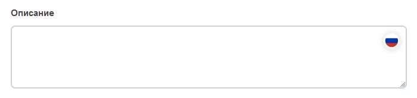

HTML Element
~~~~~~~~~~~~~

Component can be added to a form to display a single HTML element.

Content can be dynamically changed via a script. For example:

.. code-block::

       instance.component.content = {en: '
Hello World
', ru: '
Привет, мир
'};
       instance.setHTML();

`See detailed description of HTML Element on Form.io <https://help.form.io/userguide/forms/layout-components#html-element>`_

File
~~~~~

.. _File_:

Component for file upload.

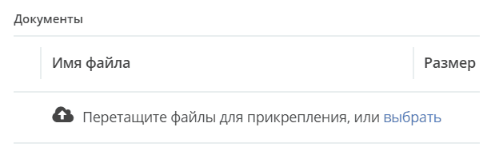

`See detailed description of File on Form.io <https://help.form.io/userguide/forms/premium-components#file>`_

:ref:`See detailed description of File <file_component>`

Select Action
~~~~~~~~~~~~~~

Component for displaying a list of values in a dropdown. Users can select one of the values.

`See detailed description of Select Action on Form.io <https://help.form.io/userguide/forms/form-components#select>`_

Layout
-------

Horizontal Line
~~~~~~~~~~~~~~~~

Component for displaying block separator.

:ref:`See detailed description of Horizontal Line<horizontal_line_component>`

Columns
~~~~~~~~

.. _Columns_:

Component responsible for dividing the form into columns. Based on the standard formio Columns component, has been modified.

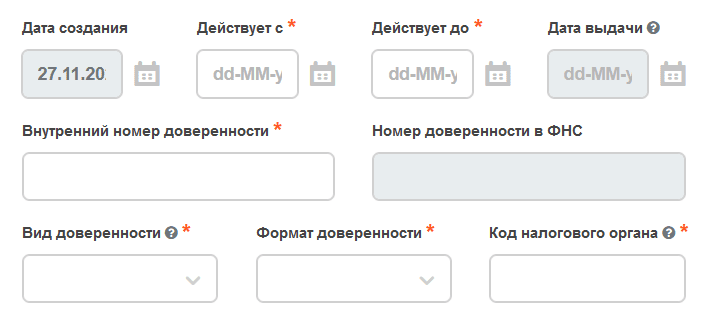

`See detailed description of Columns on Form.io <https://help.form.io/userguide/forms/layout-components#columns>`_

:ref:`See detailed description of Columns<columns_component>`

:ref:`See Columns example<sample_columns_component>`

Panel
~~~~~~

.. _Panel:

Panel where a property can be placed. Needed for zoning. Components that are similar in meaning are placed in it and assigned a title.

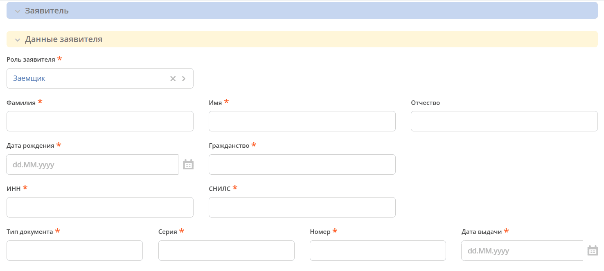

`See detailed description of Panel on Form.io <https://help.form.io/userguide/forms/layout-components#panel>`_

:ref:`See detailed description of Panel<panel_component>`

:ref:`See Panel example<sample_panel_component>`

Table
~~~~~~

.. _Table:

Component allows creating a table with columns and rows.

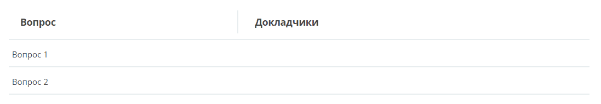

`See detailed description of Table on Form.io <https://help.form.io/userguide/forms/layout-components#table>`_

Tabs
~~~~~

Component responsible for tabs on the form. A tab is hidden when all components on it are hidden, or there are no components at all.

`See detailed description of Tabs on Form.io <https://help.form.io/userguide/forms/layout-components#tabs>`_

Data
-----

Hidden field
~~~~~~~~~~~~~

Component can be added to a form to create a resource property that can be configured in the form. There is no external widget for hidden components. They are not displayed in visualized forms.

`See detailed description of Hidden on Form.io <https://help.form.io/userguide/forms/data-components#hidden>`_

Async Data
~~~~~~~~~~~

Invisible component for loading asynchronous data.

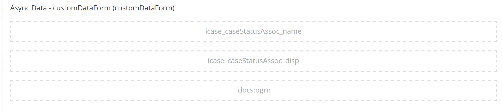

:ref:`See detailed description of Async Data<async_data_component>`

:ref:`See Async Data example<sample_async_data_component>`

Include Form
~~~~~~~~~~~~~

Component for including one form into others.

In properties, one field - **formRef** with selection from forms journal (ecos-forms).

External appearance in builder (like Hidden component, but name is formed by pattern "Form: form_name").

English variant: Form: form_name

where **form_name** is the **"?disp"** attribute of the selected form. If no form is selected, it writes No form.

When rendering a form not in the builder, the component should not be drawn (on the server it will be automatically replaced with all components that are in the selected form).

Container
~~~~~~~~~~

Wrapper for a set of fields, similar to **Field Set**.

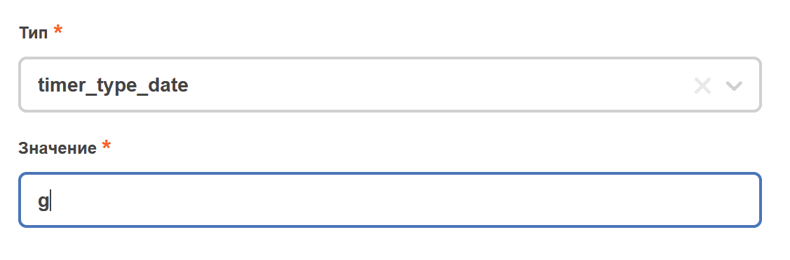

Data display management component based on Bootstrap Grid usage.

The **Bootstrap Grid** system is needed for page layout, particularly for creating responsive layouts.

The framework defines 5 responsiveness levels (breakpoints) that are based on viewport width:

 * **xs** — extra small — width < 576px (this is the default level);
 * **sm** — small — width ≥ 576px;
 * **md** — medium — width ≥ 768px;
 * **lg** — large — width ≥ 992px;
 * **xl** — extra large — width ≥ 1200px.

The grid consists of groups of rows and columns located within one or more containers.

Basic grid rules in Bootstrap:

* columns are strictly inside a row at the first nesting level;
* rows are only needed for placing columns;
* rows must be located inside a container.

Rows and columns always work together, they cannot be separated.

An element with the **.container** class is the root block of the grid in Bootstrap, meaning it is located at the outer level. The container is suitable for storing any elements, not just rows and columns.

Only columns should be inside a row, and content should be inside them.

Columns are needed for dividing the viewport horizontally, while in one row there can be columns of different widths.

The classic Bootstrap grid consists of 12 columns.

In most cases, using all of them is not required; they can be combined as needed. Imagine that the entire viewport is divided into 12 equal parts - width units. One column can contain from 1 to 12 such units.

`See detailed description of Bootstrap Grid system <https://getbootstrap.com/docs/4.0/layout/grid/>`_

`See detailed description of Container on Form.io <https://help.form.io/userguide/forms/data-components#container>`_

Data Grid
~~~~~~~~~~

Data display management component that extracts information from a collection of objects and visualizes it in a grid with rows and cells. Each row corresponds to a separate object, and each column corresponds to a property in that object.

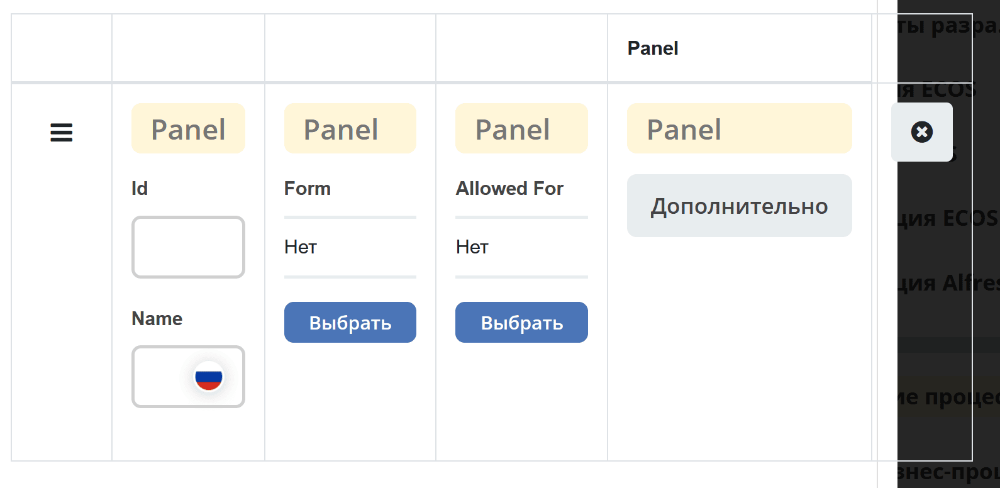

`See detailed description of Data Grid on Form.io <https://help.form.io/userguide/forms/data-components#data-grid>`_

Data Grid Assoc
~~~~~~~~~~~~~~~~

Data display management component.

Data Map
~~~~~~~~~

Component allows users to create key/value pairs.

`See detailed description of Data Map on Form.io <https://help.form.io/userguide/forms/data-components#data-map>`_
