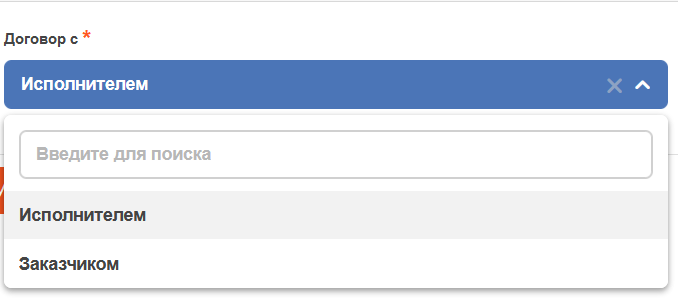
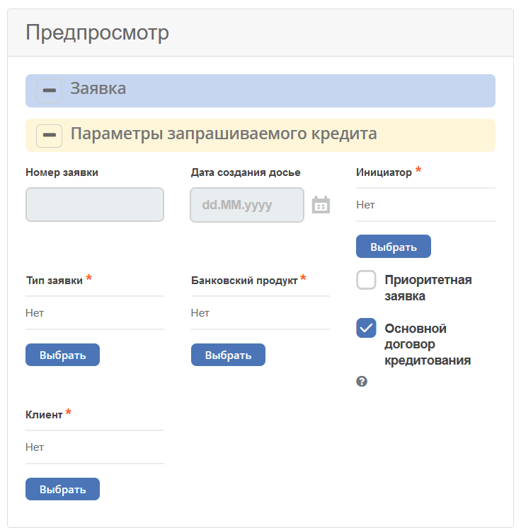
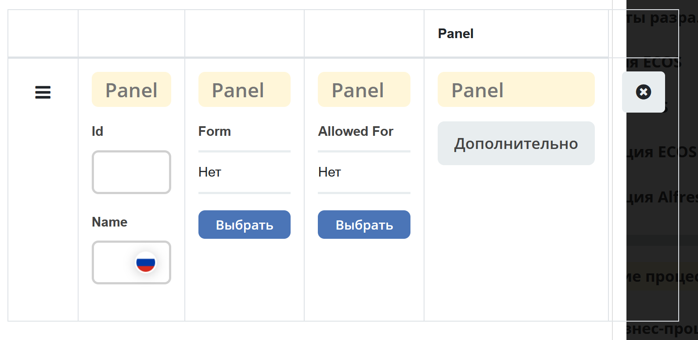

Общее описание
===============

.. contents::
   :depth: 4
		

Основные компоненты
--------------------

Text Field
~~~~~~~~~~~~

.. _Text_Field:

Однострочное текстовое поле.

`См. подробное описание Text Field на Form.io <https://help.form.io/userguide/forms/form-components#text-field>`_ 

:ref:`См. доработки компонента<text_field_component>` 

:ref:`См. пример Text Field<sample_text_field_component>` 

Select Journal
~~~~~~~~~~~~~~~

.. _Select_Journal_:

Компонент, отвечающий за выбор из журнала. Работает только в том случае, если для ссылочного типа существует журнал.

.. image:: _static/Select_Journal_Component.png
       :width: 400
       :align: center

:ref:`См. подробное описание Select Journal<Select_journal_component>`

:ref:`См. пример Select Journal<sample_select_journal_component>` 

Select Orgstruct
~~~~~~~~~~~~~~~~~~

.. _Select_Orgstruct_:

Компонент, отвечающий за выбор из оргструктуры пользователей/групп. Что именно будет выбираться (пользователи с группами вместе, или что-то одно), – регулируется внутри компонента.

.. image:: _static/Select_Orgstruct_Component.png
       :width: 400
       :align: center

:ref:`См. подробное описание Select Orgstruct<Select_orgstruct_component>`

:ref:`См. пример Select Orgstruct<sample_select_orgstruct_component>` 

Number
~~~~~~~

.. _Number:

Числовое поле. Может принимать в себя как целочисленные значения, так и с плавающей точкой. Это регулируется внутри компонента.

По умолчанию разряды числа разделены пробелом. Например, 1 000 000

`См. подробное описание Number на Form.io <https://help.form.io/userguide/forms/form-components#number>`_ 

Date/Time
~~~~~~~~~~

.. _Date_Time:

Поле, отвечающее за отображение даты и времени. Отображение регулируется внутри компонента. 

`См. подробное описание Date/Time на Form.io <https://help.form.io/userguide/forms/form-components#date-time>`_  

:ref:`См. пример Date/Time<sample_date_time_component>` 

Text Area
~~~~~~~~~~~

.. _Text_Area:

Аналог Text Field. Многострочное текстовое поле. 

.. image:: _static/Text_Area_Component.png
       :width: 400
       :align: center

Для вывода введенных данных многострочно необходимо добавить редактор на вкладке **Вид**:a

`См. подробное описание Text Area на Form.io <https://help.form.io/userguide/forms/form-components#text-area>`_ 

Checkbox
~~~~~~~~~

.. _Checkbox:

Поле выбора нескольких значений из списка параметров.

`См. подробное описание Checkbox на Form.io <https://help.form.io/userguide/forms/form-components#check-box>`_  

Day
~~~~

.. _Day:

Поле для ввода значений «День», «Месяц» и «Год» с использованием числа или выбора типа поля.

`См. подробное описание Day на Form.io <https://help.form.io/userguide/forms/form-components#day>`_  

ECOS Select
~~~~~~~~~~~~~

.. _Ecos_Select_:

Поле, отвечающее за выбор из списка. Основан на стандартном formio-компоненте Select, был модифицирован.

:ref:`См. подробное описание Ecos Select<ecos_select_component>`  

:ref:`См. пример Ecos Select<sample_ecos_select_component>`

Button
~~~~~~~~

.. _Button:

Добавление кнопок для выполнения различных действий в форме.

`См. подробное описание Button на Form.io <https://help.form.io/userguide/forms/form-components#button>`_  

:ref:`См. пример Button<sample_button_component>` 

Расширенные
------------

ML Text
~~~~~~~~~

.. _ML_Text:

Однострочное текстовое поле. Для выбора языка предусмотрен переключатель в виде флага России /США. После выбора языка в поле вводится текст.

Сохраняются оба введенных зачения. Если поле содержит постфикс ML и является объектом (содержит ключ EN/RU), то элемент отрисовывается.

.. image:: _static/ML_Text_Component.png
       :width: 400
       :align: center

Поддержка ML text реализована для поля "Название поля", "Подсказка" всех компонент редактора форм, так же для поля "Контент" компонента Html Component, "Название свойства" компонента Panel Component.

Table Form
~~~~~~~~~~~~~~~

Компонент позволяет отображать выбранные значения в виде таблицы.

:ref:`См. подробное описание Table Form<table_form_component>` 

Import Button
~~~~~~~~~~~~~~~

Компонент позволяет добавить на форму настраиваемую кнопку для загрузки файлов.

:ref:`См. подробное описание Import Button<import_button_component>` 

Email
~~~~~~

Компонент представляет собой строковое поле, которое выполняет специальную проверку ввода, гарантирующую, что введенные данные находятся в допустимом формате электронной почты. 

Действительный адрес электронной почты состоит из префикса электронной почты и домена электронной почты в приемлемых форматах.

`См. подробное описание Email на Form.io <https://help.form.io/userguide/forms/form-components#email>`_ 

URL
~~~~

Компонент имеет настраиваемый параметр проверки, который, если он настроен правильно, может гарантировать, что введенное значение является допустимым URL-адресом.

`См. подробное описание URL на Form.io <https://help.form.io/userguide/forms/form-components#url>`_ 

Phone Number
~~~~~~~~~~~~~

Компонент можно использовать для ввода номеров телефонов в форму. Можно задать маску ввода номера.

`См. подробное описание Phone Number на Form.io <https://help.form.io/userguide/forms/form-components#phone-number>`_ 

Address Field
~~~~~~~~~~~~~~~

Cпециальный компонент, выполняющий поиск введенных адресов.

`См. подробное описание Address Field на Form.io <https://help.form.io/userguide/forms/form-components#address>`_ 

ML Textarea
~~~~~~~~~~~~

Многострочное текстовое поле для ввода на русском/анлийском языках. Для выбора языка предусмотрен переключатель в виде флага России /США. После выбора языка вводится в поле вводится текст.

Сохраняются оба введенных зачения. Если поле содержит постфикс ML и является объектом (содержитключ EN/RU), то элемент отрисовывается.

HTML Element
~~~~~~~~~~~~~

Компонент может быть добавлен в форму для отображения одного элемента HTML.

`См. подробное описание HTML Element на Form.io <https://help.form.io/userguide/forms/layout-components#html-element>`_

File
~~~~~

.. _File_:

Компонент для загрузки файлов. 

`См. подробное описание File на Form.io <https://help.form.io/userguide/forms/premium-components#file>`_ 

:ref:`См. подробное описание File <file_component>` 

Select Action
~~~~~~~~~~~~~~~

Компонент для отображения список значений в раскрывающемся списке. Пользователи могут выбрать одно из значений.

`См. подробное описание Select Action на Form.io <https://help.form.io/userguide/forms/form-components#select>`_ 

Макет
-------

Horizontal Line
~~~~~~~~~~~~~~~

Компонент для отображения разделителя блоков.

:ref:`См. подробное описание Horizontal Line<horizontal_line_component>` 

Columns
~~~~~~~~

.. _Columns_:

Компонент, отвечающий за разделение формы на столбцы. Основан на стандартном formio-компоненте Columns, был модифицирован.

`См. подробное описание Columns на Form.io <https://help.form.io/userguide/forms/layout-components#columns>`_ 

:ref:`См. подробное описание Columns<columns_component>` 

:ref:`См. пример Columns<sample_columns_component>` 

Panel
~~~~~~

.. _Panel:

Панель, в которую можно поместить свойство. Нужна для зонирования. В неё помещаются близкие по смыслу компоненты и им присваивается заголовок.

`См. подробное описание Panel на Form.io <https://help.form.io/userguide/forms/layout-components#panel>`_ 

:ref:`См. подробное описание Panel<panel_component>`

:ref:`См. пример Panel<sample_panel_component>` 

Table
~~~~~~

.. _Table:

Компонент позволяет создать таблицу со столбцами и строками.

`См. подробное описание Table на Form.io <https://help.form.io/userguide/forms/layout-components#table>`_ 

Tabs
~~~~~

Компонент твечает за вкладки на форме. Вкладка скрывается, когда на ней все компоненты скрыты, либо компонентов нет совсем.

`См. подробное описание Tabs на Form.io <https://help.form.io/userguide/forms/layout-components#tabs>`_ 

Данные
--------		

Hidden
~~~~~~~

Компонент можно добавить в форму, чтобы создать свойство ресурса, которое можно настроить в форме. Внешнего виджета для скрытых компонентов нет. Они не отображаются в визуализированных формах.

`См. подробное описание Hidden на Form.io <https://help.form.io/userguide/forms/data-components#hidden>`_ 

Async Data
~~~~~~~~~~~

Невидимый компонент для загрузки асинхронных данных.

:ref:`См. подробное описание Async Data<async_data_component>`

:ref:`См. пример Async Data<sample_async_data_component>` 

Include Form
~~~~~~~~~~~~~~

Компонент для включения одной формы в другие.

В свойствах одно поле - **formRef** с выбором из журнала форм (ecos-forms).

Внеший вид в билдере (как у компонента Hidden, но имя формируется по шаблону "Форма: имя_формы"). 

Вариант на английском: Form: form_name

где **form_name** и **имя_формы** - это атрибут **"?disp"** выбраной формы. Если форма не выбрана, то пишется No form (Нет формы)

При отрисовке формы не в билдере компонент рисовать не нужно (на сервере он будет автоматически заменяться на все компоненты, которые есть в выбранной форме).

.. image:: _static/Include_Form_Component.png
       :width: 500
       :align: center

Container
~~~~~~~~~

Оболочка для набора полей, аналогичная **Field Set**.

.. image:: _static/Container_Component.png
       :width: 400
       :align: center

Компонент управления отображением данных, основанный на использовании Bootstrap Grid. 

Система **Bootstrap Grid** нужна для разметки страницы, в частности, для создания адаптивных макетов.

Фреймворк определяет 5 уровней адаптивности (брейкпоинтов), которые основаны на ширине области просмотра:

 * **xs** — extra small, супермаленький — ширина < 576px (это уровень по умолчанию);
 * **sm** — small, маленький — ширина ≥ 576px;
 * **md** — medium, средний — ширина ≥ 768px;
 * **lg** — large, большой — ширина ≥ 992px;
 * **xl** — extra large, супербольшой — ширина ≥ 1200px.

Сетка состоит из групп рядов и колонок, расположенных внутри одного или нескольких контейнеров.

Основные правила сетки в Bootstrap:

* колонки находятся строго внутри ряда на первом уровне вложенности;
* ряды нужны только для размещения колонок;
* ряды должны располагаться внутри контейнера.

Ряды и колонки всегда работают вместе,  их нельзя разделять.

Элемент с классом **.container** является корневым блоком сетки в Bootstrap, то есть располагается на внешнем уровне. Контейнер подходит для хранения любых элементов, а не только рядов и колонок.

Внутри ряда должны находиться только колонки, а контент – уже внутри них.

Колонки нужны для разделения области просмотра по горизонтали, при этом в одном ряду могут быть столбцы разной ширины. 

Классическая Bootstrap-сетка состоит из 12 колонок. 

В большинстве случаев, не требуется использование всех, их можно объединять по мере надобности. Представьте, что вся область просмотра разделена на 12 равных частей – единиц ширины. В одной колонке может быть от 1 до 12 таких единиц.

`См. подробное описание Bootstrap Grid system <https://getbootstrap.com/docs/4.0/layout/grid/>`_ 

`См. подробное описание Container на Form.io <https://help.form.io/userguide/forms/data-components#container>`_ 

Data Grid
~~~~~~~~~~

Компонент управления отображением данных, который извлекает информацию из коллекции объектов и визуализирует ее в сетке со строками и ячейками. Каждая строка соответствует отдельному объекту, а каждый столбец — свойству в этом объекте.

`См. подробное описание Data Grid на Form.io <https://help.form.io/userguide/forms/data-components#data-grid>`_ 

Data Grid Assoc
~~~~~~~~~~~~~~~~

Компонент управления отображением данных.

Data Map
~~~~~~~~~

Компонент позволяет пользователям создавать пары ключ/значение.

`См. подробное описание Data Map на Form.io <https://help.form.io/userguide/forms/data-components#data-map>`_ 

