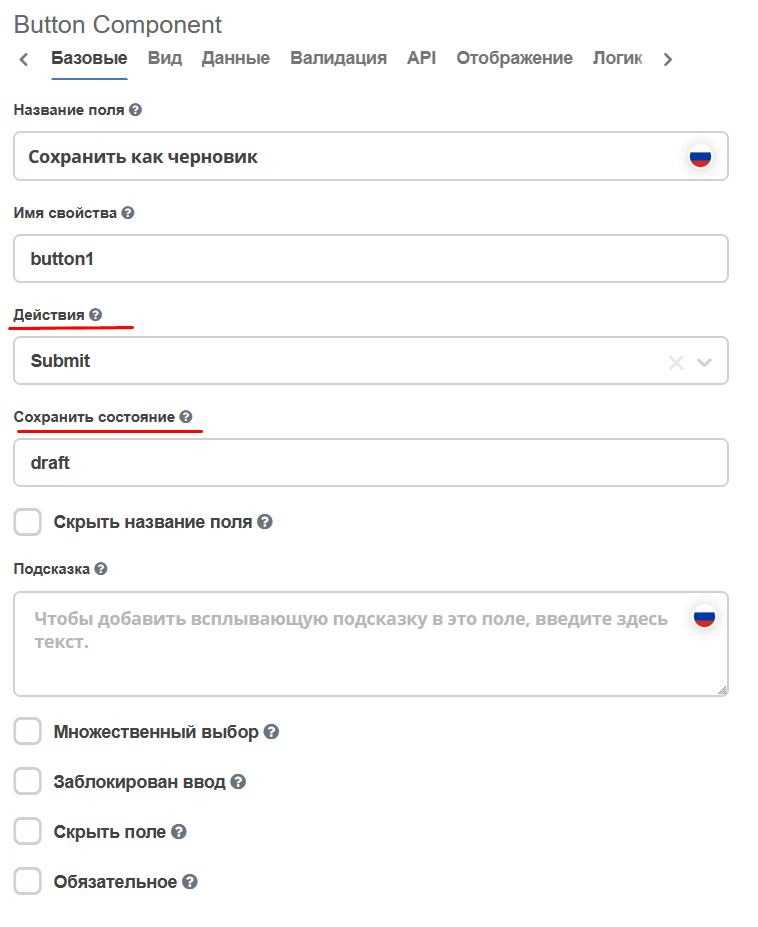

.. _form_draft:

Сохранение документа в качестве черновика
===========================================

.. contents::
   :depth: 2
   :local:

Если требуется возможность создания и редактирования записей без отправки их по процессу, то в Citeck для этого существует системный флаг **"Черновик"**.

.. note::

    Системный флаг "Черновик" не связан со статусами при настройке типа.

Настройка через интерфейс
---------------------------

Для того чтобы создать запись в состоянии **"Черновик"** на форме нужно добавить кнопку с действием **Submit** и в поле **"Сохранить состояние"** написать **draft** (без кавычек).

После этой настройки при нажатии этой кнопки на форме, валидация обязательных полей будет отключена и система позволит создать запись. Впоследствии её можно редактировать, не запуская при этом бизнес-процесс.

Для того чтобы сделать запись активной и запустить процесс, следует использовать кнопку с действием **Submit** без заполненной настройки **"Сохранить состояние"**.

Работа с флагом программно
-----------------------------

Для перевода записи в состояние **"Черновик"** или вывода из него следует при мутации указать атрибут ``_state``:

.. list-table::
   :header-rows: 1
   :class: tight-table

   * - Действие
     - Значение ``_state``
   * - Перевести в черновик
     - ``draft``
   * - Вывести из черновика
     - пустая строка ``""``

Для получения текущего значения флага **"Черновик"** можно использовать атрибут ``_isDraft?bool``.